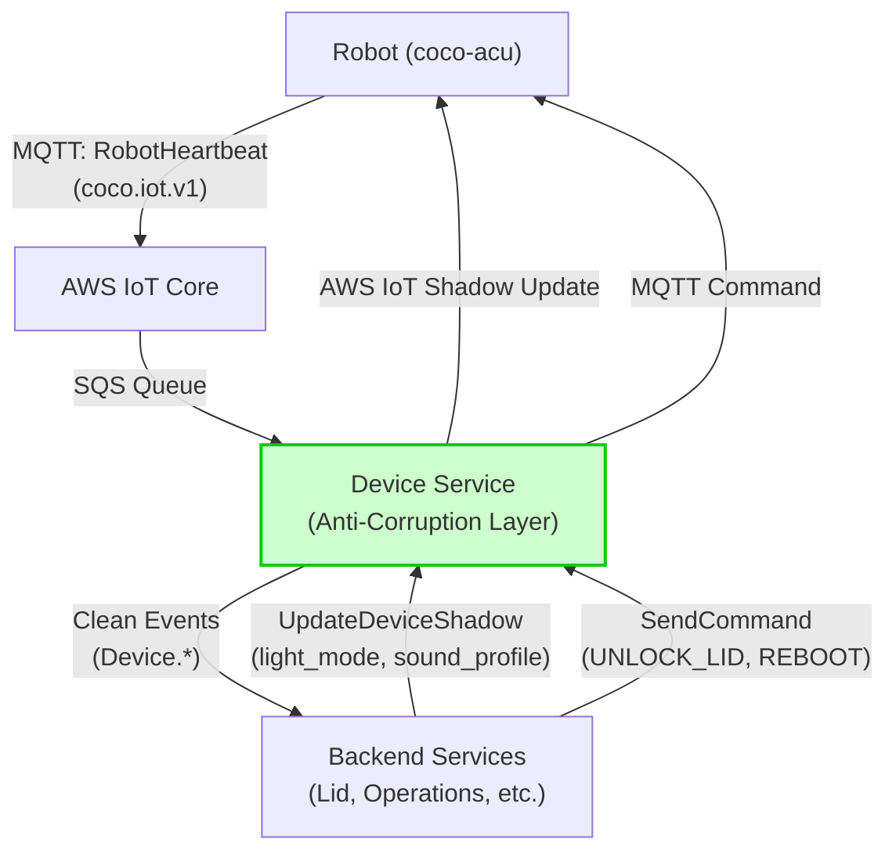

# Overview

This document describes the changes to how robots communicate with our backend services. The key change is introducing a **Device Service** as a single anti-corruption layer between the robot and all backend systems.

**What This Means for You:**

- **Single interface**: All robot telemetry goes to Device Service (no more multiple consumers of raw MQTT)
- **Cleaner contracts**: Strongly-typed Protobuf definitions for all messages
- **Business-agnostic robot**: Robot no longer needs to understand "trips" or "operations" - just physical behaviors (lights, sounds, etc.)
- **Backward compatible**: Migration happens in phases with no breaking changes

---

## Problem Statement (Robot Perspective)

Currently, the robot publishes raw MQTT telemetry that multiple backend services consume directly. This creates:

1. **Tight coupling**: Changes to MQTT format require coordinating updates across many services
2. **Business logic leakage**: Robot shadow contains business concepts like `operation_state` (ON_TRIP, PARKED, etc.) that make the robot aware of backend business logic
3. **No validation layer**: Invalid or malformed telemetry can propagate to all consumers
4. **Weak contracts**: No compile-time guarantees about message structure

**Solution**: Introduce Device Service as the single consumer of robot telemetry. It validates, normalizes, and publishes clean events to backend services.

---

## Architecture: Robot's View



**Key Points:**

1. Robot publishes **two types** of messages:
    - `devices/{serial}/info/state` - Heartbeat with full telemetry (every 5-10s)
    - `devices/{serial}/info/events` - Discrete events (lid, PIN, health)
2. Device Service is the **only** consumer of raw robot telemetry
3. Device Service validates and normalizes data
4. Device Service publishes clean `Device.*` events (Heartbeat, LidOpened, Moved, BatteryLow, etc.)
5. Backend services (Lid, Operations) consume clean events from Device Service
6. Commands and shadow updates flow through Device Service

---

## Robot Telemetry: What You Publish

The robot publishes **two types** of messages to AWS IoT:

1. **Heartbeat** (`devices/{serial}/info/state`) - Full state snapshot, published every ~5-10 seconds
2. **Events** (`devices/{serial}/info/events`) - Discrete events published when something happens (lid opens, component fails, etc.)

### 1. Heartbeat: Full State Snapshot

The robot publishes this to `devices/{serial}/info/state` every 5-10 seconds:

```protobuf
syntax = "proto3";

package coco.iot.v1;

import "google/protobuf/timestamp.proto";

// Raw telemetry published by robot to AWS IoT via MQTT
// Topic: robot/{serial_number}/status
message RobotHeartbeat {
  string serial = 1;
  google.protobuf.Timestamp timestamp = 2;

  // GPS telemetry
  GpsData gps = 3;

  // Power system
  repeated BatteryData batteries = 4;

  // Component health (key-value pairs)
  // These can be promoted into having their own proto as needed.
  map<string, string> components = 5; // e.g., {"GPS": "OK", "CAMERAS": "OK", "LTE_ROUTERS": "TIMEOUT"}

  // Lid state
  LidData lid = 6;

  // Network connectivity
  NetworkData network = 7;
}

message GpsData {
  double lat = 1;
  double lng = 2;
  double heading = 3;
  double horizontal_accuracy = 4;
  double altitude = 5;
  double speed_mph = 6;
}

message BatteryData {
  int32 index = 1;
  int32 charge_percent = 2;
  bool is_charging = 3;
  double voltage = 4;
  double current = 5;
  double temperature = 6;
}

message LidData {
  bool is_open = 1;
}

message NetworkData {
  string type = 1; // "WIFI", "CELLULAR", "ETHERNET"
  int32 signal_strength = 2;
}

```

**Publishing Frequency:**

- Every 10 seconds
- No change from current behavior

---

### 2. Events: Discrete State Changes

The robot also publishes events to `devices/{serial}/info/events` when specific things happen.

**Event Envelope Proto:**

```protobuf
syntax = "proto3";

package coco.iot.v1;

import "google/protobuf/timestamp.proto";
import "google/protobuf/any.proto";

// Envelope for robot events published to devices/{serial}/info/events
message RobotEvents {
  repeated RobotEvent events = 1;
}

message RobotEvent {
  google.protobuf.Timestamp timestamp = 1;
  string event_id = 2; // UUID for deduplication
  EventSeverity severity = 3;

  // Event payload (one of the event types below)
  oneof event {
    LidOpenedEvent lid_opened = 10;
    LidClosedEvent lid_closed = 11;
    LidOpenRequestEvent lid_open_request = 12;
    LidCloseRequestEvent lid_close_request = 13;
    KeypadEntryEvent keypad_entry = 14;
    ComponentFaultEvent component_fault = 15;
    ComponentRecoveredEvent component_recovered = 16;
  }
}

enum EventSeverity {
  EVENT_SEVERITY_UNSPECIFIED = 0;
  LOW = 1;      // Informational only (not sent to backend currently)
  MEDIUM = 2;   // Operational events (lid, PIN)
  HIGH = 3;     // Critical events (component failures, triggers rosbag marking)
}

```

**Individual Event Types:**

```protobuf
// ===== Lid Events =====

message LidOpenedEvent {
  LidOpenTrigger trigger = 1;
  string request_id = 2; // If triggered by command
}

enum LidOpenTrigger {
  LID_OPEN_TRIGGER_UNSPECIFIED = 0;
  PHYSICAL_BUTTON = 1;    // Physical button press
  PIN = 2;       // PIN entered and validated
  COMMAND = 3;   // Remote unlock command
  MANUAL = 4;    // Manual/forced open
}

message LidClosedEvent {
  int32 duration_open_ms = 1; // How long lid was open
  bool was_timeout = 2;       // True if auto-closed due to timeout
}

message LidOpenRequestEvent {
  string request_id = 1; // Unique ID for this unlock request
}

message LidCloseRequestEvent {
  string request_id = 1; // Unique ID for this lock request
}

// ===== Keypad Events =====

message KeypadEntryEvent {
  string entered_key = 1;
}

// ===== Component Health Events =====

message ComponentFaultEvent {
  string component_name = 1; // e.g., "GPS", "CAMERAS", "LTE_ROUTERS"
  string fault_code = 2;     // e.g., "TIMEOUT", "CRC_ERROR", "NOT_READY"
  string message = 3;        // Human-readable description
}

message ComponentRecoveredEvent {
  string component_name = 1; // Component that recovered
  int32 downtime_ms = 2;     // How long it was down
}

```

**Event Summary Table:**

|Event Type|When Published|Key Fields|
|---|---|---|
|`LidOpenedEvent`|Lid physically opens|`trigger` (button/pin/command)|
|`LidClosedEvent`|Lid physically closes|`duration_open_ms`, `was_timeout`|
|`LidOpenRequestEvent`|Unlock command received|`request_id`|
|`LidCloseRequestEvent`|Lock command received|`request_id`|
|`KeypadEntryEvent`|Key entered on keypad|`entered_key`|
|`ComponentFaultEvent`|Hardware component fails|`component_name`, `fault_code`|
|`ComponentRecoveredEvent`|Component returns to OK|`component_name`, `downtime_ms`|

**Current Format vs. Proposed:**

Today, robots publish these events as JSON:

```json
{
  "events": [
    {
      "ts": 1704816896000,
      "type": "LID_OPENED",
      "uuid": "550e8400-e29b-41d4-a716-446655440000",
      "severity": "MEDIUM",
      "meta": {"trigger": "button"}
    }
  ]
}

```

**Migration Path:**

- **Phase 1** (Device Service launch): Device Service accepts JSON format, parses into proto internally
- **Phase 2** (Future): Robot publishes native protobuf to MQTT (requires robot software update)
- **Phase 3** (Future): Remove JSON parsing support from Device Service

This allows Device Service to launch without requiring robot software changes.

**What Device Service Does With Events:**

- Consumes from `devices/{serial}/info/events` via SQS (JSON or proto)
- Correlates lid events with heartbeat state for lid cycle tracking
- Uses PIN entry events to trigger PIN validation (via Lid Service)
- Publishes normalized `Device.LidOpened`, `Device.LidClosed`, etc. events
- Tracks component health state changes for alerting

---

### What Device Service Does With Heartbeat:

1. Validates schema and data ranges
2. Enriches with DriveU status (from separate webhook)
3. Normalizes component statuses into structured enums
4. Detects semantic changes:
    - Location change > 10m → `Device.Moved`
    - Lid state change → `Device.LidOpened` or `Device.LidClosed`
    - Battery crosses 20% or 5% → `Device.BatteryLow` or `Device.BatteryCritical`
    - Connectivity change → `Device.ConnectivityChanged`
    - Component health change → `Device.HealthDegraded` or `Device.HealthRestored`
5. Publishes `Device.Heartbeat` (always) + 0-N semantic events

---

## Device Shadow: What You Consume

### Current State (Needs Migration)

Currently, the robot reads `operation_state` from device shadow and uses it to control lights, sounds, and OTA behavior:

```yaml
# Current shadow "desired" state
desired:
  operation_state: "ON_TRIP"  # or PARKED, GROUNDED, OFF_DUTY, etc.
  dp_needs_maintenance: false
  autonomy_allowed: true
  pin_unlock: "1234"
  battery_heater_on: false
  route_id: "route-abc-123"

```

**The Problem**: `operation_state` is a business concept. The robot doesn't care about "trips" - it cares about "what lights to show" and "what sounds to play."

### Future State (After Migration)

Replace `operation_state` with **explicit, business-agnostic fields**:

```protobuf
// Device shadow "desired" state (Cloud → Robot)
message DeviceShadowDesired {
  // Explicit behavior controls (business-agnostic)
  LightMode light_mode = 1;           // STANDARD, PARKED, MAINTENANCE, OFF_DUTY
  SoundProfile sound_profile = 2;     // ACTIVE, QUIET, SILENT
  bool autonomy_enabled = 3;          // Can driver enable autopilot?
  bool ota_enabled = 4;               // Is OTA currently allowed?
  bool battery_heater_on = 5;         // Thermal management

  // DEPRECATED: will migrate to Lid Service
  string pin_unlock = 99;             // Magic Lid PIN (to be removed)
}

enum LightMode {
  LIGHT_MODE_UNSPECIFIED = 0;
  LIGHT_MODE_STANDARD = 1;      // Normal operation (was ON_TRIP)
  LIGHT_MODE_PARKED = 2;        // Dimmed (was PARKED)
  LIGHT_MODE_MAINTENANCE = 3;   // Warning pattern (was GROUNDED or dp_needs_maintenance)
  LIGHT_MODE_OFF_DUTY = 4;      // Minimal (was OFF_DUTY)
  LIGHT_MODE_SERVICE = 5;       // Service mode (was SERVICE)
}

enum SoundProfile {
  SOUND_PROFILE_UNSPECIFIED = 0;
  SOUND_PROFILE_ACTIVE = 1;     // Play sounds (was ON_TRIP)
  SOUND_PROFILE_QUIET = 2;      // Minimal sounds (was PARKED)
  SOUND_PROFILE_SILENT = 3;     // No sounds (was GROUNDED/OFF_DUTY)
}

```

### Migration Strategy

**Phase 1: Parallel Run (No Robot Changes Yet)**

- Backend writes **both** `operation_state` (old) and new fields (`light_mode`, `sound_profile`)
- Robot continues reading `operation_state`
- Duration: TBD (could be several months)

**Phase 2: Robot Reads New Fields (Robot Software Update Required)**

- Robot code updated to:
    1. **Prefer** new explicit fields (`light_mode`, `sound_profile`, etc.)
    2. **Fall back** to `operation_state` if new fields not present
- Lights controller: Use `light_mode` instead of deriving from `operation_state`
- Sound controller: Use `sound_profile` instead of deriving from `operation_state`
- OTA permitter: Use `ota_enabled` instead of checking if `operation_state == OFF_DUTY`

**Phase 3: Remove operation_state (Backend Changes)**

- Backend stops writing `operation_state`
- Robot fully on new fields
- Business-agnostic robot achieved

### What Robot Software Needs to Change

**lights_control node:**

```python
# BEFORE (current)
if robot.operation_state == "ON_TRIP":
    set_lights(STANDARD_PATTERN)
elif robot.operation_state == "PARKED":
    set_lights(DIMMED_PATTERN)
elif robot.operation_state == "GROUNDED" or robot.dp_needs_maintenance:
    set_lights(MAINTENANCE_PATTERN)
# ... etc

# AFTER (Phase 2+)
light_mode = shadow.desired.light_mode or derive_from_operation_state()  # Fallback
if light_mode == LightMode.STANDARD:
    set_lights(STANDARD_PATTERN)
elif light_mode == LightMode.PARKED:
    set_lights(DIMMED_PATTERN)
elif light_mode == LightMode.MAINTENANCE:
    set_lights(MAINTENANCE_PATTERN)
# ... etc

```

**sound controller:**

```python
# BEFORE
if robot.operation_state == "ON_TRIP":
    play_sound("lid_open_on_trip")
elif robot.operation_state in ["PARKED", "OFF_DUTY"]:
    play_sound("lid_open_parked")

# AFTER
sound_profile = shadow.desired.sound_profile or derive_from_operation_state()
if sound_profile == SoundProfile.ACTIVE:
    play_sound("lid_open_active")
elif sound_profile == SoundProfile.QUIET:
    play_sound("lid_open_quiet")
elif sound_profile == SoundProfile.SILENT:
    pass  # No sound

```

**OTA permitter:**

```python
# BEFORE
if robot.operation_state == "OFF_DUTY":
    allow_ota()

# AFTER
if shadow.desired.ota_enabled:
    allow_ota()

```

---

## Commands: What You'll Receive

Device Service forwards commands to the robot via AWS IoT. These are **synchronous requests** (robot should acknowledge).

### Command Types

```protobuf
enum DeviceCommandType {
  DEVICE_COMMAND_TYPE_UNSPECIFIED = 0;
  DEVICE_COMMAND_TYPE_UNLOCK_LID = 1;
  DEVICE_COMMAND_TYPE_LOCK_LID = 2;
  DEVICE_COMMAND_TYPE_HONK = 3;
  DEVICE_COMMAND_TYPE_FLASH_LIGHTS = 4;
  DEVICE_COMMAND_TYPE_EMERGENCY_STOP = 5;
  DEVICE_COMMAND_TYPE_REBOOT = 6;
}

```

### How Commands Work

1. Backend service calls `DeviceService.SendCommand(serial, UNLOCK_LID)`
2. Device Service publishes MQTT message to `robot/{serial}/commands`
3. Robot receives command, executes, publishes acknowledgment
4. Device Service returns response to backend service

**Robot Implementation:**

- Subscribe to MQTT topic: `robot/{serial}/commands`
- Parse command type and parameters
- Execute command
- Publish acknowledgment to `robot/{serial}/commands/ack`

**Example MQTT Command Message:**

```json
{
  "command_id": "cmd-abc-123",
  "command_type": "UNLOCK_LID",
  "parameters": {},
  "request_id": "req-xyz-789",
  "sent_at": "2026-01-09T12:34:56Z"
}

```

**Expected Acknowledgment:**

```json
{
  "command_id": "cmd-abc-123",
  "status": "EXECUTED",  // or FAILED
  "executed_at": "2026-01-09T12:34:57Z",
  "error_message": null
}

```

---

## Events Published by Device Service

After processing your `RobotHeartbeat`, Device Service publishes these events to backend services:

### 1. Device.Heartbeat (Always Published)

Full state snapshot, published every time a heartbeat is processed:

```protobuf
message DeviceHeartbeat {
  string device_name = 1;  // "devices/ABC123"
  Device device = 2;       // Full device state
  google.protobuf.Timestamp received_at = 3;
  google.protobuf.FieldMask updated_fields = 4;  // Which fields changed
}

```

**Consumers**: Fleet Service (Redis cache), Fleet Device Service (read replica)

### 2. Semantic Events (Conditional)

Published only when specific thresholds or transitions occur:

|Event|Trigger|Purpose|
|---|---|---|
|`Device.Moved`|Location change > 10m|Route tracking, geofence alerts|
|`Device.LidOpened`|Lid state: closed → open|Lid cycle tracking|
|`Device.LidClosed`|Lid state: open → closed|Lid cycle completion|
|`Device.BatteryLow`|Battery crosses 20% threshold|Ops alerts, preemptive charging|
|`Device.BatteryCritical`|Battery crosses 5% threshold|Critical alerts, trip safety|
|`Device.ConnectivityChanged`|Online ↔ Offline|Fleet monitoring, trip safety|
|`Device.HealthDegraded`|Component enters fault|Maintenance alerts|
|`Device.HealthRestored`|Component returns to OK|Maintenance resolution|

**Why Semantic Events?**

- Backend services don't need to parse full heartbeats to detect these changes
- Threshold logic (20%, 5%, 10m) lives in one place (Device Service)
- Lid Service just subscribes to `Device.LidOpened/Closed`, not full heartbeats
- Less duplication, cleaner separation of concerns

---

## What Doesn't Change (For You)

1. **MQTT topics**: Still publish to `robot/{serial}/status`
2. **Publishing frequency**: Still every 10 seconds
3. **AWS IoT Shadow**: Still used for desired/reported state
4. **DriveU integration**: Still publishes streamer status separately
5. **Greengrass**: Still used for software deployment

**What DOES Change:**

- Backend services no longer consume your raw MQTT directly
- Device Service is the new single consumer
- Eventually, shadow will use explicit fields instead of `operation_state`

---

## Device Service API (For Reference)

You won't call these directly, but backend services will:

```protobuf
service DeviceService {
  // --- Device CRUD ---
  rpc GetDevice(GetDeviceRequest) returns (Device);
  rpc ListDevices(ListDevicesRequest) returns (ListDevicesResponse);
  rpc BatchGetDevices(BatchGetDevicesRequest) returns (BatchGetDevicesResponse);

  // --- Real-time Updates ---
  rpc StreamDeviceUpdates(StreamDeviceUpdatesRequest) returns (stream DeviceUpdate);

  // --- Commands (sent to robot) ---
  rpc SendCommand(SendCommandRequest) returns (SendCommandResponse);

  // --- Device Shadow Management ---
  rpc UpdateDeviceShadow(UpdateDeviceShadowRequest) returns (UpdateDeviceShadowResponse);
  rpc GetDeviceShadow(GetDeviceShadowRequest) returns (GetDeviceShadowResponse);

  // --- Temporary: Remove after Magic Lid migration ---
  rpc SetUnlockPin(SetUnlockPinRequest) returns (SetUnlockPinResponse);
  rpc ClearUnlockPin(ClearUnlockPinRequest) returns (ClearUnlockPinResponse);
}

```

**Primary Callers:**

- **Operations Service**: Updates shadow when business state changes (trip assigned, robot grounded)
- **Lid Service**: Manages PINs (temporary), sends lid commands
- **Mission Control**: Manual overrides, testing, troubleshooting

---

## Benefits for Robot Software Team

1. **Simpler contracts**: Robot just reports physical state, doesn't need to understand backend business logic
2. **Fewer breaking changes**: Device Service handles normalization, so MQTT format changes are isolated
3. **Better debugging**: Device Service logs all raw telemetry with validation errors
4. **Cleaner code**: Lights/sounds controlled by explicit enums, not business state inference
5. **Backward compatible migration**: No "big bang" deployment - phases allow gradual rollout

---

## Timeline & Migration Plan

### Phase 1: Device Service Launch

- Device Service deployed and consuming raw MQTT
- Backend services migrate from direct MQTT to Device Service events
- **No robot changes required**
- Shadow still uses `operation_state`

### Phase 2: Parallel Shadow Fields

- Backend writes both `operation_state` and new fields (`light_mode`, etc.)
- **No robot changes required yet**

### Phase 3: Robot Adopts New Shadow Fields

- **Robot software update required**
- Lights, sounds, OTA use explicit fields with fallback
- Deploy gradually (canary → production)

### Phase 4: Remove operation_state

- Backend stops writing `operation_state`
- Robot fully on new fields
- Clean separation achieved

---

## Questions for Robot Software Team

1. **Event format migration**: Currently events are published as JSON. Should we:
    - **Option A**: Keep JSON indefinitely (Device Service always parses JSON → proto)
    - **Option B**: Migrate robot to publish native protobuf in Phase 2 (cleaner, more efficient)
    - **Option C**: Support both formats long-term (more flexibility, more complexity)
2. **Command acknowledgments**: Current command flow uses JSON over MQTT. Should we migrate to Protobuf for commands too, or keep JSON for simplicity?
3. **Shadow migration effort**: What's the estimated effort to update lights_control, sound controller, and OTA permitter to use explicit shadow fields?
4. **Testing strategy**: How do we want to test Phase 3 (robot using new fields)? Staging robots first? Canary deployment?
5. **Component health structure**: The current `components` map is loosely typed (`map<string, string>`). Should we define structured component status protos, or keep the flexibility of key-value pairs?
6. **Event Severity** Should we keep using the concept of Event Severity?
7. **PIN Entry vs. Keypad Entry:** Processing each digit at a time makes the device more stateless. Is it worth pursuing this change?
8. **Route ID:** What is the intended use case? Should we start using route ID?

---