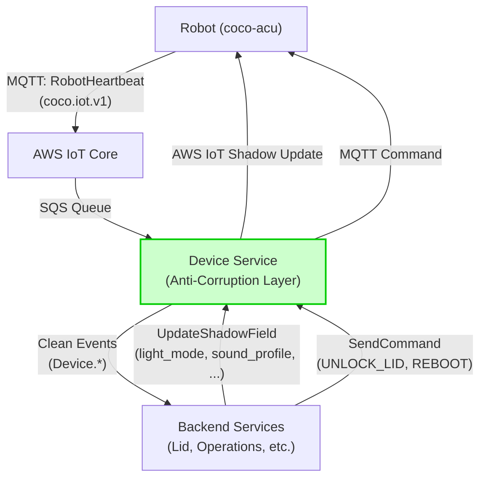

Author: @Jeremie Shaker

Co-Authors: @Alexander Hansen, @Christie Mathews

Last Updated: January 13, 2026

### Related Docs

- Entire Design: [Device API Redesign](https://www.notion.so/Device-API-Redesign-2e786fd0dcab8102a3f2fff97a772420?pvs=21)
- [Device Events Producers and Consumers](https://www.notion.so/Device-Events-Producers-and-Consumers-2e786fd0dcab80fea99fd3bca6a07c51?pvs=21)
- [Pitfalls for Device Event handling](https://www.notion.so/Pitfalls-for-Device-Event-handling-2d386fd0dcab806b92bff78ff40dffb0?pvs=21)
- [Cargo Detection](https://www.notion.so/Cargo-Detection-2db86fd0dcab80639706fddf93b24280?pvs=21)

---

# Audience

This document is addressed to engineers on the Delivery Platform team and the Robot Software team, and is meant to **share problems and upcoming plans** on the Delivery Platform and **solicit feedback from the broader software engineering team**.

# Motivation / Context

We’ve run into a number of issues (listed below) which motivated this project.:

### 1. The "Split Brain" Problem

Currently, multiple backend services (State, Operations, Dispatch, Fleet) all consume raw robot events independently. They each maintain their own version of the robot's state.

- **Consequence:** It is often unclear which service is the "authority." Service A might think the robot is `ON_TRIP` while Service B thinks it is `PARKED` because they processed events slightly differently.
- **Solution:** **Device Service** will be the _only_ consumer of raw robot telemetry. It will publish normalized events. If the Device Service says the robot is at Location X, that is the single truth for the entire platform.

### 2. Event Ordering & Network Reliability

Communication between the physical robot and the cloud is inherently unreliable. Messages can arrive out of order, be duplicated, or be lost.

- **Consequence:** Currently, every backend service has to implement complex logic to handle out-of-order events (or fail to do so, causing bugs).
- **Solution:** We are centralizing this complexity. The Device Service will act as an **Anti-Corruption Layer (ACL)**. It handles the "messiness" of the network-deduplication, ordering, and validation-so that downstream services (and the robot) can rely on clean, ordered data.

### 3. Tight Coupling & Refactoring

We want to define a strict contract between the robot and the cloud to prevent breaking changes.

- **Consequence:** Changing a message format today requires coordinated deploys across 5+ services.
- **Solution:**
    - **Protobuf**: We are moving to Protobuf to enforce strict contracts at compile time.
    - **Service Refactor**: We are deprecating the monolithic "State Service." It will be simplified into a focused **Lid Service** (handling lid cycles/PINs), while all general device state moves to the new **Device Service**.

# Key Decisions

This document outlines a redesign of the robot-to-backend communication architecture. We are moving from a decentralized model (where many services consume raw robot data) to a centralized **Device Service** that acts as the single authoritative source of truth for the robot's physical state.

- **Single interface**: All robot communication goes through Device Service (no more multiple consumers of raw MQTT)
- **Clearer contracts**: Strongly-typed Protobuf definitions for all messages
- **Business-agnostic robot**: Robot no longer needs to understand "trips" or "operations" - just physical behaviors (lights, sounds, etc.)
- **Move to semantic events:** Events like `Robots.StateChange` are too generic, and are published/subscribed to throughout the codebase. This makes it difficult to track the flow of events.

---

# Goals

- Address/solve bugs due to ambiguous state
- Deprecate State and Device service
- Define clear abstractions around the Device / Fleet
- **Backward compatibility**: Migration happens in phases with no breaking changes

---

## Architecture: Robot's View



**Key Points:**

1. Robot publishes **two types** of messages:
    - `devices/{serial}/info/state` - Heartbeat with full telemetry (every 10s)
    - `devices/{serial}/info/events` - Discrete events (lid, PIN, health)
2. Device Service is the **only** consumer of raw robot telemetry
3. Device Service validates and normalizes data
4. Device Service publishes clean `Device.*` events (Heartbeat, LidOpened, Moved, BatteryLow, etc.)
5. Backend services (Lid, Operations) consume clean events from Device Service
6. Commands and shadow updates flow through Device Service

---

## Robot Telemetry: What You Publish

The robot publishes **two types** of messages to AWS IoT:

1. **Heartbeat** (`devices/{serial}/info/state`) - Full state snapshot, published every 10 seconds
2. **Events** (`devices/{serial}/info/events`) - Discrete events published when something happens (lid opens, component fails, etc.)

### 1. Heartbeat: Full State Snapshot

The robot publishes this to `devices/{serial}/info/state` every 10 seconds:

```protobuf
syntax = "proto3";

package coco.iot.v1;

import "google/protobuf/timestamp.proto";

// Raw telemetry published by robot to AWS IoT via MQTT
// Topic: robot/{serial_number}/status
message RobotHeartbeat {
  string serial = 1;
  google.protobuf.Timestamp timestamp = 2;

  // GPS telemetry
  GpsData gps = 3;

  // Power system
  repeated BatteryData batteries = 4;

  // Component health (key-value pairs)
  // These can be promoted into having their own proto as needed.
  map<string, string> components = 5; // e.g., {"GPS": "OK", "CAMERAS": "OK", "LTE_ROUTERS": "TIMEOUT"}

  // Lid state
  LidData lid = 6;

  // Network connectivity
  NetworkData network = 7;
}

message GpsData {
  double lat = 1;
  double lng = 2;
  double heading = 3;
  double horizontal_accuracy = 4;
  double altitude = 5;
  double speed_mph = 6;
}

message BatteryData {
  int32 index = 1;
  int32 charge_percent = 2;
  bool is_charging = 3;
  double voltage = 4;
  double current = 5;
  double temperature = 6;
}

message LidData {
  bool is_open = 1;
}

message NetworkData {
  string type = 1; // "WIFI", "CELLULAR", "ETHERNET"
  int32 signal_strength = 2;
}

```

**Publishing Frequency:**

- Every 10 seconds
- No change from current behavior

---

### 2. Events: Discrete State Changes

The robot also publishes events to `devices/{serial}/info/events` when specific things happen.

**Event Envelope Proto:**

```protobuf
syntax = "proto3";

package coco.iot.v1;

import "google/protobuf/timestamp.proto";
import "google/protobuf/any.proto";

// Envelope for robot events published to devices/{serial}/info/events
message RobotEvents {
  repeated RobotEvent events = 1;
}

message RobotEvent {
  google.protobuf.Timestamp timestamp = 1;
  string event_id = 2; // UUID for deduplication

  // Event payload (one of the event types below)
  oneof event {
    LidOpenedEvent lid_opened = 10;
    LidClosedEvent lid_closed = 11;
    LidOpenRequestEvent lid_open_request = 12;
    LidCloseRequestEvent lid_close_request = 13;
    PinEntryEvent pin_entry = 14;
    ComponentFaultEvent component_fault = 15;
    ComponentRecoveredEvent component_recovered = 16;
    CargoDetectionEvent cargo_detection = 17;
  }
}

```

**Individual Event Types:**

```protobuf
// ===== Lid Events =====

message LidOpenedEvent {
  LidOpenTrigger trigger = 1;
  string request_id = 2; // If triggered by command
}

enum LidOpenTrigger {
  LID_OPEN_TRIGGER_UNSPECIFIED = 0;
  BUTTON = 1;    // Physical button press
  PIN = 2;       // PIN entered and validated
  COMMAND = 3;   // Remote unlock command
  MANUAL = 4;    // Manual/forced open
}

message LidClosedEvent {
  int32 duration_open_ms = 1; // How long lid was open
  bool was_timeout = 2;       // True if auto-closed due to timeout
}

message LidOpenRequestEvent {
  string request_id = 1; // Unique ID for this unlock request
}

message LidCloseRequestEvent {
  string request_id = 1; // Unique ID for this lock request
}

// ===== Pin Events =====

message PinEntryEvent {
  string entered_key = 1;
}

// ===== Component Health Events =====

message ComponentFaultEvent {
  string component_name = 1; // e.g., "GPS", "CAMERAS", "LTE_ROUTERS"
  string fault_code = 2;     // e.g., "TIMEOUT", "CRC_ERROR", "NOT_READY"
  string message = 3;        // Human-readable description
}

message ComponentRecoveredEvent {
  string component_name = 1; // Component that recovered
  int32 downtime_ms = 2;     // How long it was down
}

```

**Event Summary Table:**

|Event Type|When Published|Key Fields|
|---|---|---|
|`LidOpenedEvent`|Lid physically opens|`trigger` (button/pin/command)|
|`LidClosedEvent`|Lid physically closes|`duration_open_ms`, `was_timeout`|
|`LidOpenRequestEvent`|Unlock command received|`request_id`|
|`LidCloseRequestEvent`|Lock command received|`request_id`|
|`PinEntryEvent`|Key entered on pin|`entered_key`|
|`ComponentFaultEvent`|Hardware component fails|`component_name`, `fault_code`|
|`ComponentRecoveredEvent`|Component returns to OK|`component_name`, `downtime_ms`|

**Current Format vs. Proposed:**

Today, robots publish these events as JSON:

```json
{
  "events": [
    {
      "ts": 1704816896000,
      "type": "LID_OPENED",
      "uuid": "550e8400-e29b-41d4-a716-446655440000",
      "severity": "MEDIUM",
      "meta": {"trigger": "button"}
    }
  ]
}

```

**Migration Path:**

- **Phase 1** (Device Service launch): Device Service accepts JSON format, parses into proto internally
- **Phase 2** (Future): Robot publishes native protobuf messages (requires robot software update)
- **Phase 3** (Future): Remove JSON parsing support from Device Service

This allows Device Service to launch without requiring robot software changes.

**What Device Service Does With Events:**

- Consumes from `devices/{serial}/info/events` via SQS (JSON or proto)
- Correlates lid events with heartbeat state for lid cycle tracking
- Uses PIN entry events to trigger PIN validation (via Lid Service) → publishes `Device.PinEntry`
- Publishes normalized `Device.LidOpened`, `Device.LidClosed`, `Device.LidJammed`, etc. events
- Tracks component health state changes for alerting

---

### What Device Service Does With Heartbeat:

1. Validates schema and data ranges
2. Enriches with DriveU status (from separate webhook)
3. Normalizes component statuses into structured enums
4. Detects semantic changes:
    - Location change > 10m → `Device.Moved`
    - Lid state change → `Device.LidOpened` or `Device.LidClosed`
    - Lid mechanism fault → `Device.LidJammed`
    - Battery crosses 20% or 5% → `Device.BatteryLow` or `Device.BatteryCritical`
    - Connectivity change → `Device.ConnectivityChanged`
    - Component health change → `Device.HealthDegraded` or `Device.HealthRestored`
    - Emergency stop triggered → `Device.EmergencyStop`
5. Publishes `Device.Heartbeat` (always) + 0-N semantic events

---

## Device Shadow: What You Consume

### Current State (Needs Migration)

Currently, the robot reads `operation_state` from device shadow and uses it to control lights, sounds, and OTA behavior:

```yaml
# Current shadow "desired" state
desired:
  operation_state: "ON_TRIP"  # or PARKED, GROUNDED, OFF_DUTY, etc.
  dp_needs_maintenance: false
  autonomy_allowed: true
  pin_unlock: "1234"
  battery_heater_on: false
  route_id: "route-abc-123"

```

**The Problem**: `operation_state` is a business concept. The robot doesn't care about "trips" - it cares about "what lights to show" and "what sounds to play."

### Future State (After Migration)

Replace `operation_state` with **explicit, business-agnostic fields**:

```protobuf
// Device shadow "desired" state (Cloud → Robot)
message DeviceShadowDesired {
  // Explicit behavior controls (business-agnostic)
  LightMode light_mode = 1;           // STANDARD, PARKED, MAINTENANCE, OFF_DUTY, SERVICE
  SoundProfile sound_profile = 2;     // ACTIVE, QUIET, SILENT
  bool autonomy_enabled = 3;          // Can driver enable autopilot?
  bool ota_enabled = 4;               // Is OTA currently allowed?
  bool battery_heater_on = 5;         // Thermal management

  // Additional explicit controls (replaces operation_state dependencies)
  bool cameras_powered = 6;           // Should cameras remain powered?
  PinUnlockMode pin_unlock_mode = 7;  // PIN unlock behavior
  RecordingMode recording_mode = 8;   // Video/rosbag recording behavior
  bool gps_active_mode = 9;           // GPS should be in active tracking mode

  // DEPRECATED: will migrate to Lid Service
  string pin_unlock = 99;             // Magic Lid PIN (to be removed)
}

enum LightMode {
  LIGHT_MODE_UNSPECIFIED = 0;
  LIGHT_MODE_STANDARD = 1;      // Normal operation (was ON_TRIP)
  LIGHT_MODE_PARKED = 2;        // Dimmed (was PARKED)
  LIGHT_MODE_MAINTENANCE = 3;   // Warning pattern (was GROUNDED or dp_needs_maintenance)
  LIGHT_MODE_OFF_DUTY = 4;      // Minimal (was OFF_DUTY)
  LIGHT_MODE_SERVICE = 5;       // Service mode (was SERVICE)
}

enum SoundProfile {
  SOUND_PROFILE_UNSPECIFIED = 0;
  SOUND_PROFILE_ACTIVE = 1;     // Play sounds (was ON_TRIP)
  SOUND_PROFILE_QUIET = 2;      // Minimal sounds (was PARKED)
  SOUND_PROFILE_SILENT = 3;     // No sounds (was GROUNDED/OFF_DUTY)
}

enum PinUnlockMode {
  PIN_UNLOCK_MODE_UNSPECIFIED = 0;
  PIN_UNLOCK_MODE_ENABLED = 1;    // PIN unlock allowed (was PARKED)
  PIN_UNLOCK_MODE_DISABLED = 2;   // PIN unlock blocked (was SERVICE, GROUNDED)
}

enum RecordingMode {
  RECORDING_MODE_UNSPECIFIED = 0;
  RECORDING_MODE_ACTIVE = 1;      // Full recording (was ON_TRIP)
  RECORDING_MODE_STANDBY = 2;     // Reduced recording (was PARKED)
  RECORDING_MODE_OFF = 3;         // No recording (was OFF_DUTY)
}

```

### Migration Strategy

**Phase 1: Parallel Run (No Robot Changes Yet)**

- Backend writes **both** `operation_state` (old) and new explicit fields
- Robot continues reading `operation_state`
- Duration: TBD (could be several months)

**New fields written in Phase 1:**

|Field|Derived From|
|---|---|
|`light_mode`|`operation_state` + `dp_needs_maintenance`|
|`sound_profile`|`operation_state`|
|`ota_enabled`|`operation_state == OFF_DUTY` + additional safety checks|
|`cameras_powered`|`operation_state in [ON_TRIP, SERVICE]` + other conditions|
|`pin_unlock_mode`|`operation_state == PARKED` → ENABLED, else DISABLED|
|`recording_mode`|`operation_state` mapping|
|`gps_active_mode`|`operation_state == ON_TRIP`|

**Phase 2: Robot Reads New Fields (Robot Software Update Required)**

- Robot code updated to:
    1. **Prefer** new explicit fields (`light_mode`, `sound_profile`, etc.)
    2. **Fall back** to `operation_state` if new fields not present (for backward compatibility)

**Components to update in Phase 2:**

1. `lights_controller.py` → Use `light_mode`
2. `sound_effects.py` → Use `sound_profile`
3. `ota_permitter.py` → Use `ota_enabled`
4. `ota_blocker.py` → Use `ota_enabled`
5. `camera_power_manager_nodelet.cpp` → Use `cameras_powered`
6. `pin_unlock/context.cpp` + `states.cpp` → Use `pin_unlock_mode`
7. `video_recorder_node.cpp` → Use `recording_mode`
8. `rosbag_manager/manager.py` → Use `recording_mode`
9. `rosbag_recorder.cpp` → Use `recording_mode`
10. `point_one_gps_driver.cpp` → Use `gps_active_mode`
11. `state_publisher.py` → Remove `operation_state` from `CocoState`
12. `self_grounding.py` → Evaluate if migration needed (see open questions)

**Phase 3: Remove operation_state (Backend Changes)**

- Backend stops writing `operation_state`
- Robot fully on new fields
- Business-agnostic robot achieved

### How Backend Computes New Fields

The backend will use domain facts to compute the explicit fields:

```tsx
// Pseudo-code
function computeDeviceShadowDesired(robot: Robot): DeviceShadowDesired {
  // Domain facts - NOT operationState
  const hasActiveTrip = robot.activeTrip != null;
  const hasPendingTasks = robot.pendingFoTasks.length > 0;
  const needsMaintenance = robot.selfGroundingFlags.some(f => f.active);
  const isDeployed = robot.deployment != null;
  const isInServiceMode = robot.serviceMode;
  const tripJustEnded = robot.tripEndedAt &&
    (Date.now() - robot.tripEndedAt < OTA_COOLDOWN_MS);

  // Light mode
  let lightMode = LightMode.STANDARD;
  if (needsMaintenance || robot.dpNeedsMaintenance) {
    lightMode = LightMode.MAINTENANCE;
  } else if (isInServiceMode) {
    lightMode = LightMode.SERVICE;
  } else if (!isDeployed) {
    lightMode = LightMode.OFF_DUTY;
  } else if (!hasActiveTrip) {
    lightMode = LightMode.PARKED;
  }

  // Sound profile
  const soundProfile = hasActiveTrip
    ? SoundProfile.ACTIVE
    : SoundProfile.QUIET;

  // OTA: only when safe (not on trip, not recently finished trip)
  const otaEnabled = !hasActiveTrip && !tripJustEnded && !isDeployed;

  // Cameras: on during trips or service mode
  const camerasPowered = hasActiveTrip || isInServiceMode;

  // PIN unlock: only when parked (not grounded/service)
  const pinUnlockMode = (!needsMaintenance && !isInServiceMode && !hasActiveTrip)
    ? PinUnlockMode.ENABLED
    : PinUnlockMode.DISABLED;

  // Recording: active during trips, standby when parked
  const recordingMode = hasActiveTrip
    ? RecordingMode.ACTIVE
    : (isDeployed ? RecordingMode.STANDBY : RecordingMode.OFF);

  // GPS active mode: only during trips
  const gpsActiveMode = hasActiveTrip;

  return {
    light_mode: lightMode,
    sound_profile: soundProfile,
    autonomy_enabled: !needsMaintenance && robot.routeId != null,
    ota_enabled: otaEnabled,
    battery_heater_on: robot.location.temperature < 0,
    cameras_powered: camerasPowered,
    pin_unlock_mode: pinUnlockMode,
    recording_mode: recordingMode,
    gps_active_mode: gpsActiveMode,
  };
}

```

### Complete List of Components Using `operation_state`

The following table lists **every component** in coco-acu that depends on `operation_state` and how each will be migrated:

|Component|Location|Current Usage|States Used|New Field(s)|Migration Notes|
|---|---|---|---|---|---|
|**Lights Control**|`lights_control/lights_controller.py`|Subscribes to `/robot/operation_state` to set light patterns|`ON_TRIP`, `PARKED`, `GROUNDED`, `OFF_DUTY`, `SERVICE`, `OTA_IN_PROGRESS`|`light_mode`|Direct mapping to `LightMode` enum|
|**Sound Effects**|`sound_effects/sound_effects.py`|Subscribes to `/robot/operation_state` to control sounds on lid events|`ON_TRIP`, `PARKED`|`sound_profile`|Direct mapping to `SoundProfile` enum|
|**Camera Power Manager**|`camera_power_manager/camera_power_manager_nodelet.cpp`|Keeps cameras on during certain states|`ON_TRIP`, `SERVICE`|`cameras_powered`|Backend sets `true` when cameras needed|
|**Pin Unlock**|`pin_unlock/context.cpp`, `states.cpp`|Controls lid lock behavior based on state|`PARKED` (allows unlock), `SERVICE`/`GROUNDED` (blocks some operations)|`pin_unlock_mode`|Use `PIN_UNLOCK_MODE_ENABLED` for PARKED|
|**OTA Permitter**|`ota_permitter/ota_permitter.py`|Only allows OTA in specific states|`OFF_DUTY`|`ota_enabled`|Backend sets `true` only when OTA safe|
|**OTA Blocker**|`ota_blocker/ota_blocker.py`|Defers Greengrass component updates during trips|`ON_TRIP` (blocks), plus delay after trip|`ota_enabled`|Backend handles delay logic; robot just reads `ota_enabled`|
|**Video Recorder**|`video_recorder/video_recorder_node.cpp`|Controls H264 recording based on state + lid|`PARKED`, `ON_TRIP` (enables recording when lid open)|`recording_mode`|Use `RECORDING_MODE_ACTIVE` for ON_TRIP|
|**Rosbag Manager**|`rosbag_manager/manager.py`|Subscribes for upload/recording decisions|Various|`recording_mode`|Use `RECORDING_MODE_ACTIVE` for ON_TRIP|
|**Rosbag Recorder**|`rosbag_manager/rosbag_recorder.cpp`|Subscribes for recording behavior|Various|`recording_mode`|Use `RECORDING_MODE_ACTIVE` for ON_TRIP|
|**GPS Driver (Point One)**|`gps_driver/point_one_gps_driver.cpp`|Triggers GPS actions on state transitions|`ON_TRIP` (triggers GPS reset/reconnect)|`gps_active_mode`|Set `true` when active tracking needed|
|**Self Grounding**|`self_grounding/self_grounding.py`|Uses state for maintenance/grounding decisions|Various|N/A|**Keep subscribing** - self-grounding logic stays on robot|
|**State Reporter**|`state_reporter/state_publisher.py`|Includes `operation_state` in `CocoState` heartbeat|All states|**Remove field**|Backend derives state from domain events; robot doesn't need to report it|
|**Shadow File**|`shadow_file/config/topics.yaml`|Syncs `operation_state` bidirectionally with AWS IoT Shadow|All states|**Deprecated**|Replace with explicit fields; backend writes, robot reads|

### What Robot Software Needs to Change

**1. lights_control node** (`lights_control/lights_controller.py`):

```python
# BEFORE (current)
if robot.operation_state == "ON_TRIP":
    set_lights(STANDARD_PATTERN)
elif robot.operation_state == "PARKED":
    set_lights(DIMMED_PATTERN)
elif robot.operation_state == "GROUNDED" or robot.dp_needs_maintenance:
    set_lights(MAINTENANCE_PATTERN)
# ... etc

# AFTER (Phase 2+)
light_mode = shadow.desired.light_mode or derive_from_operation_state()  # Fallback
if light_mode == LightMode.STANDARD:
    set_lights(STANDARD_PATTERN)
elif light_mode == LightMode.PARKED:
    set_lights(DIMMED_PATTERN)
elif light_mode == LightMode.MAINTENANCE:
    set_lights(MAINTENANCE_PATTERN)
# ... etc

```

**2. sound_effects node** (`sound_effects/sound_effects.py`):

```python
# BEFORE
if robot.operation_state == "ON_TRIP":
    play_sound("lid_open_on_trip")
elif robot.operation_state in ["PARKED", "OFF_DUTY"]:
    play_sound("lid_open_parked")

# AFTER
sound_profile = shadow.desired.sound_profile or derive_from_operation_state()
if sound_profile == SoundProfile.ACTIVE:
    play_sound("lid_open_active")
elif sound_profile == SoundProfile.QUIET:
    play_sound("lid_open_quiet")
elif sound_profile == SoundProfile.SILENT:
    pass  # No sound

```

**3. ota_permitter node** (`ota_permitter/ota_permitter.py`):

```python
# BEFORE
if robot.operation_state == "OFF_DUTY":
    allow_ota()

# AFTER
if shadow.desired.ota_enabled:
    allow_ota()

```

**4. ota_blocker node** (`ota_blocker/ota_blocker.py`):

```python
# BEFORE - Complex logic with trip delay
if self._operation_state == "ON_TRIP":
    return True, "the robot is ON_TRIP"
if self._trip_lasted_until is not None:
    elapsed = time.time() - self._trip_lasted_until
    if elapsed < SECONDS_TO_BLOCK_OTA_AFTER_TRIP:
        return True, f"trip finished {elapsed:.1f}s ago"

# AFTER - Simple flag (backend handles delay logic)
if not shadow.desired.ota_enabled:
    defer_ota()

```

**5. camera_power_manager nodelet** (`camera_power_manager/camera_power_manager_nodelet.cpp`):

```cpp
// BEFORE
named_condition{"robot is ON_TRIP", operation_state_() == "ON_TRIP"},
named_condition{"robot is in SERVICE state", operation_state_() == "SERVICE"},

// AFTER
named_condition{"cameras should be powered", shadow_desired_.cameras_powered()},

```

**6. pin_unlock node** (`pin_unlock/context.cpp`, `states.cpp`):

```cpp
// BEFORE - Multiple state checks scattered throughout
if (ctx_.operation_state().value_or("") == "PARKED") {
    open_lock_and_start_retry_timer();
}
if (ctx_.operation_state().value_or("") == "SERVICE" ||
    ctx_.operation_state().value_or("") == "GROUNDED") {
    return;  // Block operation
}

// AFTER - Single mode check
if (shadow_desired_.pin_unlock_mode() == PIN_UNLOCK_MODE_ENABLED) {
    open_lock_and_start_retry_timer();
}
if (shadow_desired_.pin_unlock_mode() == PIN_UNLOCK_MODE_DISABLED) {
    return;  // Block operation
}

```

**7. video_recorder node** (`video_recorder/video_recorder_node.cpp`):

```cpp
// BEFORE
const bool lid_recording_condition = is_lid_open_ &&
    (operation_state_() == "PARKED" || operation_state_() == "ON_TRIP");

// AFTER
const bool lid_recording_condition = is_lid_open_ &&
    (shadow_desired_.recording_mode() != RECORDING_MODE_OFF);

```

**8. gps_driver (Point One)** (`gps_driver/point_one_gps_driver.cpp`):

```cpp
// BEFORE
if (operation_state_ == "ON_TRIP") {
    // Trigger GPS reset/reconnect for active tracking
    asio::co_spawn(io_context_, [this]() -> asio::awaitable<void> { ... });
}

// AFTER
if (shadow_desired_.gps_active_mode()) {
    // Trigger GPS reset/reconnect for active tracking
    asio::co_spawn(io_context_, [this]() -> asio::awaitable<void> { ... });
}

```

**9. state_reporter node** (`state_reporter/state_publisher.py`):

```python
# BEFORE
def operation_state_subscriber(self, data: String):
    with self.mtx:
        self.cocoState.operation_state = data.data

# AFTER - Remove this field entirely from CocoState
# Backend derives operation_state from domain events (Trip.*, FoTask.*, etc.)
# Robot doesn't need to report it

```

**10. self_grounding node** (`self_grounding/self_grounding.py`):

```python
# NO CHANGE NEEDED
# Self-grounding logic stays on robot
# It still subscribes to operation_state to know when to check conditions
# However, consider: should this use a new explicit field like `grounding_checks_enabled`?

```

---

## Commands: What You'll Receive

Device Service forwards commands to the robot via AWS IoT. These are **synchronous requests** (robot should acknowledge).

### Command Types

```protobuf
enum DeviceCommandType {
  DEVICE_COMMAND_TYPE_UNSPECIFIED = 0;
  DEVICE_COMMAND_TYPE_UNLOCK_LID = 1;
  DEVICE_COMMAND_TYPE_LOCK_LID = 2;
  DEVICE_COMMAND_TYPE_HONK = 3;
  DEVICE_COMMAND_TYPE_FLASH_LIGHTS = 4;
  DEVICE_COMMAND_TYPE_EMERGENCY_STOP = 5;
  DEVICE_COMMAND_TYPE_REBOOT = 6;
}

```

### How Commands Work

1. Backend service calls `DeviceService.SendCommand(serial, UNLOCK_LID)`
2. Device Service publishes MQTT message to `robot/{serial}/commands`
3. Robot receives command, executes, publishes acknowledgment
4. Device Service returns response to backend service

**Robot Implementation:**

- Subscribe to MQTT topic: `robot/{serial}/commands`
- Parse command type and parameters
- Execute command
- Publish acknowledgment to `robot/{serial}/commands/ack`

**Example MQTT Command Message:**

```json
{
  "command_id": "cmd-abc-123",
  "command_type": "UNLOCK_LID",
  "parameters": {},
  "request_id": "req-xyz-789",
  "sent_at": "2026-01-09T12:34:56Z"
}

```

**Expected Acknowledgment:**

```json
{
  "command_id": "cmd-abc-123",
  "status": "EXECUTED",  // or FAILED
  "executed_at": "2026-01-09T12:34:57Z",
  "error_message": null
}

```

---

## Events Published by Device Service

After processing your `RobotHeartbeat`, Device Service publishes these events to backend services:

### 1. Device.Heartbeat (Always Published)

Full state snapshot, published every time a heartbeat is processed:

```protobuf
message DeviceHeartbeat {
  string device_name = 1;  // "devices/ABC123"
  Device device = 2;       // Full device state
  google.protobuf.Timestamp received_at = 3;
  google.protobuf.FieldMask updated_fields = 4;  // Which fields changed
}

```

**Consumers**: Fleet Service (Redis cache), Fleet Device Service (read replica)

### 2. Semantic Events (Conditional)

Published only when specific thresholds or transitions occur:

|Event|Trigger|Purpose|
|---|---|---|
|`Device.Moved`|Location change > 10m|Route tracking, geofence alerts|
|`Device.LidOpened`|Lid state: closed → open|Lid cycle tracking|
|`Device.LidClosed`|Lid state: open → closed|Lid cycle completion|
|`Device.LidJammed`|Lid mechanism reports fault|Critical fault handling|
|`Device.BatteryLow`|Battery crosses 20% threshold|Ops alerts, preemptive charging|
|`Device.BatteryCritical`|Battery crosses 5% threshold|Critical alerts, trip safety|
|`Device.ConnectivityChanged`|Online ↔ Offline|Fleet monitoring, trip safety|
|`Device.HealthDegraded`|Component enters fault|Maintenance alerts|
|`Device.HealthRestored`|Component returns to OK|Maintenance resolution|
|`Device.EmergencyStop`|Emergency stop button pressed|Safety-critical response|
|`Device.PinEntry`|Key pressed on device pin pad|PIN validation (via Lid Service)|

**Why Semantic Events?**

- Backend services don't need to parse full heartbeats to detect these changes
- Threshold logic (20%, 5%, 10m) lives in one place (Device Service)
- Lid Service just subscribes to `Device.LidOpened/Closed`, not full heartbeats
- Less duplication, cleaner separation of concerns

---
## Event Broker Ordering

All events require an event key, which should be the DeviceID. The event key is needed to guarantee event ordering for events. This guarantees ordering within a topic, but not across topics. This means that publishing battery low and lid opened on separate topics may result in a separate order.

These events should never include state that is not owned by the device service. If there is data related to the device, but not owned by the device service. Eg. uber fleet id, unless there is a value stored in device service that governs the id, it should not be published because device service can only be sure about the data that itself owns.

All events should include:

- A message id
    
- A message key: serial for ordering
    
- Validation:
    
    Generation an increment indicating the generation of device object that the event is based on.
    
    This could also be a hash which can be used to validate the exact instance of the device.
    
    Timestamp.
    

Reacting to events should not pull in other data unless it can guarantee it was ≥ the generation that the event was based on.

Any state included on the event should be owned by device service and include a way to validate with the existing state.

### Infra Choice: Message keys

Kafka defines a message key, which is used to guarantee the ordering of an event. Bufstream supports this as well as it is Kafka compatible. RMQ allows events to be mapped to the same location with the routing key. This guarantees the ordering assuming not processing through a DLQ.

---
## What Doesn't Change

1. **MQTT topics**: Still publish to `devices/{serial}/info/state` and `devices/{serial}/info/events`
2. **Publishing frequency**: Still every 10 seconds for heartbeat
3. **AWS IoT Shadow**: Still used for desired/reported state
4. **DriveU integration**: Still publishes streamer status separately
5. **Greengrass**: Still used for software deployment
6. **Most component logic**: Components still make decisions, just based on different inputs

**What DOES Change:**

|Area|Before|After|
|---|---|---|
|**MQTT Consumers**|Multiple backend services consume raw MQTT|Device Service is the single consumer|
|**Shadow Fields**|`operation_state` (business concept)|Explicit fields: `light_mode`, `sound_profile`, `ota_enabled`, etc.|
|**Decision Making**|Robot infers behavior from business state|Backend tells robot exactly what to do|
|**OTA Logic**|Robot checks `operation_state == OFF_DUTY`|Backend computes `ota_enabled` with all business rules|
|**Heartbeat Content**|Includes `operation_state`|Removes `operation_state` (backend derives it)|
|**Components Updated**|N/A|12 components need migration|

---

## Device Service API (For Reference)

You won't call these directly, but backend services will:

```protobuf
service DeviceService {
  // --- Device CRUD ---
  rpc GetDevice(GetDeviceRequest) returns (Device);
  rpc ListDevices(ListDevicesRequest) returns (ListDevicesResponse);
  rpc BatchGetDevices(BatchGetDevicesRequest) returns (BatchGetDevicesResponse);

  // --- Real-time Updates ---
  rpc StreamDeviceUpdates(StreamDeviceUpdatesRequest) returns (stream DeviceUpdate);

  // --- Commands (sent to robot) ---
  rpc SendCommand(SendCommandRequest) returns (SendCommandResponse);

  // --- Device Shadow Management (per-field RPCs) ---
  rpc UpdateLightMode(UpdateLightModeRequest) returns (UpdateLightModeResponse);
  rpc GetLightMode(GetLightModeRequest) returns (GetLightModeResponse);
  rpc UpdateSoundProfile(UpdateSoundProfileRequest) returns (UpdateSoundProfileResponse);
  rpc GetSoundProfile(GetSoundProfileRequest) returns (GetSoundProfileResponse);
  rpc UpdateAutonomyEnabled(UpdateAutonomyEnabledRequest) returns (UpdateAutonomyEnabledResponse);
  rpc GetAutonomyEnabled(GetAutonomyEnabledRequest) returns (GetAutonomyEnabledResponse);
  rpc UpdateOtaEnabled(UpdateOtaEnabledRequest) returns (UpdateOtaEnabledResponse);
  rpc GetOtaEnabled(GetOtaEnabledRequest) returns (GetOtaEnabledResponse);
  rpc UpdateBatteryHeaterOn(UpdateBatteryHeaterOnRequest) returns (UpdateBatteryHeaterOnResponse);
  rpc GetBatteryHeaterOn(GetBatteryHeaterOnRequest) returns (GetBatteryHeaterOnResponse);
  rpc UpdateCamerasPowered(UpdateCamerasPoweredRequest) returns (UpdateCamerasPoweredResponse);
  rpc GetCamerasPowered(GetCamerasPoweredRequest) returns (GetCamerasPoweredResponse);
  rpc UpdatePinUnlockMode(UpdatePinUnlockModeRequest) returns (UpdatePinUnlockModeResponse);
  rpc GetPinUnlockMode(GetPinUnlockModeRequest) returns (GetPinUnlockModeResponse);
  rpc UpdateRecordingMode(UpdateRecordingModeRequest) returns (UpdateRecordingModeResponse);
  rpc GetRecordingMode(GetRecordingModeRequest) returns (GetRecordingModeResponse);
  rpc UpdateGpsActiveMode(UpdateGpsActiveModeRequest) returns (UpdateGpsActiveModeResponse);
  rpc GetGpsActiveMode(GetGpsActiveModeRequest) returns (GetGpsActiveModeResponse);

  // --- Temporary: Remove after Magic Lid migration ---
  rpc SetUnlockPin(SetUnlockPinRequest) returns (SetUnlockPinResponse);
  rpc ClearUnlockPin(ClearUnlockPinRequest) returns (ClearUnlockPinResponse);
}

```

**Primary Callers:**

- **Operations Service**: Updates shadow when business state changes (trip assigned, robot grounded)
- **Lid Service**: Manages PINs (temporary), sends lid commands
- **Mission Control**: Manual overrides, testing, troubleshooting

---

## Benefits for Robot Software Team

1. **Simpler contracts**: Robot just reports physical state, doesn't need to understand backend business logic
2. **Fewer breaking changes**: Device Service handles normalization, so MQTT format changes are isolated
3. **Better debugging**: Device Service logs all raw telemetry with validation errors
4. **Cleaner code**: All 12 components using `operation_state` will use explicit, purpose-driven fields
5. **Backward compatible migration**: No "big bang" deployment - phases allow gradual rollout
6. **Reduced coupling**: OTA delay logic, grounding decisions, and other business rules move to backend
7. **Easier testing**: Each component reads a single explicit field instead of inferring from business state
8. **Explicit contracts**: Clear what each shadow field controls - no more guessing what "PARKED" means for cameras

---

## Timeline & Migration Plan

### Phase 1: Device Service Launch

- Device Service deployed and consuming raw MQTT
- Backend services migrate from direct MQTT to Device Service events
- **No robot changes required**
- Shadow still uses `operation_state`

### Phase 2: Parallel Shadow Fields

- Backend writes both `operation_state` (old) and new explicit fields:
    - `light_mode`, `sound_profile`, `ota_enabled`
    - `cameras_powered`, `pin_unlock_mode`, `recording_mode`, `gps_active_mode`
- **No robot changes required yet**
- Validation: Compare derived field values with expected `operation_state` behavior

### Phase 3: Robot Adopts New Shadow Fields

- **Robot software update required**
- **12 components need updates** (see Complete List above):
    1. `lights_controller.py` → `light_mode`
    2. `sound_effects.py` → `sound_profile`
    3. `ota_permitter.py` → `ota_enabled`
    4. `ota_blocker.py` → `ota_enabled`
    5. `camera_power_manager_nodelet.cpp` → `cameras_powered`
    6. `pin_unlock/context.cpp` + `states.cpp` → `pin_unlock_mode`
    7. `video_recorder_node.cpp` → `recording_mode`
    8. `rosbag_manager/manager.py` → `recording_mode`
    9. `rosbag_recorder.cpp` → `recording_mode`
    10. `point_one_gps_driver.cpp` → `gps_active_mode`
    11. `state_publisher.py` → Remove `operation_state` from `CocoState`
    12. `self_grounding.py` → TBD (see open questions)
- All components use explicit fields with fallback to `operation_state`
- Deploy gradually (canary → production)

### Phase 4: Remove operation_state

- Backend stops writing `operation_state` to shadow
- Remove `operation_state` subscription from remaining components
- Remove `operation_state` from `CocoState` heartbeat message
- Update `shadow_file/config/topics.yaml` to remove `operation_state` sync
- Robot fully on new fields
- Business-agnostic robot achieved

---

## Questions for Robot Software Team

### Migration & Implementation

1. **Event format migration**: Currently events are published as JSON. Should we:
    - **Option A**: Keep JSON indefinitely (Device Service always parses JSON → proto)
    - **Option B**: Migrate robot to publish native protobuf in Phase 2 (cleaner, more efficient)
    - **Option C**: Support both formats long-term (more flexibility, more complexity)
2. **Command acknowledgments**: Current command flow uses JSON over MQTT. Should we migrate to Protobuf for commands too, or keep JSON for simplicity?
3. **Shadow migration effort**: What's the estimated effort to update ALL 12 components that depend on `operation_state`? (See Complete List above)
4. **Testing strategy**: How do we want to test Phase 2 (robot using new fields)? Staging robots first? Canary deployment?
5. **Component health structure**: The current `components` map is loosely typed (`map<string, string>`). Should we define structured component status protos, or keep the flexibility of key-value pairs?

### New Field Design

1. **Camera Power Manager**: The current logic has multiple conditions for keeping cameras on (lid open, has pin, joystick connected, webrtc request, uptime check). Should `cameras_powered` be:
    - **Option A**: A simple boolean that backend sets (robot loses local decision-making)
    - **Option B**: A "hint" that combines with local conditions (hybrid)
    - **Option C**: Keep current logic, don't migrate this component
2. **Pin Unlock complexity**: The pin_unlock component has complex state machine logic (different behaviors for Magic Lid vs Specified PIN). Is a simple `pin_unlock_mode` enum sufficient, or do we need more granular control?
3. **Recording Mode**: Video recorder and rosbag manager/recorder have different conditions for recording. Should they share `recording_mode`, or have separate fields?
4. **Self Grounding**: This component uses `operation_state` for maintenance decisions. Options:
    - **Option A**: Move grounding decision logic to backend entirely
    - **Option B**: Add new field `grounding_checks_enabled`
    - **Option C**: Keep subscribing to `operation_state` (self-grounding logic stays on robot)
5. **GPS Driver**: The GPS driver triggers actions on `ON_TRIP` transition. Is `gps_active_mode` sufficient, or should we publish an event when backend wants GPS reset?

### General Design

1. **Event Severity**: Should we keep using the concept of Event Severity?
2. **PIN Entry vs. Pin Entry:** Processing each digit at a time makes the device more stateless. Is it worth pursuing this change?
3. **Route ID:** What is the intended use case? Should we start using route ID?
4. **State Reporter**: After removing `operation_state` from `CocoState`, should we add any of the new explicit fields to the heartbeat? Or should the heartbeat only contain physical state?