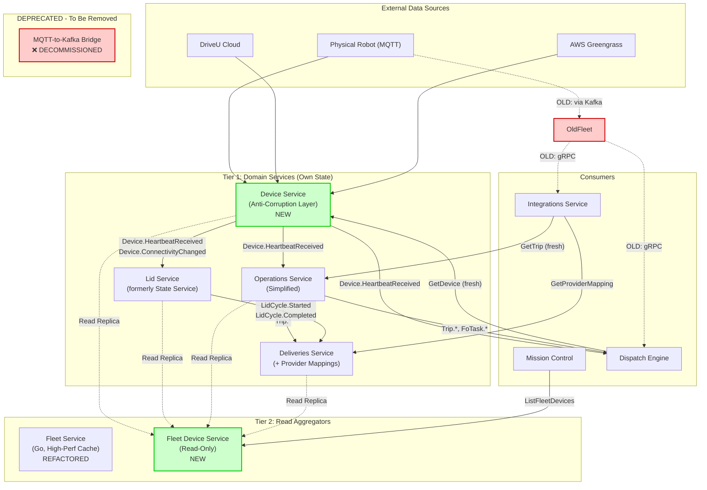
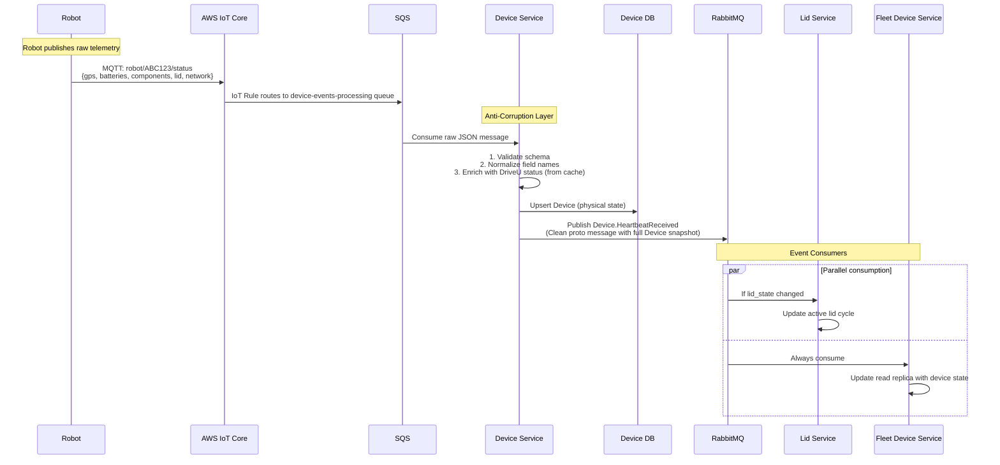
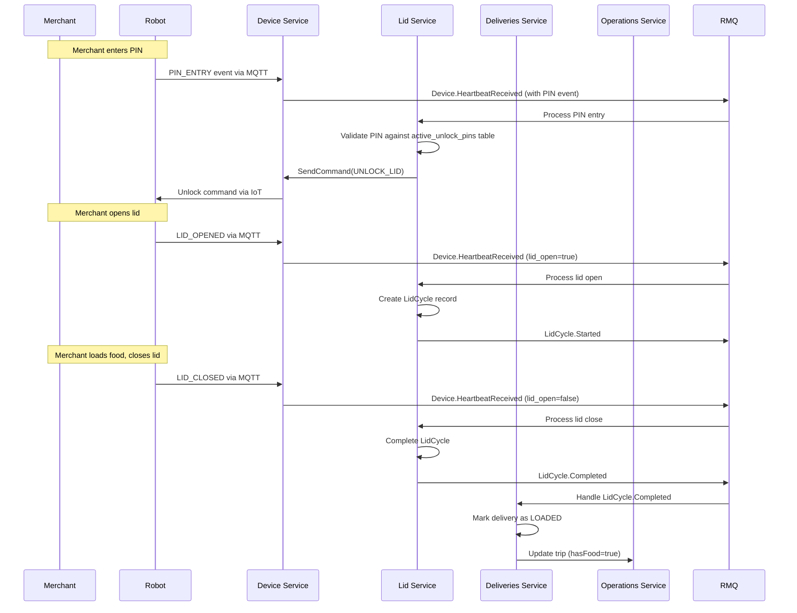
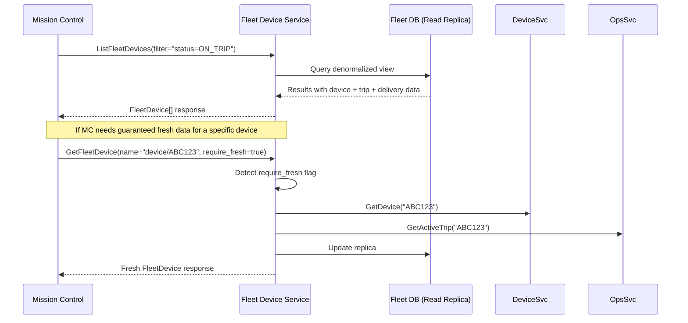

## Terminology Note

**"Fleet Service" vs "Fleet Device Service":**
- **Fleet Service** (existing, Go-based) = The current `coco-services/fleet` service. **Will be refactored** to consume from Device Service events instead of Kafka. Continues to serve high-performance machine-facing queries (Dispatch Engine).
- **Fleet Device Service** (new) = A read-only aggregator service proposed in this design. **This is brand new.** Serves human-facing queries (Mission Control, admin tools).

**Key Distinction:**
- **Fleet Service**: High-performance Redis cache for automated decision systems (Dispatch Engine)
- **Fleet Device Service**: Postgres read replicas for human-facing dashboards and tools

Both services aggregate telemetry + business state, but for different consumers with different latency/consistency requirements.

## Design Principles

1. **Single Responsibility**: Each service owns one domain and is the authoritative source for that domain's state.
2. **Anti-Corruption Layer**: Raw external data (MQTT, DriveU webhooks, AWS APIs) enters through a single service that normalizes it.
3. **Read Replicas for Aggregation**: Cross-domain queries are served by read-only replicas, not by querying multiple services at runtime.
4. **Events, Not Commands**: Published messages describe what happened, not what should happen.
5. **Stale Data Acknowledgment**: Read replicas may be stale; services needing fresh data query the owner directly.

---

## Architecture Overview



---

## Service Responsibilities

### Device Service (Anti-Corruption Layer)

**What it owns:**
- Device shadow (current physical state)
- Device registry (serial numbers, hardware metadata)
- Connectivity status (online/offline, DriveU status)
- Component health snapshots

**What it does:**
- Consumes raw MQTT heartbeats from SQS
- Consumes DriveU webhooks from SQS
- Polls AWS Greengrass for software status
- Normalizes and persists device state
- Publishes clean domain events

**What it does NOT do:**
- Manage lid cycles (that's the Lid Service)
- Know about trips, deliveries, or business context
- Make decisions about robot dispatchability

**Events Published:**

| Event | Trigger | Payload |
|-------|---------|---------|
| `Device.HeartbeatReceived` | Every processed heartbeat | Full Device snapshot (see Event Schemas below) |
| `Device.ConnectivityChanged` | Online ↔ Offline transition | Serial, new/old status, timestamp |
| `Device.HealthDegraded` | Component enters fault state | Serial, component, fault code |
| `Device.HealthRestored` | Component returns to OK | Serial, component |

**Event Schemas:**

The Device Service normalizes raw MQTT data and publishes clean, structured events:

```protobuf
// Published to RabbitMQ after processing raw MQTT heartbeat
message DeviceHeartbeatReceived {
  string device_name = 1; // "devices/{serial_number}"
  Device device = 2; // Full device snapshot with current state
  google.protobuf.Timestamp received_at = 3;
  
  // Which fields changed since last heartbeat (for optimization)
  google.protobuf.FieldMask updated_fields = 4;
}

// Published when connectivity state transitions
message DeviceConnectivityChanged {
  string device_name = 1;
  bool online = 2;
  bool previous_online = 3;
  google.protobuf.Timestamp changed_at = 4;
}

// Published when component health degrades
message DeviceHealthDegraded {
  string device_name = 1;
  string component_name = 2;
  HardwareStatusCode status_code = 3;
  string message = 4;
  google.protobuf.Timestamp detected_at = 5;
}
```

**Raw MQTT Heartbeat (What Device Sends):**

For reference, here's what the robot currently sends via MQTT (simplified):

```json
{
  "serial": "ABC123",
  "timestamp": 1704891234567,
  "gps": {
    "lat": 37.7749,
    "lng": -122.4194,
    "heading": 45.2,
    "horizontal_accuracy": 3.5,
    "altitude": 10.2,
    "speed_mph": 5.3
  },
  "batteries": [{
    "index": 0,
    "charge_percent": 87,
    "is_charging": false,
    "voltage": 48.2,
    "current": -5.3,
    "temperature": 32.5
  }],
  "components": {
    "GPS": "OK",
    "CAMERAS": "OK",
    "SEGWAY_BASE": "OK",
    "LTE_ROUTERS": "TIMEOUT",
    "EMERGENCY_BUTTON": "OK"
  },
  "lid": {
    "is_open": false
  },
  "network": {
    "type": "CELLULAR",
    "signal_strength": -85
  }
}
```

The Device Service:
1. Validates this structure
2. Enriches with DriveU status (from separate webhook)
3. Normalizes into the `Device` proto message
4. Publishes `DeviceHeartbeatReceived` event with full snapshot

**gRPC API:**
```protobuf
service DeviceService {
  // Reads
  rpc GetDevice(GetDeviceRequest) returns (Device);
  rpc ListDevices(ListDevicesRequest) returns (ListDevicesResponse);
  rpc StreamDeviceUpdates(StreamDeviceUpdatesRequest) returns (stream DeviceUpdate);
  
  // Commands (these cause physical robot actions)
  rpc SendCommand(SendCommandRequest) returns (SendCommandResponse);

  // Remove after we change the MagicLid flow to use the Lid service
  rpc SetUnlockPin(SetUnlockPinRequest) returns (SetUnlockPinResponse);
  rpc ClearUnlockPin(ClearUnlockPinRequest) returns (ClearUnlockPinResponse);
}
```

**Note:** No separate `SetUnlockPin`/`ClearUnlockPin` RPCs. PIN management is handled via the generic `SendCommand` RPC with command type `SET_PIN`. This is a temporary requirement to support the current Magic Lid firmware flow. Once Magic Lid migrates to server-side validation, PIN commands will be eliminated entirely from Device Service.

---

### Lid Service (formerly State Service)

**What it owns:**
- Lid cycle state machine
- Lid cycle history
- Active unlock PINs (which PINs are valid for which robots)
- PIN validation logic

**What it does:**
- Subscribes to `Device.HeartbeatReceived` for lid state changes
- Manages lid cycle lifecycle (Init → Complete/Timeout)
- Stores and validates PINs against active delivery/task context
- Calls `DeviceService.SendCommand(SET_PIN)` to configure robot firmware (temporary, until Magic Lid migration)
- Publishes lid cycle events

**What it does NOT do:**
- Own the device shadow (that's the Device Service now)
- Know about the full device state (battery, GPS, etc.)
- Manage robot state machine (ON_TRIP, PARKED, etc.)

**Events Published:**

| Event | Trigger | Payload |
|-------|---------|---------|
| `LidCycle.Started` | Lid opened | Serial, cycle_id, context_id (e.g., delivery_id) |
| `LidCycle.Completed` | Lid closed within timeout | Serial, cycle_id, duration |
| `LidCycle.Timeout` | Lid open too long | Serial, cycle_id |
| `LidCycle.PinValidated` | Correct PIN entered | Serial, pin_type (merchant/customer) |
| `LidCycle.PinRejected` | Incorrect PIN entered | Serial, attempted_pin |

**Note:** These are events describing what happened, not commands. The Deliveries Service subscribes and decides what to do (e.g., mark delivery as loaded).

**gRPC API:**
```protobuf
service LidService {
  // PIN Management
  rpc SetUnlockPin(SetUnlockPinRequest) returns (SetUnlockPinResponse);
  rpc ClearUnlockPin(ClearUnlockPinRequest) returns (google.protobuf.Empty);
  rpc ValidatePin(ValidatePinRequest) returns (ValidatePinResponse);
  
  // Lid Cycle Management
  rpc GetLidCycle(GetLidCycleRequest) returns (LidCycle);
  rpc ListLidCycles(ListLidCyclesRequest) returns (ListLidCyclesResponse);
}
```

When a caller (e.g., Deliveries Service) sets a PIN, Lid Service:
1. Stores it in `active_unlock_pins` table
2. For Magic Lid flow: Calls `DeviceService.SendCommand(SET_PIN)` to configure robot firmware (temporary)
3. For Deviceless flow: Just stores it for server-side validation

---

### Operations Service (Simplified)

**What it owns:**
- Trip lifecycle
- FO Task lifecycle
- Deployment state

**What it does NOT own anymore:**
- ~~Robot operational state (ON_TRIP, PARKED, GROUNDED, OFF_DUTY)~~ - This aggregated state is now derived by Fleet Device Service
- ~~Maintenance flags stored separately~~ - The existence of FO tasks IS the maintenance state

**Events Published:**

| Event | Trigger | Payload |
|-------|---------|---------|
| `Trip.Created` | New trip assigned | trip_id, serial, trip_type |
| `Trip.StageChanged` | Robot arrives at waypoint | trip_id, new_stage (AT_PICKUP, LOADING, etc.) |
| `Trip.Completed` | Trip finished | trip_id, outcome |
| `FoTask.Created` | Maintenance task created | task_id, serial, task_type |
| `FoTask.StatusChanged` | Task assigned/started/completed | task_id, new_status |
| `Deployment.Created` | Robot deployed to location | deployment_id, serial, location |
| `Deployment.Ended` | Robot undeployed | deployment_id, serial |

**Note:** Operations no longer publishes `Robots.StateChange` with `operationState`. Instead:
- If a robot has active trips → Fleet Device Service derives `status=ON_TRIP`
- If a robot has pending FO tasks → Fleet Device Service derives `status=NEEDS_MAINTENANCE`
- If a robot has an FO in progress → Fleet Device Service derives `status=UNDER_MAINTENANCE`
- If a robot is deployed with no trips/tasks → Fleet Device Service derives `status=DEPLOYED`

---

### Deliveries Service (Enhanced)

**What it owns:**
- Delivery lifecycle
- Attempt state machine
- Provider order mappings
- **Provider vehicle mappings** (NEW) - Which Uber/DoorDash vehicle ID corresponds to which robot for a delivery

**Subscribes to:**
- `LidCycle.Completed` → Marks delivery as loaded/delivered
- `Trip.StageChanged` → Updates delivery status

**New Responsibility:**
Provider vehicle mappings are moving from Fleet Service to Deliveries Service because they represent business relationships ("this robot is assigned to Uber as vehicle X for this delivery"). The Deliveries Service is the appropriate owner since it manages the delivery lifecycle and partner integrations.

---

### Fleet Device Service (Read-Only Aggregator)

**What it owns:**
- Nothing. It owns no authoritative state.

**What it does:**
- Maintains read replicas of:
  - Device state (from Device Service)
  - Lid cycle state (from Lid Service)
  - Trip/Task state (from Operations Service)
  - Delivery state (from Deliveries Service)
  - Provider mappings (from Deliveries Service)
- **Derives high-level status** by aggregating domain events:
  - Consumes `Trip.Created` → Sets `status=ON_TRIP`
  - Consumes `FoTask.Created` (with pending status) → Sets `status=NEEDS_MAINTENANCE`
  - Consumes `FoTask.StatusChanged` (to IN_PROGRESS) → Sets `status=UNDER_MAINTENANCE`
  - Consumes `Device.ConnectivityChanged` (to offline) → Sets `status=OFFLINE`
  - Consumes `Deployment.Created` (with no trips/tasks) → Sets `status=DEPLOYED`
- Denormalizes data for efficient querying
- Provides a single API for Mission Control and similar consumers

**What it does NOT do:**
- Accept writes (redirects to owning service)
- Publish events (it's read-only)
- Make business decisions (it just aggregates existing state)

**Who Should Use Fleet Device Service:**

| Consumer | Use Case | Why Fleet Device Service? |
|----------|----------|---------------------------|
| **Mission Control** ✅ | Dashboard showing all robots with status, location, trips | Needs denormalized view across all domains |
| **Internal Tools** ✅ | Admin tools, debugging UIs, robot finder | Human-facing tools benefit from aggregated data |
| **Analytics/BI** ✅ | Historical reporting, fleet utilization analysis | Read replicas are perfect for analytical queries |
| **Customer Support Tools** ✅ | Looking up robot state for support tickets | Needs full context without multiple API calls |

**Who Should NOT Use Fleet Device Service:**

| Consumer | Why Not? | What To Use Instead |
|----------|----------|---------------------|
| **Dispatch Engine** ❌ | Needs sub-100ms latency for assignment decisions | **Fleet Service** (Go-based, Redis cache) - specifically designed for high-perf queries |
| **Integrations Service** ❌ | Pushing real-time updates to partners (DoorDash/Uber) | Subscribe to source events (`Trip.StageChanged`, etc.) |
| **Trip Monitor** ❌ | Real-time trip monitoring, needs immediate updates | Subscribe to source events |
| **Automated Decision Systems** ❌ | Any system making critical decisions (grounding, assignments) | Query authoritative sources or **Fleet Service** for cached state |

**Note on Fleet Service (Go-based) vs Fleet Device Service:**
- **Fleet Service** (`coco-services/fleet`) continues to exist, serving **Dispatch Engine** and other high-performance consumers with Redis-cached state
- **Fleet Device Service** (new) serves **human-facing tools** with Postgres read replicas
- Both aggregate telemetry + business state, but optimize for different use cases:
  - Fleet Service: Sub-100ms latency, eventual consistency acceptable, optimized for assignment algorithms
  - Fleet Device Service: Human-readable queries, rich filtering, optimized for dashboards

**Rule of Thumb:**
- **Human-facing reads** → Fleet Device Service (optimized for display, tolerates slight staleness)
- **Machine-facing decisions** → Source services (guaranteed fresh, authoritative)
- **Event-driven reactions** → Subscribe to source events (real-time, no polling)

**gRPC API:**
```protobuf
service FleetDeviceService {
  // Read-only aggregated view
  rpc GetFleetDevice(GetFleetDeviceRequest) returns (FleetDevice);
  rpc ListFleetDevices(ListFleetDevicesRequest) returns (ListFleetDevicesResponse);
  
  // No write methods - consumers call the owning service directly
}
```

**Read Replica Strategy:**

| Source Service | Source Table | Replica Strategy |
|----------------|--------------|------------------|
| Device Service | `devices` | Event subscription (`Device.HeartbeatReceived`) |
| Lid Service | `lid_cycles` | Event subscription (`LidCycle.*`) |
| Operations Service | `trips`, `fo_tasks` | Event subscription (`Trip.*`, `FoTask.*`) |
| Deliveries Service | `deliveries` | Event subscription (`Delivery.*`) |

**Stale Data Handling:**

1. Each replica row includes `source_updated_at` timestamp
2. A background process detects rows where `NOW() - source_updated_at > threshold`
3. For detected stale rows:
   - Option A: Async refresh by querying the source service
   - Option B: Mark as `potentially_stale` flag, let consumers decide
4. Consumers needing guaranteed freshness (e.g., Dispatch Engine for assignment) query the owning service directly

---

## Data Flow Examples

### Example 1: Robot Heartbeat Processing

This shows how raw MQTT telemetry flows through the anti-corruption layer and gets normalized into clean domain events.



**Key Points:**
- **Raw MQTT** contains vendor-specific field names, inconsistent formats, and no business context
- **Device Service** normalizes into clean, versioned proto messages
- **Downstream consumers** never see raw MQTT - they only see `Device.HeartbeatReceived` events
- **Device Service** is the only service with AWS IoT/SQS dependencies

### Example 2: Lid Cycle Flow (Food Loading)



### Example 3: Mission Control Querying Fleet



### Example 4: How FleetDeviceStatus Is Computed

Fleet Device Service derives the high-level status by subscribing to domain events:

```typescript
// Pseudo-code for status derivation logic in Fleet Device Service

function computeStatus(fleetDevice: FleetDevice): FleetDeviceStatus {
  // Priority 1: Offline takes precedence
  if (!fleetDevice.device.connectivity.online) {
    return { status: Status.OFFLINE };
  }
  
  // Priority 2: Active trip
  if (fleetDevice.active_trip) {
    return { status: Status.ON_TRIP };
  }
  
  // Priority 3: Maintenance state
  const activeTasks = fleetDevice.fo_tasks.filter(t => 
    t.status === FoTaskStatus.IN_PROGRESS
  );
  if (activeTasks.length > 0) {
    return { status: Status.UNDER_MAINTENANCE };
  }
  
  const pendingTasks = fleetDevice.fo_tasks.filter(t => 
    t.status === FoTaskStatus.PENDING || 
    t.status === FoTaskStatus.ASSIGNED
  );
  if (pendingTasks.length > 0) {
    return { status: Status.NEEDS_MAINTENANCE };
  }
  
  // Priority 4: Deployment state (from Operations Service events)
  const deployment = getActiveDeployment(fleetDevice);
  if (deployment) {
    if (deployment.needs_pickup) {
      return { status: Status.NEEDS_UNDEPLOYMENT };
    }
    return { status: Status.DEPLOYED };
  }
  
  // Priority 5: Not deployed
  return { status: Status.UNDEPLOYED };
}

// Event handlers update the replica:
async function onTripCreated(event: TripCreatedEvent) {
  await db.fleetDevices.update({
    where: { serial_number: event.serial },
    data: {
      active_trip: {
        trip_id: event.trip_id,
        trip_type: event.trip_type,
        // ...
      },
      trips_last_synced: now(),
    }
  });
  // Status is recomputed on next read
}

async function onFoTaskCreated(event: FoTaskCreatedEvent) {
  await db.fleetDevices.update({
    where: { serial_number: event.serial },
    data: {
      fo_tasks: { push: { /* task summary */ } },
      tasks_last_synced: now(),
    }
  });
  // Status is recomputed on next read
}
```

---

## State Management Cleanup

### Problem 1: OperationState Is Ambiguous

The current `RobotStateHistory.operationState` field tries to capture the robot's overall status in a single enum: `PARKED`, `ON_TRIP`, `GROUNDED`, `OFF_DUTY`. However:

- It's **inferred state** aggregated from multiple sources (trips, tasks, deployments)
- It's **incomplete** - doesn't capture nuances like "deployed but needs maintenance"
- It's **owned by Operations** but depends on data from Deliveries and Dispatch
- Different consumers need different views of "status"

**Solution:** Remove `operationState` as a concept. Instead:

1. **Each service reports its own domain state:**
   - Operations Service: "This robot has 3 pending FO tasks"
   - Dispatch/Deliveries: "This robot is assigned to trip XYZ"
   - Device Service: "This robot is online with 45% battery"

2. **Fleet Device Service aggregates into high-level status:**
   - Consumes events from all sources
   - Computes derived `FleetDeviceStatus` enum (ON_TRIP, DEPLOYED, NEEDS_MAINTENANCE, etc.)
   - This is a **read model** optimization, not authoritative state

3. **Consumers query the appropriate source:**
   - Need to know if robot has tasks? Query Operations Service
   - Need high-level "is this robot available?" Query Fleet Device Service

### Problem 2: Events vs Commands

The current system has some messages that are commands disguised as events. Here's what needs cleanup:

| Current Message | Problem | Fix |
|-----------------|---------|-----|
| `Robots.StateChange` with `needsMaintenance=true` | This is a command ("robot should be grounded") | Split into: (1) `FoTask.Created` event, (2) Operations Service decides to ground |
| `LidCycle.Complete` triggering hasFood update | The event payload includes the business decision | `LidCycle.Completed` describes the lid closed. Deliveries Service decides what that means for food status. |
| `IoT.Heartbeat` consumed everywhere | Raw data leaking across boundaries | Only Device Service consumes raw heartbeats. Publishes clean `Device.HeartbeatReceived`. |
| `Robots.StateChange` with `operationState` | Aggregated state shouldn't be in an event | Each service publishes its own domain events. Fleet Device Service derives status. |

### Corrected Event Design

**Events describe facts:**
- ✅ `Device.HeartbeatReceived` - "The robot sent telemetry at timestamp X"
- ✅ `LidCycle.Completed` - "The lid was closed after being open for Y seconds"
- ✅ `Trip.StageChanged` - "The robot arrived at the pickup location"
- ✅ `Robot.Grounded` - "The robot entered GROUNDED state"

**Commands are explicit RPCs:**
- ✅ `DeviceService.SendCommand(UNLOCK_LID)` - "Open the lid now"
- ✅ `DeviceService.SendCommand(SET_PIN)` - "Configure PIN in robot firmware" (temporary - see note below)
- ✅ `OperationsService.GroundRobot(serial, reason)` - "Ground this robot"
- ✅ `OperationsService.AssignTrip(serial, trip_id)` - "Assign this trip"

**Note on PIN Handling:**
Currently, the robot firmware validates PINs locally for the "Magic Lid" (4-digit) flow, which requires Device Service to forward PINs to the robot. However, we plan to migrate Magic Lid to server-side validation (like the existing 2-digit "Deviceless PIN" flow). Once complete, Device Service will no longer need PIN-related commands - all PIN logic will live exclusively in Lid Service.

---

## Migration Path

### Phase 1: Device Service as Anti-Corruption Layer

1. Create Device Service with SQS consumers
2. Device Service publishes `Device.HeartbeatReceived` to RabbitMQ
3. Existing State Service subscribes to `Device.HeartbeatReceived` instead of raw SQS
4. Validate: Compare State Service behavior before/after

### Phase 2: State Service → Lid Service

1. Move device shadow ownership to Device Service
2. State Service retains only lid cycle logic
3. Rename to Lid Service (or keep name, clarify scope)
4. Remove robot state machine from State Service

### Phase 2.5: Operations Service Cleanup

1. Remove `RobotStateHistory.operationState` field
2. Stop publishing `Robots.StateChange` event (replaced by domain events)
3. Operations publishes only:
   - `Trip.*` events for trip lifecycle
   - `FoTask.*` events for maintenance tasks
   - `Deployment.*` events for deployment state
4. Remove aggregation logic that tried to compute robot status from multiple sources

### Phase 3: Fleet Device Service (Read Aggregator)

1. Create Fleet Device Service with empty read replicas
2. Subscribe to events from all source services
3. Build denormalized view
4. Mission Control migrates from Operations Service facade to Fleet Device Service
5. Validate: Compare query results

### Phase 4: Migrate Off Existing Fleet Service

1. **Dispatch Engine**: Stop querying Fleet Service Redis
   - Subscribe to `Device.HeartbeatReceived` events
   - Maintain own cache or query Device Service directly
2. **Integrations Service**: Stop querying Fleet Service for provider mappings
   - Query Deliveries Service or Fleet Device Service instead
3. **Validate**: Ensure no consumers still depend on Fleet Service

### Phase 5: Cleanup & Decommission

1. Remove `IoT.Heartbeat` event (replaced by `Device.HeartbeatReceived`)
2. Remove duplicate robot state from Operations Service Redis
3. **Decommission Fleet Service (Go-based in coco-services)**
   - Delete `fleet-robots` DynamoDB table
   - Delete Fleet Service Redis cache
   - Delete MQTT-to-Kafka bridge service
   - Archive `coco-services/fleet` codebase
4. Remove State Service DynamoDB (DriveU status now in Device Service)

### Phase 6: Magic Lid Migration (Future)

1. Migrate Magic Lid (4-digit PIN) flow to server-side validation
   - Change firmware to send keypad entries without local validation
   - Lid Service validates all PINs server-side (2-digit and 4-digit)
2. Remove `SET_PIN` command from Device Service
3. All PIN logic now exclusively in Lid Service

---

## Complete API Definitions

### Device Service Proto (device.proto)

```protobuf
syntax = "proto3";

package coco.device.v1;

import "google/protobuf/timestamp.proto";
import "google/protobuf/field_mask.proto";
import "google/protobuf/empty.proto";

// ====================================================
// Service Definition
// ====================================================

service DeviceService {
  // --- Device CRUD ---
  rpc GetDevice(GetDeviceRequest) returns (Device);
  rpc ListDevices(ListDevicesRequest) returns (ListDevicesResponse);
  rpc BatchGetDevices(BatchGetDevicesRequest) returns (BatchGetDevicesResponse);
  rpc CreateDevice(CreateDeviceRequest) returns (Device);
  rpc UpdateDevice(UpdateDeviceRequest) returns (Device);
  rpc DeleteDevice(DeleteDeviceRequest) returns (google.protobuf.Empty);
  
  // --- Real-time Updates ---
  rpc StreamDeviceUpdates(StreamDeviceUpdatesRequest) returns (stream DeviceUpdate);
  
  // --- Commands (physical robot interaction) ---
  rpc SendCommand(SendCommandRequest) returns (SendCommandResponse);
  
  // --- Temporary: Remove after Magic Lid migration ---
  rpc SetUnlockPin(SetUnlockPinRequest) returns (SetUnlockPinResponse);
  rpc ClearUnlockPin(ClearUnlockPinRequest) returns (ClearUnlockPinResponse);
}

// ====================================================
// Resource Definition
// ====================================================

message Device {
  // Resource name: "devices/{serial_number}"
  string name = 1;
  
  // --- Location ---
  Location location = 10;
  
  // --- Power ---
  repeated Battery batteries = 11;
  
  // --- Connectivity ---
  Connectivity connectivity = 12;
  
  // --- Lid State (physical only) ---
  LidState lid_state = 13;
  
  // --- Component Health ---
  repeated ComponentStatus component_statuses = 20;
  
  // --- DriveU / Teleops ---
  DriveUStatus driveu_status = 21;
  
  // --- Software (from Greengrass) ---
  GreengrassStatus greengrass_status = 30;
  
  // --- Timestamps ---
  google.protobuf.Timestamp created_at = 100;
  google.protobuf.Timestamp updated_at = 101;
}

message Location {
  double latitude = 1;
  double longitude = 2;
  double heading = 3;
  double horizontal_accuracy = 4;
  double altitude = 5;
  double speed_mph = 6;
  google.protobuf.Timestamp updated_at = 7;
}

message Battery {
  int32 battery_index = 1;
  int32 charge_percent = 2;
  bool is_charging = 3;
  double voltage = 4;
  double current = 5;
  double temperature = 6;
  int32 estimated_range_meters = 7;
  google.protobuf.Timestamp updated_at = 8;
}

message Connectivity {
  bool online = 1;
  NetworkType network_type = 2;
  int32 signal_strength = 3;
  google.protobuf.Timestamp updated_at = 4;
}

message LidState {
  bool is_open = 1;
  google.protobuf.Timestamp updated_at = 2;
}

message ComponentStatus {
  string component_name = 1; // e.g., "GPS", "CAMERAS", "SEGWAY_BASE"
  HardwareStatusCode status_code = 2;
  string message = 3;
  google.protobuf.Timestamp updated_at = 4;
}

message DriveUStatus {
  DriveUStreamerStatus streamer_status = 1;
  bool pilot_connected = 2;
  string session_id = 3;
  google.protobuf.Timestamp updated_at = 4;
}

message GreengrassStatus {
  GreengrassCoreStatus core_status = 1;
  repeated InstalledComponent installed_components = 2;
  google.protobuf.Timestamp updated_at = 3;
}

message InstalledComponent {
  string component_name = 1;
  string component_version = 2;
  ComponentLifecycleState lifecycle_state = 3;
}

// ====================================================
// Enums
// ====================================================

enum NetworkType {
  NETWORK_TYPE_UNSPECIFIED = 0;
  NETWORK_TYPE_WIFI = 1;
  NETWORK_TYPE_CELLULAR = 2;
  NETWORK_TYPE_ETHERNET = 3;
}

enum HardwareStatusCode {
  HARDWARE_STATUS_CODE_UNSPECIFIED = 0;
  HARDWARE_STATUS_CODE_OK = 1;
  HARDWARE_STATUS_CODE_READY = 2;
  HARDWARE_STATUS_CODE_TIMEOUT = 3;
  HARDWARE_STATUS_CODE_NON_CRITICAL_FAULT = 4;
  HARDWARE_STATUS_CODE_CRITICAL_FAULT = 5;
}

enum DriveUStreamerStatus {
  DRIVEU_STREAMER_STATUS_UNSPECIFIED = 0;
  DRIVEU_STREAMER_STATUS_OFFLINE = 1;
  DRIVEU_STREAMER_STATUS_ONLINE = 2;
  DRIVEU_STREAMER_STATUS_CONNECTED_TO_NODE = 3;
  DRIVEU_STREAMER_STATUS_STREAMING = 4;
}

enum GreengrassCoreStatus {
  GREENGRASS_CORE_STATUS_UNSPECIFIED = 0;
  GREENGRASS_CORE_STATUS_HEALTHY = 1;
  GREENGRASS_CORE_STATUS_UNHEALTHY = 2;
}

enum ComponentLifecycleState {
  COMPONENT_LIFECYCLE_STATE_UNSPECIFIED = 0;
  COMPONENT_LIFECYCLE_STATE_RUNNING = 1;
  COMPONENT_LIFECYCLE_STATE_ERRORED = 2;
  COMPONENT_LIFECYCLE_STATE_BROKEN = 3;
  COMPONENT_LIFECYCLE_STATE_INSTALLED = 4;
  COMPONENT_LIFECYCLE_STATE_STARTING = 5;
  COMPONENT_LIFECYCLE_STATE_STOPPING = 6;
}

enum DeviceCommandType {
  DEVICE_COMMAND_TYPE_UNSPECIFIED = 0;
  DEVICE_COMMAND_TYPE_UNLOCK_LID = 1;
  DEVICE_COMMAND_TYPE_LOCK_LID = 2;
  DEVICE_COMMAND_TYPE_HONK = 3;
  DEVICE_COMMAND_TYPE_FLASH_LIGHTS = 4;
  DEVICE_COMMAND_TYPE_EMERGENCY_STOP = 5;
  DEVICE_COMMAND_TYPE_REBOOT = 6;
}

enum DeviceCommandStatus {
  DEVICE_COMMAND_STATUS_UNSPECIFIED = 0;
  DEVICE_COMMAND_STATUS_PENDING = 1;
  DEVICE_COMMAND_STATUS_SENT = 2;
  DEVICE_COMMAND_STATUS_ACKNOWLEDGED = 3;
  DEVICE_COMMAND_STATUS_EXECUTED = 4;
  DEVICE_COMMAND_STATUS_FAILED = 5;
  DEVICE_COMMAND_STATUS_TIMEOUT = 6;
}

enum UpdateType {
  UPDATE_TYPE_UNSPECIFIED = 0;
  UPDATE_TYPE_HEARTBEAT = 1;
  UPDATE_TYPE_CONNECTIVITY_CHANGE = 2;
  UPDATE_TYPE_HEALTH_CHANGE = 3;
  UPDATE_TYPE_LID_EVENT = 4;
  UPDATE_TYPE_DRIVEU_STATUS_CHANGE = 5;
  UPDATE_TYPE_SOFTWARE_UPDATE = 6;
}

enum UnlockPinType {
  UNLOCK_PIN_TYPE_UNSPECIFIED = 0;
  UNLOCK_PIN_TYPE_MERCHANT = 1;
  UNLOCK_PIN_TYPE_CUSTOMER = 2;
  UNLOCK_PIN_TYPE_OPERATOR = 3;
}

// ====================================================
// Request/Response Messages
// ====================================================

message GetDeviceRequest {
  string name = 1; // "devices/{serial_number}"
  google.protobuf.FieldMask read_mask = 2;
}

message ListDevicesRequest {
  int32 page_size = 1;
  string page_token = 2;
  string filter = 3; // e.g., "online=true AND battery_percent>20"
  google.protobuf.FieldMask read_mask = 4;
}

message ListDevicesResponse {
  repeated Device devices = 1;
  string next_page_token = 2;
  int32 total_size = 3;
}

message BatchGetDevicesRequest {
  repeated string names = 1; // ["devices/ABC123", "devices/DEF456"]
  google.protobuf.FieldMask read_mask = 2;
}

message BatchGetDevicesResponse {
  repeated Device devices = 1;
}

message CreateDeviceRequest {
  Device device = 1;
  string device_id = 2; // Serial number
}

message UpdateDeviceRequest {
  Device device = 1;
  google.protobuf.FieldMask update_mask = 2;
}

message DeleteDeviceRequest {
  string name = 1;
}

message StreamDeviceUpdatesRequest {
  repeated string names = 1; // Empty = all devices
  google.protobuf.Timestamp since = 2;
  repeated UpdateType update_types = 3; // Filter by update type
  google.protobuf.FieldMask read_mask = 4;
}

message DeviceUpdate {
  Device device = 1;
  UpdateType update_type = 2;
  google.protobuf.Timestamp updated_at = 3;
}

message SendCommandRequest {
  string name = 1; // "devices/{serial_number}"
  DeviceCommandType command_type = 2;
  map<string, string> parameters = 3;
  string request_id = 4;
  optional int32 timeout_seconds = 5;
}

message SendCommandResponse {
  string command_id = 1;
  DeviceCommandStatus status = 2;
  google.protobuf.Timestamp sent_at = 3;
}

// --- Temporary: Remove after Magic Lid migration ---

message SetUnlockPinRequest {
  string name = 1; // "devices/{serial_number}"
  string pin = 2;
  UnlockPinType pin_type = 3;
  string context_id = 4; // delivery_id, trip_id, etc.
  google.protobuf.Timestamp expires_at = 5;
}

message SetUnlockPinResponse {
  bool success = 1;
}

message ClearUnlockPinRequest {
  string name = 1;
}

message ClearUnlockPinResponse {
  bool success = 1;
}
```

### Fleet Device Service Proto (fleet_device.proto)

```protobuf
syntax = "proto3";

package coco.fleet.v1;

import "google/protobuf/timestamp.proto";
import "google/protobuf/field_mask.proto";
import "coco/device/v1/device.proto";

// ====================================================
// Service Definition
// ====================================================

service FleetDeviceService {
  // --- Read Operations (No Writes) ---
  rpc GetFleetDevice(GetFleetDeviceRequest) returns (FleetDevice);
  rpc ListFleetDevices(ListFleetDevicesRequest) returns (ListFleetDevicesResponse);
  rpc BatchGetFleetDevices(BatchGetFleetDevicesRequest) returns (BatchGetFleetDevicesResponse);
}

// ====================================================
// Resource Definition
// ====================================================

message FleetDevice {
  // Resource name: "fleetDevices/{serial_number}"
  string name = 1;
  
  // Snapshot of physical state from Device Service
  coco.device.v1.Device device = 2;
  
  // High-level business status (derived from multiple sources)
  FleetDeviceStatus status = 3;
  
  // Active trip information (from Operations/Deliveries)
  TripInfo active_trip = 4;
  
  // Active pilot session (from Device Service DriveU status + context)
  PilotInfo active_pilot = 5;
  
  // Pending/active FO tasks (from Operations)
  repeated FoTaskSummary fo_tasks = 6;
  
  // Provider mappings (from Deliveries)
  repeated ProviderMapping provider_mappings = 7;
  
  // Active lid cycle (from Lid Service)
  LidCycleSummary active_lid_cycle = 8;
  
  // Replica metadata
  ReplicaMetadata replica_metadata = 100;
}

message FleetDeviceStatus {
  enum Status {
    STATUS_UNSPECIFIED = 0;
    ON_TRIP = 1;
    DEPLOYING = 2;
    DEPLOYED = 3;
    NEEDS_UNDEPLOYMENT = 4;
    UNDEPLOYED = 5;
    NEEDS_MAINTENANCE = 6;
    UNDER_MAINTENANCE = 7;
    OFFLINE = 8;
    OTHER = 100;
  }
  Status status = 1;
  string additional_status = 2; // Fill if status is "OTHER"
  string status_reason = 3; // Human-readable explanation
}

message TripInfo {
  string trip_id = 1;
  TripType trip_type = 2;
  TripStage current_stage = 3;
  string demand_id = 4;
  string delivery_id = 5;
  string merchant_id = 6;
  string customer_id = 7;
  google.protobuf.Timestamp started_at = 8;
}

message PilotInfo {
  string pilot_id = 1;
  string pilot_name = 2;
  google.protobuf.Timestamp session_started_at = 3;
  string session_id = 4;
}

message FoTaskSummary {
  string task_id = 1;
  FoTaskType task_type = 2;
  FoTaskStatus task_status = 3;
  google.protobuf.Timestamp created_at = 4;
}

message ProviderMapping {
  string provider = 1; // "uber", "doordash", etc.
  string provider_vehicle_id = 2;
  google.protobuf.Timestamp created_at = 3;
}

message LidCycleSummary {
  string cycle_id = 1;
  string context_id = 2; // delivery_id, trip_id, etc.
  LidCycleStatus status = 3;
  google.protobuf.Timestamp started_at = 4;
}

message ReplicaMetadata {
  google.protobuf.Timestamp device_last_synced = 1;
  google.protobuf.Timestamp trips_last_synced = 2;
  google.protobuf.Timestamp tasks_last_synced = 3;
  google.protobuf.Timestamp deliveries_last_synced = 4;
  bool potentially_stale = 5;
}

// ====================================================
// Enums
// ====================================================

enum TripType {
  TRIP_TYPE_UNSPECIFIED = 0;
  TRIP_TYPE_DELIVERY = 1;
  TRIP_TYPE_RETURN = 2;
  TRIP_TYPE_DEPLOYMENT = 3;
  TRIP_TYPE_PICKUP = 4;
  TRIP_TYPE_RELOCATION = 5;
}

enum TripStage {
  TRIP_STAGE_UNSPECIFIED = 0;
  TRIP_STAGE_SCHEDULED = 1;
  TRIP_STAGE_EN_ROUTE_TO_PICKUP = 2;
  TRIP_STAGE_AT_PICKUP = 3;
  TRIP_STAGE_LOADING = 4;
  TRIP_STAGE_LOADED = 5;
  TRIP_STAGE_EN_ROUTE_TO_DROPOFF = 6;
  TRIP_STAGE_AT_DROPOFF = 7;
  TRIP_STAGE_UNLOADING = 8;
  TRIP_STAGE_COMPLETED = 9;
  TRIP_STAGE_CANCELLED = 10;
}

enum FoTaskType {
  FO_TASK_TYPE_UNSPECIFIED = 0;
  FO_TASK_TYPE_BATTERY_SWAP = 1;
  FO_TASK_TYPE_UNSTUCK_BOT = 2;
  FO_TASK_TYPE_INSPECT = 3;
  FO_TASK_TYPE_REPAIR = 4;
  FO_TASK_TYPE_PICKUP = 5;
  FO_TASK_TYPE_DROPOFF = 6;
}

enum FoTaskStatus {
  FO_TASK_STATUS_UNSPECIFIED = 0;
  FO_TASK_STATUS_PENDING = 1;
  FO_TASK_STATUS_ASSIGNED = 2;
  FO_TASK_STATUS_IN_PROGRESS = 3;
  FO_TASK_STATUS_COMPLETED = 4;
  FO_TASK_STATUS_CANCELLED = 5;
}

enum LidCycleStatus {
  LID_CYCLE_STATUS_UNSPECIFIED = 0;
  LID_CYCLE_STATUS_INIT = 1;
  LID_CYCLE_STATUS_COMPLETE = 2;
  LID_CYCLE_STATUS_TIMEOUT = 3;
}

// ====================================================
// Request/Response Messages
// ====================================================

message GetFleetDeviceRequest {
  string name = 1; // "fleetDevices/{serial_number}"
  google.protobuf.FieldMask read_mask = 2;
  bool require_fresh = 3; // If true, force refresh from source services
}

message ListFleetDevicesRequest {
  int32 page_size = 1;
  string page_token = 2;
  // Filter examples:
  // - "status=DEPLOYED AND device.online=true"
  // - "device.batteries[0].charge_percent>20"
  // - "active_trip.trip_type=DELIVERY"
  // - "fo_tasks.size()>0"
  string filter = 3;
  google.protobuf.FieldMask read_mask = 4;
}

message ListFleetDevicesResponse {
  repeated FleetDevice fleet_devices = 1;
  string next_page_token = 2;
  int32 total_size = 3;
}

message BatchGetFleetDevicesRequest {
  repeated string names = 1;
  google.protobuf.FieldMask read_mask = 2;
  bool require_fresh = 3;
}

message BatchGetFleetDevicesResponse {
  repeated FleetDevice fleet_devices = 1;
}
```

---

## Data Model

### Device Service Database

```sql
CREATE TABLE devices (
    serial_number VARCHAR(255) PRIMARY KEY,
    
    -- Location
    lat DOUBLE PRECISION,
    lng DOUBLE PRECISION,
    heading DOUBLE PRECISION,
    speed_mph DOUBLE PRECISION,
    location_updated_at TIMESTAMPTZ,
    
    -- Connectivity
    online BOOLEAN DEFAULT FALSE,
    connectivity_updated_at TIMESTAMPTZ,
    
    -- DriveU
    driveu_streamer_status VARCHAR(50),
    pilot_connected BOOLEAN DEFAULT FALSE,
    driveu_updated_at TIMESTAMPTZ,
    
    -- Lid (physical state only, not cycle)
    lid_is_open BOOLEAN DEFAULT FALSE,
    lid_updated_at TIMESTAMPTZ,
    
    -- Timestamps
    created_at TIMESTAMPTZ NOT NULL DEFAULT NOW(),
    updated_at TIMESTAMPTZ NOT NULL DEFAULT NOW()
);

CREATE TABLE device_batteries (
    id SERIAL PRIMARY KEY,
    serial_number VARCHAR(255) REFERENCES devices(serial_number),
    battery_index INT,
    charge_percent INT,
    voltage DOUBLE PRECISION,
    is_charging BOOLEAN,
    updated_at TIMESTAMPTZ
);

CREATE TABLE device_components (
    id SERIAL PRIMARY KEY,
    serial_number VARCHAR(255) REFERENCES devices(serial_number),
    component_name VARCHAR(100),
    status_code VARCHAR(50),
    message TEXT,
    updated_at TIMESTAMPTZ
);
```

### Lid Service Database

```sql
CREATE TABLE lid_cycles (
    cycle_id UUID PRIMARY KEY,
    serial_number VARCHAR(255) NOT NULL,
    context_id VARCHAR(255), -- delivery_id, trip_id, etc.
    context_type VARCHAR(50), -- 'delivery', 'fo_task', etc.
    
    status VARCHAR(20) NOT NULL, -- INIT, COMPLETE, TIMEOUT
    started_at TIMESTAMPTZ NOT NULL,
    ended_at TIMESTAMPTZ,
    
    created_at TIMESTAMPTZ NOT NULL DEFAULT NOW()
);

CREATE TABLE active_unlock_pins (
    serial_number VARCHAR(255) PRIMARY KEY,
    pin VARCHAR(10) NOT NULL,
    pin_type VARCHAR(20) NOT NULL, -- merchant, customer, operator
    context_id VARCHAR(255), -- delivery_id, trip_id, etc.
    expires_at TIMESTAMPTZ NOT NULL,
    created_at TIMESTAMPTZ NOT NULL DEFAULT NOW()
);

CREATE TABLE pin_entries (
    id SERIAL PRIMARY KEY,
    serial_number VARCHAR(255) NOT NULL,
    cycle_id UUID REFERENCES lid_cycles(cycle_id),
    entered_pin VARCHAR(10),
    expected_pin VARCHAR(10),
    pin_type VARCHAR(20), -- merchant, customer, operator
    success BOOLEAN,
    entered_at TIMESTAMPTZ NOT NULL DEFAULT NOW()
);
```

### Fleet Device Service Database (Read Replica)

```sql
-- Denormalized view for fast querying
CREATE TABLE fleet_devices_view (
    serial_number VARCHAR(255) PRIMARY KEY,
    
    -- From Device Service
    lat DOUBLE PRECISION,
    lng DOUBLE PRECISION,
    online BOOLEAN,
    lid_is_open BOOLEAN,
    battery_percent INT,
    device_updated_at TIMESTAMPTZ,
    
    -- From Lid Service
    active_lid_cycle_id UUID,
    active_lid_cycle_status VARCHAR(20),
    
    -- From Operations Service
    operation_state VARCHAR(50), -- ON_TRIP, PARKED, GROUNDED, OFF_DUTY
    active_trip_id UUID,
    active_trip_type VARCHAR(50),
    active_trip_stage VARCHAR(50),
    needs_maintenance BOOLEAN,
    undergoing_maintenance BOOLEAN,
    
    -- From Deliveries Service
    active_delivery_id UUID,
    active_delivery_status VARCHAR(50),
    merchant_id VARCHAR(255),
    customer_id VARCHAR(255),
    
    -- Replica metadata
    last_device_sync TIMESTAMPTZ,
    last_ops_sync TIMESTAMPTZ,
    last_delivery_sync TIMESTAMPTZ,
    potentially_stale BOOLEAN DEFAULT FALSE
);

CREATE INDEX idx_fleet_devices_operation_state ON fleet_devices_view(operation_state);
CREATE INDEX idx_fleet_devices_online ON fleet_devices_view(online);
CREATE INDEX idx_fleet_devices_trip ON fleet_devices_view(active_trip_id);
```

---

## Open Questions

1. **Read Replica Consistency**: Should we use database-level replication (Postgres logical replication) or event-driven materialization? Event-driven gives us control but requires more code.

2. **Stale Data Threshold**: What's acceptable? 5 seconds? 30 seconds? This affects the staleness detection and refresh strategy.

3. **~~Provider Mappings~~**: ~~Currently in Fleet Service DynamoDB. Should they move to Deliveries Service (owns the relationship) or stay separate?~~
   - **ANSWERED**: Provider mappings are business relationships, so **Deliveries Service owns them** (writes). Fleet Device Service exposes them for reads (via replica). The existing Fleet Service's `FleetBeaconScope` API for provider lookups will be replaced by queries to Deliveries Service or Fleet Device Service.

4. **~~Dispatch Engine Integration~~**: ~~Does Dispatch Engine use Fleet Device Service or query Device Service directly for assignment decisions?~~
   - **ANSWERED**: Dispatch Engine should **NOT** use Fleet Device Service. It's an automated decision system that needs guaranteed fresh data. It should:
     - Subscribe to `Device.HeartbeatReceived` events for real-time telemetry
     - Subscribe to `Trip.*` and `FoTask.*` events for business state
     - Query Device Service and Operations Service directly when making assignment decisions
     - Maintain its own optimized cache/read model if needed

5. **Magic Lid Migration Timeline**: When do we plan to migrate Magic Lid to server-side validation? Should we do this before or after the Device Service rollout? This affects whether Device Service needs PIN commands at launch.

---

## Summary of Changes from v1

| Aspect | v1 Design | v2 Design |
|--------|-----------|-----------|
| Fleet Device Service | Owns state, publishes events | Read-only aggregator, no events |
| Existing Fleet Service | Not addressed | **Decommissioned** (Go service, Kafka/Redis/DynamoDB) |
| State Service | Replaced entirely | Becomes Lid Service, keeps lid logic |
| Device Service | Owns device + some business state | Pure anti-corruption layer for physical state |
| Event Publishing | Fleet Device Service publishes enriched events | Source services publish their own events |
| Writes | Fleet Device Service handles writes | Each source service handles its own writes |
| PIN Handling | Device Service stores active PINs | Lid Service owns PINs; Device Service only forwards SET_PIN commands (temporary) |
| Robot Status | Operations Service owns `operationState` enum | Operations publishes domain events (Trip.*, FoTask.*); Fleet Device Service derives `FleetDeviceStatus` |
| Dispatch Engine Integration | Not specified | Does NOT use Fleet Device Service; subscribes to events & queries Device Service directly |

