# Problem Statement

Our current device state management has several architectural issues:

- **Fragmented State Ownership**: Device state is scattered across multiple services with no single source of truth. The existing `operationState` is an incomplete, inferred aggregate that doesn't accurately represent device status.
- **Tight Coupling to External Systems**: Multiple services directly consume raw MQTT events from AWS IoT, Greengrass, and DriveU. Changes to external data formats require updates across many services.
- **Weak Type Safety**: Inter-service communication lacks strongly-typed schemas. Event payloads are loosely structured, making breaking changes hard to detect at build time.
- **Blurred Service Boundaries**: Services have overlapping responsibilities (e.g., State Service manages both lid cycles and device shadow). Event vs. Command patterns are violated, with events used to trigger actions rather than describe facts.
- **Poor Query Performance**: Getting a complete device view requires querying 4+ services. Mission Control and admin tools make expensive fan-out queries at runtime with no staleness detection.

# Solution

This redesign addresses these issues through:

- **Simplified State Management**: Each service owns one domain and publishes authoritative events. Device Service owns physical state, Lid Service owns lid cycles, Operations owns trips/tasks. Fleet Device Service provides a read-only, denormalized view.
- **Strong Typing with Protobuf**: All service APIs and events use `.proto` definitions, providing compile-time safety, backward compatibility, and auto-generated clients.
- **Single Responsibility Per Service**: Clear boundaries-Device Service is the anti-corruption layer for hardware data, Lid Service handles all lid logic, Operations manages trips/tasks without device shadow concerns, and Fleet Device Service serves read-only cross-domain queries.

---

## Terminology Note

**"Fleet Service" vs "Fleet Device Service":**

- **Fleet Service** (existing, Go-based) = The current `coco-services/fleet` service.
- **Fleet Device Service** (new) = A read-only aggregator service proposed in this design. **This is brand new.** Serves human-facing queries (Mission Control, admin tools).

## Design Principles

1. **Single Responsibility**: Each service owns one domain and is the authoritative source for that domain's state.
2. **Anti-Corruption Layer**: Raw external data (MQTT, DriveU webhooks, AWS APIs) enters through a single service that normalizes it.
3. **Read Replicas for Aggregation**: Cross-domain queries are served by read-only replicas, not by querying multiple services at runtime.
4. **Events, Not Commands**: Published messages describe what happened, not what should happen.
5. **Stale Data Acknowledgment**: Read replicas may be stale; services needing fresh data query the owner directly.

---

## Architecture Overview

```mermaid
flowchart LR
    subgraph before["❌ BEFORE: Tight Coupling"]
        direction TB
        Robot1["🤖 Robot<br/>(MQTT)"]
        Robot1 --> State1["State Service"]
        Robot1 --> Fleet1["Fleet Service"]
        Robot1 --> Ops1["Operations"]
        Robot1 --> Other1["...others"]
    end
    
    subgraph after["✅ AFTER: Single Entry Point"]
        direction TB
        Robot2["🤖 Robot<br/>(MQTT)"]
        Robot2 --> Device["Device Service<br/>(Anti-Corruption Layer)"]
        Device -->|"Clean Events"| Backend["Backend Services"]
    end
```



**The Key Change:** Instead of multiple services consuming raw MQTT directly, **Device Service** becomes the single consumer. It validates, normalizes, and publishes clean `Device.*` events that backend services subscribe to.


---

## Service Responsibilities

### Device Service (Anti-Corruption Layer)

**What it owns:**

- Device shadow (current physical state)
- Device registry (serial numbers, hardware metadata)
- Connectivity status (online/offline, DriveU status)
- Component health snapshots

**What it does:**

- Consumes raw MQTT heartbeats from SQS
- Consumes DriveU webhooks from SQS
- Polls AWS Greengrass for software status
- Normalizes and persists device state
- Publishes clean domain events

**What it does NOT do:**

- Manage lid cycles (that's the Lid Service)
- Know about trips, deliveries, or business context
- Make decisions about robot dispatchability

**Events Published:**

Device Service publishes both **full state snapshots** (Heartbeat) and **semantic business events** for high-value changes:

| Event                        | Trigger                                 | Payload                            | Consumers                                                                                                                                                                                                                                                                                                          | Purpose                              |
| ---------------------------- | --------------------------------------- | ---------------------------------- | ------------------------------------------------------------------------------------------------------------------------------------------------------------------------------------------------------------------------------------------------------------------------------------------------------------------ | ------------------------------------ |
| `Device.Heartbeat`           | Every processed heartbeat (~5-10s)      | Full Device snapshot               | **Dispatch Engine**: Update robot supply cache (location, battery, service codes) for assignment decisions<br/>**Fleet Service**: Update Redis/DynamoDB cache for Uber position updates<br/>**Fleet Device Service**: Maintain read replica for Mission Control<br/>**Trip Monitor**: Update trip trace, recalculate ETA | Cache builders, full state consumers |
| `Device.Moved`               | Location changed > 10m                  | Serial, new/old location, distance | **Trip Monitor**: Route deviation detection, arrival detection<br/>**Operations Service**: Geofence checks (entering/leaving service areas)                                                                                                                                                                        | Route tracking, geofence detection   |
| `Device.LidOpened`           | Lid state: closed → open                | Serial, timestamp                  | **Lid Service**: Start lid cycle, track open duration<br/>**Deliveries Service**: Track loading start time                                                                                                                                                                                                         | Lid cycle tracking, security alerts  |
| `Device.LidClosed`           | Lid state: open → closed                | Serial, timestamp, seconds_open    | **Lid Service**: Complete lid cycle, emit LidCycle.Completed<br/>**Deliveries Service**: Trigger load completion if conditions met                                                                                                                                                                                 | Lid cycle tracking                   |
| `Device.LidJammed`           | Lid mechanism reports fault             | Serial, fault_code, timestamp      | **Lid Service**: Abort lid cycle, alert operations<br/>**Operations Service**: Create urgent FO task<br/>**Deliveries Service**: Handle failed handoff scenario                                                                                                                                                    | Critical fault handling              |
| `Device.BatteryLow`          | Battery crosses 20% threshold           | Serial, battery_percent, timestamp | **Operations Service**: Create FO task for battery swap<br/>**Dispatch Engine**: Reduce robot availability score                                                                                                                                                                                                   | Ops alerts, preemptive recharging    |
| `Device.BatteryCritical`     | Battery crosses 5% threshold            | Serial, battery_percent, timestamp | **Operations Service**: Ground robot, create urgent FO task<br/>**Dispatch Engine**: Remove from available supply<br/>**Trip Monitor**: Alert if robot is mid-trip                                                                                                                                                 | Critical ops alerts, trip safety     |
| `Device.ConnectivityChanged` | Online ↔ Offline transition             | Serial, new/old status, timestamp  | **Operations Service**: Update robot connectivity status, potentially ground if offline too long<br/>**Dispatch Engine**: Remove/add to supply<br/>**Fleet Device Service**: Update status to OFFLINE                                                                                                              | Trip safety, fleet monitoring        |
| `Device.HealthDegraded`      | Component enters fault state            | Serial, component, fault code      | **Operations Service**: Create FO task, potentially ground robot<br/>**Dispatch Engine**: Mark robot unhealthy, remove from supply                                                                                                                                                                                 | Maintenance alerts                   |
| `Device.HealthRestored`      | Component returns to OK                 | Serial, component                  | **Operations Service**: Cancel pending maintenance task if applicable<br/>**Dispatch Engine**: Mark robot healthy, add to supply                                                                                                                                                                                   | Maintenance resolution               |
| `Device.EmergencyStop`       | Emergency stop button pressed           | Serial, trigger_source, timestamp  | **Operations Service**: Immediately ground robot, create critical alert<br/>**Dispatch Engine**: Remove from supply immediately<br/>**Trip Monitor**: Pause trip, alert if mid-delivery                                                                                                                            | Safety-critical response             |
| `Device.PinEntry`            | Key pressed on device pin pad           | Serial, entered_key                | **Lid Service**: Validate PIN against active unlock context, decide whether to open lid                                                                                                                                                                                                                            | Lid unlock                           |

**Design Philosophy (Hybrid Approach):**

- **Heartbeat** = Full state snapshot for cache builders (Fleet Service, Fleet Device Service)
- **Semantic Events** = Business-meaningful transitions for focused consumers (Lid Service, Operations, Alerting)
- **Emit semantic events only for**: discrete state transitions, threshold crossings, boolean flips
- **Don't emit for**: continuous values (exact speed), minor fluctuations (GPS jitter), every percentage change

**Event Schemas:**

The Device Service normalizes raw MQTT data and publishes clean, structured events:

```protobuf
syntax = "proto3";

// ===== Full State Snapshot =====

// Published to RabbitMQ after processing raw MQTT heartbeat
message DeviceHeartbeat {
  string device_name = 1;
  Device device = 2;
  google.protobuf.Timestamp received_at = 3;

  // Which fields changed since last heartbeat
  google.protobuf.FieldMask updated_fields = 4;
}

message DeviceMoved {
  string device_name = 1;
  GpsLocation previous_location = 2;
  GpsLocation new_location = 3;
  double distance_meters = 4; // Distance traveled since last event
  google.protobuf.Timestamp moved_at = 5;
}

message DeviceLidOpened {
  string device_name = 1;
  google.protobuf.Timestamp opened_at = 2;
}

message DeviceLidClosed {
  string device_name = 1;
  google.protobuf.Timestamp closed_at = 2;
  int32 seconds_open = 3;
}

// Published when battery crosses LOW threshold (20%)
message DeviceBatteryLow {
  string device_name = 1;
  int32 battery_percent = 2;
  bool is_charging = 3;
  google.protobuf.Timestamp detected_at = 4;
}

message DeviceBatteryCritical {
  string device_name = 1;
  int32 battery_percent = 2;
  bool is_charging = 3;
  google.protobuf.Timestamp detected_at = 4;
}

message DeviceConnectivityChanged {
  string device_name = 1;
  bool online = 2;
  bool previous_online = 3;
  google.protobuf.Timestamp changed_at = 4;
}

message DeviceHealthDegraded {
  string device_name = 1;
  string component_name = 2;
  HardwareStatusCode status_code = 3;
  string message = 4;
  google.protobuf.Timestamp detected_at = 5;
}

message DeviceHealthRestored {
  string device_name = 1;
  string component_name = 2;
  google.protobuf.Timestamp restored_at = 3;
}

// ===== Lid Fault Events =====

message DeviceLidJammed {
  string device_name = 1;
  string fault_code = 2;            // Specific lid fault code from hardware
  google.protobuf.Timestamp detected_at = 3;
}

// ===== Safety Events =====

message DeviceEmergencyStop {
  string device_name = 1;
  EmergencyStopSource source = 2;   // BUTTON, REMOTE, SYSTEM
  google.protobuf.Timestamp triggered_at = 3;
}

enum EmergencyStopSource {
  EMERGENCY_STOP_SOURCE_UNSPECIFIED = 0;
  EMERGENCY_STOP_SOURCE_BUTTON = 1;       // Physical button on robot
  EMERGENCY_STOP_SOURCE_REMOTE = 2;       // Sent from Mission Control
  EMERGENCY_STOP_SOURCE_SYSTEM = 3;       // Automatic (e.g., detected collision)
}

```

**Benefits of Hybrid Approach:**

- Lid Service doesn't parse full heartbeat, just gets clean lid events
- Fleet Service still gets full snapshots (no change to existing logic)
- Alerting logic is simple: subscribe to `BatteryCritical`, not "parse heartbeat & check thresholds"
- Less duplication: threshold logic (20%, 5%, 10m distance) lives in one place (Device Service)
- Easy to add new semantic events without breaking existing consumers

---

**Raw IoT Heartbeat Proto (What Robot Publishes to AWS IoT):**

The robot publishes this proto message to AWS IoT Core via MQTT:

```protobuf
syntax = "proto3";

package coco.iot.v1;

import "google/protobuf/timestamp.proto";

// Raw telemetry published by robot to AWS IoT via MQTT
// Topic: robot/{serial_number}/status
message RobotHeartbeat {
  string serial = 1;
  google.protobuf.Timestamp timestamp = 2;

  // GPS telemetry
  GpsData gps = 3;

  // Power system
  repeated BatteryData batteries = 4;

  // Component health (key-value pairs)
  // These can be promoted into having their own proto as needed.
  map<string, string> components = 5; // e.g., {"GPS": "OK", "CAMERAS": "OK", "LTE_ROUTERS": "TIMEOUT"}

  // Lid state
  LidData lid = 6;

  // Network connectivity
  NetworkData network = 7;
}

message GpsData {
  double lat = 1;
  double lng = 2;
  double heading = 3;
  double horizontal_accuracy = 4;
  double altitude = 5;
  double speed_mph = 6;
}

message BatteryData {
  int32 index = 1;
  int32 charge_percent = 2;
  bool is_charging = 3;
  double voltage = 4;
  double current = 5;
  double temperature = 6;
}

message LidData {
  bool is_open = 1;
}

message NetworkData {
  string type = 1; // "WIFI", "CELLULAR", "ETHERNET"
  int32 signal_strength = 2;
}

```

**Robot Events Proto (Discrete State Changes):**

In addition to the heartbeat, robots publish discrete events to `devices/{serial}/info/events`:

```protobuf
syntax = "proto3";

package coco.iot.v1;

import "google/protobuf/timestamp.proto";

// Envelope for robot events published to devices/{serial}/info/events
message RobotEvents {
  repeated RobotEvent events = 1;
}

message RobotEvent {
  google.protobuf.Timestamp timestamp = 1;
  string event_id = 2; // UUID for deduplication

  // Event payload (one of the event types below)
  oneof event {
    LidOpenedEvent lid_opened = 10;
    LidClosedEvent lid_closed = 11;
    LidOpenRequestEvent lid_open_request = 12;
    LidCloseRequestEvent lid_close_request = 13;
    PinEntryEvent pin_entry = 14;
    ComponentFaultEvent component_fault = 15;
    ComponentRecoveredEvent component_recovered = 16;
  }
}

// ===== Lid Events =====

message LidOpenedEvent {
  LidOpenTrigger trigger = 1;
  string request_id = 2; // If triggered by command
}

enum LidOpenTrigger {
  LID_OPEN_TRIGGER_UNSPECIFIED = 0;
  BUTTON = 1;    // Physical button press
  PIN = 2;       // PIN entered and validated
  COMMAND = 3;   // Remote unlock command
  MANUAL = 4;    // Manual/forced open
}

message LidClosedEvent {
  int32 duration_open_ms = 1; // How long lid was open
  bool was_timeout = 2;       // True if auto-closed due to timeout
}

message LidOpenRequestEvent {
  string request_id = 1; // Unique ID for this unlock request
}

message LidCloseRequestEvent {
  string request_id = 1; // Unique ID for this lock request
}

// ===== Pin Events =====

message PinEntryEvent {
  string entered_key = 1;      // The key that was entered
}

// ===== Component Health Events =====

message ComponentFaultEvent {
  string component_name = 1; // e.g., "GPS", "CAMERAS", "LTE_ROUTERS"
  string fault_code = 2;     // e.g., "TIMEOUT", "CRC_ERROR", "NOT_READY"
  string message = 3;        // Human-readable description
}

message ComponentRecoveredEvent {
  string component_name = 1; // Component that recovered
  int32 downtime_ms = 2;     // How long it was down
}

```

**Note on Current JSON Format:**

Today, robots publish events as JSON. The proto definitions above represent the target state. Device Service will initially accept JSON and parse into proto internally, allowing migration without robot software changes:

```json
// Current format (Phase 1)
{
  "events": [
    {
      "ts": 1704816896000,
      "type": "LID_OPENED",
      "uuid": "550e8400-e29b-41d4-a716-446655440000",
      "severity": "MEDIUM",
      "meta": {"trigger": "button"}
    }
  ]
}

```

**Migration Phases:**

1. Device Service accepts JSON, parses to proto internally (no robot changes)
2. Robot publishes native protobuf (requires robot software update)
3. Remove JSON parsing support from Device Service

**Differences from Internal Device Proto:**

|Field|IoT Heartbeat (Raw)|Device Proto (Normalized)|
|---|---|---|
|**Component Health**|Map of strings (`{"GPS": "OK"}`)|Structured `ComponentStatus[]` with enums|
|**Network Type**|String|Enum (`NetworkType.CELLULAR`)|
|**Naming**|Snake_case field names|CamelCase proto conventions|
|**DriveU Status**|Not included (separate webhook)|Merged in by Device Service|
|**Validation**|Robot may send invalid data|Device Service validates & normalizes|
|**Field Masks**|Not present|Added for optimization|

The Device Service:

1. Consumes `RobotHeartbeat` from SQS
2. Validates structure and data ranges
3. Enriches with DriveU status (from separate webhook/cache)
4. Normalizes component statuses into structured enums
5. Compares with previous state to detect semantic changes:
    - **Location**: If distance > 10m → emit `Device.Moved`
    - **Lid**: If `is_open` changed → emit `Device.LidOpened` or `Device.LidClosed`
    - **Battery**: If crossed 20% or 5% threshold → emit `Device.BatteryLow` or `Device.BatteryCritical`
    - **Connectivity**: If `online` changed → emit `Device.ConnectivityChanged`
    - **Health**: If component status changed → emit `Device.HealthDegraded` or `Device.HealthRestored`
6. Publishes `Device.Heartbeat` event (always, with full snapshot)
7. Publishes 0-N semantic events (only when thresholds/transitions detected)

**gRPC API:**

Key RPCs (see [Complete Device Service Proto](https://www.notion.so/Device-API-Redesign-2e386fd0dcab800bb35cdfd292620fb7?pvs=21) for full definition):

- `GetDevice`, `ListDevices`, `BatchGetDevices` - Read device state
- `StreamDeviceUpdates` - Real-time updates
- `SendCommand` - Send commands to robot (unlock lid, reboot, etc.)
- `UpdateLightMode`/`GetLightMode`, `UpdateSoundProfile`/`GetSoundProfile`, `UpdateOtaEnabled`/`GetOtaEnabled`, etc. - Manage desired robot behavior per field
- `SetUnlockPin`, `ClearUnlockPin` - **Temporary**: Remove after Magic Lid migration

**Note:** PIN management via `SetUnlockPin`/`ClearUnlockPin` is a temporary requirement to support the current Magic Lid firmware flow. Once Magic Lid migrates to server-side validation, PIN commands will be eliminated entirely from Device Service.

**Raw IoT Messages (What Robot Publishes to AWS IoT):**

The robot publishes **two types** of messages to AWS IoT Core via MQTT:

1. **Heartbeat** (`devices/{serial}/info/state`) - Full `CocoState` message with telemetry, published every 5-10 seconds
2. **Events** (`devices/{serial}/info/events`) - Discrete events (lid opens/closes, PIN entries, component faults) published when they occur

Below is a simplified proto representation of the heartbeat. The actual robot uses ROS messages (`CocoState`), but Device Service will normalize to protobuf:

```protobuf
syntax = "proto3";

package coco.iot.v1;

import "google/protobuf/timestamp.proto";

// Raw telemetry published by robot to AWS IoT via MQTT
// Topic: robot/{serial_number}/status
message RobotHeartbeat {
  string serial = 1;
  google.protobuf.Timestamp timestamp = 2;

  // GPS telemetry
  GpsData gps = 3;

  // Power system
  repeated BatteryData batteries = 4;

  // Component health (key-value pairs)
  // These can be promoted into having their own proto as needed.
  map<string, string> components = 5; // e.g., {"GPS": "OK", "CAMERAS": "OK", "LTE_ROUTERS": "TIMEOUT"}

  // Lid state
  LidData lid = 6;

  // Network connectivity
  NetworkData network = 7;
}

message GpsData {
  double lat = 1;
  double lng = 2;
  double heading = 3;
  double horizontal_accuracy = 4;
  double altitude = 5;
  double speed_mph = 6;
}

message BatteryData {
  int32 index = 1;
  int32 charge_percent = 2;
  bool is_charging = 3;
  double voltage = 4;
  double current = 5;
  double temperature = 6;
}

message LidData {
  bool is_open = 1;
}

message NetworkData {
  string type = 1; // "WIFI", "CELLULAR", "ETHERNET"
  int32 signal_strength = 2;
}

```

**Robot Events Proto (Discrete State Changes):**

In addition to the heartbeat, robots publish discrete events to `devices/{serial}/info/events`:

```protobuf
syntax = "proto3";

package coco.iot.v1;

import "google/protobuf/timestamp.proto";

// Envelope for robot events published to devices/{serial}/info/events
message RobotEvents {
  repeated RobotEvent events = 1;
}

message RobotEvent {
  google.protobuf.Timestamp timestamp = 1;
  string event_id = 2; // UUID for deduplication

  // Event payload (one of the event types below)
  oneof event {
    LidOpenedEvent lid_opened = 10;
    LidClosedEvent lid_closed = 11;
    LidOpenRequestEvent lid_open_request = 12;
    LidCloseRequestEvent lid_close_request = 13;
    PinEntryEvent pin_entry = 14;
    ComponentFaultEvent component_fault = 15;
    ComponentRecoveredEvent component_recovered = 16;
  }
}

// ===== Lid Events =====

message LidOpenedEvent {
  LidOpenTrigger trigger = 1;
  string request_id = 2; // If triggered by command
}

enum LidOpenTrigger {
  LID_OPEN_TRIGGER_UNSPECIFIED = 0;
  BUTTON = 1;    // Physical button press
  PIN = 2;       // PIN entered and validated
  COMMAND = 3;   // Remote unlock command
  MANUAL = 4;    // Manual/forced open
}

message LidClosedEvent {
  int32 duration_open_ms = 1; // How long lid was open
  bool was_timeout = 2;       // True if auto-closed due to timeout
}

message LidOpenRequestEvent {
  string request_id = 1; // Unique ID for this unlock request
}

message LidCloseRequestEvent {
  string request_id = 1; // Unique ID for this lock request
}

// ===== Pin Events =====

message PinEntryEvent {
  string entered_key = 1;      // The key that was entered
}

// ===== Component Health Events =====

message ComponentFaultEvent {
  string component_name = 1; // e.g., "GPS", "CAMERAS", "LTE_ROUTERS"
  string fault_code = 2;     // e.g., "TIMEOUT", "CRC_ERROR", "NOT_READY"
  string message = 3;        // Human-readable description
}

message ComponentRecoveredEvent {
  string component_name = 1; // Component that recovered
  int32 downtime_ms = 2;     // How long it was down
}

```

**Note on Current JSON Format:**

Today, robots publish events as JSON. The proto definitions above represent the target state. Device Service will initially accept JSON and parse into proto internally, allowing migration without robot software changes:

```json
// Current format (Phase 1)
{
  "events": [
    {
      "ts": 1704816896000,
      "type": "LID_OPENED",
      "uuid": "550e8400-e29b-41d4-a716-446655440000",
      "severity": "MEDIUM",
      "meta": {"trigger": "button"}
    }
  ]
}

```

**Migration Phases:**

1. Device Service accepts JSON, parses to proto internally (no robot changes)
2. Robot publishes native protobuf (requires robot software update)
3. Remove JSON parsing support from Device Service

**Differences from Internal Device Proto:**

|Field|IoT Heartbeat (Raw)|Device Proto (Normalized)|
|---|---|---|
|**Component Health**|Map of strings (`{"GPS": "OK"}`)|Structured `ComponentStatus[]` with enums|
|**Network Type**|String|Enum (`NetworkType.CELLULAR`)|
|**Naming**|Snake_case field names|CamelCase proto conventions|
|**DriveU Status**|Not included (separate webhook)|Merged in by Device Service|
|**Validation**|Robot may send invalid data|Device Service validates & normalizes|
|**Field Masks**|Not present|Added for optimization|

The Device Service:

1. Consumes both message types from SQS:
    - `devices/{serial}/info/state` (heartbeat) - SQS queue: `device-heartbeats`
    - `devices/{serial}/info/events` (discrete events) - SQS queue: `device-events`
2. Validates structure and data ranges
3. Enriches heartbeat with DriveU status (from separate webhook/cache)
4. Normalizes component statuses into structured enums
5. Correlates discrete events (lid, PIN) with heartbeat state
6. Compares heartbeat with previous state to detect semantic changes:
    - **Location**: If distance > 10m → emit `Device.Moved`
    - **Lid**: If `is_open` changed (or receives `LID_OPENED`/`LID_CLOSED` event) → emit `Device.LidOpened` or `Device.LidClosed`
    - **Battery**: If crossed 20% or 5% threshold → emit `Device.BatteryLow` or `Device.BatteryCritical`
    - **Connectivity**: If `online` changed → emit `Device.ConnectivityChanged`
    - **Health**: If component status changed (or receives `COMPONENT_FAULT` event) → emit `Device.HealthDegraded` or `Device.HealthRestored`
7. Publishes `Device.Heartbeat` event (always, with full snapshot)
8. Publishes 0-N semantic events (only when thresholds/transitions detected)

**gRPC API:**

Key RPCs (see [Complete Device Service Proto](https://www.notion.so/Device-API-Redesign-2e386fd0dcab800bb35cdfd292620fb7?pvs=21) for full definition):

- `GetDevice`, `ListDevices`, `BatchGetDevices` - Read device state
- `StreamDeviceUpdates` - Real-time updates
- `SendCommand` - Send commands to robot (unlock lid, reboot, etc.)
- `UpdateLightMode`/`GetLightMode`, `UpdateSoundProfile`/`GetSoundProfile`, `UpdateOtaEnabled`/`GetOtaEnabled`, etc. - Manage desired robot behavior per field
- `SetUnlockPin`, `ClearUnlockPin` - **Temporary**: Remove after Magic Lid migration

**Note:** PIN management via `SetUnlockPin`/`ClearUnlockPin` is a temporary requirement to support the current Magic Lid firmware flow. Once Magic Lid migrates to server-side validation, PIN commands will be eliminated entirely from Device Service.

---

### Lid Service (formerly State Service)

**What it owns:**

- Lid cycle state machine
- Lid cycle history
- Active unlock PINs (which PINs are valid for which robots)
- PIN validation logic

**What it does:**

- Subscribes to `Device.LidOpened` and `Device.LidClosed` for lid state transitions
- Manages lid cycle lifecycle (Init → Complete/Timeout)
- Stores and validates PINs against active delivery/task context
- Calls `DeviceService.SendCommand(SET_PIN)` to configure robot firmware (temporary, until Magic Lid migration)
- Publishes lid cycle events

**What it does NOT do:**

- Own the device shadow (that's the Device Service now)
- Know about the full device state (battery, GPS, etc.)
- Manage robot state machine (ON_TRIP, PARKED, etc.)

**Events Published:**

|Event|Trigger|Payload|Consumers|Purpose|
|---|---|---|---|---|
|`LidCycle.Started`|Lid opened|Serial, cycle_id, context_id (e.g., delivery_id)|**Deliveries Service**: Track loading/unloading started<br/>**Operations Service**: Update trip stage if at merchant/customer|Lid cycle tracking|
|`LidCycle.Completed`|Lid closed within timeout|Serial, cycle_id, duration, source, reasons|**Deliveries Service**: Mark robot as loaded (if load reason), update hasFood state, trigger departure<br/>**Operations Service**: Update trip stage<br/>**Fleet Device Service**: Update active lid cycle status|Load/unload confirmation|
|`LidCycle.Timeout`|Lid open too long|Serial, cycle_id|**Deliveries Service**: Alert, potentially cancel delivery<br/>**Operations Service**: Create FO task, potentially ground robot|Safety/operational alerts|
|`LidCycle.PinValidated`|Correct PIN entered|Serial, pin_type (merchant/customer)|**Deliveries Service**: Track PIN entry success for analytics<br/>**Operations Service**: Update trip metrics|PIN flow tracking|
|`LidCycle.PinRejected`|Incorrect PIN entered|Serial, attempted_pin|**Deliveries Service**: Track failed attempts, alert if threshold exceeded<br/>**Operations Service**: Create support ticket if repeated failures|Security monitoring|

**Note:** These are events describing what happened, not commands. The Deliveries Service subscribes and decides what to do (e.g., mark delivery as loaded).

**gRPC API (Overview):**

Key RPCs:

- **PIN Management**: `SetUnlockPin`, `ClearUnlockPin`, `ValidatePin`
- **Lid Cycle Management**: `GetLidCycle`, `ListLidCycles`

_Note: Complete Lid Service proto definition is outside the scope of this Device API redesign document._

When a caller (e.g., Deliveries Service) sets a PIN, Lid Service:

1. Stores it in `active_unlock_pins` table
2. For Magic Lid flow: Calls `DeviceService.SendCommand(SET_PIN)` to configure robot firmware (temporary)
3. For Deviceless flow: Just stores it for server-side validation

---

### Operations Service (Simplified)

**What it owns:**

- Trip lifecycle
- FO Task lifecycle
- Deployment state

**What it does NOT own anymore:**

- ~~Robot operational state (ON_TRIP, PARKED, GROUNDED, OFF_DUTY)~~ - This aggregated state is now derived by Fleet Device Service
- ~~Maintenance flags stored separately~~ - The existence of FO tasks IS the maintenance state

**Events Published:**

|Event|Trigger|Payload|Consumers|Purpose|
|---|---|---|---|---|
|`Trip.Created`|New trip assigned|trip_id, serial, trip_type, origin, destination|**Dispatch Engine**: Update robot's scheduled demands, mark as assigned<br/>**Deliveries Service**: Link attempt to trip<br/>**Fleet Device Service**: Update status to ON_TRIP<br/>**Trip Monitor**: Start monitoring trip|Trip lifecycle tracking|
|`Trip.StageChanged`|Robot arrives at waypoint|trip_id, new_stage (AT_PICKUP, LOADING, IN_TRANSIT, AT_DESTINATION)|**Deliveries Service**: Update attempt status (AtPickup, InTransit, AtDestination)<br/>**Integrations Service**: Push status to DoorDash/Uber<br/>**Trip Monitor**: Update ETA calculations|Delivery status updates|
|`Trip.Completed`|Trip finished|trip_id, outcome, robot_serial|**Dispatch Engine**: Release robot from assignment, add back to supply<br/>**Deliveries Service**: Mark attempt as Delivered<br/>**Fleet Device Service**: Update status to DEPLOYED<br/>**Trip Monitor**: Stop monitoring, archive trip data|Trip finalization|
|`Trip.Cancelled`|Trip cancelled|trip_id, cancellation_reason, robot_serial|**Dispatch Engine**: Release robot, update demand status<br/>**Deliveries Service**: Mark attempt as Canceled with reason<br/>**Integrations Service**: Push cancellation to partners|Trip cancellation handling|
|`FoTask.Created`|Maintenance task created|task_id, serial, task_type, priority|**Dispatch Engine**: Mark robot as needs_maintenance, reduce/remove from supply<br/>**Fleet Device Service**: Update status to NEEDS_MAINTENANCE|Maintenance scheduling|
|`FoTask.StatusChanged`|Task assigned/started/completed|task_id, new_status, operator_id|**Dispatch Engine**: If started → undergoing_maintenance; if completed → clear flags<br/>**Fleet Device Service**: Update status (UNDER_MAINTENANCE or back to DEPLOYED)|Maintenance progress|
|`Deployment.Created`|Robot deployed to location|deployment_id, serial, location|**Dispatch Engine**: Add robot to supply for location<br/>**Fleet Service**: Update provider vehicle status (online)<br/>**Fleet Device Service**: Update status to DEPLOYED|Fleet management|
|`Deployment.Ended`|Robot undeployed|deployment_id, serial|**Dispatch Engine**: Remove robot from supply<br/>**Fleet Service**: Update provider vehicle status (offline)<br/>**Fleet Device Service**: Update status to UNDEPLOYED|Fleet management|

**Note:** Operations no longer publishes `Robots.StateChange` with `operationState`. Operations publishes only domain events (`Trip.*`, `FoTask.*`, `Deployment.*`).

**Fleet Device Service** (for human-facing UIs) derives `FleetDeviceStatus` from these domain events:

- `Trip.Created` → `status=ON_TRIP`
- `FoTask.Created` (pending) → `status=NEEDS_MAINTENANCE`
- `FoTask.StatusChanged` (in progress) → `status=UNDER_MAINTENANCE`
- `Deployment.Created` (no trips/tasks) → `status=DEPLOYED`

**Other services** (Dispatch Engine, Fleet Service, etc.) derive their own status from the domain facts they track-see "Consumer Changes Required" table in State Management Cleanup section.

---

### Deliveries Service (Unchanged)

**What it owns:**

- Delivery lifecycle
- Attempt state machine
- Provider order mappings (which Uber order ID / DoorDash delivery ID for each delivery)

**Subscribes to:**

- `LidCycle.Completed` → Marks delivery as loaded/delivered
- `Trip.StageChanged` → Updates delivery status

**Note on Provider Mappings:** Provider **order** mappings (delivery-specific) stay in Deliveries Service. Provider **vehicle** mappings (robot-to-provider-vehicle-ID, long-lived) remain in Fleet Service.

---

### Fleet Service

**What it owns:**

- Redis cache of robot state (for sub-100ms queries)
- **Provider vehicle mappings** (which Uber/DoorDash vehicle ID corresponds to which robot)
- Potentially DynamoDB for persistence (TBD during refactor)

**What it does:**

- Consumes `Device.Heartbeat` events (replaces Kafka consumption)
- Consumes `Trip.*`, `FoTask.*` events from Operations
- Maintains high-performance Redis + DynamoDB cache
- Manages Uber Eats integration (beacon management, position updates, online/offline status)
- Provides vehicle ID resolution for Integrations Service
- Exposes gRPC API for provider integrations and fleet management queries

**What changes in refactor:**

- **Before**: Consumed raw telemetry from Kafka (via MQTT-to-Kafka bridge)
- **After**: Consumes clean events from Device Service via RabbitMQ
- **Benefit**: No longer coupled to MQTT format; Device Service handles all raw data normalization
- **Keeps**: Provider vehicle mapping APIs (minimal change to consumers)

**Who uses it:**

- Uber Eats integration (via beacon consumer for position updates, online/offline management)
- Integrations Service (provider vehicle ID lookups via gRPC)
- Internal fleet management tools

**Note:** Dispatch Engine does NOT query Fleet Service. Dispatch Engine maintains its own Postgres cache by subscribing to the same events (`Device.Heartbeat`, `Robots.StateChange`, etc.).

**Events Published:**

|Event|Trigger|Payload|Consumers|Purpose|
|---|---|---|---|---|
|`Fleet.ProviderMappingCreated`|Robot registered with provider|serial, provider (uber/doordash), provider_vehicle_id|**Fleet Device Service**: Add provider mapping to read replica<br/>**Integrations Service**: Cache vehicle ID for faster lookups|Provider integration setup|
|`Fleet.ProviderMappingUpdated`|Provider vehicle ID changes|serial, provider, old_vehicle_id, new_vehicle_id|**Fleet Device Service**: Update provider mapping in replica<br/>**Integrations Service**: Invalidate cached vehicle ID|Provider ID management|
|`Fleet.ProviderMappingRemoved`|Provider mapping deleted|serial, provider|**Fleet Device Service**: Remove provider mapping from replica<br/>**Integrations Service**: Stop sending updates for this robot to provider|Provider offboarding|

These events allow Fleet Device Service to maintain read replicas of provider mappings.

**Technology Stack:**

- Go-based service (continues as-is)
- Redis for caching
- gRPC API

### Fleet Device Service (Read-Only Aggregator)

**What it owns:**

- Nothing. It owns no authoritative state.

**What it does:**

- Maintains read replicas of:
    - Device state (from Device Service)
    - Lid cycle state (from Lid Service)
    - Trip/Task state (from Operations Service)
    - Delivery state (from Deliveries Service)
    - Provider vehicle mappings (from Fleet Service)
- **Derives high-level status** by aggregating domain events:
    - Consumes `Trip.Created` → Sets `status=ON_TRIP`
    - Consumes `FoTask.Created` (with pending status) → Sets `status=NEEDS_MAINTENANCE`
    - Consumes `FoTask.StatusChanged` (to IN_PROGRESS) → Sets `status=UNDER_MAINTENANCE`
    - Consumes `Device.ConnectivityChanged` (to offline) → Sets `status=OFFLINE`
    - Consumes `Deployment.Created` (with no trips/tasks) → Sets `status=DEPLOYED`
- Denormalizes data for efficient querying
- Provides a single API for Mission Control and similar consumers

**What it does NOT do:**

- Accept writes
- Publish events (it's read-only)
- Make business decisions (it just aggregates existing state)

**Who Should Use Fleet Device Service:**

|Consumer|Use Case|Why Fleet Device Service?|
|---|---|---|
|**Mission Control**|Dashboard showing all robots with status, location, trips|Needs denormalized view across all domains|
|**Internal Tools**|Admin tools, debugging UIs, robot finder|Human-facing tools benefit from aggregated data|
|**Analytics/BI**|Historical reporting, fleet utilization analysis|Read replicas are perfect for analytical queries|
|**Customer Support Tools**|Looking up robot state for support tickets|Needs full context without multiple API calls|

**Who Should NOT Use Fleet Device Service:**

|Consumer|Why Not?|What To Use Instead|
|---|---|---|
|**Dispatch Engine**|Needs guaranteed fresh data for assignment decisions|Maintains its own Postgres cache by subscribing to `Device.Heartbeat`, `Trip.*`, `FoTask.*`, `Deployment.*` events. Derives availability from domain facts (`healthy`, `hasActiveTrip`, `needsMaintenance`).|
|**Integrations Service**|Pushing real-time updates to partners (DoorDash/Uber)|Subscribe to source events (`Trip.StageChanged`, etc.); Query Fleet Service for provider vehicle IDs|
|**Trip Monitor**|Real-time trip monitoring, needs immediate updates|Subscribe to source events. Already knows trips internally.|
|**Automated Decision Systems**|Any system making critical decisions (grounding, assignments)|Subscribe to domain events and maintain own cache, or query authoritative source services directly.|

**Important:** Services needing robot operational status must NOT query Fleet Device Service for `FleetDeviceStatus`. They should subscribe to domain events and derive status based on their specific business needs. `FleetDeviceStatus` is a display-optimized aggregate for human interfaces, not a source of truth for service-to-service decisions.

**Note on Fleet Service (Go-based) vs Fleet Device Service:**

- **Fleet Service** (`coco-services/fleet`) continues to exist, primarily serving **Uber Eats integration** (beacon management, position updates) and providing **provider vehicle ID lookups** for Integrations Service
- **Fleet Device Service** (new) serves **human-facing tools** (Mission Control, admin UIs) with Postgres read replicas
- **Dispatch Engine** maintains its own separate Postgres cache by subscribing to events
- Key differences:
    - Fleet Service: Provider integration focus, Redis + DynamoDB, gRPC API
    - Fleet Device Service: Human-readable queries, rich filtering, Postgres, optimized for dashboards
    - Dispatch Engine: Own Postgres cache, optimized for assignment algorithm performance

**Rule of Thumb:**

- **Human-facing reads** → Fleet Device Service (optimized for display, tolerates slight staleness)
- **Machine-facing decisions** → Source services (guaranteed fresh, authoritative)
- **Event-driven reactions** → Subscribe to source events (real-time, no polling)

**gRPC API:**

Key RPCs (see [Complete Fleet Device Service Proto](https://www.notion.so/Device-API-Redesign-2e386fd0dcab800bb35cdfd292620fb7?pvs=21) for full definition):

- `GetFleetDevice`, `ListFleetDevices`, `BatchGetFleetDevices` - Read aggregated device state
- **No write methods** - consumers call the owning service directly for writes

**Read Replica Strategy:**

|Source Service|Source Table|Replica Strategy|
|---|---|---|
|Device Service|`devices`|Event subscription (`Device.Heartbeat`)|
|Lid Service|`lid_cycles`|Event subscription (`LidCycle.*`)|
|Operations Service|`trips`, `fo_tasks`|Event subscription (`Trip.*`, `FoTask.*`)|
|Deliveries Service|`deliveries`|Event subscription (`Delivery.*`)|
|Fleet Service|`provider_vehicle_mappings`|Event subscription or periodic sync (TBD)|
|**Stale Data Handling:**|||

1. Each replica row includes `source_updated_at` timestamp
2. A background process detects rows where `NOW() - source_updated_at > threshold`
3. For detected stale rows, async refresh by querying the source service
4. Consumers needing guaranteed freshness (e.g., automated decision systems) should subscribe to events and maintain their own cache, or query owning services directly, rather than using Fleet Device Service

---

## Device Shadow: Physical vs Business State

### Current State (What Needs to Change)

The device shadow currently contains a mix of physical device state and business logic state. Business-aware states are sent from backend services via the AWS IoT Shadow's "desired" state, and the robot reads these to control its behavior.

**Business States Currently in Shadow (Need Separation):**

|Shadow Field|Purpose|Controls|Current Owner|Future Owner|
|---|---|---|---|---|
|`operation_state`|Robot operational mode|Lights, sounds, OTA permissions|Operations Service via shadow|**Remove. Replace with explicit fields: `light_mode`, `sound_profile`, `ota_enabled`**|
|`dp_needs_maintenance`|Maintenance flag from backend|Lights (maintenance pattern)|Operations Service via shadow|Operations Service via shadow|
|`autonomy_allowed`|Permission for autonomous driving|Autopilot enable/disable|Operations Service via shadow|Operations Service via shadow|
|`pin_unlock`|Magic Lid PIN|Lid unlock|State Service|Lid Service|
|`battery_heater_on`|Battery thermal control|Battery heater|Operations Service via shadow|Operations Service via shadow|

**Physical/Hardware States (Should Stay):**

|Shadow Field|Purpose|Direction|
|---|---|---|
|`ota_allowed`|Robot computes if OTA safe|Robot → Cloud (reported)|
|`lte`, `pcu`, `lcu`, `segway_base`|Hardware status|Robot → Cloud (reported)|
|`base_restart_required`|Robot needs reboot|Robot → Cloud (reported)|
|`layout_version`|DriveU layout|Robot → Cloud (reported)|
|`point_one_gps`|GPS firmware versions|Robot → Cloud (reported)|

### The Problem with `operation_state`

Currently, `operation_state` (values: `ON_TRIP`, `PARKED`, `GROUNDED`, `OFF_DUTY`, `SERVICE`, `OTA_IN_PROGRESS`) is a **business aggregate** that controls multiple robot behaviors:

1. **Lights Controller**: Different light patterns for each state
    - `ON_TRIP`: Standard running lights
    - `PARKED`: Dimmed lights
    - `GROUNDED`: Red/orange warning pattern
    - `OFF_DUTY`: Minimal lights
    - `SERVICE`: Service mode lights
2. **Sound Effects**: Different sounds for lid operations
    - `ON_TRIP`: Plays "lid_open_on_trip" sound
    - `PARKED`: Plays "lid_open_parked" sound
3. **OTA Permitter**: Only allows OTA updates in `OFF_DUTY`
4. **Heartbeat Reporting**: Included in `CocoState` message sent to backend

This violates the principle that **Device Service should be business-agnostic**. The robot doesn't care about "trips" or "operations" - it cares about "what lights to show" and "what sounds to play."

### Proposed Solution: Explicit State Fields

Instead of `operation_state`, use explicit, purpose-driven fields:

```protobuf
syntax = "proto3";

// Device shadow "desired" state (Cloud → Robot)
// See Complete API Definitions section for canonical proto
message DeviceShadowDesired {
  // Explicit behavior controls (business-agnostic)
  LightMode light_mode = 1;           // STANDARD, PARKED, MAINTENANCE, OFF_DUTY
  SoundProfile sound_profile = 2;     // ACTIVE, QUIET, SILENT
  bool autonomy_enabled = 3;          // Can driver enable autopilot?
  bool ota_enabled = 4;               // Is OTA currently allowed?
  bool battery_heater_on = 5;         // Thermal management

  // Additional explicit controls (replaces operation_state dependencies)
  bool cameras_powered = 6;           // Should cameras remain powered?
  PinUnlockMode pin_unlock_mode = 7;  // PIN unlock behavior
  RecordingMode recording_mode = 8;   // Video/rosbag recording behavior
  bool gps_active_mode = 9;           // GPS should be in active tracking mode

  // Temporary: Remove after Magic Lid migrates to server-side validation
  string pin_unlock = 99;
}

enum LightMode {
  LIGHT_MODE_UNSPECIFIED = 0;
  LIGHT_MODE_STANDARD = 1;      // Normal operation (was ON_TRIP)
  LIGHT_MODE_PARKED = 2;        // Dimmed (was PARKED)
  LIGHT_MODE_MAINTENANCE = 3;   // Warning pattern (was GROUNDED or dp_needs_maintenance)
  LIGHT_MODE_OFF_DUTY = 4;      // Minimal (was OFF_DUTY)
  LIGHT_MODE_SERVICE = 5;       // Service mode (was SERVICE)
}

enum SoundProfile {
  SOUND_PROFILE_UNSPECIFIED = 0;
  SOUND_PROFILE_ACTIVE = 1;     // Play sounds (was ON_TRIP)
  SOUND_PROFILE_QUIET = 2;      // Minimal sounds (was PARKED)
  SOUND_PROFILE_SILENT = 3;     // No sounds (was GROUNDED/OFF_DUTY)
}

enum PinUnlockMode {
  PIN_UNLOCK_MODE_UNSPECIFIED = 0;
  PIN_UNLOCK_MODE_ENABLED = 1;    // PIN unlock allowed (was PARKED)
  PIN_UNLOCK_MODE_DISABLED = 2;   // PIN unlock blocked (was SERVICE, GROUNDED)
}

enum RecordingMode {
  RECORDING_MODE_UNSPECIFIED = 0;
  RECORDING_MODE_ACTIVE = 1;      // Full recording (was ON_TRIP)
  RECORDING_MODE_STANDBY = 2;     // Reduced recording (was PARKED)
  RECORDING_MODE_OFF = 3;         // No recording (was OFF_DUTY)
}

```

### Required Changes

**Robot Software:**

- Update lights controller to read `light_mode` instead of `operation_state`
- Update sound effects to read `sound_profile` instead of `operation_state`  
- Update OTA permitter to read `ota_enabled` instead of checking `operation_state === 'OFF_DUTY'`
- Update camera power manager to read `cameras_powered` instead of `operation_state`
- Update pin unlock logic to read `pin_unlock_mode` instead of `operation_state`
- Update video/rosbag recording to read `recording_mode` instead of `operation_state`
- Update GPS driver to read `gps_active_mode` instead of `operation_state`
- Remove `operation_state` from `CocoState` heartbeat message

**Operations Service:**

- Write explicit shadow fields (`light_mode`, `sound_profile`, `ota_enabled`, `cameras_powered`, `pin_unlock_mode`, `recording_mode`, `gps_active_mode`) instead of `operation_state`
- Use business logic to compute these values (see "How Operations Service Decides Values" below)

### How Operations Service Decides Values

Operations Service owns the business logic for determining these explicit states:

```tsx
// Pseudo-code in Operations Service
function computeDeviceShadowDesired(robot: Robot): DeviceShadowDesired {
  // Use domain facts, NOT operationState
  const hasActiveTrip = robot.activeTrip != null;
  const hasPendingTasks = robot.pendingFoTasks.length > 0;
  const needsMaintenance = robot.selfGroundingFlags.some(f => f.active);
  const isDeployed = robot.deployment != null;
  const isInServiceMode = robot.serviceMode;
  const tripJustEnded = robot.tripEndedAt && 
    (Date.now() - robot.tripEndedAt < OTA_COOLDOWN_MS);

  // Business logic to determine light mode
  let lightMode = LightMode.LIGHT_MODE_STANDARD;
  if (needsMaintenance) {
    lightMode = LightMode.LIGHT_MODE_MAINTENANCE;
  } else if (isInServiceMode) {
    lightMode = LightMode.LIGHT_MODE_SERVICE;
  } else if (!isDeployed) {
    lightMode = LightMode.LIGHT_MODE_OFF_DUTY;
  } else if (!hasActiveTrip) {
    lightMode = LightMode.LIGHT_MODE_PARKED;
  }

  // Business logic for sound profile
  const soundProfile = hasActiveTrip
    ? SoundProfile.SOUND_PROFILE_ACTIVE
    : SoundProfile.SOUND_PROFILE_QUIET;

  // Autonomy: only if healthy and route assigned
  const autonomyEnabled = !needsMaintenance && robot.routeId != null;

  // OTA: only when safe (not on trip, not recently finished trip)
  const otaEnabled = !hasActiveTrip && !tripJustEnded && !isDeployed;

  // Cameras: on during trips or service mode
  const camerasPowered = hasActiveTrip || isInServiceMode;

  // PIN unlock: only when parked (not grounded/service)
  const pinUnlockMode = (!needsMaintenance && !isInServiceMode && !hasActiveTrip)
    ? PinUnlockMode.PIN_UNLOCK_MODE_ENABLED
    : PinUnlockMode.PIN_UNLOCK_MODE_DISABLED;

  // Recording: active during trips, standby when parked
  const recordingMode = hasActiveTrip
    ? RecordingMode.RECORDING_MODE_ACTIVE
    : (isDeployed ? RecordingMode.RECORDING_MODE_STANDBY : RecordingMode.RECORDING_MODE_OFF);

  // GPS active mode: only during trips
  const gpsActiveMode = hasActiveTrip;

  return {
    light_mode: lightMode,
    sound_profile: soundProfile,
    autonomy_enabled: autonomyEnabled,
    ota_enabled: otaEnabled,
    battery_heater_on: robot.location.temperature < 0, // Business rule
    cameras_powered: camerasPowered,
    pin_unlock_mode: pinUnlockMode,
    recording_mode: recordingMode,
    gps_active_mode: gpsActiveMode,
  };
}

// Operations Service calls DeviceService.UpdateShadow(serial, desired) whenever state changes

```

### Benefits of This Approach

1. **Business-agnostic robot**: Robot doesn't know about "trips" or "operations"
2. **Explicit contracts**: Clear what each field controls
3. **Single source of truth**: Operations Service owns business logic, Device Service owns shadow
4. **Testable**: Easy to test "when maintenance flag set, lights should be maintenance mode"
5. **Extensible**: Add new explicit fields without breaking existing ones

### Device Service API for Shadow Updates

Device Service exposes **per-field** shadow management RPCs. Each desired field has a paired update and get method:

- `UpdateLightMode` / `GetLightMode`
- `UpdateSoundProfile` / `GetSoundProfile`
- `UpdateAutonomyEnabled` / `GetAutonomyEnabled`
- `UpdateOtaEnabled` / `GetOtaEnabled`
- `UpdateBatteryHeaterOn` / `GetBatteryHeaterOn`

PIN remains managed via `SetUnlockPin`/`ClearUnlockPin` until Magic Lid migrates to server-side validation.

See [Device Shadow Messages](https://www.notion.so/Device-API-Redesign-2e386fd0dcab800bb35cdfd292620fb7?pvs=21) in the Complete API Definitions section for full proto definitions.

**Primary Callers:**

1. **Operations Service** - Updates shadow when business state changes (trip assigned, robot grounded, etc.)
2. **Lid Service** (temporary) - Sets PIN for Magic Lid
3. **Mission Control** - Manual overrides for testing/troubleshooting

Operations Service calls the **field-specific update RPCs** whenever it needs to change robot behavior based on business state changes.

---

## State Management Cleanup

### Problem 1: OperationState Is Ambiguous

The current `RobotStateHistory.operationState` field tries to capture the robot's overall status in a single enum: `PARKED`, `ON_TRIP`, `GROUNDED`, `OFF_DUTY`. However:

- It's **inferred state** aggregated from multiple sources (trips, tasks, deployments)
- It's **incomplete** - doesn't capture nuances like "deployed but needs maintenance"
- It's **owned by Operations** but depends on data from Deliveries and Dispatch
- Different consumers need different views of "status"

**Solution:** Remove `operationState` as a concept. Each service reports its own domain state via domain events. Services that need robot status derive it from domain-specific facts they already track.

**Consumer Changes Required:**

| Consumer | Current Approach | New Approach |
|----------|-----------------|--------------|
| **Dispatch Engine** | Reads `operationState` from `Robots.StateChange` to determine availability | Already tracks `needsMaintenance`, `hasFood`, `healthy`, `hasActiveTrip` in its supply cache. Derive availability from these domain facts. |
| **Trip Monitor** | Checks `operationState === 'ON_TRIP'` to log warnings | Already knows active trips internally (creates them from `Trip.Created` events). Remove operationState check. |
| **Fleet Service (Go)** | Stores `operationState` in DynamoDB | Subscribe to `Trip.*`, `FoTask.*`, `Deployment.*` events. Derive status for Uber from domain facts. |
| **State Service** | Includes `operationState` in `IoT.Heartbeat` | Remove from heartbeat. Shadow updates use explicit fields (`light_mode`, `sound_profile`) instead. |
| **Operations Service** | Publishes `operationState` in `Robots.StateChange` | Stop publishing `Robots.StateChange`. Publish domain events (`Trip.*`, `FoTask.*`, `Deployment.*`) instead. |
| **Deliveries Service** | Sets `operationState: ON_TRIP` when robot loaded | Publish `Trip.StageChanged` or similar domain event. Other services derive status from trip events. |

**Fleet Device Service's Role:**

Fleet Device Service computes `FleetDeviceStatus` (ON_TRIP, DEPLOYED, NEEDS_MAINTENANCE, etc.) from domain events for **human-facing UIs only**. Machine services must NOT query Fleet Device Service-they derive their own status from the domain events they consume.

### Problem 2: Events vs Commands

The current system has some messages that are commands disguised as events. Here's what needs cleanup:

|Current Message|Problem|Fix|
|---|---|---|
|`Robots.StateChange` with `needsMaintenance=true`|This is a command ("robot should be grounded")|Split into: (1) `FoTask.Created` event, (2) Operations Service decides to ground|
|`LidCycle.Complete` triggering hasFood update|The event payload includes the business decision|`LidCycle.Completed` describes the lid closed. Deliveries Service decides what that means for food status.|
|`IoT.Heartbeat` consumed everywhere|Raw data leaking across boundaries|Only Device Service consumes raw heartbeats. Publishes clean `Device.Heartbeat`.|
|`Robots.StateChange` with `operationState`|Aggregated state shouldn't be in an event|Each service publishes its own domain events. Fleet Device Service derives status.|

### Corrected Event Design

**Events describe facts (Hybrid Approach):**

_Full State Snapshots:_

- `Device.Heartbeat` - "The robot sent telemetry at timestamp X" (continuous, every 5-10s)

_Semantic Business Events:_

- `Device.LidOpened` / `Device.LidClosed` - "The lid state changed"
- `Device.Moved` - "The robot moved > 10m from last position"
- `Device.BatteryLow` / `Device.BatteryCritical` - "Battery crossed threshold"
- `Device.ConnectivityChanged` - "Robot went online/offline"
- `Device.HealthDegraded` / `Device.HealthRestored` - "Component status changed"
- `LidCycle.Completed` - "The lid was closed after being open for Y seconds"
- `Trip.StageChanged` - "The robot arrived at the pickup location"
- `Robot.Grounded` - "The robot entered GROUNDED state"

**Commands are explicit RPCs:**

- `DeviceService.SendCommand(UNLOCK_LID)` - "Open the lid now"
- `DeviceService.SendCommand(SET_PIN)` - "Configure PIN in robot firmware" (temporary - see note below)
- `OperationsService.GroundRobot(serial, reason)` - "Ground this robot"
- `OperationsService.AssignTrip(serial, trip_id)` - "Assign this trip"

**Note on PIN Handling:** Currently, the robot firmware validates PINs locally for the "Magic Lid" (4-digit) flow, which requires Device Service to forward PINs to the robot. However, we plan to migrate Magic Lid to server-side validation (like the existing 2-digit "Deviceless PIN" flow). Once complete, Device Service will no longer need PIN-related commands - all PIN logic will live exclusively in Lid Service.

---

## Migration Path

### Phase 1: Device Service as Anti-Corruption Layer

1. Create Device Service with SQS consumers
2. Device Service publishes `Device.Heartbeat` to RabbitMQ
3. Existing State Service subscribes to `Device.Heartbeat` instead of raw SQS
4. Validate: Compare State Service behavior before/after

### Phase 2: Fleet Device Service (Read Aggregator)

1. Create Fleet Device Service with empty read replicas
2. Subscribe to events from all source services
3. Build denormalized view
4. Mission Control migrates from Operations Service facade to Fleet Device Service
5. Validate: Compare query results

### Phase 3: State Service → Lid Service

1. Move device shadow ownership to Device Service
2. State Service retains only lid cycle logic
3. Rename to Lid Service (or keep name, clarify scope)
4. Remove robot state machine from State Service

### Phase 3.5: Remove operationState

1. Remove `RobotStateHistory.operationState` field from Operations Service
2. Stop publishing `Robots.StateChange` event entirely-replaced by domain events:
    - `Trip.*` events for trip lifecycle
    - `FoTask.*` events for maintenance tasks
    - `Deployment.*` events for deployment state
3. Remove aggregation logic that computed robot status from multiple sources
4. Each consumer derives status from domain facts (see "Consumer Changes Required" table in State Management Cleanup section)

### Phase 4: Refactor Fleet Service

1. **Migrate Fleet Service data source from Kafka to RabbitMQ:**
    - Remove `robot_consumer` (Kafka consumer)
    - Add event consumer for `Device.Heartbeat`
    - Add event consumer for `Trip.*`, `FoTask.*` (from Operations)
    - Keep Redis + DynamoDB caching strategy (high performance for Uber integration)
2. **Keep provider vehicle mappings in Fleet Service:**
    - No migration needed (minimal change)
    - Fleet Service's `FleetBeaconScope` API continues to work
    - Integrations Service continues using it for vehicle ID lookups
3. **Decommission MQTT-to-Kafka Bridge:**
    - Stop Kafka consumer in Fleet Service
    - Delete bridge service
    - Delete Kafka topic `robot_platform_robot_updates_v1`

### Phase 5: Device Shadow Cleanup

Replace `operation_state` in device shadow with explicit behavior fields:

1. Operations Service writes `light_mode`, `sound_profile`, `ota_enabled` instead of `operation_state`
2. Robot code reads explicit fields instead of `operation_state`
3. Robot is now business-agnostic - it knows about "lights" and "sounds", not "trips"

See "Device Shadow: Physical vs Business State" section for required changes.

### Phase 6: Cleanup

1. Remove `IoT.Heartbeat` event (replaced by `Device.Heartbeat`)
2. Remove duplicate robot state from Operations Service Redis
3. Remove State Service DynamoDB (DriveU status now in Device Service)
4. **Fleet Service cleanup:**
    - Remove DynamoDB (migrate to Redis-only if needed, or keep for persistence)
    - Remove `legacy_robots_consumer` (RabbitMQ consumer for old events)
    - Simplify to single event consumer model

### Phase 6: Magic Lid Migration (Future)

1. Migrate Magic Lid (4-digit PIN) flow to server-side validation
    - Change firmware to send pin entries without local validation
    - Lid Service validates all PINs server-side (2-digit and 4-digit)
2. Remove `SET_PIN` command from Device Service
3. All PIN logic now exclusively in Lid Service

---

## Complete API Definitions

### Device Service Proto (device.proto)

```protobuf
syntax = "proto3";

package coco.device.v1;

import "google/protobuf/timestamp.proto";
import "google/protobuf/field_mask.proto";
import "google/protobuf/empty.proto";

// ====================================================
// Service Definition
// ====================================================

service DeviceService {
  // --- Device CRUD ---
  rpc GetDevice(GetDeviceRequest) returns (Device);
  rpc ListDevices(ListDevicesRequest) returns (ListDevicesResponse);
  rpc BatchGetDevices(BatchGetDevicesRequest) returns (BatchGetDevicesResponse);
  rpc CreateDevice(CreateDeviceRequest) returns (Device);
  rpc UpdateDevice(UpdateDeviceRequest) returns (Device);
  rpc DeleteDevice(DeleteDeviceRequest) returns (google.protobuf.Empty);

  // --- Real-time Updates ---
  rpc StreamDeviceUpdates(StreamDeviceUpdatesRequest) returns (stream DeviceUpdate);

  // --- Commands (physical robot interaction) ---
  rpc SendCommand(SendCommandRequest) returns (SendCommandResponse);

  // --- Device Shadow Management (per-field RPCs) ---
  rpc UpdateLightMode(UpdateLightModeRequest) returns (UpdateLightModeResponse);
  rpc GetLightMode(GetLightModeRequest) returns (GetLightModeResponse);
  rpc UpdateSoundProfile(UpdateSoundProfileRequest) returns (UpdateSoundProfileResponse);
  rpc GetSoundProfile(GetSoundProfileRequest) returns (GetSoundProfileResponse);
  rpc UpdateAutonomyEnabled(UpdateAutonomyEnabledRequest) returns (UpdateAutonomyEnabledResponse);
  rpc GetAutonomyEnabled(GetAutonomyEnabledRequest) returns (GetAutonomyEnabledResponse);
  rpc UpdateOtaEnabled(UpdateOtaEnabledRequest) returns (UpdateOtaEnabledResponse);
  rpc GetOtaEnabled(GetOtaEnabledRequest) returns (GetOtaEnabledResponse);
  rpc UpdateBatteryHeaterOn(UpdateBatteryHeaterOnRequest) returns (UpdateBatteryHeaterOnResponse);
  rpc GetBatteryHeaterOn(GetBatteryHeaterOnRequest) returns (GetBatteryHeaterOnResponse);

  // --- Temporary: Remove after Magic Lid migration ---
  rpc SetUnlockPin(SetUnlockPinRequest) returns (SetUnlockPinResponse);
  rpc ClearUnlockPin(ClearUnlockPinRequest) returns (ClearUnlockPinResponse);
}

// ====================================================
// Resource Definition
// ====================================================

message Device {
  string name = 1;
  Location location = 10;
  repeated Battery batteries = 11;
  Connectivity connectivity = 12;
  LidState lid_state = 13;
  repeated ComponentStatus component_statuses = 20;
  DriveUStatus driveu_status = 21;
  DeviceShadowDesired shadow_desired = 22; // What backend wants robot to do
  DeviceShadowReported shadow_reported = 23; // What robot reports

  GreengrassStatus greengrass_status = 30;

  google.protobuf.Timestamp created_at = 100;
  google.protobuf.Timestamp updated_at = 101;
}

message Location {
  double latitude = 1;
  double longitude = 2;
  double heading = 3;
  double horizontal_accuracy = 4;
  double altitude = 5;
  double speed_mph = 6;
  google.protobuf.Timestamp updated_at = 7;
}

message Battery {
  int32 battery_index = 1;
  int32 charge_percent = 2;
  bool is_charging = 3;
  double voltage = 4;
  double current = 5;
  double temperature = 6;
  int32 estimated_range_meters = 7;
  google.protobuf.Timestamp updated_at = 8;
}

message Connectivity {
  bool online = 1;
  NetworkType network_type = 2;
  int32 signal_strength = 3;
  google.protobuf.Timestamp updated_at = 4;
}

message LidState {
  bool is_open = 1;
  google.protobuf.Timestamp updated_at = 2;
}

message ComponentStatus {
  string component_name = 1; // e.g., "GPS", "CAMERAS", "SEGWAY_BASE"
  HardwareStatusCode status_code = 2;
  string message = 3;
  google.protobuf.Timestamp updated_at = 4;
}

message DriveUStatus {
  DriveUStreamerStatus streamer_status = 1;
  bool pilot_connected = 2;
  string session_id = 3;
  google.protobuf.Timestamp updated_at = 4;
}

message GreengrassStatus {
  GreengrassCoreStatus core_status = 1;
  repeated InstalledComponent installed_components = 2;
  google.protobuf.Timestamp updated_at = 3;
}

message InstalledComponent {
  string component_name = 1;
  string component_version = 2;
  ComponentLifecycleState lifecycle_state = 3;
}

// ====================================================
// Enums
// ====================================================

enum NetworkType {
  NETWORK_TYPE_UNSPECIFIED = 0;
  NETWORK_TYPE_WIFI = 1;
  NETWORK_TYPE_CELLULAR = 2;
  NETWORK_TYPE_ETHERNET = 3;
}

enum HardwareStatusCode {
  HARDWARE_STATUS_CODE_UNSPECIFIED = 0;
  HARDWARE_STATUS_CODE_OK = 1;
  HARDWARE_STATUS_CODE_READY = 2;
  HARDWARE_STATUS_CODE_TIMEOUT = 3;
  HARDWARE_STATUS_CODE_NON_CRITICAL_FAULT = 4;
  HARDWARE_STATUS_CODE_CRITICAL_FAULT = 5;
}

enum DriveUStreamerStatus {
  DRIVEU_STREAMER_STATUS_UNSPECIFIED = 0;
  DRIVEU_STREAMER_STATUS_OFFLINE = 1;
  DRIVEU_STREAMER_STATUS_ONLINE = 2;
  DRIVEU_STREAMER_STATUS_CONNECTED_TO_NODE = 3;
  DRIVEU_STREAMER_STATUS_STREAMING = 4;
}

enum GreengrassCoreStatus {
  GREENGRASS_CORE_STATUS_UNSPECIFIED = 0;
  GREENGRASS_CORE_STATUS_HEALTHY = 1;
  GREENGRASS_CORE_STATUS_UNHEALTHY = 2;
}

enum ComponentLifecycleState {
  COMPONENT_LIFECYCLE_STATE_UNSPECIFIED = 0;
  COMPONENT_LIFECYCLE_STATE_RUNNING = 1;
  COMPONENT_LIFECYCLE_STATE_ERRORED = 2;
  COMPONENT_LIFECYCLE_STATE_BROKEN = 3;
  COMPONENT_LIFECYCLE_STATE_INSTALLED = 4;
  COMPONENT_LIFECYCLE_STATE_STARTING = 5;
  COMPONENT_LIFECYCLE_STATE_STOPPING = 6;
}

enum DeviceCommandType {
  DEVICE_COMMAND_TYPE_UNSPECIFIED = 0;
  DEVICE_COMMAND_TYPE_UNLOCK_LID = 1;
  DEVICE_COMMAND_TYPE_LOCK_LID = 2;
  DEVICE_COMMAND_TYPE_HONK = 3;
  DEVICE_COMMAND_TYPE_FLASH_LIGHTS = 4;
  DEVICE_COMMAND_TYPE_EMERGENCY_STOP = 5;
  DEVICE_COMMAND_TYPE_REBOOT = 6;
}

enum DeviceCommandStatus {
  DEVICE_COMMAND_STATUS_UNSPECIFIED = 0;
  DEVICE_COMMAND_STATUS_PENDING = 1;
  DEVICE_COMMAND_STATUS_SENT = 2;
  DEVICE_COMMAND_STATUS_ACKNOWLEDGED = 3;
  DEVICE_COMMAND_STATUS_EXECUTED = 4;
  DEVICE_COMMAND_STATUS_FAILED = 5;
  DEVICE_COMMAND_STATUS_TIMEOUT = 6;
}

enum UpdateType {
  UPDATE_TYPE_UNSPECIFIED = 0;
  UPDATE_TYPE_HEARTBEAT = 1;
  UPDATE_TYPE_CONNECTIVITY_CHANGE = 2;
  UPDATE_TYPE_HEALTH_CHANGE = 3;
  UPDATE_TYPE_LID_EVENT = 4;
  UPDATE_TYPE_DRIVEU_STATUS_CHANGE = 5;
  UPDATE_TYPE_SOFTWARE_UPDATE = 6;
}

enum UnlockPinType {
  UNLOCK_PIN_TYPE_UNSPECIFIED = 0;
  UNLOCK_PIN_TYPE_MERCHANT = 1;
  UNLOCK_PIN_TYPE_CUSTOMER = 2;
  UNLOCK_PIN_TYPE_OPERATOR = 3;
}

// ====================================================
// Request/Response Messages
// ====================================================

message GetDeviceRequest {
  string name = 1;
  google.protobuf.FieldMask read_mask = 2;
}

message ListDevicesRequest {
  int32 page_size = 1;
  string page_token = 2;
  string filter = 3; // e.g., "online=true AND battery_percent>20"
  google.protobuf.FieldMask read_mask = 4;
}

message ListDevicesResponse {
  repeated Device devices = 1;
  string next_page_token = 2;
  int32 total_size = 3;
}

message BatchGetDevicesRequest {
  repeated string names = 1;
  google.protobuf.FieldMask read_mask = 2;
}

message BatchGetDevicesResponse {
  repeated Device devices = 1;
}

message CreateDeviceRequest {
  Device device = 1;
  string device_id = 2;
}

message UpdateDeviceRequest {
  Device device = 1;
  google.protobuf.FieldMask update_mask = 2;
}

message DeleteDeviceRequest {
  string name = 1;
}

message StreamDeviceUpdatesRequest {
  repeated string names = 1; // Empty = all devices
  google.protobuf.Timestamp since = 2;
  repeated UpdateType update_types = 3; // Filter by update type
  google.protobuf.FieldMask read_mask = 4;
}

message DeviceUpdate {
  Device device = 1;
  UpdateType update_type = 2;
  google.protobuf.Timestamp updated_at = 3;
}

message SendCommandRequest {
  string name = 1; // "devices/{serial_number}"
  DeviceCommandType command_type = 2;
  map<string, string> parameters = 3;
  string request_id = 4;
  optional int32 timeout_seconds = 5;
}

message SendCommandResponse {
  string command_id = 1;
  DeviceCommandStatus status = 2;
  google.protobuf.Timestamp sent_at = 3;
}

// --- Temporary: Remove after Magic Lid migration ---

message SetUnlockPinRequest {
  string name = 1; // "devices/{serial_number}"
  string pin = 2;
  UnlockPinType pin_type = 3;
  string context_id = 4; // delivery_id, trip_id, etc.
  google.protobuf.Timestamp expires_at = 5;
}

message SetUnlockPinResponse {
  bool success = 1;
}

message ClearUnlockPinRequest {
  string name = 1;
}

message ClearUnlockPinResponse {
  bool success = 1;
}

// ====================================================
// Device Shadow Messages
// ====================================================

message UpdateLightModeRequest {
  string name = 1; // "devices/{serial_number}"
  LightMode light_mode = 2;
}

message UpdateLightModeResponse {
  int32 version = 1; // Shadow version number from AWS IoT
  google.protobuf.Timestamp updated_at = 2;
}

message GetLightModeRequest {
  string name = 1; // "devices/{serial_number}"
}

message GetLightModeResponse {
  LightMode light_mode = 1;
  int32 version = 2;
}

message UpdateSoundProfileRequest {
  string name = 1; // "devices/{serial_number}"
  SoundProfile sound_profile = 2;
}

message UpdateSoundProfileResponse {
  int32 version = 1;
  google.protobuf.Timestamp updated_at = 2;
}

message GetSoundProfileRequest {
  string name = 1; // "devices/{serial_number}"
}

message GetSoundProfileResponse {
  SoundProfile sound_profile = 1;
  int32 version = 2;
}

message UpdateAutonomyEnabledRequest {
  string name = 1; // "devices/{serial_number}"
  bool autonomy_enabled = 2;
}

message UpdateAutonomyEnabledResponse {
  int32 version = 1;
  google.protobuf.Timestamp updated_at = 2;
}

message GetAutonomyEnabledRequest {
  string name = 1; // "devices/{serial_number}"
}

message GetAutonomyEnabledResponse {
  bool autonomy_enabled = 1;
  int32 version = 2;
}

message UpdateOtaEnabledRequest {
  string name = 1; // "devices/{serial_number}"
  bool ota_enabled = 2;
}

message UpdateOtaEnabledResponse {
  int32 version = 1;
  google.protobuf.Timestamp updated_at = 2;
}

message GetOtaEnabledRequest {
  string name = 1; // "devices/{serial_number}"
}

message GetOtaEnabledResponse {
  bool ota_enabled = 1;
  int32 version = 2;
}

message UpdateBatteryHeaterOnRequest {
  string name = 1; // "devices/{serial_number}"
  bool battery_heater_on = 2;
}

message UpdateBatteryHeaterOnResponse {
  int32 version = 1;
  google.protobuf.Timestamp updated_at = 2;
}

message GetBatteryHeaterOnRequest {
  string name = 1; // "devices/{serial_number}"
}

message GetBatteryHeaterOnResponse {
  bool battery_heater_on = 1;
  int32 version = 2;
}

// Desired state: Cloud → Robot (business logic controls)
message DeviceShadowDesired {
  // Explicit behavior controls (business-agnostic)
  LightMode light_mode = 1;
  SoundProfile sound_profile = 2;
  bool autonomy_enabled = 3;
  bool ota_enabled = 4;
  bool battery_heater_on = 5;

  // Temporary: Remove after Magic Lid migrates to server-side validation
  string pin_unlock = 99;
}

// Reported state: Robot → Cloud (physical/computed state)
message DeviceShadowReported {
  bool ota_allowed = 1; // Robot computed: safe for OTA
  bool base_restart_required = 2;
  string layout_version = 3; // DriveU layout

  // Hardware component status (JSON blobs for now)
  string lte_status = 4;
  string pcu_status = 5;
  string lcu_status = 6;
  string segway_base_status = 7;
  string point_one_gps_versions = 8;
}

enum LightMode {
  LIGHT_MODE_UNSPECIFIED = 0;
  LIGHT_MODE_STANDARD = 1;      // Normal operation (replaces ON_TRIP)
  LIGHT_MODE_PARKED = 2;        // Dimmed (replaces PARKED)
  LIGHT_MODE_MAINTENANCE = 3;   // Warning pattern (replaces GROUNDED/dp_needs_maintenance)
  LIGHT_MODE_OFF_DUTY = 4;      // Minimal (replaces OFF_DUTY)
  LIGHT_MODE_SERVICE = 5;       // Service mode (replaces SERVICE)
}

enum SoundProfile {
  SOUND_PROFILE_UNSPECIFIED = 0;
  SOUND_PROFILE_ACTIVE = 1;     // Play sounds (was ON_TRIP)
  SOUND_PROFILE_QUIET = 2;      // Minimal sounds (was PARKED)
  SOUND_PROFILE_SILENT = 3;     // No sounds (was GROUNDED/OFF_DUTY)
}
```

### Fleet Device Service Proto (fleet_device.proto)

```protobuf
syntax = "proto3";

package coco.fleet.v1;

import "google/protobuf/timestamp.proto";
import "google/protobuf/field_mask.proto";
import "coco/device/v1/device.proto";

// ====================================================
// Service Definition
// ====================================================

service FleetDeviceService {
  // --- Read Operations (No Writes) ---
  rpc GetFleetDevice(GetFleetDeviceRequest) returns (FleetDevice);
  rpc ListFleetDevices(ListFleetDevicesRequest) returns (ListFleetDevicesResponse);
  rpc BatchGetFleetDevices(BatchGetFleetDevicesRequest) returns (BatchGetFleetDevicesResponse);
}

// ====================================================
// Resource Definition
// ====================================================

message FleetDevice {
  // Resource name: "fleetDevices/{serial_number}"
  string name = 1;

  // Snapshot of physical state from Device Service
  coco.device.v1.Device device = 2;

  // High-level business status (derived from multiple sources)
  FleetDeviceStatus status = 3;

  // Active trip information (from Operations/Deliveries)
  TripInfo active_trip = 4;

  // Active pilot session (from Device Service DriveU status + context)
  PilotInfo active_pilot = 5;

  // Pending/active FO tasks (from Operations)
  repeated FoTaskSummary fo_tasks = 6;

  // Provider vehicle mappings (from Fleet Service)
  repeated ProviderMapping provider_mappings = 7;

  // Active lid cycle (from Lid Service)
  LidCycleSummary active_lid_cycle = 8;

  // Replica metadata
  ReplicaMetadata replica_metadata = 100;
}

message FleetDeviceStatus {
  enum Status {
    STATUS_UNSPECIFIED = 0;
    ON_TRIP = 1;
    DEPLOYED = 2;
    NEEDS_UNDEPLOYMENT = 3;
    UNDEPLOYED = 4;
    NEEDS_MAINTENANCE = 5;
    UNDER_MAINTENANCE = 6;
    OFFLINE = 7;
    EMERGENCY_STOP = 8;
    OTHER = 100;
  }
  Status status = 1;
  string additional_status = 2; // Fill if status is "OTHER"
  string status_reason = 3; // Human-readable explanation
}

message TripInfo {
  string trip_id = 1;
  TripType trip_type = 2;
  TripStage current_stage = 3;
  string demand_id = 4;
  string delivery_id = 5;
  string merchant_id = 6;
  string customer_id = 7;
  google.protobuf.Timestamp started_at = 8;
}

message PilotInfo {
  string pilot_id = 1;
  string pilot_name = 2;
  google.protobuf.Timestamp session_started_at = 3;
  string session_id = 4;
}

message FoTaskSummary {
  string task_id = 1;
  FoTaskType task_type = 2;
  FoTaskStatus task_status = 3;
  google.protobuf.Timestamp created_at = 4;
}

message ProviderMapping {
  string provider = 1; // "uber", "doordash", etc.
  string provider_vehicle_id = 2;
  google.protobuf.Timestamp created_at = 3;
}

message LidCycleSummary {
  string cycle_id = 1;
  string context_id = 2; // delivery_id, trip_id, etc.
  LidCycleStatus status = 3;
  google.protobuf.Timestamp started_at = 4;
}

message ReplicaMetadata {
  google.protobuf.Timestamp device_last_synced = 1;
  google.protobuf.Timestamp trips_last_synced = 2;
  google.protobuf.Timestamp tasks_last_synced = 3;
  google.protobuf.Timestamp deliveries_last_synced = 4;
}

// ====================================================
// Enums
// ====================================================

enum TripType {
  TRIP_TYPE_UNSPECIFIED = 0;
  DELIVERY = 1;
  RETURN = 2;
  DEPLOYMENT = 3;
  PICKUP = 4;  // Value is 'JITP' (Just-In-Time Pickup) in the database
  NONE = 5;
}

enum TripState {
  TRIP_STATE_UNSPECIFIED = 0;
  SCHEDULED = 1;              // Trip not allowed to start (robot may not be assigned)
  PENDING = 2;                // Robot assigned, pilot may be assigned
  READY_TO_DEPART = 3;        // Pilot & robot assigned, pilot hasn't started trip
  IN_TRANSIT = 4;             // Pilot & robot assigned, pilot has started trip
  AT_DESTINATION = 5;         // Pilot marked "at customer" or "at merchant"
  COMPLETED = 6;
  CANCELED = 7;
}

enum FoTaskType {
  FO_TASK_TYPE_UNSPECIFIED = 0;
  // Robot Service
  PUT_UP_FLAG = 1;
  BATTERY_SWAP = 2;
  PARKING_LOT_BATTERY_SWAP = 3;
  CLEAN_CAMERA = 4;
  CLEAN_INSOLE = 5;
  EMPTY_BOT = 6;
  RETURN_TO_PARKING_LOT = 7;
  // Incident Response
  MOVE_BOT_FROM_CROSSWALK = 8;
  UNSTUCK_BOT = 9;
  UNFLIP_BOT = 10;
  BOT_HIT = 11;
  // Merchant Response
  TABLET_ISSUE = 12;
  QR_ISSUE = 13;
  // On Trip Rescue
  DELIVERY_RESCUE = 14;
  BOT_PICKUP = 15;
  SWAP_BOT = 16;
}

enum FoTaskState {
  FO_TASK_STATE_UNSPECIFIED = 0;
  PENDING = 1;
  IN_PROGRESS = 2;
  COMPLETED = 3;
  CANCELED = 4;
  SCHEDULED = 5;
}

enum LidCycleEvent {
  LID_CYCLE_EVENT_UNSPECIFIED = 0;
  LID_CYCLE_INIT = 1;
  LID_CYCLE_INTERRUPT = 2;
  LID_CYCLE_COMPLETE = 3;
  LID_CYCLE_TIMEOUT = 4;
}
// ====================================================
// Request/Response Messages
// ====================================================

message GetFleetDeviceRequest {
  string name = 1; // "fleetDevices/{serial_number}"
  google.protobuf.FieldMask read_mask = 2;
  bool require_fresh = 3; // If true, force refresh from source services
}

message ListFleetDevicesRequest {
  int32 page_size = 1;
  string page_token = 2;
  // Filter examples:
  // - "status=DEPLOYED AND device.online=true"
  // - "device.batteries[0].charge_percent>20"
  // - "active_trip.trip_type=DELIVERY"
  // - "fo_tasks.size()>0"
  string filter = 3;
  google.protobuf.FieldMask read_mask = 4;
}

message ListFleetDevicesResponse {
  repeated FleetDevice fleet_devices = 1;
  string next_page_token = 2;
  int32 total_size = 3;
}

message BatchGetFleetDevicesRequest {
  repeated string names = 1;
  google.protobuf.FieldMask read_mask = 2;
  bool require_fresh = 3;
}

message BatchGetFleetDevicesResponse {
  repeated FleetDevice fleet_devices = 1;
}
```

---

## Data Model

### Device Service Database

```sql
CREATE TABLE devices (
    serial_number VARCHAR(255) PRIMARY KEY,

    -- Location
    lat DOUBLE PRECISION,
    lng DOUBLE PRECISION,
    heading DOUBLE PRECISION,
    speed_mph DOUBLE PRECISION,
    location_updated_at TIMESTAMPTZ,

    -- Connectivity
    online BOOLEAN DEFAULT FALSE,
    connectivity_updated_at TIMESTAMPTZ,

    -- DriveU
    driveu_streamer_status VARCHAR(50),
    pilot_connected BOOLEAN DEFAULT FALSE,
    driveu_updated_at TIMESTAMPTZ,

    -- Lid (physical state only, not cycle)
    lid_is_open BOOLEAN DEFAULT FALSE,
    lid_updated_at TIMESTAMPTZ,

    -- Timestamps
    created_at TIMESTAMPTZ NOT NULL DEFAULT NOW(),
    updated_at TIMESTAMPTZ NOT NULL DEFAULT NOW()
);

CREATE TABLE device_batteries (
    id SERIAL PRIMARY KEY,
    serial_number VARCHAR(255) REFERENCES devices(serial_number),
    battery_index INT,
    charge_percent INT,
    voltage DOUBLE PRECISION,
    is_charging BOOLEAN,
    updated_at TIMESTAMPTZ
);

CREATE TABLE device_components (
    id SERIAL PRIMARY KEY,
    serial_number VARCHAR(255) REFERENCES devices(serial_number),
    component_name VARCHAR(100),
    status_code VARCHAR(50),
    message TEXT,
    updated_at TIMESTAMPTZ
);
```

**Change Detection for Semantic Events:**

Device Service uses the stored state to detect meaningful changes:

- **Location**: Compare new lat/lng with stored values → if distance > 10m, emit `Device.Moved`
- **Lid**: Compare `lid_is_open` with incoming value → if changed, emit `Device.LidOpened` or `Device.LidClosed`
- **Battery**: Query `device_batteries` to check previous `charge_percent` → if crossed 20% or 5% threshold (in either direction), emit `Device.BatteryLow` or `Device.BatteryCritical`
- **Connectivity**: Compare `online` status → if changed, emit `Device.ConnectivityChanged`
- **Components**: Compare `status_code` for each component → if status changed, emit `Device.HealthDegraded` or `Device.HealthRestored`

This approach ensures semantic events are only emitted for true business-meaningful changes, not noise.

### Lid Service Database

```sql
CREATE TABLE lid_cycles (
    cycle_id UUID PRIMARY KEY,
    serial_number VARCHAR(255) NOT NULL,
    context_id VARCHAR(255), -- delivery_id, trip_id, etc.
    context_type VARCHAR(50), -- 'delivery', 'fo_task', etc.

    status VARCHAR(20) NOT NULL, -- INIT, COMPLETE, TIMEOUT
    started_at TIMESTAMPTZ NOT NULL,
    ended_at TIMESTAMPTZ,

    created_at TIMESTAMPTZ NOT NULL DEFAULT NOW()
);

CREATE TABLE active_unlock_pins (
    serial_number VARCHAR(255) PRIMARY KEY,
    pin VARCHAR(10) NOT NULL,
    pin_type VARCHAR(20) NOT NULL, -- merchant, customer, operator
    context_id VARCHAR(255), -- delivery_id, trip_id, etc.
    expires_at TIMESTAMPTZ NOT NULL,
    created_at TIMESTAMPTZ NOT NULL DEFAULT NOW()
);

CREATE TABLE pin_entries (
    id SERIAL PRIMARY KEY,
    serial_number VARCHAR(255) NOT NULL,
    cycle_id UUID REFERENCES lid_cycles(cycle_id),
    entered_pin VARCHAR(10),
    expected_pin VARCHAR(10),
    pin_type VARCHAR(20), -- merchant, customer, operator
    success BOOLEAN,
    entered_at TIMESTAMPTZ NOT NULL DEFAULT NOW()
);

```

### Fleet Device Service Database (Read Replica)

```sql
-- Denormalized view for fast querying
CREATE TABLE fleet_devices_view (
    serial_number VARCHAR(255) PRIMARY KEY,

    -- From Device Service
    lat DOUBLE PRECISION,
    lng DOUBLE PRECISION,
    online BOOLEAN,
    lid_is_open BOOLEAN,
    battery_percent INT,
    device_updated_at TIMESTAMPTZ,

    -- From Lid Service
    active_lid_cycle_id UUID,
    active_lid_cycle_status VARCHAR(20),

    -- Derived status (computed from domain events, NOT from operationState)
    status VARCHAR(50), -- ON_TRIP, DEPLOYED, NEEDS_MAINTENANCE, UNDER_MAINTENANCE, OFFLINE, etc.
    status_reason VARCHAR(255), -- Human-readable explanation
    
    -- From Operations Service (domain facts, not aggregated state)
    active_trip_id UUID,
    active_trip_type VARCHAR(50),
    active_trip_stage VARCHAR(50),
    needs_maintenance BOOLEAN,
    undergoing_maintenance BOOLEAN,

    -- From Deliveries Service
    active_delivery_id UUID,
    active_delivery_status VARCHAR(50),
    merchant_id VARCHAR(255),
    customer_id VARCHAR(255),

    -- Replica metadata
    last_device_sync TIMESTAMPTZ,
    last_ops_sync TIMESTAMPTZ,
    last_delivery_sync TIMESTAMPTZ
);

CREATE INDEX idx_fleet_devices_status ON fleet_devices_view(status);
CREATE INDEX idx_fleet_devices_online ON fleet_devices_view(online);
CREATE INDEX idx_fleet_devices_trip ON fleet_devices_view(active_trip_id);

-- Provider vehicle mappings (replicated from Fleet Service)
CREATE TABLE provider_mappings (
    serial_number VARCHAR(255) NOT NULL,
    provider VARCHAR(50) NOT NULL, -- e.g., 'uber', 'doordash'
    provider_vehicle_id VARCHAR(255) NOT NULL,
    created_at TIMESTAMPTZ NOT NULL,
    last_synced_at TIMESTAMPTZ NOT NULL DEFAULT NOW(),

    PRIMARY KEY (serial_number, provider)
);

CREATE INDEX idx_provider_mappings_provider ON provider_mappings(provider);

```

---

## Open Questions

1. **Read Replica Consistency**: Should we use database-level replication (Postgres logical replication) or event-driven materialization? Event-driven gives us control but requires more code.
2. **Stale Data Threshold**: What's acceptable? 5 seconds? 30 seconds? This affects the staleness detection and refresh strategy.
3. **~~Provider Mappings~~**: ~~Currently in Fleet Service DynamoDB. Should they move to Deliveries Service (owns the relationship) or stay separate?~~
    - **ANSWERED**: Provider **vehicle** mappings (robot → provider vehicle ID) stay in **Fleet Service** to minimize changes. Provider **order** mappings (delivery → provider order ID) stay in **Deliveries Service**. Fleet Service's `FleetBeaconScope` API continues to serve vehicle ID lookups.
4. **~~Dispatch Engine Integration~~**: ~~Does Dispatch Engine use Fleet Device Service or query Device Service directly for assignment decisions?~~
    - **ANSWERED**: Dispatch Engine does **NOT** use Fleet Device Service or Fleet Service. It maintains its own Postgres cache by:
        - Subscribing to `Device.Heartbeat` events for real-time telemetry
        - Subscribing to `Trip.*`, `FoTask.*`, `Deployment.*` events for business state
        - Storing data in its own `Robot` table in Postgres
        - Deriving availability from domain facts (`healthy`, `hasActiveTrip`, `needsMaintenance`)
5. **Magic Lid Migration Timeline**: When do we plan to migrate Magic Lid to server-side validation? Should we do this before or after the Device Service rollout? This affects whether Device Service needs PIN commands at launch.
6. **Fleet Service Persistence**: After refactoring Fleet Service to consume events, do we still need DynamoDB or can it be Redis-only? DynamoDB provides persistence/recovery but adds complexity. Redis-only is simpler but requires cache warming on restart.
7. **Fleet Service Events**: Fleet Service should publish events when provider vehicle mappings change (e.g., `Fleet.ProviderMappingCreated`, `Fleet.ProviderMappingRemoved`) so Fleet Device Service can maintain its read replica. This requires adding event publishing to Fleet Service as part of the refactor.
