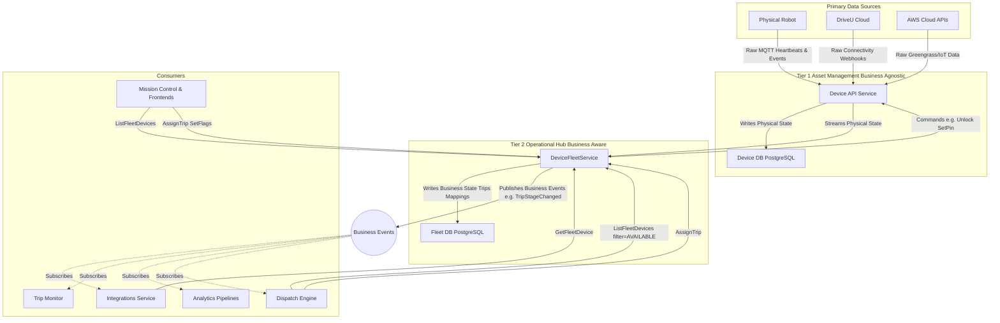
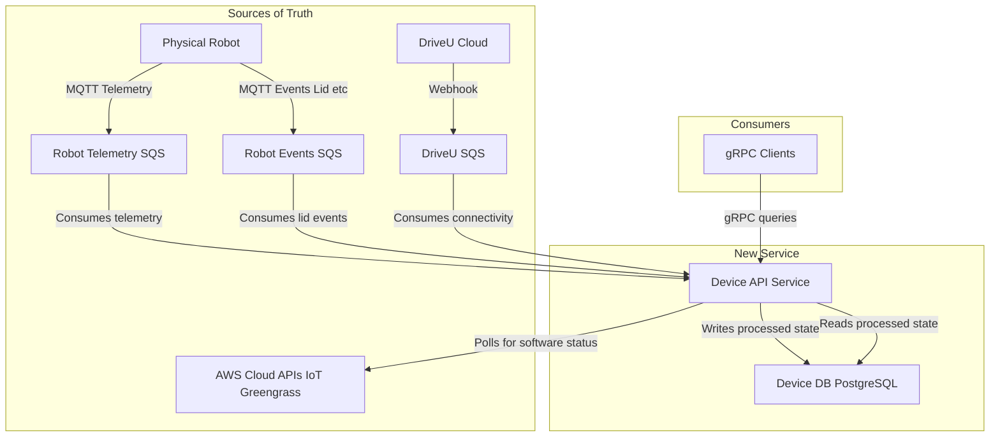
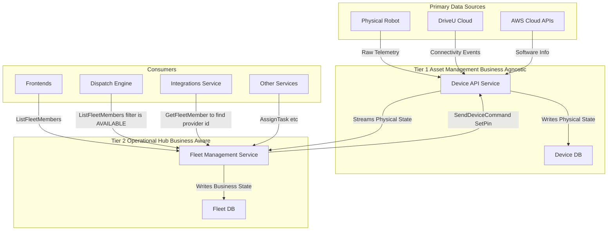

# High-Level Design
The goal of this design is to have one authoritative source for a device's state. We will achieve this by having the device service consume raw data directly from primary sources, process it, and expose a holistic, queryable view of the device.


## Separation of concerns

To effectively manage complexity and align with the principle of least astonishment, we are introducing a strict two-tier architecture, clearly separating the physical state of the device from its operational business context.

### Device API Service (The Physical State)

To effectively manage complexity and align with the principle of least astonishment, we are introducing a strict two-tier architecture, clearly separating the physical state of the device from its operational business context.**Device API Service (The Physical State)**

This service is the foundational layer. It is responsible for providing the authoritative, real-time physical and technical state of the device, directly derived from raw telemetry.

* **Concern:** Device as a machine/asset.  
* **Scope:** Location, battery health, component status, software version, and raw connectivity.  
* Visibility (Key Rule): The Device API will NOT publish events to the wider system. Its state is intended to be consumed primarily by the DeviceFleetService via its real-time stream.

### DeviceFleetService (The Business State)

This service is the operational layer. It consumes the physical state from the Device API, enriches it with business context, and manages all operational lifecycle events.

* **Concern:** Device as an operational fleet asset (e.g., its role in a delivery).  
* **Scope:** Trip assignments, current trip stage, operational flags (e.g., needs pickup), provider mappings (e.g., Uber/DoorDash IDs).  
* **Visibility (Key Rule):** The **DeviceFleetService will be the primary event publisher** for all business-level events.

### Reasoning

The DeviceFleetService will be the primary event publisher for all business-level events. The Device API will not publish events to the wider system.

**Reasoning:**

* **Context is King:** Downstream consumers like Integrations Service and Trip Monitor don't just care that a robot's location changed; they care that it has arrived at a pickup location. The Device API only knows the former. The DeviceFleetService knows the latter because it manages the trip context.  
* **Reduces Complexity for Consumers:** This creates a clean architecture. All services that care about the *business state* of the fleet listen to a single, authoritative source: the DeviceFleetService. They don't need to subscribe to raw telemetry and then try to figure out what it means.  
* **The "Event Enrichment" Pattern:** The DeviceFleetService will consume the raw, real-time stream from the Device API, enrich this physical data with its business context (e.g., matching a location to a delivery destination), and then publish a new, high-value, business-aware event (e.g., FleetDevice.TripStageChanged).

# Summary of Changes

### **1\. Services: From Sprawl to Two-Tier Consolidation**

* **Created:**  
  * **Device API Service (Tier 1):** A foundational service responsible for the "Device as a machine," serving as the authoritative ingestion point for raw telemetry and software management.  
  * **DeviceFleetService (Tier 2):** Acts as the modern facade (BFF) for Mission Control and other consumers. It aggregates physical data from Tier 1 with business data from the Operations Service to provide a single, AIP-compliant gRPC interface.  
* **Changed**:  
  * **Operations Service:** No longer consumes heartbeats, no longer stores any device state, no longer publishes `Robots.StateChange` events.  
* **Replaced/Decommissioned:**  
  * **State Service:** Formerly responsible for lid cycle state and operation state transitions.  
  * **Legacy Device Service:** Previously acted as a proxy to AWS Greengrass for software lifecycle management.  
  * **MQTT-to-Kafka Bridge:** A dedicated service used to forward raw telemetry directly to the Fleet Service.

  ### **2\. Databases: Standardizing Persistence**

* **Created:**  
  * **Device DB (PostgreSQL):** Stores materialized physical state (location, battery, components).  
  * **Fleet Device DB (PostgreSQL):** Stores business metadata including trip assignments, operational flags, lid cycle state and provider mappings.  
* **Replaced/Decommissioned:**  
  * **State PostgreSQL:** Previously stored `RobotState` and `LidCycle` records.  
  * **Operations PostgreSQL:** Formerly used for `RobotStateHistory` and maintenance flags.  
  * **Fleet DynamoDB (`fleet-robots` table):** Previously aggregated telemetry and business state for external provider resolution.  
* **Deleted (Ephemeral Caches):**  
  * **Operations Redis:** Used for transient connectivity and health data.  
  * **Fleet Service Redis:** A high-frequency cache for raw telemetry needed for dispatching.  
  * **State DynamoDB:** Formerly used specifically for DriveU connectivity status.

  ### **3\. Endpoints: From Aggregated Facades to Standardized gRPC**

* **Created (gRPC/AIP-Compliant):**  
  * **Tier 1:** `GetDevice`, `ListDevices`, and the critical `StreamDeviceUpdates` (server-side stream).  
  * **Tier 2:** `ListFleetDevices`, `AssignTrip`, `UpdateTrip`, and `AddProviderMapping`.  
* **Replaced/Decommissioned:**  
  * **Legacy Device GET `/device/:serial`:** The previous entry point for software and component details.  
  * **Operations Service Facade:** Aggregated queries that performed fallback synchronous RPC calls to the State Service.  
  * **Fleet Beacon/Labor Scopes:** Legacy gRPC endpoints used to query the Fleet Redis cache and DynamoDB tables.

  ### **4\. Events: From Raw Telemetry to Enriched Business Logic**

* **Created (Tier 2 Enriched Events):**  
  * **`FleetDevice.ArrivedAtMerchant`**, **`FleetDevice.ArrivedAtCustomer`:** Triggered when location updates meet business milestones (e.g., "Arrived at Merchant").  
  * **`FleetDevice.TripStarted`**, **`FleetDevice.TripCompleted` :** Triggered when business status transitions (e.g., `AVAILABLE` to `ON_TRIP`).  
  * **`FleetDevice.TripAssigned` / `TripUnassigned`:** Published upon trip orchestration events.  
* **Replaced/Decommissioned:**  
  * **`IoT.Heartbeat`:** Raw AMQP events published by the State Service for every robot update.  
    * **Dispatch Engine Internal Events**: The Dispatch Engine will stop subscribing to external `IoT.Heartbeat` events to update its "two-step internal event queue". It will instead move to a "pull" model via the Tier 2 `ListFleetDevices` RPC or subscribe to Tier 2's enriched business events.  
  * **`Robots.StateChange`:** Discrete transitions used by the Operations Service. These are mostly used to keep track of when the robot gets grounded.   
    This will be replaced by deriving the operations state from the trip changes, deployments, and FO tasks.  
    If the consumers absolutely need it, we can emit `Robots.Parked`, `Robots.WentOffDuty`,  `Robots.Grounded`, `Robots.Ungrounded`  
  * **`Deliveries.DeliveryEvent`:** Legacy events used to push status updates to partners like DoorDash.  
    This can be replaced   
  * **`ConnectivityRawStatusChanged` & `LidCycle.Complete`:** Low-level RabbitMQ events previously published by the State Service.  
  * **`robot_platform_robot_updates_v1`**: This high-throughput topic, used by the legacy **MQTT-to-Kafka Bridge** to feed the Fleet Service, is being **replaced** by the gRPC `StreamDeviceUpdates`.

### **5\. Modified/Updated: Ingestion Queues (SQS)**

While these SQS queues remain, the **consumer** is being updated. Instead of being consumed by the legacy State Service or the MQTT-to-Kafka Bridge, they are now consumed **exclusively by the Device API Service (Tier 1\)**.

* **`device-events-processing`**: Raw MQTT heartbeats from the physical robot.  
* **`device-state-processing`**: Raw robot events, such as lid and hardware status changes.  
* **`connectivity-processing`**: Webhooks from DriveU regarding remote control connectivity.  
* **`mqtt-to-kafka` bridge queue**: This dedicated SQS queue will be deleted as the Kafka path is decommissioned.

#### **6\. Functional Responsibility Shifts**

To ensure the full deletion of legacy services, the following logic is redistributed:

* **PIN Validation (Tier 2):** Responsibility for validating **2-digit PINs** and **loading flows** moves to the Fleet Service. Tier 1 merely provides the RPC to receive the keypad entry, while Tier 2 validates it against the active delivery context.  
* **FO Task Orchestration (Tier 2):** The logic that triggers **Field Operations tasks** (e.g., creating a `BATTERY_SWAP` when SOC \< 20% or `UNSTUCK_BOT` based on sensor triggers) is moved to Tier 2’s operational watchdog.  
* **Geofencing & Trip Transitions (Tier 2):** The geofencing engine—previously in the Operations Service—now lives in Tier 2\. It compares Tier 1 location data against merchant/customer boundaries to trigger `TripStageChanged` events (e.g., `AT_PICKUP`).  
* **Operational Alerting (Tier 2):** Tier 2 becomes responsible for publishing **health alerts** to Slack or PagerDuty when Tier 1 reports a critical hardware failure that grounds a robot.
---------------------------------------

# Detailed Design 
# Device API

The Device API Service will act as a primary data processor and a source of truth for device state. It will subscribe directly to raw SQS queues populated by robots and DriveU, and it will poll AWS APIs for software management data.

This new architecture places the Device API Service much earlier in the data pipeline, making it a foundational service that other business logic services could consume in the future.  


This design makes the service self-reliant for constructing a device's state, ensuring it has no dependencies on the services we intend to replace.

## Data Ingestion & Processing

The service's core responsibility will be to process raw data from three distinct sources.

1. **Physical Robot Telemetry** (MQTT \-\> SQS)  
   * Source: The SQS queue fed by the AWS IoT rule that receives MQTT messages from robot/+/status.  
   * Data Format: The service will need to parse the raw HardwareStatus message published by the on-robot mqtt\_reporter. This includes telemetry like GPS coordinates, battery status, and sensor readings.  
   * Action: An SQS consumer will process these messages, extract the relevant telemetry, and update the telemetry portion of the Device record in its database.  
2. **DriveU Connectivity** (Webhook \-\> SQS)  
   * Source: The connectivityQueueUrl SQS queue that receives webhooks from DriveU.  
   * Data Format: The service will parse the IWebhookEvent JSON payload, which contains the connectivity status (online, offline, etc.).  
   * Action: A dedicated SQS consumer will process these events and update the telemetry.connectivity\_status field for the corresponding device.  
3. **AWS Greengrass Software Info** (AWS API)  
   * Source: Direct calls to the AWS Greengrass V2 API.  
   * Data Format: The service will use the AWS SDK for Go to interact with the API, parsing the CoreDevice and InstalledComponent structures.  
   * Action: A periodic background job (e.g., running every few minutes) will poll the Greengrass API for every known device. It will fetch the core device status and the list of installed software components, then update the software\_info section of the Device record. This polling mechanism is necessary as Greengrass status changes are not event-driven.

---

# Fleet API

The existing "Fleet API" section contains the necessary gRPC definitions (`DeviceFleetService` and related messages) but lacks the architectural and implementation details. Since the document's design separates the services into a two-tier architecture, the **Fleet API** design needs to detail how it functions as the business-logic layer.

Here is an expanded section you can add after the **RPC Request/Response Messages** to provide the missing design context:

## Design Implementation

The **DeviceFleetService** is the orchestration layer, responsible for managing the device's operational lifecycle and business context. Its primary purpose is to transform the *physical state* (from the Device API) into the authoritative *business state* of the fleet.Data Ingestion and Synchronization

The core function of this service is dependent on the `Device API Service`'s real-time physical data.

* **Source:** The service will be a dedicated gRPC client that consumes the **`StreamDeviceUpdates`** server-side streaming RPC from the Device API.  
* **Action:** It will process the stream of `DeviceUpdate` messages and maintain a highly-available, near-real-time cache of the latest physical state for every device (as a `DeviceSnapshot`). This allows its RPCs (e.g., `ListFleetDevices`) to quickly join the business context with the current physical state without needing to query the Device API for every request.

Persistence (Trip and Business Context)

The service must maintain its own state separate from the Device API to manage business-level concepts.

* **Purpose:** To store the durable state related to device assignments, operational flags, and external provider IDs, which are the service's primary concerns.  
* **Database:** A PostgreSQL database will be used to store the following entities:  
  * **`fleet_devices`:** Contains the operational metadata (e.g., `status`, `operational_flags`) and a foreign key to the `devices` table (or serial number).  
  * **`trips`:** Stores current and historical trip data (mapped to the `TripInfo` message).  
  * **`provider_mappings`:** Stores the external ID mappings (e.g., Uber/DoorDash vehicle IDs).

Event Publishing (The Critical Output)

As the authoritative source for all business-level events, this service will use an event bus (e.g., RabbitMQ, as noted in the plan) to communicate changes to downstream systems.

* **Event Enrichment Pattern:** When the service consumes a physical state change from the Device API, it combines it with its own business context (trip status, location targets, etc.). If this combination results in a significant business-level change, it publishes an **enriched event**.  
* **Published Events (Examples):**  
  * `FleetDevice.TripAssigned` / `FleetDevice.TripUnassigned` (Published when `AssignTrip` or `UnassignTrip` RPCs are called).  
  * `FleetDevice.TripStageChanged` (Published when a device's location update means it has *arrived* at a business destination, like pickup or drop-off).  
  * `FleetDevice.StatusChanged` (Published when the high-level `FleetDeviceStatus` changes, e.g., from `AVAILABLE` to `UNDER_MAINTENANCE`).  
* **Visibility (Recap):** All downstream consumers (like Trip Monitor, Integrations Service, and Dispatch Engine) should exclusively consume these enriched events from the `DeviceFleetService`, never the raw telemetry from the Device API.



# Data Model & API Design

# Device Service

## Protobuf Schema (device.proto)

The Device resource will focus on the physical state received from AWS IoT, Greengrass and DriveU. 

```protobuf
message Device {
  // --- Identity ---
  string name = 1;

  // --- Real-time Physical State ---
  Location location = 10;
  repeated Battery batteries = 11;
  Connectivity connectivity = 12;
  LidState lid_state = 13;

  // --- Health, Status & Maintenance ---
  bool undergoing_maintenance = 23;
  AdditionalComponentHealth additional_component_health = 24;
  DriveUStatus driveu_status = 25;
  repeated ComponentStatusEntry active_component_statuses = 26;

  // --- Software ---
  GreengrassStatus greengrass_status = 31;

  // --- Active Transient States ---
  bool has_cargo = 41;

  // --- Timestamps ---
  google.protobuf.Timestamp created_at;
  google.protobuf.Timestamp updated_at;
}

message Location {
  double latitude = 1;
  double longitude = 2;
  double heading = 3;
  double horizontal_accuracy = 4;
  double altitude = 5;
  double speed_mph = 6;
  google.protobuf.Timestamp updated_at = 7;
}

message Battery {
  int32 charge_percent = 1;
  bool is_charging = 2;
  double voltage = 4;
  double current = 5;
  double temperature = 6;
  int32 estimated_range_meters = 7;
  google.protobuf.Timestamp updated_at = 8;
}

message Connectivity {
  bool online = 1;
  google.protobuf.Timestamp updated_at = 2;
  NetworkType network_type = 3;
  int32 signal_strength = 4;
}

message LidState {
  bool is_open = 1;
  google.protobuf.Timestamp updated_at = 3;
}

// Note: We want to work with the Robot Software team to determine which of these components should get their own proto message, and which should be 
// captured in this generic map.
// Known components: SEGWAY_BASE, CAMERAS, LTE_ROUTERS, DISK, AUDIO_DEVICES, BATTERY, EMERGENCY_BUTTON, USB, DOCKER, KEYPAD, NODES, CARGO_POWER
message AdditionalComponentHealth {
  map<string, HardwareStatusCode> component_statuses = 1;
  google.protobuf.Timestamp updated_at = 2;
}

message DriveUStatus {
  DriveUStreamerStatus streamer_status = 1;
  bool pilot_connected = 4;
  google.protobuf.Timestamp updated_at = 5;
  string session_id = 6;
}

message GreengrassStatus {
  GreengrassCoreStatus status = 1;
  google.protobuf.Timestamp updated_at = 2;
  repeated InstalledComponent installed_components = 3;
}

message InstalledComponent {
  string component_name = 1;
  string component_version = 2;
  ComponentLifecycleState lifecycle_state = 3;
}

// ====================================================
// Enums
// ====================================================

enum NetworkType {
  NETWORK_TYPE_UNSPECIFIED = 0;
  NETWORK_TYPE_WIFI = 1;
  NETWORK_TYPE_CELLULAR = 2;
  NETWORK_TYPE_ETHERNET = 3;
}

enum DriveUStreamerStatus {
  DRIVEU_STREAMER_STATUS_UNSPECIFIED = 0;
  DRIVEU_STREAMER_STATUS_OFFLINE = 1;
  DRIVEU_STREAMER_STATUS_ONLINE = 2;
  DRIVEU_STREAMER_STATUS_CONNECTED_TO_NODE = 3;
  DRIVEU_STREAMER_STATUS_STREAMING = 5;
}

enum GreengrassCoreStatus {
  GREENGRASS_CORE_STATUS_UNSPECIFIED = 0;
  GREENGRASS_CORE_STATUS_HEALTHY = 1;
  GREENGRASS_CORE_STATUS_UNHEALTHY = 2;
}

enum HardwareStatusCode {
  HARDWARE_STATUS_CODE_UNSPECIFIED = 0;
  HARDWARE_STATUS_CODE_OK = 1;
  HARDWARE_STATUS_CODE_READY = 2;
  HARDWARE_STATUS_CODE_TIMEOUT = 4;
  HARDWARE_STATUS_CODE_NON_CRITICAL_FAULT = 5;
  HARDWARE_STATUS_CODE_CRITICAL_FAULT = 6;
}

enum ComponentLifecycleState {
  COMPONENT_LIFECYCLE_STATE_UNSPECIFIED = 0;
  COMPONENT_LIFECYCLE_STATE_RUNNING = 1;
  COMPONENT_LIFECYCLE_STATE_ERRORED = 2;
  COMPONENT_LIFECYCLE_STATE_BROKEN = 3;
  COMPONENT_LIFECYCLE_STATE_INSTALLED = 4;
  COMPONENT_LIFECYCLE_STATE_STARTING = 5;
}

enum UpdateType {
  UPDATE_TYPE_UNSPECIFIED = 0;
  UPDATE_TYPE_HEARTBEAT = 1;
  UPDATE_TYPE_STATE_CHANGE = 2;
  UPDATE_TYPE_CONNECTIVITY_CHANGE = 3;
  UPDATE_TYPE_HEALTH_CHANGE = 4;
  UPDATE_TYPE_LID_EVENT = 5;
  UPDATE_TYPE_DRIVEU_STATUS_CHANGE = 7;
}

enum TeleopsPipelineState {
  TELEOPS_PIPELINE_STATE_UNSPECIFIED = 0;
  TELEOPS_PIPELINE_STATE_INITIALIZING = 1;
  TELEOPS_PIPELINE_STATE_READY = 2;
  TELEOPS_PIPELINE_STATE_CONNECTED = 3;
  TELEOPS_PIPELINE_STATE_STREAMING = 4;
  TELEOPS_PIPELINE_STATE_ERROR = 5;
  TELEOPS_PIPELINE_STATE_RELEASED = 6;
}

enum TeleopsPipelineType {
  TELEOPS_PIPELINE_TYPE_UNSPECIFIED = 0;
  TELEOPS_PIPELINE_TYPE_MONITORING = 1;
  TELEOPS_PIPELINE_TYPE_CONTROL = 2;
}

enum DeviceCommandType {
  DEVICE_COMMAND_TYPE_UNSPECIFIED = 0;
  DEVICE_COMMAND_TYPE_UNLOCK_LID = 1;
  DEVICE_COMMAND_TYPE_LOCK_LID = 2;
  DEVICE_COMMAND_TYPE_HONK = 3;
  DEVICE_COMMAND_TYPE_FLASH_LIGHTS = 4;
  DEVICE_COMMAND_TYPE_EMERGENCY_STOP = 5;
  DEVICE_COMMAND_TYPE_REBOOT = 7;
}

enum DeviceCommandStatus {
  DEVICE_COMMAND_STATUS_UNSPECIFIED = 0;
  DEVICE_COMMAND_STATUS_PENDING = 1;
  DEVICE_COMMAND_STATUS_SENT = 2;
  DEVICE_COMMAND_STATUS_ACKNOWLEDGED = 3;
  DEVICE_COMMAND_STATUS_EXECUTED = 4;
  DEVICE_COMMAND_STATUS_FAILED = 5;
  DEVICE_COMMAND_STATUS_TIMEOUT = 6;
}

```

## gRPC API

```protobuf
service DeviceService {

  // --- Device CRUD ---
  rpc GetDevice(GetDeviceRequest) returns (Device) {}
  rpc CreateDevice(CreateDeviceRequest) returns (Device) {}
  rpc UpdateDevice(UpdateDeviceRequest) returns (Device) {}
  rpc DeleteDevice(DeleteDeviceRequest) returns (google.protobuf.Empty) {}
  rpc ListDevices(ListDevicesRequest) returns (ListDevicesResponse) {}
  rpc BatchGetDevices(BatchGetDevicesRequest) returns (BatchGetDevicesResponse) {}

  // --- Health and Maintenance Management ---
  rpc SetComponentStatus(SetComponentStatusRequest) returns (SetComponentStatusResponse) {}
  rpc ClearComponentStatus(ClearComponentStatusRequest) returns (ClearComponentStatusResponse) {}

  // --- Teleoperations Management ---
  rpc InitTeleopsPipeline(InitTeleopsPipelineRequest) returns (TeleopsPipeline) {}
  rpc GetTeleopsPipeline(GetTeleopsPipelineRequest) returns (TeleopsPipeline) {}
  rpc ReleaseTeleopsPipeline(ReleaseTeleopsPipelineRequest) returns (google.protobuf.Empty) {}

  // --- Device Interaction ---
  rpc SendDeviceCommand(SendDeviceCommandRequest) returns (SendDeviceCommandResponse) {}
  rpc StreamDeviceUpdates(StreamDeviceUpdatesRequest) returns (stream DeviceUpdate);
}


// --- RPC Request and Response Messages ---

message GetDeviceRequest {
  string name = 1;
  google.protobuf.FieldMask read_mask = 2;
}

message ListDevicesRequest {
  int32 page_size = 1;
  string page_token = 2;
  string filter = 3;
  google.protobuf.FieldMask read_mask = 4;
}

message ListDevicesResponse {
  repeated Device devices = 1;
  string next_page_token = 2;
  int32 total_size = 3;
}

message BatchGetDevicesRequest {
  repeated string names = 1;
  google.protobuf.FieldMask read_mask = 2;
}

message BatchGetDevicesResponse {
  repeated Device devices = 1;
}

message GetTelemetryRequest {
  string name = 1;
  google.protobuf.Timestamp start_at = 2;
  google.protobuf.Timestamp end_at = 3;
  int32 page_size = 4;
  string page_token = 5;
}

message CreateDeviceRequest {
  Device device = 1;
}

message UpdateDeviceRequest {
  Device device = 1;
  google.protobuf.FieldMask update_mask = 2;
}

message DeleteDeviceRequest {
  string name = 1;
}

message SetUnlockPinRequest {
  string name = 1;
  string pin = 2;
  google.protobuf.Timestamp expires_at = 3;
  string context_id = 4;
  UnlockPinType pin_type = 5;
}

message ClearUnlockPinRequest {
  string name;
}

message SetComponentStatusRequest {
  string name = 1;
  repeated ComponentStatusEntry statuses = 2;
}

message SetComponentStatusResponse {
  repeated ComponentStatusEntry active_statuses = 1;
}

message ClearComponentStatusRequest {
  string name = 1;
  repeated string status_ids = 2;
  bool clear_all = 3;
}

message ClearComponentStatusResponse {
  repeated ComponentStatusEntry active_statuses = 1;
}

message InitTeleopsPipelineRequest {
  string name = 1;
  string operator_id = 2;
  TeleopsPipelineType pipeline_type = 3;
  string reason = 4;
}

message GetTeleopsPipelineRequest {
  string name = 1;
}

message ReleaseTeleopsPipelineRequest {
  string name;
  string operator_id = 2;
  string release_reason = 3;
}

message SendDeviceCommandRequest {
  string name = 1;
  DeviceCommandType command_type = 2;
  map<string, string> parameters = 3;
  string request_id = 4;
  optional int32 timeout_seconds = 5;
}

message SendDeviceCommandResponse {
  string command_id = 1;
  DeviceCommandStatus status = 2;
}

message StreamDeviceUpdatesRequest {
  repeated string names;
  google.protobuf.Timestamp since = 2;
  repeated UpdateType update_types = 3;
  google.protobuf.FieldMask read_mask = 4;
}

message DeviceUpdate {
  Device device = 1;
  google.protobuf.Timestamp updated_at = 2;
  UpdateType update_type = 3;
}
```

# ---

# Device Fleet Service

### Protobuf Schema (fleet.proto)

```protobuf
message FleetDevice {
  string device_name = 1;
  // A snapshot of the device's physical state from the Device API.
  coco.deviceapi.v1.Device device_snapshot = 2;
  // The high-level business status of the fleet device.
  FleetDeviceStatus status = 3;
  TripInfo active_trip = 4;
  PilotInfo active_pilot = 5;
  repeated FoTask tasks = 6;
  repeated ProviderMapping provider_mappings = 7;

  LidCycle active_lid_cycle = 8; 
  UnlockPinInfo active_unlock_pin = 9;
}

// High-level business status for a fleet device.
// This information is computed by fetching data from dispatch (on_trip), operations (deployed/maintenance), and the device itself
// To be consumed by the dispatch engine to know if a device is available. 
message FleetDeviceStatus {
  enum Status {
    STATUS_UNSPECIFIED = 0;
    ON_TRIP = 1;
    DEPLOYING = 2; // TODO: check if FOs ever set this state
    DEPLOYED = 3;
    NEEDS_UNDEPLOYMENT = 4;
    UNDEPLOYED = 5;
    NEEDS_MAINTENANCE = 6;
    UNDER_MAINTENANCE = 7;
    OFFLINE = 8;
    OTHER = 100;
  }
  Status status = 1;
  // Fill if status is "OTHER"
  string additional_status = 2;
}

// Business context for the active trip.
// This information is retrieved from the operations service.
message TripInfo {
  string trip_id = 1;
  TripType trip_type = 2;
  string demand_id = 5;
  string customer_id = 6;
  string merchant_id = 7;
}

message PilotInfo {
  string pilot_id = 1;
  string pilot_name = 2;
  google.protobuf.Timestamp session_started_at = 3;
}

// Mapping to an external partner's vehicle ID.
message ProviderMapping {
  string provider = 1; // e.g., "uber", "doordash"
  string provider_vehicle_id = 2;
}

enum TripType {
  TRIP_TYPE_UNSPECIFIED = 0;
  DELIVERY = 1;
  RETURN = 2;
  DEPLOYMENT = 3;
  PICKUP = 4;
}

message LidCycle {
  string cycle_id = 1;
  string reference_id = 2;
  LidCycleStatus status = 3;
  
  google.protobuf.Timestamp started_at = 4;
  google.protobuf.Timestamp ended_at = 5;
}

enum LidCycleStatus {
  LID_CYCLE_STATUS_UNSPECIFIED = 0;
  LID_CYCLE_INIT = 1; 
  LID_CYCLE_COMPLETE = 2;
  LID_CYCLE_TIMEOUT = 3;
}

message UnlockPinInfo {
  string pin = 1;
  UnlockPinType pin_type = 2;
  google.protobuf.Timestamp expires_at = 3;
  string context_id = 4;
}

enum UnlockPinType {
  UNLOCK_PIN_TYPE_UNSPECIFIED = 0;
  UNLOCK_PIN_TYPE_MERCHANT = 1;
  UNLOCK_PIN_TYPE_CUSTOMER = 2;
  UNLOCK_PIN_TYPE_OPERATOR = 3;
}

```

## gRPC API

```protobuf
service DeviceFleetService {
  // --- Read Operations ---
  rpc ListFleetDevices(ListFleetDevicesRequest) returns (ListFleetDevicesResponse);
  rpc GetFleetDevice(GetFleetDeviceRequest) returns (FleetDevice);

  // --- Orchestration & Assignment ---
  rpc AssignTrip(AssignTripRequest) returns (FleetDevice);
  rpc UpdateTrip(UpdateTripRequest) returns (FleetDevice);
  rpc UnassignTrip(UnassignTripRequest) returns (FleetDevice);

  // --- Operational Flag Management ---
  rpc CreateTask(SetOperationalFlagsRequest) returns (FleetDevice);

  // --- Provider Mapping Management ---
  rpc AddProviderMapping(AddProviderMappingRequest) returns (FleetDevice);
  rpc RemoveProviderMapping(RemoveProviderMappingRequest) returns (FleetDevice);

  // --- Pin Interaction ---
  rpc SetUnlockPin(SetUnlockPinRequest) returns (UnlockPinInfo);
  rpc ClearUnlockPin(ClearUnlockPinRequest) returns (google.protobuf.Empty);

  // --- Telemetry ---
  rpc ListHeartbeats(ListHeartbeatsRequest) returns (ListHeartbeatsResponse);
  rpc GetTimeseries(SqlLikeObject) returns (Timeseries);
}

// --- RPC Request/Response Messages ---

message ListFleetDevicesRequest {
  string filter = 1;
  int32 page_size = 2;
  string page_token = 3;
}

message ListFleetDevicesResponse {
  repeated FleetDevice fleet_devices = 1;
  string next_page_token = 2;
}

message GetFleetDeviceRequest {
  string name = 1;
}

message AssignTripRequest {
  string name = 1; // device id
  string trip_id = 2;
}

message UpdateTripRequest {
  string name = 1;
  string current_stage = 2;
  bool has_cargo = 3;
}

message UnassignTripRequest {
  string name = 1; // device id
  string trip_id = 2;
}

message AddProviderMappingRequest {
  string name = 1;
  ProviderMapping mapping = 2;
}

message RemoveProviderMappingRequest {
  string name = 1;
  string provider = 2;
}

message ListHeartbeatsRequest {
  string filter = 1;
  int32 page_size = 2;
  string page_token = 3;
}

message ListHeartbeatsResponse {
  repeated Heartbeat heartbeats = 1;
  string next_page_token = 2;
}

```

# Persistence

# Device DB

The PostgreSQL table remains an effective choice for storing the materialized Device state.

### 1\. Core Enums

These enums are derived directly from the `device.proto` definitions.

```sql
CREATE TYPE movement_state AS ENUM ('STATE_UNSPECIFIED', 'PARKED', 'IN_TRANSIT', 'IDLE');
CREATE TYPE network_type AS ENUM ('NETWORK_TYPE_UNSPECIFIED', 'WIFI', 'CELLULAR', 'ETHERNET');
CREATE TYPE component_lifecycle_state AS ENUM ('COMPONENT_LIFECYCLE_STATE_UNSPECIFIED', 'RUNNING', 'ERRORED', 'BROKEN', 'INSTALLED', 'STARTING');
CREATE TYPE hardware_status_code AS ENUM ('HARDWARE_STATUS_CODE_UNSPECIFIED', 'OK', 'READY', 'TIMEOUT', 'NON_CRITICAL_FAULT', 'CRITICAL_FAULT');
CREATE TYPE greengrass_core_status AS ENUM ('GREENGRASS_CORE_STATUS_UNSPECIFIED', 'HEALTHY', 'UNHEALTHY');
CREATE TYPE unlock_pin_type AS ENUM ('UNLOCK_PIN_TYPE_UNSPECIFIED', 'MERCHANT', 'CUSTOMER', 'OPERATOR');
```

### 2\. Primary Device Table

This table stores the singular technical state of the "Device as a machine".

```sql
CREATE TABLE devices (
    serial_number VARCHAR(255) PRIMARY KEY, -- The unique hardware identifier
    name VARCHAR(255) NOT NULL,              -- Resource name
    
    -- Physical State (Flattened from Location message)
    lat DOUBLE PRECISION,
    lng DOUBLE PRECISION,
    heading DOUBLE PRECISION,
    horizontal_accuracy DOUBLE PRECISION,
    altitude DOUBLE PRECISION,
    speed_mph DOUBLE PRECISION,
    location_updated_at TIMESTAMPTZ,

    -- Connectivity
    online BOOLEAN DEFAULT FALSE,
    network_type network_type DEFAULT 'NETWORK_TYPE_UNSPECIFIED',
    signal_strength INT,
    connectivity_updated_at TIMESTAMPTZ,

    -- Lid State
    lid_is_open BOOLEAN DEFAULT FALSE,
    lid_updated_at TIMESTAMPTZ,

    -- Movement State
    current_movement_state movement_state DEFAULT 'STATE_UNSPECIFIED',
    dest_lat DOUBLE PRECISION, -- Destination coordinates
    dest_lng DOUBLE PRECISION,
    movement_updated_at TIMESTAMPTZ,

    -- Health and Maintenance
    undergoing_maintenance BOOLEAN DEFAULT FALSE,
    has_cargo BOOLEAN DEFAULT FALSE,
    
    -- DriveU / Teleop Status
    driveu_streamer_status VARCHAR(50),
    pilot_connected BOOLEAN DEFAULT FALSE,
    driveu_session_id VARCHAR(255),
    driveu_updated_at TIMESTAMPTZ,

    -- Greengrass Agent Status
    greengrass_status greengrass_core_status DEFAULT 'GREENGRASS_CORE_STATUS_UNSPECIFIED',
    greengrass_updated_at TIMESTAMPTZ,

    -- Active Unlock PIN
    active_pin VARCHAR(10),
    active_pin_type unlock_pin_type,
    active_pin_expires_at TIMESTAMPTZ,
    active_pin_context_id VARCHAR(255),

    -- System Timestamps
    created_at TIMESTAMPTZ NOT NULL DEFAULT NOW(),
    updated_at TIMESTAMPTZ NOT NULL DEFAULT NOW()
);
```

### 3\. Related Tables (Repeated Fields)

Because a device can have multiple batteries, software components, or active faults, these must be moved to separate tables to maintain normalization.

#### **Device Batteries**

Stores the `repeated Battery batteries` field from the Protobuf.

```sql
CREATE TABLE device_batteries (
    id SERIAL PRIMARY KEY,
    serial_number VARCHAR(255) REFERENCES devices(serial_number) ON DELETE CASCADE,
    battery_index INT, -- Position in the repeated list
    charge_percent INT,
    is_charging BOOLEAN,
    voltage DOUBLE PRECISION,
    current DOUBLE PRECISION,
    temperature DOUBLE PRECISION,
    estimated_range_meters INT,
    updated_at TIMESTAMPTZ
);
```

#### **Installed Components (Software)**

Stores the `repeated InstalledComponent` found in the Greengrass status.

```sql
CREATE TABLE device_software_components (
    id SERIAL PRIMARY KEY,
    serial_number VARCHAR(255) REFERENCES devices(serial_number) ON DELETE CASCADE,
    component_name VARCHAR(255) NOT NULL,
    component_version VARCHAR(50),
    lifecycle_state component_lifecycle_state,
    UNIQUE(serial_number, component_name)
);
```

#### **Component Health Statuses**

Stores `repeated ComponentStatusEntry` for active hardware faults.

```sql
CREATE TABLE device_component_health (
    id SERIAL PRIMARY KEY,
    serial_number VARCHAR(255) REFERENCES devices(serial_number) ON DELETE CASCADE,
    component_name VARCHAR(100), -- e.g., 'GPS', 'CAMERAS'
    status_code hardware_status_code,
    message TEXT,
    updated_at TIMESTAMPTZ
);
```

# Fleet DB

The fleet database does not match one-to-one with the protobuf schema because the Fleet Service acts as a facade for all of the states that it does not own. Fleet DB does not own the trips, nor the scheduled tasks.

```sql

CREATE TYPE lid_cycle_status AS ENUM (
    'LID_CYCLE_STATUS_UNSPECIFIED', 
    'INIT',
    'COMPLETE',
    'TIMEOUT'
);

-- Authoritative for operational metadata and current status.
CREATE TABLE fleet_devices (
    device_name VARCHAR(255) PRIMARY KEY, -- Links to Tier 1 serial_number
    
    -- Current Active Trip
    -- Allows quick lookup of the current assignment without scanning the trips table.
    active_trip_id UUID, 
    
    updated_at TIMESTAMPTZ NOT NULL DEFAULT NOW()
);

-- Tracks the business session of a lid interaction.
CREATE TABLE lid_cycles (
    cycle_id UUID PRIMARY KEY,
    device_name VARCHAR(255) REFERENCES fleet_devices(device_name),
    reference_id VARCHAR(255), -- Typically the Delivery ID or Trip ID
    status lid_cycle_status NOT NULL DEFAULT 'LID_CYCLE_STATUS_UNSPECIFIED',
    started_at TIMESTAMPTZ NOT NULL DEFAULT NOW(),
    ended_at TIMESTAMPTZ,
    
    -- Metadata to detect timeouts (e.g., lid open > 5 mins)
    last_heartbeat_at TIMESTAMPTZ 
);

-- Maps internal devices to external partner vehicle IDs (Uber, DoorDash).
CREATE TABLE provider_mappings (
    device_name VARCHAR(255) REFERENCES fleet_devices(device_name),
    provider VARCHAR(50) NOT NULL, -- e.g., 'uber', 'doordash'
    provider_vehicle_id VARCHAR(255) NOT NULL,
    
    PRIMARY KEY (device_name, provider),
    created_at TIMESTAMPTZ NOT NULL DEFAULT NOW()
);

-- Indexes for query performance
CREATE INDEX idx_trips_device_name ON trips(device_name);
CREATE INDEX idx_lid_cycles_reference ON lid_cycles(reference_id);
```