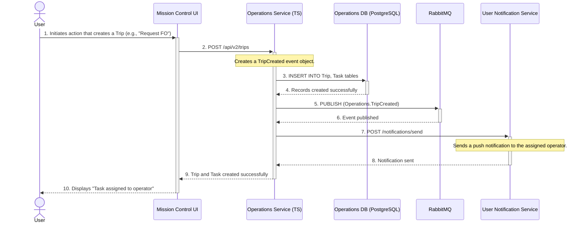

---
tags:
  - workflow
  - diagram
  - sequence
  - task
  - trip
  - pilot
---
# Assign Task to Operator Flow

This diagram illustrates what happens when a new [[Trip]] is created, which also creates the underlying [[Task]] and assigns it to a Field Operator or Pilot.

### Flow Description

1.  **Initiate [[Trip]] Creation:** A user in [[Mission Control UI]] performs an action that requires a new [[Trip]], such as requesting a [[FO (Field Operator)|Field Op]] for a maintenance [[Task]].
2.  **Request to [[Operations Service]]:** The [[Mission Control UI]] sends a `POST` request to the `/api/v2/trips` endpoint on the **[[Operations Service]]**.
3.  **Persist to Database:** The **[[Operations Service]]** handles this request by creating the new [[Trip]] and its underlying [[Task]] entities and saving them to its **PostgreSQL database**.
4.  **Publish Event:** After the database transaction is successful, the service publishes a `TripCreated` event to **RabbitMQ**. This allows other services (like the [[Dispatch Engine]] or analytics services) to be aware of the new [[Trip]] without being tightly coupled.
5.  **Notify Operator:** The **[[Operations Service]]** then calls a notification service to send a push notification to the assigned operator's mobile device about the new [[Task]].
6.  **Confirmation to UI:** The service returns a success response to the [[Mission Control UI]], which can then display a confirmation to the user.
