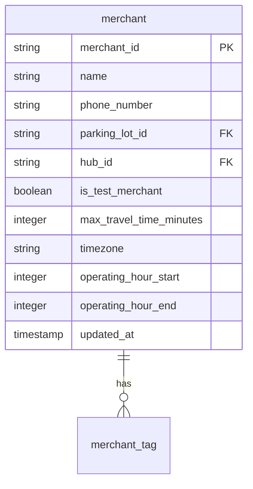
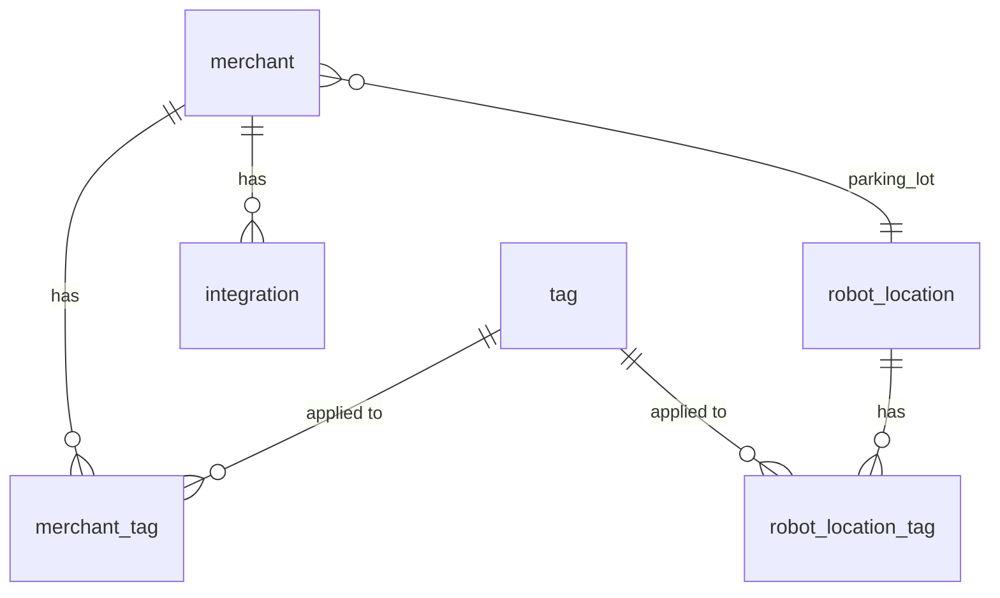

---
tags:
  - database
  - redshift
  - configuration
  - backend
---
# Config RDS Schema

**Namespace:** `config_rds_public`

This schema is synced from the [[Config Service]] RDS database and contains configuration data for merchants, robot locations, and system integrations.

## Core Tables

### `merchant`
Restaurant/merchant partner configurations.

**Key columns:**
- `merchant_id` - Unique merchant identifier
- `name` - Merchant business name
- `parking_lot_id` - Associated [[Robot Location]]
- `hub_id` - Associated operational hub
- `is_test_merchant` - Flag for test/sandbox merchants
- `timezone` - Merchant local timezone
- `operating_hour_start/end` - Business hours (0-23)

### `robot_location`
Physical locations where robots can operate (parking lots, hubs, merchant locations).

**Key columns:**
- `robot_location_id` - Unique location identifier
- `name` - Location name
- `latitude`, `longitude` - GPS coordinates
- `capacity` - Number of robots that can be stationed
- `type` - Location type (0=parking lot, 1=hub, etc.)
- `hub_id` - Parent hub if applicable
- `is_active` - Whether location is operational

### `integration`
Third-party integration configurations for merchants.

**Key columns:**
- `merchant_id` - Associated merchant
- `source` - Integration source (e.g., "olo", "lunchbox")
- `type` - Integration type code
- `is_active` - Whether integration is enabled
- `pickup_override_minutes` - Custom pickup time buffer
- `unlock_pin` - PIN for robot unlocking
- `external_ids` - External system identifiers

### `tag`
Key-value tags for categorizing merchants and locations.

**Key columns:**
- `tag_id` - Unique tag identifier
- `key` - Tag category (integer enum)
- `value` - Tag value
- `created_at` - Tag creation timestamp

### `history`
Audit trail for configuration changes.

**Key columns:**
- `entity_key` - Entity being changed (merchant_id, location_id, etc.)
- `version` - Version number
- `field` - Field that changed
- `value` - New value
- `updater_email` - Who made the change
- `updated_at` - When change occurred
- `trace_id` - Request trace identifier

## Relationships

## Related Concepts

- [[Config Service]] - Source service managing this data
- [[Merchant]] - Business concept
- [[Robot]] - Robots stationed at locations
- [[Integrations Service]] - Manages third-party integrations

