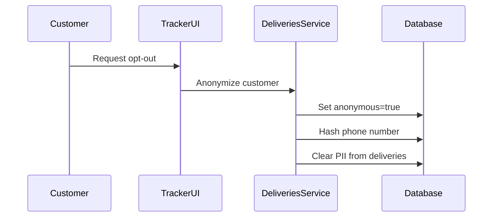
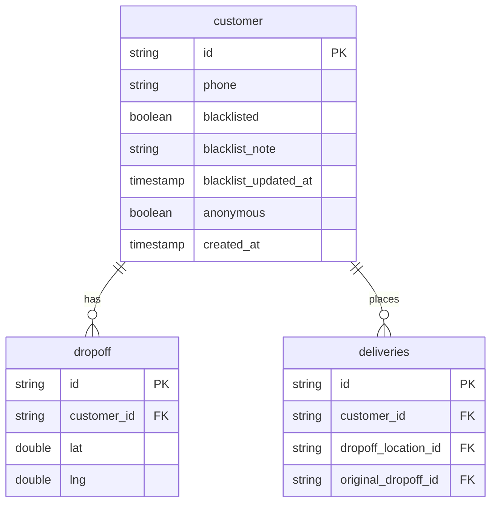

---
tags:
  - concept
  - customer
  - privacy
---
# Customer

A customer represents the end recipient of a [[Delivery]]. The Customer entity was introduced in the [[Deliveries V3 RDS Schema]] to better manage customer data, privacy, and address reuse.

## Key Attributes

- **ID** - Unique customer identifier
- **Phone** - Contact phone number (primary identifier)
- **Blacklisted** - Whether customer is banned
- **Anonymous** - Whether customer data has been anonymized (right to be forgotten)

## Privacy Features

### Anonymization

Customers can request data anonymization (GDPR "right to be forgotten"):



When anonymized:
- Phone number is hashed/obfuscated
- Name and address details are cleared
- Historical delivery records remain (for business analytics) but are de-identified
- Future orders treated as new customers

### Blacklisting

Customers can be blacklisted for policy violations:
- Repeated false claims
- Abuse of support system
- Fraudulent behavior
- Safety concerns

Blacklist includes:
- Reason note
- Who added to blacklist
- Timestamp

## Address Management

Customers have associated [[Dropoff]] locations:
- Multiple dropoff addresses per customer
- Address reuse across deliveries
- Original vs. updated addresses tracked

## Data Model



## Customer Lifecycle

### First Order
1. Customer places order through partner app (DoorDash, etc.)
2. Phone number received in delivery request
3. New `customer` record created
4. `dropoff` location created and linked

### Repeat Order
1. Phone number matches existing customer
2. Reuse customer ID
3. Check if same address (reuse dropoff) or new address (create new dropoff)
4. Link to customer for history tracking

### Address Change
1. Customer updates address mid-delivery
2. New `dropoff` location created
3. Delivery's `dropoff_location_id` updated
4. `original_dropoff_id` preserved for reference

## Analytics

Customer data enables:
- Repeat customer analysis
- Address accuracy tracking
- Customer satisfaction trends
- Blacklist effectiveness

From [[Redshift Data Warehouse]]:

```sql
-- Repeat customer rate
SELECT 
  COUNT(DISTINCT customer_id) AS total_customers,
  COUNT(*) AS total_deliveries,
  ROUND(COUNT(*) * 1.0 / COUNT(DISTINCT customer_id), 2) AS avg_orders_per_customer
FROM deliveriesv3prod_rds_public.deliveries
WHERE created_at >= CURRENT_DATE - 30
  AND customer_id IS NOT NULL;

-- Blacklisted customer orders blocked
SELECT 
  DATE_TRUNC('day', d.created_at) AS date,
  COUNT(*) AS blocked_orders
FROM deliveriesv3prod_rds_public.deliveries d
JOIN deliveriesv3prod_rds_public.customer c ON d.customer_id = c.id
WHERE c.blacklisted = TRUE
  AND d.created_at >= CURRENT_DATE - 30
GROUP BY 1;
```

## Privacy Compliance

### GDPR
- Right to be forgotten via anonymization
- Data minimization (only essential fields)
- Audit trail of data access

### CCPA
- Customer data deletion upon request
- Opt-out of data selling (not applicable - no data selling)
- Disclosure of collected data

## Related Concepts

- [[Delivery]] - Deliveries placed by customers
- [[Deliveries V3 RDS Schema]] - Database schema
- [[Tracker UI]] - Customer interface
- [[Coco Marketplace Analytics Schema]] - Customer behavior tracking
- [[Segment Analytics Integration]] - Analytics collection

