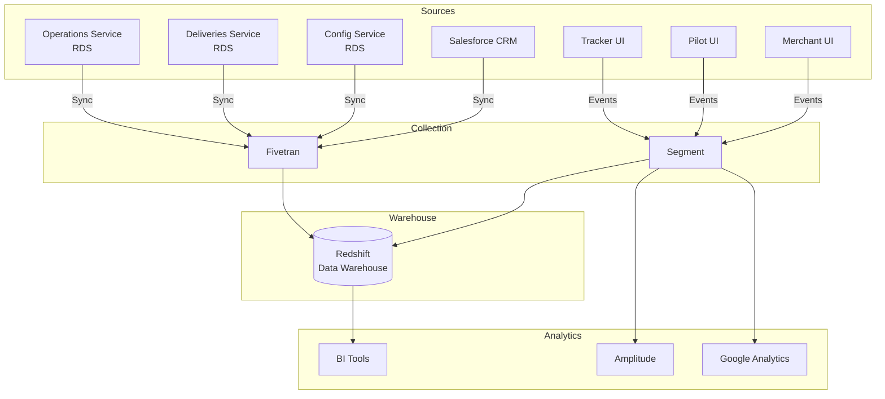

---
tags:
  - analytics
  - data
  - redshift
  - overview
  - index
---
# Data Analytics Platform

The Coco delivery platform uses a comprehensive analytics infrastructure to track operations, customer behavior, and business metrics. This note provides an overview and index of all data-related documentation.

## Architecture Overview



## Core Concepts

### Data Warehouse
- [[Redshift Data Warehouse]] - Central analytics platform overview

### Database Schemas
- [[Config RDS Schema]] - Merchant and robot configurations (`config_rds_public`)
- **[[Deliveries V3 RDS Schema]]** - **Current delivery operations** (`deliveriesv3prod_rds_public`) ⭐ **Use this for queries**
- [[Deliveries RDS Schema]] - Legacy data: partner configs, Salesforce sync (`deliveries_rds_public`)
- [[Coco Marketplace Analytics Schema]] - Mobile app analytics (`coco_marketplace_prod_analytics`)
- [[Delivery Platform Events Schema]] - Platform event tracking (`delivery_platform_prod`)

### Data Entities
- [[Customer]] - End delivery recipients
- [[Dropoff]] - Normalized delivery locations
- [[Delivery]] - Delivery requests
- [[Attempt]] - Fulfillment attempts
- [[Merchant]] - Restaurant partners
- [[Robot]] - Autonomous delivery robots

### Integrations
- [[Segment Analytics Integration]] - Event collection system
- [[Salesforce Data Sync]] - CRM data synchronization
- [[Integration Provider Tables]] - Third-party integrations (OLO, DoorDash)

### Systems
- [[Watchdog System]] - Automated monitoring and actions

## Query Resources

### Query Patterns
- [[Redshift Query Patterns]] - Common queries and best practices

### Example Queries by Use Case

#### Operational Metrics
```sql
-- Daily delivery volume and success rate
-- See: Redshift Query Patterns > Analytics Queries
```

#### Customer Behavior
```sql
-- Daily active users and engagement
-- See: Redshift Query Patterns > Customer Behavior Analysis
```

#### Pilot Performance
```sql
-- Troubleshooting events and incident reports
-- See: Redshift Query Patterns > Pilot Operations Analysis
```

#### Business Intelligence
```sql
-- Merchant onboarding pipeline
-- See: Redshift Query Patterns > Salesforce Integration Queries
```

## Data Sources by Domain

### Operations Data
**Source Services:**
- [[Operations Service]] → Trip, Task, Pilot data
- [[Deliveries Service]] → Delivery, Attempt, Quote data
- [[Config Service]] → Merchant, Location, Integration data

**Schemas:**
- **[[Deliveries V3 RDS Schema]]** (`deliveriesv3prod_rds_public`) - **PRIMARY: Current operational data** ⭐
- [[Config RDS Schema]] (`config_rds_public`) - Configuration data
- [[Deliveries RDS Schema]] (`deliveries_rds_public`) - Legacy: partner configs, Salesforce sync

**Important:** Always use `deliveriesv3prod_rds_public` for delivery queries. The legacy `deliveries_rds_public` schema should only be used for:
- Partner configurations (`partner_configs`, `partners`)
- Salesforce sync tables (`salesforce_*`)
- Integration tracking (`olo_references`, `doordash_references`)

### Analytics Events
**Source Applications:**
- [[Tracker UI]] → Customer tracking events
- [[Pilot UI]] → Pilot operations events
- [[Merchant UI]] → Merchant portal events
- Coco Marketplace App → Mobile app events

**Schemas:**
- [[Delivery Platform Events Schema]] - Platform events
- [[Coco Marketplace Analytics Schema]] - Mobile app events

**Event Types:**
- Page views and navigation
- Button clicks and interactions
- Robot unlock events
- Troubleshooting actions
- Incident reports
- Delivery ratings

### CRM Data
**Source System:**
- [[Salesforce Data Sync]] - Customer relationship management

**Includes:**
- Merchant accounts and contacts
- Sales opportunities and pipeline
- Onboarding cases and launch groups
- Contracts and subscriptions
- Asset management

## Common Analysis Scenarios

### Delivery Operations
- **Objective:** Monitor delivery success rates and timing
- **Data Sources:** [[Deliveries V3 RDS Schema]], [[Config RDS Schema]]
- **Key Metrics:** Delivery count, success rate, average duration
- **Query:** See [[Redshift Query Patterns]] > Daily Delivery Volume

### Customer Experience
- **Objective:** Understand customer behavior and satisfaction
- **Data Sources:** [[Delivery Platform Events Schema]], [[Deliveries V3 RDS Schema]]
- **Key Metrics:** Tracker engagement, unlock success rate, ratings
- **Query:** See [[Redshift Query Patterns]] > Event Funnel Analysis

### Pilot Productivity
- **Objective:** Track pilot efficiency and issues
- **Data Sources:** [[Delivery Platform Events Schema]]
- **Key Metrics:** Trips completed, troubleshooting frequency, incidents
- **Query:** See [[Redshift Query Patterns]] > Pilot Operations Analysis

### Merchant Performance
- **Objective:** Analyze merchant volume and operational metrics
- **Data Sources:** [[Deliveries V3 RDS Schema]], [[Config RDS Schema]], [[Salesforce Data Sync]]
- **Key Metrics:** Order volume, prep time, platform mix
- **Query:** See [[Redshift Query Patterns]] > Daily Delivery Volume by Merchant

### Sales Pipeline
- **Objective:** Track sales progress and onboarding
- **Data Sources:** [[Salesforce Data Sync]]
- **Key Metrics:** Opportunity value, launch dates, location count
- **Query:** See [[Redshift Query Patterns]] > Merchant Onboarding Status

## Data Governance

### Data Freshness
- **Fivetran Sync:** Every 6 hours
- **Segment Events:** Real-time (seconds)
- **Check Sync Status:** Look for `_fivetran_synced` timestamps

### Data Quality
- **Soft Deletes:** Filter `_fivetran_deleted = FALSE`
- **Test Data:** Filter `is_test_merchant = FALSE` or `is_test = FALSE`
- **Anonymized Data:** Check `customer.anonymous` flag

### Privacy Compliance
- [[Customer]] anonymization for GDPR/CCPA
- PII minimization in event tracking
- Audit trails in configuration history

## Tools & Access

### Query Tools
- **SQL Client:** DBeaver, DataGrip, pgAdmin
- **BI Platform:** Tableau, Looker, Mode Analytics
- **Notebooks:** Jupyter, Hex, Observable

### Authentication
- Redshift cluster credentials required
- VPN access for direct queries
- SSO integration for BI tools

## Getting Started

### For Analysts
1. Review [[Redshift Data Warehouse]] overview
2. Understand schema organization
3. Study [[Redshift Query Patterns]]
4. Join relevant data sources
5. Filter test data and soft deletes

### For Engineers
1. Review [[Segment Analytics Integration]]
2. Understand event naming conventions
3. Add instrumentation to your service
4. Test events in staging
5. Monitor event delivery

### For Product Managers
1. Define key metrics
2. Work with analysts on queries
3. Build dashboards in BI tool
4. Schedule automated reports
5. Iterate based on insights

## Related Documentation

### Service Documentation
- [[Deliveries Service]] - Delivery operations
- [[Operations Service]] - Trip and task management
- [[Config Service]] - Configuration management

### UI Documentation
- [[Tracker UI]] - Customer interface
- [[Pilot UI]] - Pilot operations interface
- [[Merchant UI]] - Merchant portal

### Architecture Documentation
- [[Entity Relationship Diagram]] - Core data model
- [[Dispatch Engine Architecture]] - Delivery orchestration
- [[Software Automation and CI-CD]] - Deployment pipeline

