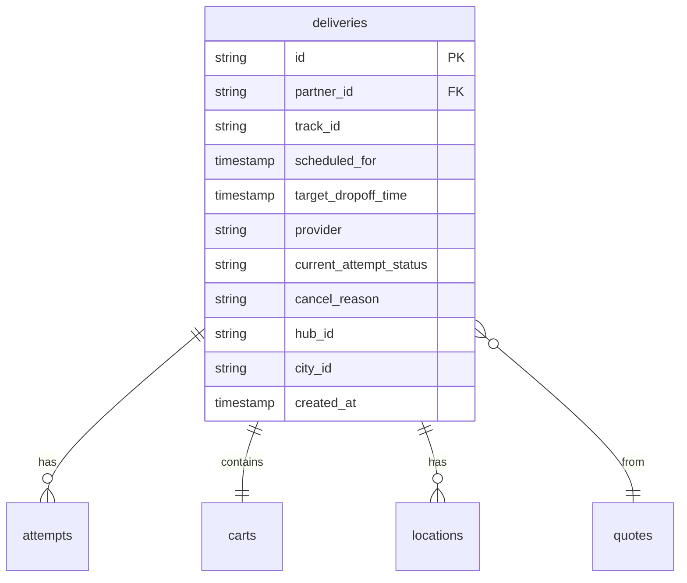

---
tags:
  - database
  - redshift
  - delivery
  - backend
  - legacy
---
# Deliveries RDS Schema

**Namespace:** `deliveries_rds_public`

This schema is synced from the legacy [[Deliveries Service]] RDS database. It contains the operational data for delivery requests, attempts, and order details. 

> **Note:** This is the legacy schema. See [[Deliveries V3 RDS Schema]] for the current system.

## Core Tables

### `deliveries`
Main delivery request records.

**Key columns:**
- `id` - Unique delivery identifier
- `partner_id` - [[Merchant]] partner ID
- `scheduled_for` - Requested delivery time
- `target_dropoff_time` - Target customer delivery time
- `provider` - Fulfillment provider (COCO_ROBOT, DOORDASH, etc.)
- `current_attempt_status` - Latest [[Attempt]] status
- `route` - Planned route data
- `order_source` - Source system (olo, lunchbox, etc.)
- `operational_mode` - Delivery mode configuration

### `attempts`
Individual delivery attempts (robot or human courier).

**Key columns:**
- `id` - Unique attempt identifier
- `delivery_id` - Parent [[Delivery]]
- `provider` - Provider fulfilling attempt
- `status` - Current attempt status
- `trip_id` - Associated [[Trip]] if robot delivery
- `eta` - Estimated time of arrival
- `cancellationreason` - Why attempt was cancelled
- `verification_image_filename` - Proof of delivery image

### `quotes`
Pre-delivery cost and feasibility quotes.

**Key columns:**
- `id` - Quote identifier
- `partner_id` - Requesting merchant
- `provider` - Quoted provider
- `fee` - Quoted delivery fee
- `quoted_pickup_time` - When order will be picked up
- `quoted_dropoff_time` - When order will be delivered
- `contains_alcohol` - Special handling flag
- `expires_at` - Quote expiration

### `carts`
Order contents and pricing.

**Key columns:**
- `id` - Cart identifier
- `delivery_id` - Associated delivery
- `subtotal` - Order subtotal
- `delivery_fee` - Delivery charge
- `tip` - Customer tip
- `total` - Grand total
- `controlled_contents` - Special items (alcohol, etc.)

### `items`
Individual line items in cart.

**Key columns:**
- `id` - Item identifier
- `cart_id` - Parent cart
- `title` - Item name
- `description` - Item details
- `quantity` - Number ordered
- `price` - Item price

### `locations`
Pickup and dropoff addresses.

**Key columns:**
- `delivery_id` - Associated delivery
- `type` - "pickup" or "dropoff"
- `latitude`, `longitude` - GPS coordinates
- `street_line1`, `street_line2` - Address
- `city`, `state`, `zip` - Location details
- `phone` - Contact number
- `name` - Contact name
- `details` - Special instructions

### `partners`
Merchant partner records.

**Key columns:**
- `id` - Partner identifier
- `name` - Partner slug/identifier
- `human_readable_name` - Display name
- `isactive` - Whether partner is active
- `issmson` - SMS notifications enabled
- `iswhiteglove` - Premium service tier

### `partner_configs`
Detailed merchant configuration.

**Key columns:**
- `partner_id` - Associated partner
- `store_name` - Display name
- `address` - Merchant address
- `lat`, `long` - GPS coordinates
- `city`, `neighborhood` - Location details
- `opens_at`, `closes_at` - Operating hours
- `load_time` - Prep time minutes
- `salesforce_account_id` - CRM integration
- `preferred_courier_provider` - Default fulfillment

## Integration Tables

### DoorDash Integration
- `doordash_references` - Mapping to DoorDash delivery IDs
- `doordash_requests` - Outbound API requests
- `doordash_responses` - API responses

### OLO Integration
- `olo_references` - Mapping to OLO order IDs
- `olo_requests` - Outbound API requests
- `olo_responses` - API responses
- `olo_providers` - OLO provider configurations
- `partner_olo_configs` - Per-partner OLO settings

## Support Tables

- `customer_blacklist` - Blocked customer phone numbers
- `delivery_issues` - Flagged delivery problems
- `delivery_sms_failures` - SMS notification failures
- `images` - Delivery verification photos

## Salesforce Sync Tables

See [[Salesforce Data Sync]] for details on:
- `salesforce_accounts`
- `salesforce_opportunities`
- `salesforce_contacts`
- `salesforce_cases`
- `salesforce_contracts`
- `salesforce_orders`

## Related Concepts

- [[Deliveries Service]] - Source service
- [[Delivery]] - Core business concept
- [[Attempt]] - Fulfillment attempt concept
- [[Deliveries V3 RDS Schema]] - Current schema

