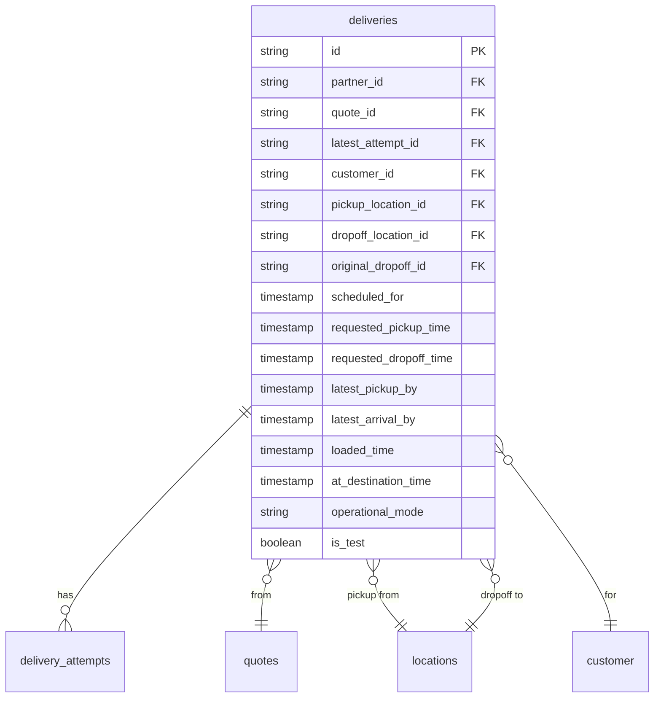

---
tags:
  - database
  - redshift
  - delivery
  - backend
---
# Deliveries V3 RDS Schema

**Namespace:** `deliveriesv3prod_rds_public`

This schema is synced from the current [[Deliveries Service]] RDS database (v3 architecture). It represents a refactored version of [[Deliveries RDS Schema]] with improved data modeling.

## Key Improvements Over V2

1. **Customer Abstraction** - Dedicated `customer` table instead of embedding in locations
2. **Watchdog System** - Automated monitoring with `watchdog_actions` and `watchdog_schema`
3. **Better State Management** - Cleaner state tracking for deliveries
4. **Dropoff Normalization** - Separate `dropoff` table for address reuse

## Core Tables

### `deliveries`
Main delivery records (similar to v2 but refined).

**Key columns:**
- `id` - Unique delivery identifier
- `customer_id` - Link to [[Customer]] entity
- `quote_id` - Originating quote
- `latest_attempt_id` - Current active attempt
- `pickup_location_id`, `dropoff_location_id` - Address references
- `original_dropoff_id` - Original address if changed
- `latest_pickup_by` - SLA for pickup
- `latest_arrival_by` - SLA for delivery
- `loaded_time` - When order was loaded into robot
- `at_destination_time` - When robot arrived at customer
- `unlock_pin` - PIN for customer unlock
- `contactless` - No-contact delivery flag
- `load_type` - How delivery is loaded (MERCHANT, PARKING_LOT, etc.)

### `customer`
Customer records for privacy and tracking.

**Key columns:**
- `id` - Unique customer identifier
- `phone` - Customer phone (anonymizable)
- `blacklisted` - Whether customer is blocked
- `blacklist_note` - Reason for blacklisting
- `anonymous` - Whether customer data is anonymized
- `created_at` - First order timestamp

### `dropoff`
Normalized dropoff locations for address reuse.

**Key columns:**
- `id` - Dropoff location identifier
- `lat`, `lng` - GPS coordinates
- `customer_id` - Associated customer

### `attempts`
Delivery attempt records.

**Key columns:**
- `id` - Attempt identifier
- `provider` - Fulfillment provider
- `provider_id` - External provider reference
- `status` - Current attempt status
- `quoted_pickup_time`, `quoted_dropoff_time` - Provider quotes
- `estimated_pickup_time`, `estimated_dropoff_time` - Real-time estimates
- `actual_pickup_time`, `actual_dropoff_time` - Actual times
- `delivery_fee` - Actual delivery cost
- `driver_name`, `driver_phone` - Courier info
- `driver_lat`, `driver_lng` - Real-time courier location

### `delivery_attempts`
Join table linking deliveries to attempts.

**Key columns:**
- `delivery_id` - Associated delivery
- `attempt_id` - Associated attempt
- `created_at` - When attempt was created

### `quotes`
Pre-delivery quotes (enhanced from v2).

**Key columns:**
- `id` - Quote identifier
- `partner_id` - Requesting merchant
- `provider` - Provider (COCO_ROBOT, DOORDASH, etc.)
- `quoted_pickup_time`, `quoted_dropoff_time` - Estimated times
- `route_id` - Planned robot route
- `pickup_route_id` - Route to merchant if needed
- `robot_failure_reason` - Why robot couldn't fulfill
- `robot_failure_reason_details` - Additional context
- `delivery_radius_miles` - Max delivery distance

### `locations`
Address records for pickups and dropoffs.

**Key columns:**
- `id` - Location identifier
- `lat`, `lng` - GPS coordinates
- `street`, `unit` - Address components
- `city`, `state`, `zip`, `country` - Location details
- `full_address` - Complete address string

## Watchdog System

### `watchdog_schema`
Defines automated monitoring rules.

**Key columns:**
- `label` - Human-readable rule name
- `entry_point` - Trigger event type
- `schema` - Rule definition (JSON)
- `active` - Whether rule is enabled
- `updated_by` - Who last modified rule

### `watchdog_actions`
Actions triggered by watchdog rules.

**Key columns:**
- `id` - Action identifier
- `delivery_id` - Target delivery
- `type` - Action type (ALERT, CANCEL, REASSIGN, etc.)
- `actiondata` - Action parameters (JSON)
- `eta` - When action should execute
- `path` - Execution path/status

## Notification Tracking

### `notification_history`
Audit trail for all notifications sent.

**Key columns:**
- `delivery_id` - Associated delivery
- `type` - Notification type (SMS, EMAIL, PUSH)
- `to` - Recipient
- `message` - Message content
- `status` - Send status
- `external_id` - Provider message ID
- `created_at` - Send timestamp

## Related Concepts

- [[Deliveries Service]] - Source service
- [[Delivery]] - Core business concept
- [[Customer]] - Customer entity
- [[Watchdog System]] - Automated monitoring (note: this is a new concept to document)

