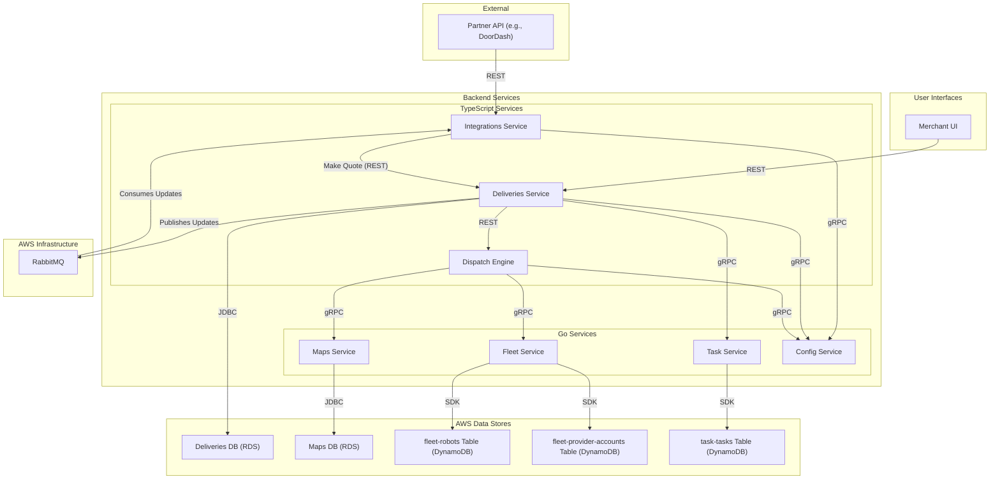

---
tags:
  - workflow
  - diagram
  - architecture
  - delivery
  - dispatch
---
# Delivery & Dispatch Flow

This diagram shows the complete lifecycle of a delivery, from the moment a request comes in from a partner or merchant to a robot being dispatched.

This flow involves the [[Integrations Service]], [[Deliveries Service]], [[Dispatch Engine]], [[Fleet Service]], [[Task Service]], [[Maps Service]], and [[Config Service]].
