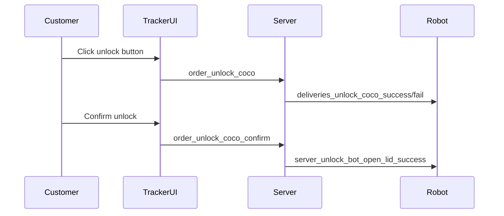
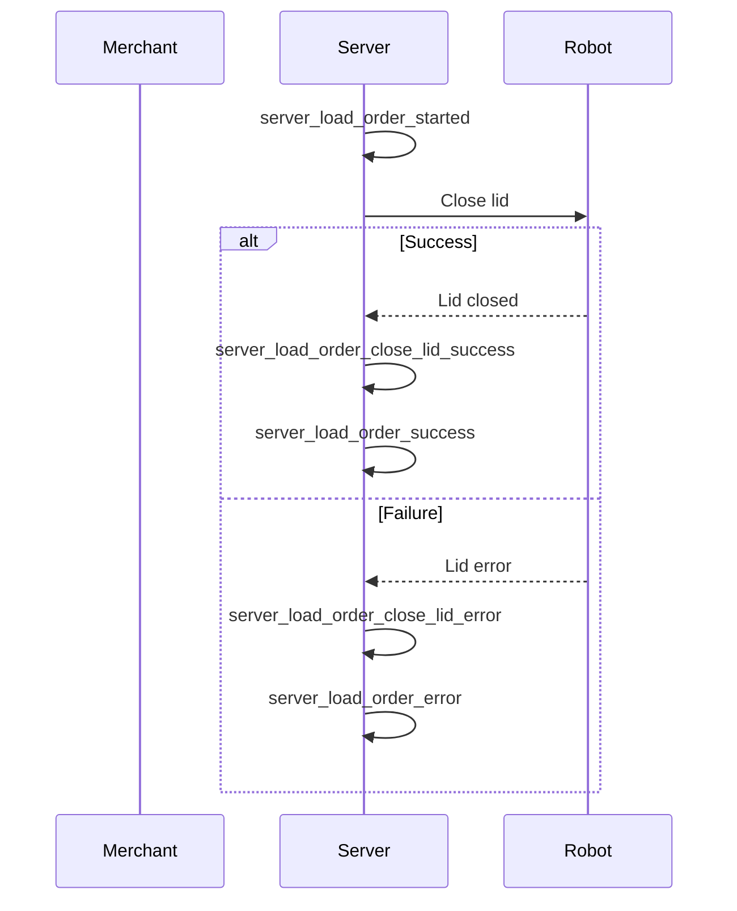

---
tags:
  - database
  - redshift
  - analytics
  - events
  - segment
---
# Delivery Platform Events Schema

**Namespace:** `delivery_platform_prod`

This schema contains event tracking data from [[Segment Analytics Integration]] for user interactions and system operations across the delivery platform. Unlike [[Coco Marketplace Analytics Schema]], this focuses on operational and admin interfaces.

## Event Categories

### Order Tracker Events (Customer-Facing)

Customer interactions with the [[Tracker UI]]:

- **`order_tracker_open`** - Customer opens tracking page
- **`order_tracker_faq_open`** - Customer views FAQ item
- **`order_tracker_text_support_click`** - Customer clicks support
- **`order_tracker_rating_submit`** - Customer submits delivery rating
- **`order_tracker_optout_error`** - SMS opt-out failure

### Unlock Events (Customer Self-Service)

Customer unlocking robot at delivery:

**Event sequence:**
1. `order_unlock_coco` - Customer initiates unlock
2. `order_unlock_coco_confirm` - Customer confirms unlock
3. `deliveries_unlock_coco_success` - Unlock succeeded
4. `deliveries_unlock_coco_fail` - Unlock failed

### App Banner Events

Marketing banner interactions:

- **`app_banner_viewed`** - Banner shown to customer
- **`app_banner_clicked`** - Customer clicks banner
- **`app_banner_dismissed`** - Customer closes banner

**Tracked attributes:**
- `order_id` - Associated delivery
- `merchant_name` - Merchant being promoted
- `position` - Banner placement
- `displayed_savings` - Promotional value shown
- `delivery_status` - Current order status

### Pilot Operations Events

[[Pilot UI]] interactions and field operations:

#### Trip Management
- **`pilot_cancel_trip`** - Pilot cancels a [[Trip]]
- **`pilot_unable_to_cancel_trip`** - Cancellation blocked
- **`pilot_start_break`** - Pilot starts scheduled break
- **`node_auto_launch`** - Autonomous trip initiated
- **`node_initialization`** - Trip initialization status

#### Robot Troubleshooting
- **`pilot_troubleshooting_step`** - Pilot navigates troubleshooting flow
- **`pilot_hard_reset`** - Pilot performs hard reset
- **`pilot_hard_reset_fail`** - Hard reset failed
- **`pilot_soft_reset`** - Pilot performs soft reset
- **`pilot_soft_reset_fail`** - Soft reset failed
- **`pilot_modem_reset`** - Pilot resets modem
- **`pilot_switch_sim_backup`** - Pilot switches to backup SIM
- **`pilot_reset_gps_hot`** - Hot GPS reset
- **`pilot_reset_gps_cold`** - Cold GPS reset

#### Field Operations
- **`pilot_requested_field_op`** - Pilot requests field assistance
- **`pilot_initiated_reassignment`** - Pilot requests robot swap
- **`pilot_submitted_reassignment`** - Reassignment submitted
- **`pilot_incident_report`** - Pilot files incident report
- **`pilot_route_issue`** - Pilot reports map/routing problem
- **`pilot_no_route_found`** - Route planning failure

#### Delivery Acknowledgment
- **`pilot_failed_to_acknowledge_delivery_in_progress`** - Pilot didn't confirm delivery start
- **`pilot_confirm_bot_parked_success`** - Pilot confirms robot parked

#### System Info
- **`pilot_workstation_hostname`** - Pilot workstation identified

### Server Events (Backend Operations)

Server-side operational events:

#### Load Order Flow

**Events:**
- `server_load_order_started` - Order loading initiated
- `server_load_order_success` - Order loaded successfully
- `server_load_order_error` - Load failed
- `server_load_order_close_lid_success` - Lid closed after load
- `server_load_order_close_lid_error` - Lid closure failed

#### Unlock Flow
- `server_unlock_bot_started` - Unlock initiated
- `server_unlock_bot_error` - Unlock failed
- `server_unlock_bot_open_lid_success` - Lid opened for customer
- `server_unlock_bot_open_lid_error` - Lid open failed

### UI Navigation Events

Generic interaction tracking:

- **`page_viewed`** - Page/screen viewed
- **`button_clicked`** - Button interaction
- **`app_download_faq_clicked`** - App download FAQ accessed

### Error Events

System errors and exceptions:

- **`error_mercator_error`** - Map rendering error
- **`merchant_asset_missing`** - Missing merchant image/logo
- **`order_tracker_open_error`** - Tracker page load error
- **`order_tracker_optout_error`** - SMS opt-out failure

## Common Event Attributes

All events include:

### Identity
- `anonymous_id` - Session identifier
- `user_id` - Authenticated user (when applicable)

### Context
- `context_user_agent` - Browser/device info
- `context_ip` - IP address
- `context_locale` - User locale
- `context_timezone` - User timezone
- `context_actions_amplitude_session_id` - Amplitude session

### Web Context (when applicable)
- `context_page_url` - Full URL
- `context_page_path` - URL path
- `context_page_title` - Page title
- `context_page_referrer` - Referrer URL

### Timing
- `timestamp` - Event occurrence time
- `original_timestamp` - Client-side timestamp
- `sent_at` - Transmission time
- `received_at` - Server receipt time

## Related Concepts

- [[Segment Analytics Integration]] - Event collection system
- [[Tracker UI]] - Customer tracking interface
- [[Pilot UI]] - Pilot operations interface
- [[Robot]] - Robot operations being tracked
- [[Trip]] - Trips being managed
- [[Delivery]] - Deliveries being fulfilled

