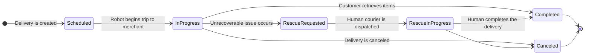

---
tags:
  - state-machine
  - diagram
  - delivery
---
# Delivery Status State Machine

This diagram illustrates the lifecycle of a [[Delivery]] as it moves from the initial partner request through to successful completion or failure. This represents the high-level status of the order itself.

### Description of States

*   **`Scheduled`**: The [[Delivery]] has been accepted and is scheduled, but work has not yet begun.
*   **`InProgress`**: The [[Delivery]] is actively being carried out by a [[Robot]].
*   **`RescueRequested`**: The [[Robot]] has failed, and a request has been made for a human courier to "rescue" the [[Delivery]].
*   **`RescueInProgress`**: A human courier is actively carrying out the [[Delivery]].
*   **`Completed`**: The customer has successfully retrieved their order. This is a final state.
*   **`Canceled`**: The [[Delivery]] was cancelled. This is a final state.
