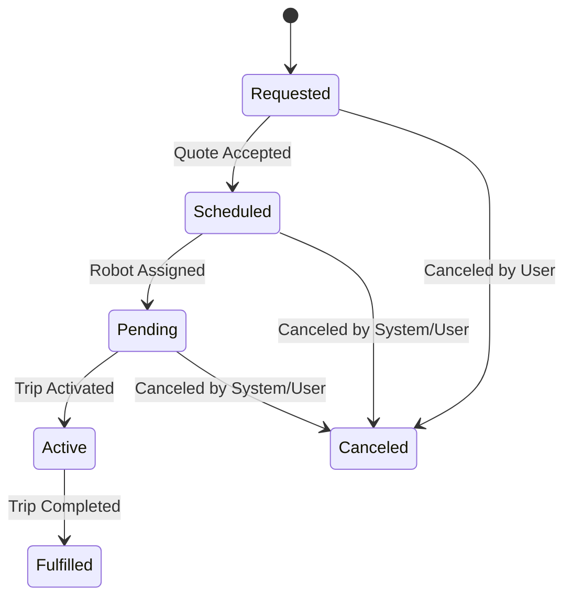

---
tags:
  - concept
  - dispatch-engine
---
# Demand

A **Demand** in the [[Dispatch Engine]] represents a request for a task that requires resources, such as a delivery. It is the central entity that the [[PlannerModule]] works to fulfill.

A [[Demand]] is tightly coupled with a [[Trip]], often having a one-to-one relationship. The [[Demand]] represents the *what* (the need for a delivery), while the [[Trip]] represents the *how* (the execution of that delivery by the [[Operations Service]]).

## Lifecycle

A Demand moves through several statuses:
- `Requested`: The initial state when a quote is requested.
- `Scheduled`: The state after a quote has been accepted and the demand is waiting for a resource assignment.
- `Pending`: The demand has been assigned a robot and is awaiting pilot assignment and trip activation.
- `Active`: The trip is in progress.
- `Fulfilled`: The trip has been successfully completed.
- `Canceled`: The demand has been canceled.

The [[Dispatch Engine Workflow]] is responsible for managing this lifecycle. Flows like [[Dispatch Engine - handleDeliveryLoaded]] manage the critical transitions between these states (e.g., moving from `Scheduled` to `Pending` when a robot is loaded).

## API Operations

The `demand.controller.ts` exposes several key endpoints to manage the [[Demand]] lifecycle:

- `estimate`: Provides a cost and time estimate for a potential delivery.
- `quote`: Creates a formal quote for a delivery.
- `confirm`: Confirms a quote, turning it into a scheduled [[Demand]].
- `update`: A new endpoint to modify key fields of an existing [[Demand]], such as `earliest_start_time` or `latest_start_time`. This is useful for operational interventions, like forcing a [[Trip]] to start immediately by setting its `latest_start_time` to the current time.
- `activate`: Triggers the start of a [[Trip]] for a given [[Demand]] ID.

## Activation Pipeline

The process of moving a [[Demand]] from `Pending` to `Active` involves multiple services:

1.  The [[Dispatch Engine]] "activates" the [[Trip]].
2.  This signals the [[Operations Service]] to assign a pilot.
3.  Once a pilot is assigned and the [[Trip]] starts, the [[Dispatch Engine]] moves the [[Demand]]'s status from `Scheduled` to `Active`.
