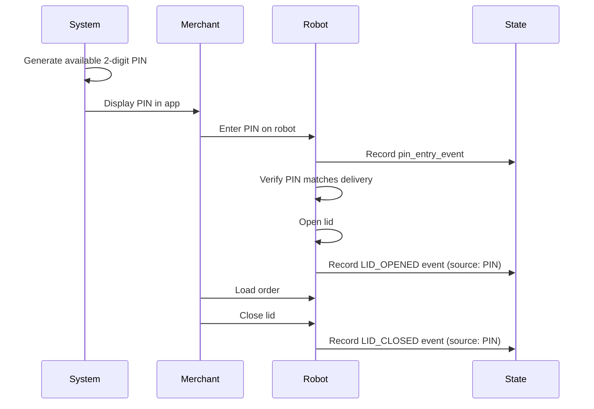

---
tags:
  - delivery
  - operations
  - deviceless
  - pin
  - analytics
---
# Deviceless PIN Flow

A delivery loading method that uses a system-generated 2-digit PIN, allowing merchants to load robots without customer interaction.

## Overview

Deviceless PIN deliveries are identified by `load_type = 'TWO_DIGIT_DEVICELESS_PIN'` in [[Deliveries V3 RDS Schema]].



## Key Tables

### Deliveries
From [[Deliveries V3 RDS Schema]]:
- `load_type` = `'TWO_DIGIT_DEVICELESS_PIN'`
- `unlock_pin` - The assigned 2-digit PIN (stored as integer)
- `created_at` - Delivery created time (start of valid window)
- `loaded_time` - When order was loaded (end of valid window)

### PIN Entry Events
From [[State RDS Schema]]:
- `pin_entry_event.entered` - The PIN that was entered
- `pin_entry_event.created_at` - When PIN was entered
- `pin_entry_event.serial` - Robot serial number

### Lid Events
From [[State RDS Schema]]:
- `lid_cycle_event_history.source` = `'PIN'` or `'pin'`
- `lid_cycle_event_history.lid_event` = `'LID_CLOSED'`
- `lid_cycle_event_history.reasons` = `'["LOAD"]'`

## Success Criteria

A deviceless load is considered **successful** when:

1. ✅ A `pin_entry_event` exists matching the `unlock_pin`
2. ✅ PIN was entered AFTER `created_at` and BEFORE `loaded_time`
3. ✅ A `LID_CLOSED` event exists with `source = 'PIN'`

```sql
-- Count successful deviceless loads
SELECT COUNT(*)
FROM deliveriesv3prod_rds_public.deliveries d
JOIN state_rds_public.pin_entry_event p 
    ON d.unlock_pin = p.entered
    AND d.created_at < p.created_at
    AND d.loaded_time > p.created_at
WHERE d.load_type = 'TWO_DIGIT_DEVICELESS_PIN'
    AND d.created_at BETWEEN '2025-11-02' AND '2025-11-09'
    AND d._fivetran_deleted = FALSE;
```

## Failure Scenarios

A deviceless load is considered **unsuccessful** when:

❌ No matching `pin_entry_event` within the valid time window
❌ PIN was entered but timing didn't match
❌ Lid was never closed

```sql
-- Count unsuccessful deviceless loads
SELECT COUNT(DISTINCT d.id)
FROM deliveriesv3prod_rds_public.deliveries d
LEFT JOIN state_rds_public.pin_entry_event p 
    ON d.unlock_pin = p.entered
    AND d.created_at < p.created_at
    AND COALESCE(d.loaded_time, d.created_at + INTERVAL '30 minutes') > p.created_at
WHERE d.load_type = 'TWO_DIGIT_DEVICELESS_PIN'
    AND d.created_at BETWEEN '2025-11-02' AND '2025-11-09'
    AND p.entered IS NULL  -- No successful PIN entry
    AND d._fivetran_deleted = FALSE;
```

**Note:** Using `COALESCE(d.loaded_time, d.created_at + INTERVAL '30 minutes')` handles cases where `loaded_time` is NULL.

## Investigating Failed Deliveries

Get details of individual failed deviceless loads:

```sql
SELECT
    d.id AS delivery_id,
    d.partner_id,
    d.created_at,
    d.loaded_time,
    d.unlock_pin,
    d.load_type,
    -- Check if there were ANY pin entries for this PIN
    (SELECT COUNT(*)
     FROM state_rds_public.pin_entry_event p2
     WHERE p2.entered = d.unlock_pin) AS total_pin_entries_for_this_pin,
    -- Get the latest attempt time if any
    (SELECT MAX(p3.created_at)
     FROM state_rds_public.pin_entry_event p3
     WHERE p3.entered = d.unlock_pin) AS latest_pin_attempt
FROM deliveriesv3prod_rds_public.deliveries d
LEFT JOIN state_rds_public.pin_entry_event p
    ON d.unlock_pin = p.entered
    AND d.created_at < p.created_at
    AND COALESCE(d.loaded_time, d.created_at + INTERVAL '30 minutes') > p.created_at
WHERE d.load_type = 'TWO_DIGIT_DEVICELESS_PIN'
    AND d.created_at BETWEEN '2025-11-02' AND '2025-11-09'
    AND p.entered IS NULL  -- Failed
    AND d._fivetran_deleted = FALSE
ORDER BY d.created_at DESC;
```

## Common Failure Reasons

1. **Wrong PIN Entered**
   - Merchant entered incorrect PIN
   - Check `pin_entry_event` for attempts with different PINs

2. **Timing Issues**
   - PIN entered too early (before delivery created)
   - PIN entered too late (after timeout)
   - `loaded_time` is NULL (delivery never marked as loaded)

3. **No Attempts**
   - Merchant never tried to enter PIN
   - Robot was unavailable
   - Delivery was canceled before load

4. **Manual Intervention Required**
   - See [[Manual Intervention Tracking]]
   - Staff had to manually open lid

## PIN Generation

PINs are generated from a deterministic sequence of 2-digit numbers:
- Excludes 00-09 to avoid confusion
- Only uses allowed digits (configurable)
- Limited pool size (typically ~90 PINs)
- Reused when deliveries complete

**Code Reference:** `delivery-platform/service/deliveries/src/modules/deviceless/deviceless.service.ts`

## Analytics Queries

### Success Rate by Date

```sql
WITH deviceless_deliveries AS (
    SELECT 
        DATE_TRUNC('day', d.created_at) AS date,
        d.id,
        d.unlock_pin,
        d.created_at,
        d.loaded_time
    FROM deliveriesv3prod_rds_public.deliveries d
    WHERE d.load_type = 'TWO_DIGIT_DEVICELESS_PIN'
        AND d.created_at >= CURRENT_DATE - 30
        AND d._fivetran_deleted = FALSE
),
successful_loads AS (
    SELECT DISTINCT dd.id
    FROM deviceless_deliveries dd
    JOIN state_rds_public.pin_entry_event p 
        ON dd.unlock_pin = p.entered
        AND dd.created_at < p.created_at
        AND COALESCE(dd.loaded_time, dd.created_at + INTERVAL '30 minutes') > p.created_at
)
SELECT 
    dd.date,
    COUNT(DISTINCT dd.id) AS total_attempts,
    COUNT(DISTINCT sl.id) AS successful,
    COUNT(DISTINCT dd.id) - COUNT(DISTINCT sl.id) AS failed,
    ROUND(100.0 * COUNT(DISTINCT sl.id) / COUNT(DISTINCT dd.id), 2) AS success_rate_pct
FROM deviceless_deliveries dd
LEFT JOIN successful_loads sl ON dd.id = sl.id
GROUP BY dd.date
ORDER BY dd.date DESC;
```

### Failure Reason Analysis

```sql
SELECT
    CASE 
        WHEN d.loaded_time IS NULL THEN 'Never Loaded'
        WHEN p.entered IS NULL THEN 'No PIN Entry Found'
        ELSE 'Other'
    END AS failure_reason,
    COUNT(*) AS count
FROM deliveriesv3prod_rds_public.deliveries d
LEFT JOIN state_rds_public.pin_entry_event p 
    ON d.unlock_pin = p.entered
    AND d.created_at < p.created_at
    AND COALESCE(d.loaded_time, d.created_at + INTERVAL '30 minutes') > p.created_at
WHERE d.load_type = 'TWO_DIGIT_DEVICELESS_PIN'
    AND d.created_at >= CURRENT_DATE - 7
    AND p.entered IS NULL
    AND d._fivetran_deleted = FALSE
GROUP BY 1;
```

## Related Concepts

- [[Load Methods and Types]] - Overview of all load methods
- [[State RDS Schema]] - PIN and lid event tables
- [[Deliveries V3 RDS Schema]] - Delivery records
- [[Manual Intervention Tracking]] - When staff help is needed
- [[Redshift Query Patterns]] - Query examples


