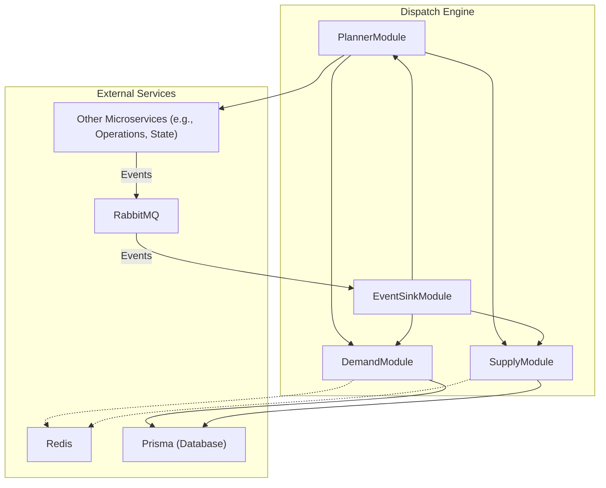

---
tags:
  - architecture
  - dispatch-engine
---
# Dispatch Engine Architecture

The [[Dispatch Engine]] is a [[TypeScript Backend Services|NestJS service]] built with a modular architecture, with a clear separation of concerns for handling demand, supply, planning, and event processing.

## Component Diagram

## Core Modules
- **`DemandModule`**: Manages the lifecycle of a [[Demand]], which represents a request for a task.
- **`SupplyModule`**: Manages the available resources: [[Robot|robots]] and pilots.
- **`PlannerModule`**: The core of the engine. It takes the current supply and demand and creates an optimal plan to assign resources. This is where the [[Continuous Replanning]] logic lives.
- **`EventSinkModule`**: Listens for events published by other microservices (e.g., [[Operations Service]], [[State Service]]) via RabbitMQ. This allows the engine to react to real-world changes.

## Technical Stack
- **Framework**: [[NestJS]]
- **Database**: Prisma for object-relational mapping.
- **Messaging**: RabbitMQ for asynchronous [[Event-Driven Architecture|event-driven communication]].
- **Caching**: Redis for performance optimization.
