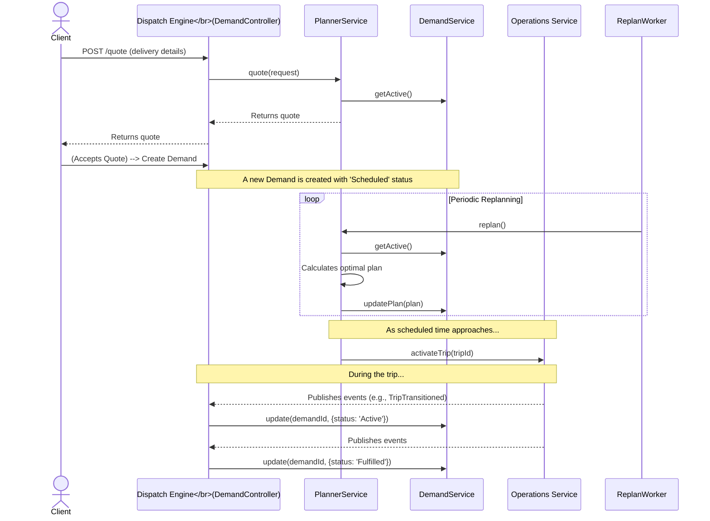

---
tags:
  - workflow
  - dispatch-engine
---
# Dispatch Engine Workflow

This describes the typical workflow for handling a new delivery request within the [[Dispatch Engine]].

## Sequence Diagram

1.  **Request & Quote**: An external service sends a delivery request to the `/quote` [[API Endpoints|endpoint]]. The `PlannerModule`'s `quote()` method is called to generate an estimate. It fetches available [[Supply]] and calculates a route using the [[Maps Service]] to determine feasibility.

2.  **Demand Creation**: If the quote is accepted, a new [[Demand]] is created with a `Scheduled` status.

3.  **Replanning**: The `ReplanWorker` cron job periodically triggers the [[Continuous Replanning]] process. This process re-evaluates all `Scheduled` and `Pending` demands against the current state of all available [[Robot|robots]] and pilots to create the most optimal plan.

4.  **Execution & Monitoring**: As the scheduled time for a [[Demand]] approaches, the [[PlannerModule]] activates the associated [[Trip]] by sending a message to the [[Operations Service]]. The `EventSinkModule` then listens for events from other services (like [[Robot]] heartbeats or [[Trip]] status changes) to update the [[Demand]]'s state from `Scheduled` -> `Active` -> `Fulfilled`.
