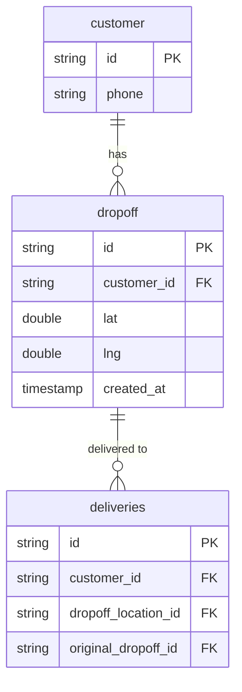
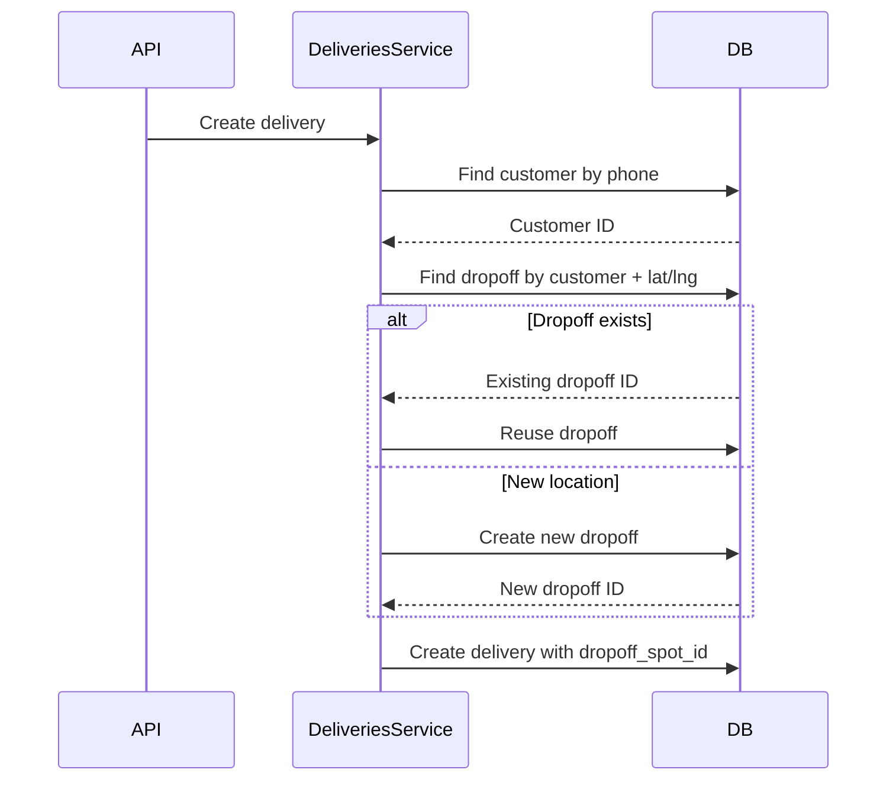

---
tags:
  - concept
  - location
  - delivery
---
# Dropoff

A dropoff represents a normalized delivery destination location in the [[Deliveries V3 RDS Schema]]. It links a [[Customer]] to GPS coordinates, enabling address reuse and geospatial analysis.

## Purpose

Dropoff was introduced in V3 to:
1. **Normalize addresses** - Avoid storing duplicate coordinates
2. **Enable customer history** - Link multiple deliveries to same address
3. **Improve geocoding** - Cache geocoded coordinates
4. **Support address changes** - Track original vs. updated locations

## Data Model



## Relationship to Locations

The [[Deliveries V3 RDS Schema]] has two location concepts:

### `dropoff` Table
- **Purpose:** Normalized GPS coordinates per customer
- **Key:** `customer_id` + `lat/lng` pair
- **Usage:** Link deliveries to reusable dropoff points

### `locations` Table  
- **Purpose:** Full address details (street, city, zip, etc.)
- **Key:** Unique `location_id`
- **Usage:** Store complete address information
- **Reference:** Both `pickup_location_id` and `dropoff_location_id` in `deliveries`

A delivery references:
- `dropoff` via `dropoff_spot_id` (for customer/GPS link)
- `locations` via `dropoff_location_id` (for full address)

## Address Reuse

When a customer orders to the same address:



Benefits:
- Reduces duplicate geocoding API calls
- Enables "deliver to same address" analysis
- Supports customer segmentation by location

## Address Changes

When a customer updates their delivery address:

```sql
-- Original delivery
INSERT INTO deliveries (
  id,
  customer_id,
  dropoff_location_id,
  dropoff_spot_id,
  original_dropoff_id
) VALUES (
  'del_123',
  'cust_456',
  'loc_789',      -- Current address
  'drop_abc',      -- Current dropoff
  NULL             -- No change yet
);

-- Customer updates address
UPDATE deliveries 
SET 
  dropoff_location_id = 'loc_999',   -- New address
  dropoff_spot_id = 'drop_xyz',       -- New dropoff
  original_dropoff_id = 'drop_abc'    -- Preserve original
WHERE id = 'del_123';
```

This enables:
- Tracking address changes
- Understanding why deliveries were modified
- Analyzing address accuracy issues

## Geospatial Analysis

Dropoffs enable location-based queries:

```sql
-- Deliveries within 1 mile of a point
SELECT 
  d.id,
  d.customer_id,
  drop.lat,
  drop.lng,
  (
    3959 * ACOS(
      COS(RADIANS(37.7749)) * COS(RADIANS(drop.lat)) * 
      COS(RADIANS(drop.lng) - RADIANS(-122.4194)) + 
      SIN(RADIANS(37.7749)) * SIN(RADIANS(drop.lat))
    )
  ) AS distance_miles
FROM deliveriesv3prod_rds_public.deliveries d
JOIN deliveriesv3prod_rds_public.dropoff drop ON d.dropoff_spot_id = drop.id
HAVING distance_miles < 1
ORDER BY distance_miles;

-- Most popular delivery zones
SELECT 
  ROUND(drop.lat, 2) AS lat_zone,
  ROUND(drop.lng, 2) AS lng_zone,
  COUNT(DISTINCT drop.customer_id) AS unique_customers,
  COUNT(d.id) AS total_deliveries
FROM deliveriesv3prod_rds_public.deliveries d
JOIN deliveriesv3prod_rds_public.dropoff drop ON d.dropoff_spot_id = drop.id
WHERE d.created_at >= CURRENT_DATE - 30
GROUP BY 1, 2
HAVING COUNT(d.id) > 10
ORDER BY 4 DESC;
```

## Customer Address History

```sql
-- All addresses for a customer
SELECT 
  c.phone,
  drop.id AS dropoff_id,
  drop.lat,
  drop.lng,
  l.full_address,
  COUNT(d.id) AS delivery_count,
  MIN(d.created_at) AS first_delivery,
  MAX(d.created_at) AS last_delivery
FROM deliveriesv3prod_rds_public.customer c
JOIN deliveriesv3prod_rds_public.dropoff drop ON c.id = drop.customer_id
JOIN deliveriesv3prod_rds_public.deliveries d ON drop.id = d.dropoff_spot_id
LEFT JOIN deliveriesv3prod_rds_public.locations l ON d.dropoff_location_id = l.id
WHERE c.id = 'cust_123'
GROUP BY 1, 2, 3, 4, 5
ORDER BY 7 DESC;
```

## Migration from V2

Legacy [[Deliveries RDS Schema]] stored addresses differently:

**V2 Schema:**
- `locations` table with `type = 'dropoff'`
- No customer normalization
- Duplicate geocoding for same addresses

**V3 Schema:**
- Separate `dropoff` table
- Linked to `customer` entity
- Reusable GPS coordinates

Migration involved:
1. Creating `customer` records from phone numbers
2. Deduplicating dropoff coordinates per customer
3. Linking deliveries to normalized dropoffs

## Related Concepts

- [[Customer]] - Customer placing the order
- [[Delivery]] - Delivery being fulfilled
- [[Deliveries V3 RDS Schema]] - Database schema
- [[Redshift Data Warehouse]] - Analytics platform
- [[Redshift Query Patterns]] - Query examples

