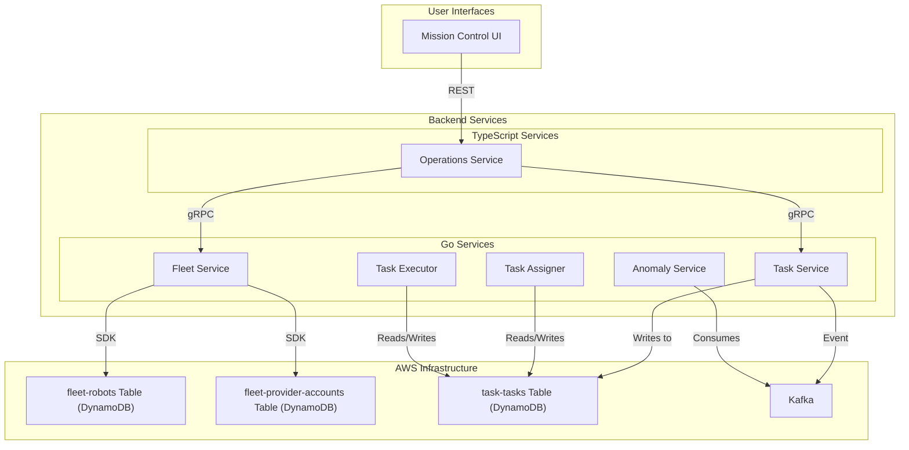

---
tags:
  - architecture
  - diagram
  - fleet
  - task
  - operations
---
# Fleet & Task Management

This diagram shows the internal administrative and management side of the system, focusing on how the fleet of robots and operators is managed and how tasks are orchestrated.

This flow involves the [[Operations Service]], [[Task Service]], [[Fleet Service]], [[Task Assigner]], [[Task Executor]], and [[Anomaly Service]].
