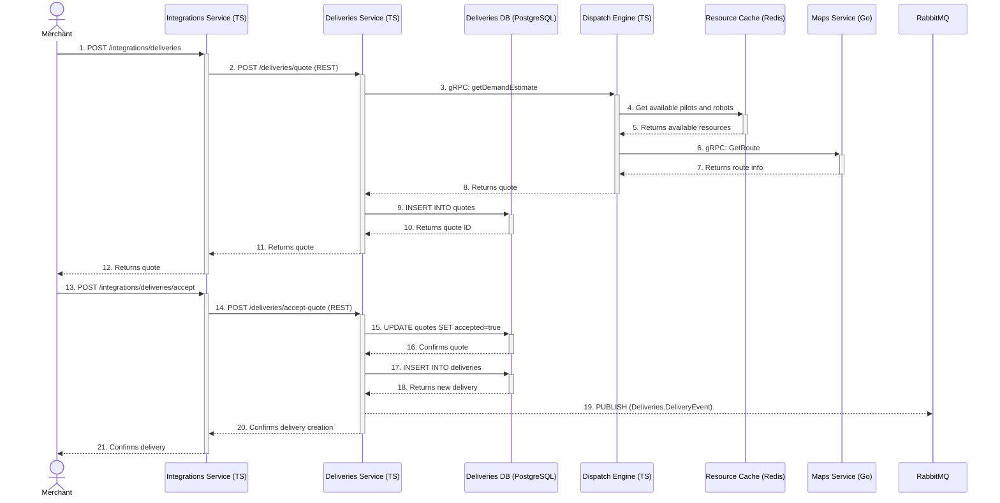

---
tags:
  - workflow
  - diagram
  - sequence
  - delivery
  - robot
  - dispatch
---
# Incoming Delivery Request and Robot Assignment Flow

This sequence describes how a new delivery request from a merchant partner is processed, quoted, and finally created in the system.

### Flow Description

1.  **Incoming Request:** A merchant's backend system sends a `POST` request to a partner-specific endpoint (e.g., `/doordash/v3/delivery/assign`) on the **[[Integrations Service]]** to initiate a [[Delivery]].
2.  **Request Quote:** The **[[Integrations Service]]** first makes a REST API call (`/deliveries/quote`) to the **[[Deliveries Service]]** to get a quote.
3.  **Get Demand Estimate:** The **[[Deliveries Service]]** then makes a gRPC call (`getDemandEstimate`) to the **[[Dispatch Engine]]** to determine if a [[Robot]] and pilot are available.
4.  **Check Resource Cache:** The **[[Dispatch Engine]]** checks its **Resource Cache (Redis)** for available pilots and [[Robot|robots]] in the area. This cache is kept up-to-date by other services that publish resource availability events.
5.  **Get Route:** The **[[Dispatch Engine]]** also calls the **[[Maps Service]]** (Go) via gRPC to calculate the route and estimated travel time.
6.  **Persist and Return Quote:** The **[[Deliveries Service]]** receives the estimate, persists it as a quote in its **PostgreSQL database**, and returns the quote ID to the **[[Integrations Service]]**.
7.  **Accept Quote:** The merchant confirms the [[Delivery]], triggering another call from the **[[Integrations Service]]** to the **[[Deliveries Service]]** (`/deliveries/accept-quote`).
8.  **Create [[Delivery]]:** The **[[Deliveries Service]]** marks the quote as accepted and creates the official [[Delivery]] record in its **PostgreSQL database**.
9.  **Publish Event:** Upon successful creation, the **[[Deliveries Service]]** publishes a `DeliveryCreated` event to **RabbitMQ**. This asynchronous event allows other services (like the **[[Operations Service]]**) to be notified of the new [[Delivery]] and begin their own processes, such as assigning a specific pilot.
10. **Confirmation:** The final confirmation is sent back up the chain to the merchant.
