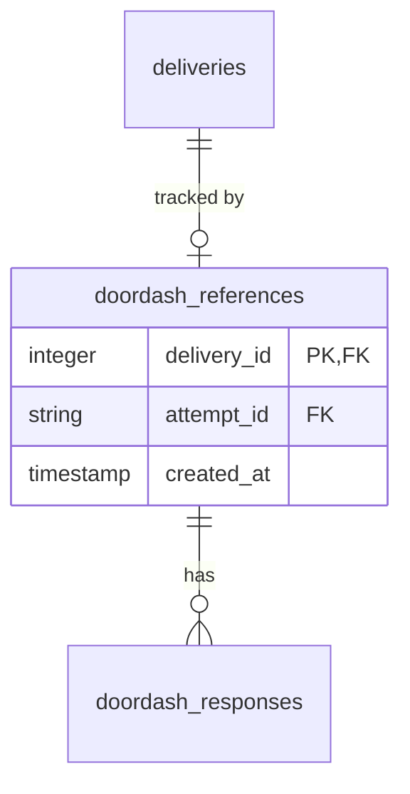
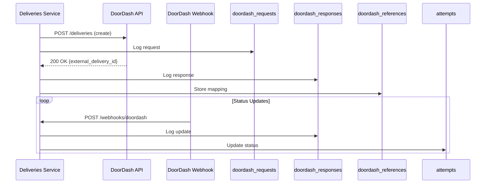
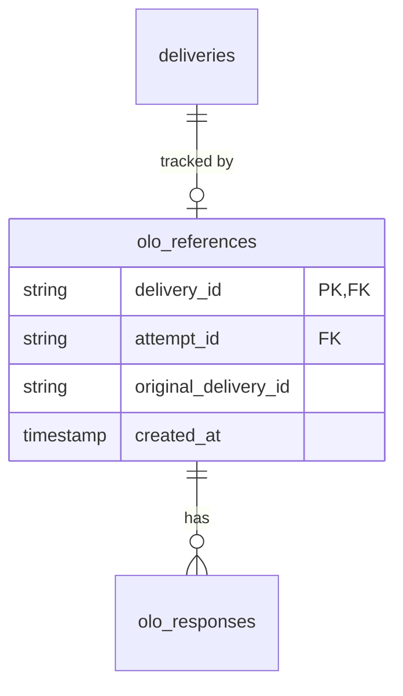
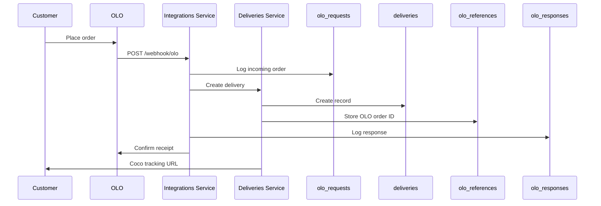

---
tags:
  - integration
  - database
  - doordash
  - olo
  - third-party
---
# Integration Provider Tables

The delivery platform integrates with multiple third-party systems for order ingestion and fulfillment. Integration state is tracked in dedicated tables within [[Deliveries RDS Schema]] and [[Deliveries V3 RDS Schema]].

## DoorDash Integration

DoorDash is used as a backup fulfillment provider when robots are unavailable.

### Tables (in `deliveries_rds_public`)

#### `doordash_references`
Maps Coco deliveries to DoorDash delivery IDs.



**Key columns:**
- `delivery_id` - Coco delivery ID (integer in v2 schema)
- `attempt_id` - Coco attempt ID
- `created_at` - When delivery was sent to DoorDash

#### `doordash_requests`
Outbound API requests to DoorDash.

**Key columns:**
- `id` - Request ID
- `type` - Request type (CREATE, CANCEL, UPDATE)
- `payload` - Request JSON
- `created_at` - Request timestamp

**Request types:**
- `CREATE` - Create new DoorDash delivery
- `CANCEL` - Cancel DoorDash delivery
- `UPDATE` - Update delivery details
- `QUOTE` - Get delivery quote

#### `doordash_responses`
API responses from DoorDash.

**Key columns:**
- `id` - Response ID
- `attempt_id` - Associated Coco attempt
- `type` - Response type (matches request type)
- `payload` - Response JSON
- `created_at` - Response timestamp

**Response data includes:**
- DoorDash delivery ID
- Driver information (name, phone, location)
- Pickup/dropoff ETAs
- Delivery status updates
- Error details (if failed)

### DoorDash Webhook Flow



## OLO Integration

OLO is a white-label online ordering platform used by many restaurant partners.

### Tables (in `deliveries_rds_public`)

#### `olo_references`
Maps Coco deliveries to OLO order IDs.



**Key columns:**
- `delivery_id` - Coco delivery ID
- `attempt_id` - Coco attempt ID  
- `original_delivery_id` - OLO order ID
- `created_at` - When order received from OLO

#### `olo_providers`
OLO provider configurations (what OLO calls their customers).

**Key columns:**
- `id` - Provider ID
- `name` - Provider name
- `slug` - URL slug
- `profile` - Provider profile/configuration
- `tos_prompt` - Terms of service prompt

#### `partner_olo_configs`
Per-merchant OLO configurations.

**Key columns:**
- `id` - Config ID
- `partner_id` - Associated Coco merchant
- `pickup_instructions` - Special instructions for pickup
- `created_at`, `updated_at` - Timestamps

#### `olo_config_providers`
Links OLO configs to providers (many-to-many).

**Key columns:**
- `config_id` - Partner OLO config
- `provider_id` - OLO provider
- `type` - Provider type

#### `olo_requests`
Outbound API requests to OLO.

**Key columns:**
- `id` - Request ID
- `type` - Request type
- `payload` - Request JSON
- `created_at` - Request timestamp

#### `olo_responses`
API responses from OLO.

**Key columns:**
- `id` - Response ID
- `attempt_id` - Associated attempt
- `type` - Response type
- `payload` - Response JSON
- `created_at` - Response timestamp

### OLO Order Flow



## Integration Configuration

### Merchant Setup (in `config_rds_public.integration`)

The [[Config RDS Schema]] `integration` table configures third-party integrations per merchant:

**Key columns:**
- `merchant_id` - Merchant being configured
- `source` - Integration source ("olo", "lunchbox", etc.)
- `type` - Integration type code
- `is_active` - Whether integration is enabled
- `external_ids` - External system identifiers (JSON)
- `pickup_override_minutes` - Override for prep time
- `unlock_pin` - PIN for robot unlock (if applicable)
- `is_deviceless` - Whether integration supports deviceless operation

### Common Integration Sources

- **"olo"** - OLO platform orders
- **"lunchbox"** - Lunchbox platform orders
- **"doordash"** - DoorDash marketplace orders
- **"ubereats"** - Uber Eats orders (via OLO or direct)
- **"grubhub"** - Grubhub orders
- **"native"** - Direct ordering

## Testing Integrations

See dedicated testing guides:
- [[DoorDash Integration Testing]]
- [[Uber Eats Integration Testing]]
- [[Integrations Testing]]

## Common Queries

### DoorDash Delivery Status
```sql
SELECT 
  d.id AS delivery_id,
  a.provider,
  a.status,
  dr.created_at AS sent_to_doordash,
  ddresp.payload->>'status' AS doordash_status,
  ddresp.created_at AS last_update
FROM deliveriesv3prod_rds_public.deliveries d
LEFT JOIN deliveriesv3prod_rds_public.delivery_attempts da ON d.id = da.delivery_id
LEFT JOIN deliveriesv3prod_rds_public.attempts a ON da.attempt_id = a.id
JOIN deliveries_rds_public.doordash_references dr ON d.id = dr.delivery_id
LEFT JOIN LATERAL (
  SELECT payload, created_at
  FROM deliveries_rds_public.doordash_responses
  WHERE attempt_id = a.id
  ORDER BY created_at DESC
  LIMIT 1
) ddresp ON TRUE
WHERE a.provider = 'DOORDASH'
  AND d.created_at > CURRENT_DATE - 7
  AND d._fivetran_deleted = FALSE;
```

### OLO Order Source
```sql
SELECT 
  d.id,
  d.partner_id,
  pc.store_name AS partner_name,
  d.order_source,
  oref.original_delivery_id AS olo_order_id,
  d.created_at
FROM deliveriesv3prod_rds_public.deliveries d
LEFT JOIN deliveries_rds_public.partner_configs pc ON d.partner_id = pc.partner_id
LEFT JOIN deliveries_rds_public.olo_references oref ON d.id = oref.delivery_id
WHERE d.order_source = 'olo'
  AND d.created_at > CURRENT_DATE - 1
  AND d._fivetran_deleted = FALSE;
```

### Integration Configuration by Merchant
```sql
SELECT 
  m.merchant_id,
  m.name,
  i.source,
  i.is_active,
  i.external_ids,
  i.is_deviceless
FROM config_rds_public.merchant m
LEFT JOIN config_rds_public.integration i ON m.merchant_id = i.merchant_id
WHERE m.is_test_merchant = FALSE
  AND m._fivetran_deleted = FALSE
ORDER BY m.name, i.source;
```

## Related Concepts

- [[Deliveries Service]] - Manages integration requests
- [[Integrations Service]] - Handles incoming webhooks
- [[Config Service]] - Stores integration configuration
- [[Delivery]] - Deliveries created from integrations
- [[Attempt]] - Fulfillment attempts via providers

