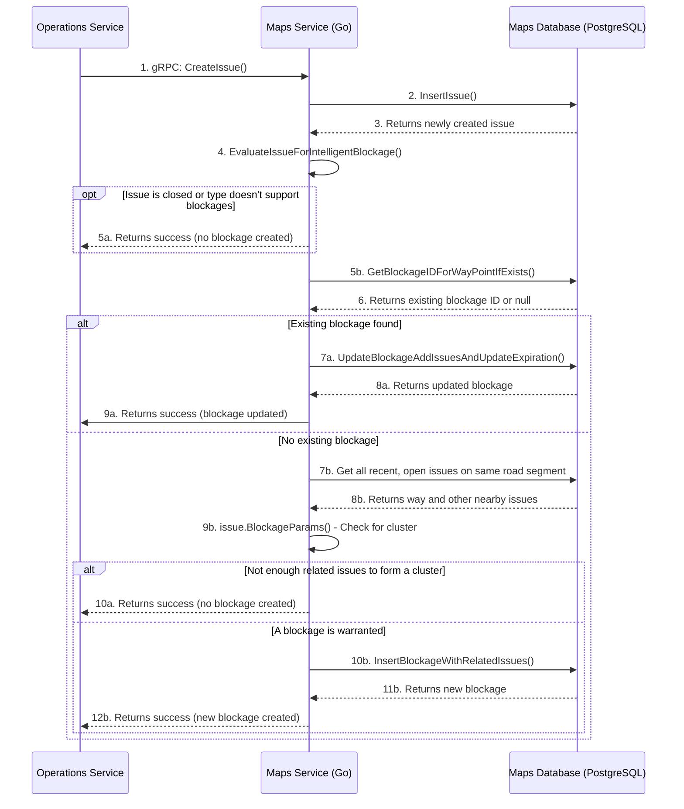

---
tags:
---
# Intelligent Blockage Creation Flow

This document explains the process within the **[[Maps Service]]** that evaluates a newly reported route issue to determine if it should create or update an "Intelligent Blockage". This blockage is then used by the routing engine to avoid sending other robots down the same problematic path for a period of time.

The primary logic resides in the `CreateIssue` and `EvaluateIssueForIntelligentBlockage` methods in `maps_issue.go`.

### Flow Description

1.  **Create Issue Request:** The process begins when an external service, like the **[[Operations Service]]**, sends a `CreateIssue` gRPC request to the **[[Maps Service]]**.

2.  **Initial Database Insert:** The **[[Maps Service]]** first validates the request and inserts the new issue into its **Maps Database**.

3.  **Evaluate for Blockage:** After the issue is successfully saved, the service immediately calls its own internal `EvaluateIssueForIntelligentBlockage` method to begin the core logic.

4.  **Initial Sanity Check:** The method first checks if the issue type is one that supports intelligent blockages (e.g., a temporary blockage, not a permanent `HAZARD`) and that the issue isn't already closed. If not, the process ends.

5.  **Check for Existing Blockage:** The service queries its database to see if an active or recently expired blockage already exists for the same road segment (`WayID`) and issue type.

6.  **Update Existing Blockage:** If an existing blockage is found, the service adds the new issue to it. This might extend the blockage's duration. The process then finishes.

7.  **Gather Related Issues (Step 7b in diagram):** If no existing blockage is found, the service queries its database via the `GetWayAndIssuesForType` method to gather all other recent, open issues of the same type that are on the same road segment (`WayID`).

8.  **Check for a Cluster:** The core "intelligent" logic happens here. The service calls the `issue.BlockageParams()` method, which analyzes the new issue and the other nearby issues based on a set of configurable parameters to determine if a "cluster" of reports exists. A blockage is warranted if:
    *   **Sufficient Issue Count:** There are at least `IssueCountForBlockageCreation` related issues (e.g., 3 reports).
    *   **Sufficient Issue Freshness:** All of those issues are younger than `IssueAgeForBlockageCreation` (e.g., created in the last 15 minutes).
    *   **Geographic Proximity:** Issues are considered "related" if they are within `IssueRelatedToBlockageDistanceMeters` of each other.

9.  **Handle Cluster Result:**
    *   **Not Enough Issues:** If there isn't a sufficient cluster of reports, the process ends. No blockage is created.
    *   **Create New Blockage:** If the cluster meets the required threshold, the service creates a new `Blockage` entity in the database. 
        *   The new blockage is given a duration defined by `BlockageDurationBase` (e.g., 30 minutes).
        *   This duration will not exceed `BlockageDurationMaximum`.
        *   The new blockage is linked to all the individual pilot issue reports that contributed to its creation. This blockage will now be considered by the routing engine for future trip calculations.
        
This entire flow is only triggered for issue types where the `SupportsIntelligentBlockages` flag is true.
