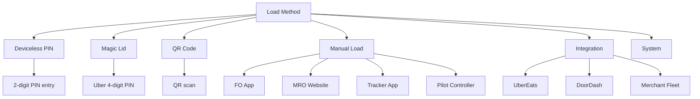

---
tags:
  - delivery
  - operations
  - analytics
  - database
---
# Load Methods and Types

Different methods for loading deliveries into robots, tracked through [[State RDS Schema]] events and delivery metadata.

## Classification Hierarchy



## Detection Logic

### Primary Signal: `load_type` Field
The most reliable indicator in [[Deliveries V3 RDS Schema]]:

```sql
SELECT 
    CASE 
        WHEN d.load_type = 'TWO_DIGIT_DEVICELESS_PIN' THEN 'Deviceless PIN'
        ELSE 'Other'
    END AS load_method
FROM deliveriesv3prod_rds_public.deliveries d;
```

**Known Values:**
- `TWO_DIGIT_DEVICELESS_PIN` - Deviceless PIN flow (see [[Deviceless PIN Flow]])
- (NULL) - Not a deviceless delivery

### Secondary Signal: Lid Event Source
When `load_type` is NULL, check [[State RDS Schema]] lid events:

```sql
SELECT 
    le.source,
    COUNT(DISTINCT d.id) AS delivery_count
FROM deliveriesv3prod_rds_public.deliveries d
LEFT JOIN deliveriesv3prod_rds_public.attempts a ON d.latest_attempt_id = a.id
LEFT JOIN state_rds_public.lid_cycle_event_history le
    ON le.serial = a.driver_name
    AND le.created_at BETWEEN d.created_at AND COALESCE(d.loaded_time, d.created_at + INTERVAL '30 minutes')
    AND le.lid_event = 'LID_CLOSED'
    AND le.reasons LIKE '%LOAD%'
GROUP BY 1;
```

## Complete Classification Query

```sql
WITH delivery_robots AS (
    SELECT 
        d.id AS delivery_id,
        a.driver_name AS robot_serial,
        d.created_at AS delivery_start,
        COALESCE(d.loaded_time, d.created_at + INTERVAL '30 minutes') AS delivery_end,
        d.load_type,
        d.loaded_time
    FROM deliveriesv3prod_rds_public.deliveries d
    LEFT JOIN deliveriesv3prod_rds_public.attempts a ON d.latest_attempt_id = a.id
    WHERE d._fivetran_deleted = FALSE
),
first_load_event AS (
    SELECT 
        dr.delivery_id,
        le.source,
        ROW_NUMBER() OVER (PARTITION BY dr.delivery_id ORDER BY le.created_at ASC) AS rn
    FROM delivery_robots dr
    LEFT JOIN state_rds_public.lid_cycle_event_history le
        ON le.serial = dr.robot_serial
        AND le.created_at BETWEEN dr.delivery_start AND dr.delivery_end
        AND le.lid_event IN ('LID_OPEN_REQUEST', 'LID_OPENED', 'LID_CLOSED')
        AND le.reasons LIKE '%LOAD%'
)
SELECT 
    dr.delivery_id,
    CASE 
        WHEN dr.load_type = 'TWO_DIGIT_DEVICELESS_PIN' THEN 'Deviceless PIN'
        WHEN fle.source = 'MAGIC_LID' THEN 'Magic Lid'
        WHEN fle.source = 'QR' THEN 'QR Code'
        WHEN fle.source IN ('FO', 'MRO', 'TRACKER', 'PILOT') THEN 'Manual Load (Staff)'
        WHEN fle.source IN ('UBER_EATS', 'DOORDASH', 'MERCHANT_FLEET') THEN 'Integration'
        WHEN fle.source IN ('PIN', 'pin') THEN 'PIN Entry'
        WHEN fle.source IN ('mqtt', 'INTERNAL', 'MISSION_CONTROL') THEN 'System'
        WHEN fle.source IN ('MANUAL', 'UNKNOWN') THEN 'Other/Unknown'
        WHEN dr.loaded_time IS NULL THEN 'Never Loaded'
        ELSE 'Unknown'
    END AS load_method
FROM delivery_robots dr
LEFT JOIN first_load_event fle 
    ON fle.delivery_id = dr.delivery_id 
    AND fle.rn = 1;
```

## Method Descriptions

### Deviceless PIN
**Identifier:** `load_type = 'TWO_DIGIT_DEVICELESS_PIN'` OR `source IN ('PIN', 'pin')`

Merchant enters a 2-digit PIN generated by the system. See [[Deviceless PIN Flow]] for details.

**Characteristics:**
- No customer interaction required
- PIN shown in merchant app
- Automatically assigned from pool of available PINs
- Time-limited validity

### Magic Lid
**Identifier:** `source = 'MAGIC_LID'`

Used for Uber deliveries with 4-digit PIN.

**Characteristics:**
- Customer receives 4-digit code
- Customer enters code to unlock
- Primarily used for UberEats integration

### QR Code
**Identifier:** `source = 'QR'`

Customer scans QR code to unlock robot.

**Characteristics:**
- QR code displayed in customer app
- Customer scans with phone camera
- Used for direct customer pickups

### Manual Load (Staff)
**Identifier:** `source IN ('FO', 'MRO', 'TRACKER', 'PILOT')`

Staff member manually opens lid using internal tools.

**Characteristics:**
- Requires manual intervention (see [[Manual Intervention Tracking]])
- Used when automated methods fail
- Tracked as operational overhead

**Subtypes:**
- **FO** - Field Operator using mobile app
- **MRO** - Operations team using web interface
- **TRACKER** - Customer support using tracker app
- **PILOT** - Remote pilot using controller

### Integration
**Identifier:** `source IN ('UBER_EATS', 'DOORDASH', 'MERCHANT_FLEET')`

Third-party integration triggered the load.

**Characteristics:**
- Automated via API integration
- Used for marketplace deliveries
- May have additional tracking in [[Integration Provider Tables]]

## Related Concepts

- [[Deviceless PIN Flow]] - Details on PIN-based loading
- [[State RDS Schema]] - Source of lid event data
- [[Deliveries V3 RDS Schema]] - Delivery records
- [[Manual Intervention Tracking]] - Identifying staff interventions
- [[Redshift Query Patterns]] - Query examples


