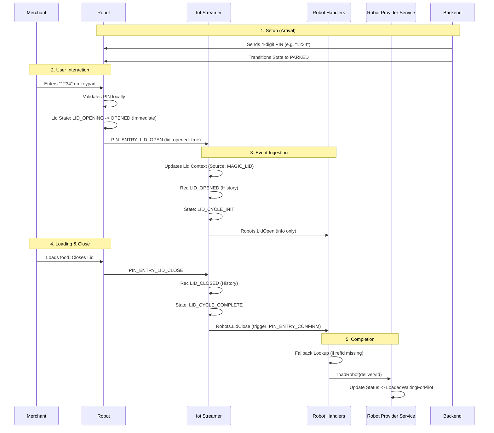
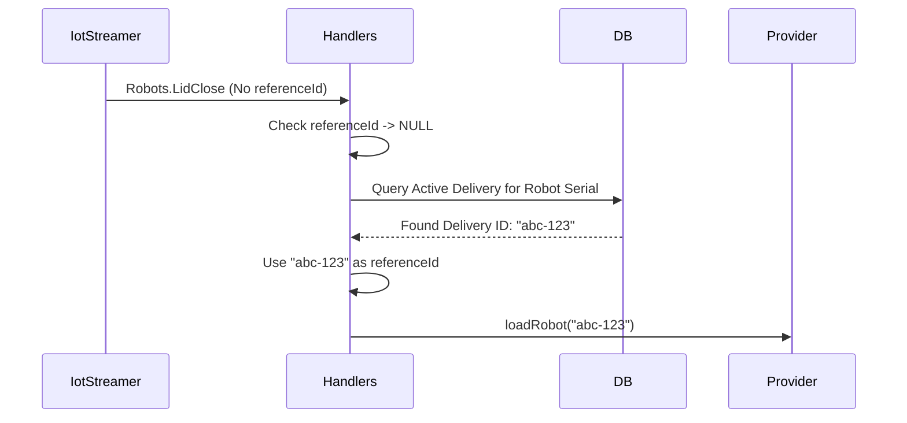
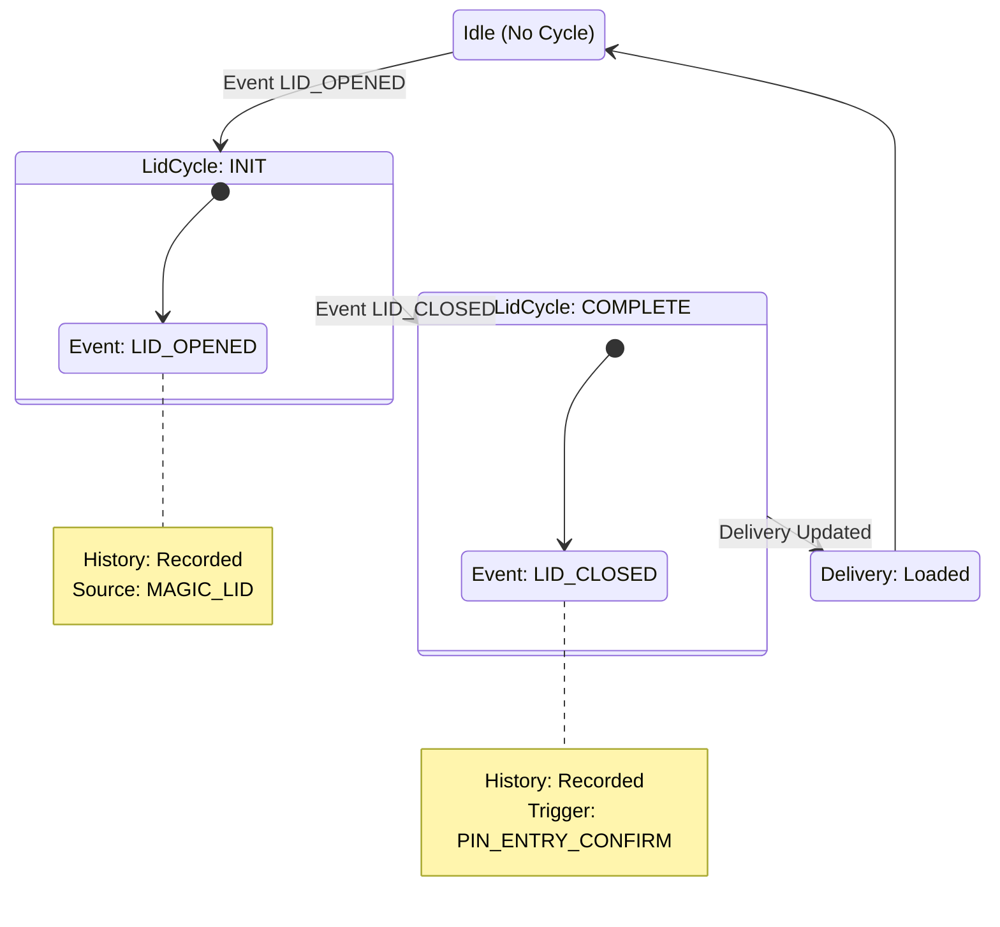

---
tags:
  - delivery
  - operations
  - magic-lid
  - uber
  - robot
---
# Magic Lid Loading Flow

"Magic Lid" refers to a loading flow where the robot's firmware opens the lid immediately upon user interaction (locally validated), bypassing the round-trip to the backend for an *open* command. The backend acts as a reactive observer to these events.

There are two main variants of this flow:
1.  **Standard Magic Lid (Uber):** Uses a 4-digit PIN.
2.  **Pinless / Proximity:** Uses no PIN (any touch), validated by location. See [[Pinless Loading Flow]].

This document primarily details the **Standard (4-digit)** flow used for Uber Eats.

## Sequence of Events (4-Digit Flow)

### Success Flow

**Step-by-Step Explanation:**
1.  **Setup (Backend):** When an Uber order is active and the robot arrives (`AtPickup`), `DeliveryService` retrieves the static 4-digit PIN from the Integration config and sends it to the robot via `setPinForRobot`. Simultaneously, the robot is transitioned to the `PARKED` state.
    -   `DeliveryService`: [delivery-platform/service/deliveries/src/modules/delivery/service/delivery.service.ts](https://github.com/cocorobotics/delivery-platform/blob/main/service/deliveries/src/modules/delivery/service/delivery.service.ts)
2.  **Lid Open (Firmware):** The merchant enters the 4-digit PIN. The robot's firmware (`MagicLidPinVerificationState`) validates the PIN locally against the shadow settings. If valid, it opens the lid immediately and sends a `PIN_ENTRY_LID_OPEN` event with `lid_opened: true`.
    -   `MagicLidPinVerificationState` (Firmware): [coco-acu/src/coco_business_logic/pin_unlock/src/states.cpp](https://github.com/cocorobotics/coco-acu/blob/master/src/coco_business_logic/pin_unlock/src/states.cpp)
3.  **Event Ingestion:** `IotStreamerService` receives the event. Recognizing `lid_opened: true`, it updates the Lid Cycle context to `Source: MAGIC_LID`. This is critical because the backend didn't initiate the open, so it must "catch up" to the fact that a magic load is in progress.
    -   `IotStreamerService`: [delivery-platform/service/state/src/iot-streamer/iot-streamer.service.ts](https://github.com/cocorobotics/delivery-platform/blob/main/service/state/src/iot-streamer/iot-streamer.service.ts)
4.  **Lid Close:** The merchant closes the lid. The robot sends `PIN_ENTRY_LID_CLOSE`. `IotStreamerService` publishes a `Robots.LidClose` event.
5.  **Loading Logic:** `RobotHandlers` consumes the close event. It attempts to load the robot. If the event lacks a `referenceId` (which is common in Magic Lid since the Open wasn't a backend command), it performs a fallback lookup to find the active delivery for that robot.
    -   `RobotHandlers`: [delivery-platform/service/deliveries/src/modules/providers/robot/robot.handler.ts](https://github.com/cocorobotics/delivery-platform/blob/main/service/deliveries/src/modules/providers/robot/robot.handler.ts)

### Error Flow: Missing Reference ID (Fixed)

**Step-by-Step Explanation:**
1.  **Event with No ID:** The `Robots.LidClose` event arrives at `RobotHandlers`. The `referenceId` field is undefined because the original "Open" was a local firmware action, not a tracked backend request.
2.  **Fallback Lookup:** `RobotHandlers` queries the database (`prisma.delivery`) for a delivery where:
    -   `attempt.driverName` matches the robot serial.
    -   `status` is active (not Completed/Canceled).
    -   `createdAt` is recent (within 24h).
3.  **Recovery:** If a unique active delivery is found, its ID is used as the `referenceId` to proceed with `loadRobot`.

## Fallback Mechanism (The "Missing Reference ID" Fix)

Since the "Open" command didn't originate from the backend, the `Robots.LidClose` event often lacks a `referenceId` (request ID). 

To handle this, `RobotHandlers` implements a fallback lookup:
1.  Checks if `payload.referenceId` is present.
2.  If missing, it queries the database for an **Active Delivery** associated with the robot's serial number (`payload.serial`).
    -   Conditions: `status` is not Completed/Canceled, `createdAt` within last 24h.
3.  If a unique active delivery is found, it uses that delivery's ID as the `referenceId`.

## Finite State Machine

## Potential Issues

-   **Missing Reference ID:** Historically a bug where the load would fail silently if the event lacked an ID. Fixed by the fallback lookup described above.
-   **Duplicate Loads:** If the backend *also* thinks it's a standard PIN flow (rare, but possible if configuration is mixed), both `DevicelessService` and `RobotHandlers` might try to load the bot. `DevicelessService` prevents this by ignoring `MAGIC_LID` sources.
-   **Race Conditions:** If the user closes the lid extremely quickly, the backend might process the Close event before the Open event has fully established the Lid Cycle context.

## Related Concepts
- [[Robot Loading Overview]]
- [[Pinless Loading Flow]]
- [[IotStreamerService]]
- [[Robot Service]]
- [[Lid State Resynchronization]]
