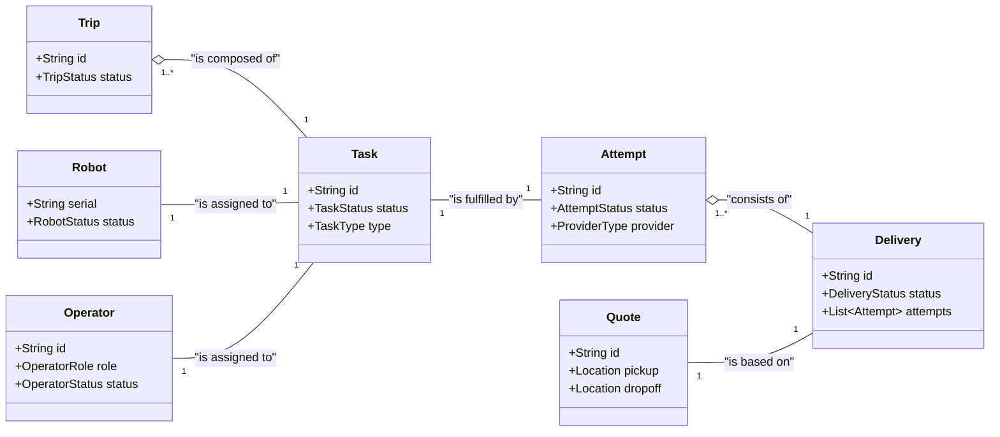

---
tags:
  - diagram
  - uml
  - architecture
---
# Object Model Diagram

This diagram shows the high-level relationships between the core data objects in the system.

This diagram shows the relationships between [[Delivery]], [[Attempt]], [[Task]], [[Trip]], [[Robot]], and [[Operator]].
