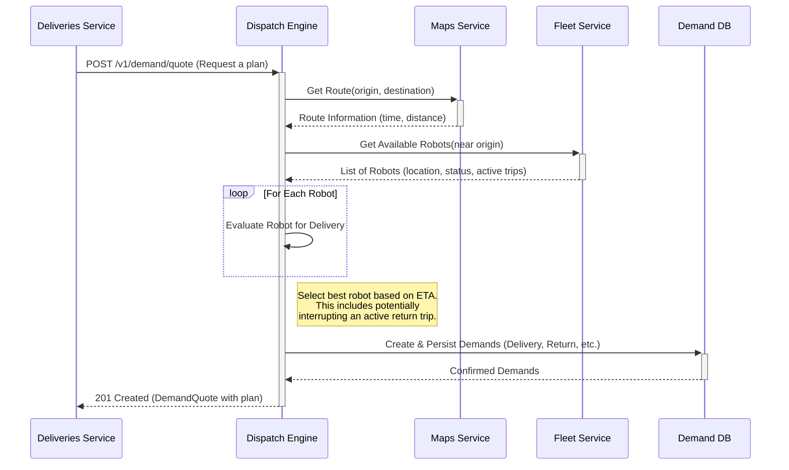

---
tags:
  - dispatch-engine
  - planning
  - sequence-diagram
  - architecture
---
# P2P Dispatch Sequence Flow

This diagram illustrates the "happy path" sequence for a [[Point-to-Point (P2P) Dispatch]] quote request, from the initial API call to the final creation of a delivery plan. This flow is the backbone of the P2P model, enabling a more dynamic and responsive dispatch system.

It shows the interactions between the [[Dispatch Engine]], the [[Deliveries Service]], and other key backend services like the [[Maps Service]] and [[Fleet Service]].

This sequence is the foundation for handling various [[P2P Dispatch Scenarios]], but it's important to consider the [[P2P Dispatch Risks]] associated with acting on potentially stale state data from the Fleet Service. Proper [[Dispatch Observability]] is crucial for monitoring the health of this flow.
