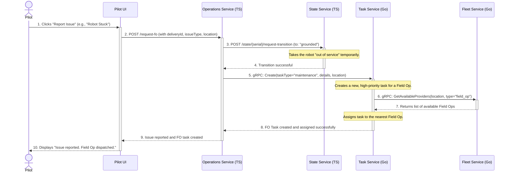
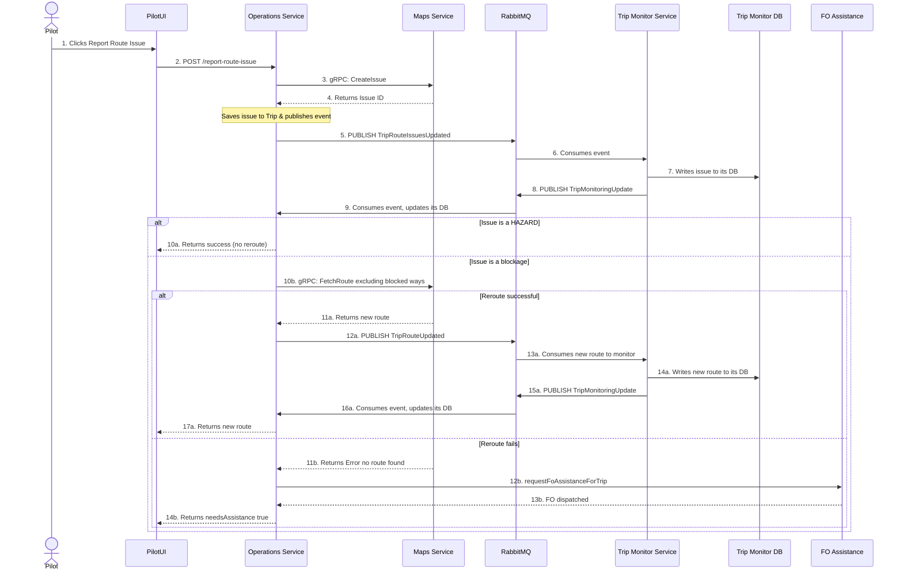

---
tags:
  - workflow
  - diagram
  - sequence
  - pilot
  - robot
  - issue-tracking
---
# Pilot Reports an Issue Flow

A pilot can report two main types of issues: a physically stuck robot or a problem with the route itself.

### Scenario 1: Robot is Physically Stuck

This flow is triggered when a pilot determines the robot cannot move and requires physical assistance.

#### Flow Description

1.  **Pilot Action:** During a [[Delivery]], the pilot realizes the [[Robot]] is physically stuck. They open a menu in the **[[Pilot UI]]** and select "Report Issue," choosing the "Robot Stuck" option.
2.  **Request [[FO (Field Operator)|Field Op]]:** The **[[Pilot UI]]** sends a `POST` request to the `/request-fo` endpoint on the **[[Operations Service]]**. The request includes the [[Delivery]] ID, the type of issue, and the [[Robot]]'s last known location.
3.  **Ground the [[Robot]]:** The **[[Operations Service]]** immediately calls the **[[State Service]]** to transition the [[Robot]]'s state to `grounded`. This is a critical step that prevents the [[Dispatch Engine]] from assigning any new [[Delivery|deliveries]] to the [[Robot]] while it is in a problematic state.
4.  **Create Maintenance [[Task]]:** The **[[Operations Service]]** then makes a gRPC call to the **[[Task Service]]** to create a new [[Task]]. This [[Task]] is of type `maintenance` and contains details about the issue and the [[Robot]]'s location.
5.  **Find and Assign [[FO (Field Operator)|Field Op]]:** The **[[Task Service]]** queries the **[[Fleet Service]]** to find the nearest available [[FO (Field Operator)|Field Operator]]. It then automatically assigns the newly created maintenance [[Task]] to that operator.
6.  **Confirmation to Pilot:** Once the [[FO (Field Operator)|Field Op]] [[Task]] is created and assigned, the success response is propagated back to the **[[Pilot UI]]**, which informs the pilot that help is on the way.

---

### Scenario 2: Route Issue (e.g., Blocked Path)

This flow is initiated from the `reportRouteIssue` method in the `PilotTripsService` within the **[[Operations Service]]**.

#### Flow Description

1.  **Pilot Action:** A pilot encounters a problem on their route (e.g., a blocked sidewalk) and reports it from the **[[Pilot UI]]**.
2.  **Request to Operations Service:** The UI sends a request to the `reportRouteIssue` endpoint in the **[[Operations Service]]**.
3.  **Create Issue in Maps Service:** The **[[Operations Service]]** calls the `createIssue()` method, which makes a gRPC call to the **[[Maps Service]]** to create a formal record of the issue.
4.  **Special Handling for Hazards:** If the reported issue is of type `HAZARD` (a passable obstacle), the flow stops here. The issue is logged in the **[[Maps Service]]**, but no further action is taken, and no events are published to the **[[Trip Monitor Service]]**.
5.  **Update Trip State & Publish:** For blocking issues, the problem is saved to the trip's state in the **[[Operations Service]]**. It then publishes a `TripRouteIssuesUpdated` event to RabbitMQ.
6.  **Trip Monitor Consumes and Stores:** The **[[Trip Monitor Service]]** is a stateful service responsible for tracking live trip progress. It consumes the `TripRouteIssuesUpdated` event and writes the new issue information to its own **Trip Monitor Database**. It needs to persist this data so it can perform accurate ETA and route deviation calculations when it receives subsequent `Heartbeat` events from the robot. After updating its database, it publishes a `TripMonitoringUpdate` event to notify other services of the change.
7.  **Operations Service Consumes ETA Update:** The **[[Operations Service]]** itself consumes the `TripMonitoringUpdate` event in its `handleDynamicEtaUpdate` method and updates its own database with the latest ETA. This makes the most current time estimate available to UIs like Mission Control.
8.  **Attempt to Reroute:** The **[[Operations Service]]** immediately calls the **[[Maps Service]]** again (via `mapsClient.fetchRoute()`), requesting a new route that excludes the reported blockage.
9.  **Handle Reroute Response:**
    *   **Success:** If a new route is found, the **[[Operations Service]]** saves it (via `addNewRouteForTrip()`) and publishes a `TripRouteUpdated` event. The **[[Trip Monitor Service]]** consumes this second event, writes the new route to its database, and publishes another `TripMonitoringUpdate`, which is in turn consumed by the **[[Operations Service]]**. The new route is sent back to the **[[Pilot UI]]**.
    *   **Failure:** If the **[[Maps Service]]** cannot find an alternative route, it returns an error. The **[[Operations Service]]** then automatically triggers a request for a **[[FO (Field Operator)|Field Operator]]** by calling the `requestFoAssistanceForTrip()` method. It notifies the UI that assistance is required. 