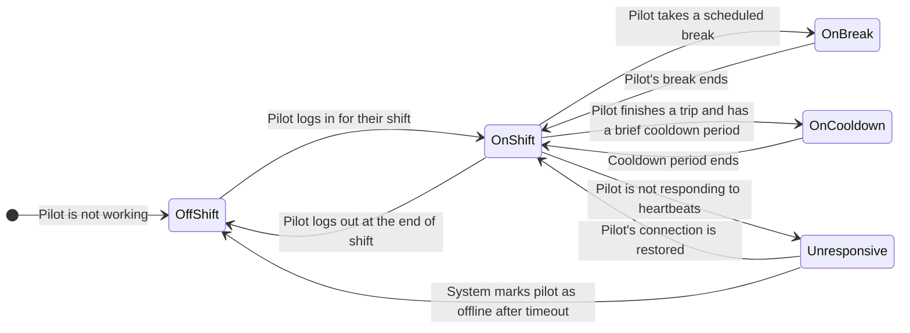

---
tags:
  - state-machine
  - diagram
  - pilot
---
# Pilot State State Machine

This diagram shows the status of a remote pilot as they move through their workday, from the perspective of the [[Dispatch Engine]].

### Description of States

*   **`OffShift`**: The pilot is not working and cannot be assigned any [[Task|tasks]].
*   **`OnShift`**: The pilot is logged in, on shift, and is considered available to be assigned a [[Delivery]] [[Trip]].
*   **`OnBreak`**: The pilot is on a scheduled break and is temporarily unavailable for new assignments.
*   **`OnCooldown`**: After completing a [[Task]], the pilot enters a brief cooldown period before they can be assigned a new one.
*   **`Unresponsive`**: The system has not received a heartbeat from the pilot's UI for a period of time, and they are considered temporarily unavailable.
