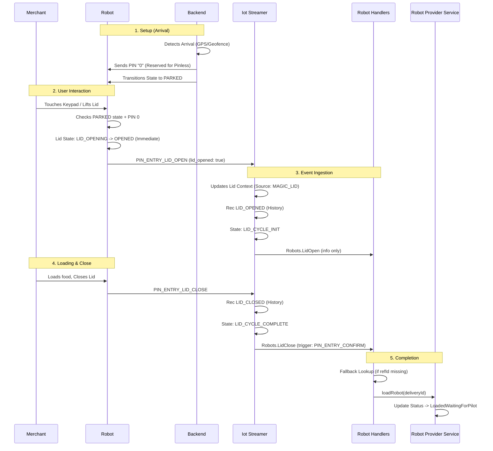
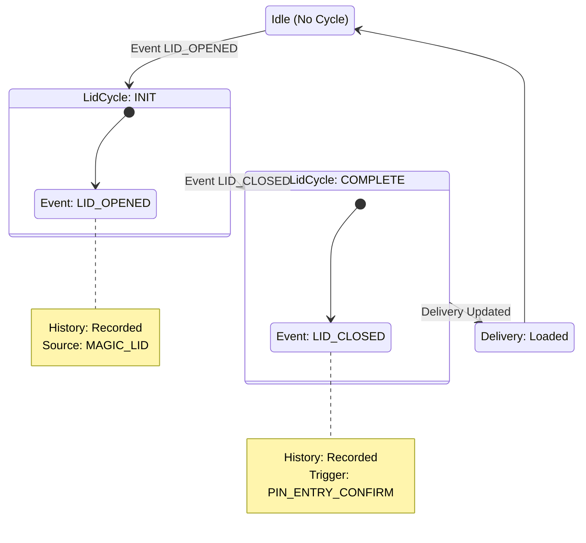

---
tags:
  - delivery
  - operations
  - magic-lid
  - pinless
  - robot
---
# Pinless Loading Flow

The "Pinless" (or "Proximity") loading flow is a variant of the [[Magic Lid Loading Flow]] where no specific PIN is required to open the robot lid. Instead, the robot allows the lid to be opened by **any interaction** (e.g., touching the keypad), provided the robot is geographically at the correct pickup location.

This flow is sometimes considered the "modern" successor to the 4-digit Magic Lid flow.

## Sequence of Events

### Success Flow



**Step-by-Step Explanation:**
1.  **Setup (Backend):** The Dispatch Engine detects the robot has arrived at the pickup location.
    -   `RobotHandlers` reacts to the `AtOrigin` dispatch event by setting the delivery status to `AtPickup`.
    -   `DeliveryService` sees the `AtPickup` transition and the `unlockPin: 0`. It calls `setPinForRobot(0)`.
    -   Simultaneously, `RobotFleetManagementService` transitions the robot's state to `PARKED`.
    -   `DeliveryService`: [delivery-platform/service/deliveries/src/modules/delivery/service/delivery.service.ts](https://github.com/cocorobotics/delivery-platform/blob/main/service/deliveries/src/modules/delivery/service/delivery.service.ts)
2.  **User Interaction (Firmware):** The robot receives the PIN configuration (0 -> Empty PIN in shadow settings). It also enters the `PARKED` state. The firmware class `MagicLidPinVerificationState` sees both conditions are met (`is_magic_lid_active` + `ParkedState`) and **unlocks the lid latch**.
    -   `MagicLidPinVerificationState` (Firmware): [coco-acu/src/coco_business_logic/pin_unlock/src/states.cpp](https://github.com/cocorobotics/coco-acu/blob/master/src/coco_business_logic/pin_unlock/src/states.cpp)
    -   `PinUnlockContext` (Firmware): [coco-acu/src/coco_business_logic/pin_unlock/src/context.h](https://github.com/cocorobotics/coco-acu/blob/master/src/coco_business_logic/pin_unlock/src/context.h)
3.  **Lid Open:** The merchant touches the keypad or lifts the lid. Since the latch is unlocked, the lid opens. The firmware sends `PIN_ENTRY_LID_OPEN`.
4.  **Completion:** The rest of the flow follows the standard [[Magic Lid Loading Flow]], with `IotStreamer` setting the context and `RobotHandlers` performing the fallback lookup to load the robot.

## Mechanism

### 1. The "Zero" PIN
The backend enables this mode by setting the delivery's `unlockPin` to a specific reserved value: `0`.

-   **Constant:** `RESERVED_UNLOCK_PIN = 0` (defined in `@coco/types/deliveries`).
-   **Validation:** Unlike 2-digit PINs (10-99), this 0 value is a special signal.

### 2. Backend Setup
When the delivery is created (or updated), if `unlockPin` is `0`, the `DeliveryService` sends this PIN to the robot when it arrives at pickup:

```typescript
// delivery-platform/service/deliveries/src/modules/delivery/service/delivery.service.ts

if (update.status === AttemptStatus.AtPickup && delivery.unlockPin != null ...) {
  // Sends PIN '0' to the robot
  await this.robot.setPinForRobot(0, ...); 
}
```

### 3. Firmware Behavior
When the robot receives PIN `0` **AND** enters the `PARKED` state (set by the backend upon arrival):
1.  **The robot** enters "Pinless Unlock" mode.
2.  It confirms the **Geofence/Arrival Check** by verifying it is in the `PARKED` state (which is only set by the server when the robot is at the pickup location).
3.  It **unlocks the lid latch** immediately.
4.  **Any** keypad touch or interaction triggers the **Lid Open** event (since the latch is already unlocked).

### 4. Event Flow
The rest of the flow is identical to the [[Magic Lid Loading Flow]]:
1.  **Open:** Firmware opens lid -> Sends `PIN_ENTRY_LID_OPEN` (source: MAGIC_LID).
2.  **Close:** User closes lid -> Sends `PIN_ENTRY_LID_CLOSE`.
3.  **Load:** [[Robot Handlers]] receives the close event and performs the load (often requiring the [[Magic Lid Loading Flow#Fallback Mechanism (The "Missing Reference ID" Fix)|Fallback Lookup]]).

## Finite State Machine



## Determination logic

The system determines which flow to use based on the `unlockPin` and `loadType` of the delivery:

| Flow | `loadType` | `unlockPin` | Backend Action |
| :--- | :--- | :--- | :--- |
| **Deviceless** | `TWO_DIGIT_DEVICELESS_PIN` | 10-99 (Generated) | Validates PIN, sends Open Cmd |
| **Uber (Magic)** | `null` | 4-digit (from Uber) | Sends PIN to Robot |
| **Pinless** | `null` | `0` (`RESERVED`) | Sends `0` to Robot (Enable Proximity) |

## Configuration & Feature Flags

-   **Feature Flag:** `disable-pinless-unlock`
    -   If set to `true`, the backend will **refuse** to set `unlockPin` to `0`, effectively disabling this flow.
    -   *Logic:* `if (unlockPin === RESERVED_UNLOCK_PIN && flag) unlockPin = undefined;`

## Related Documentation
- [[Magic Lid Loading Flow]]
- [[Robot Loading Overview]]
- [[Robot Service]]
