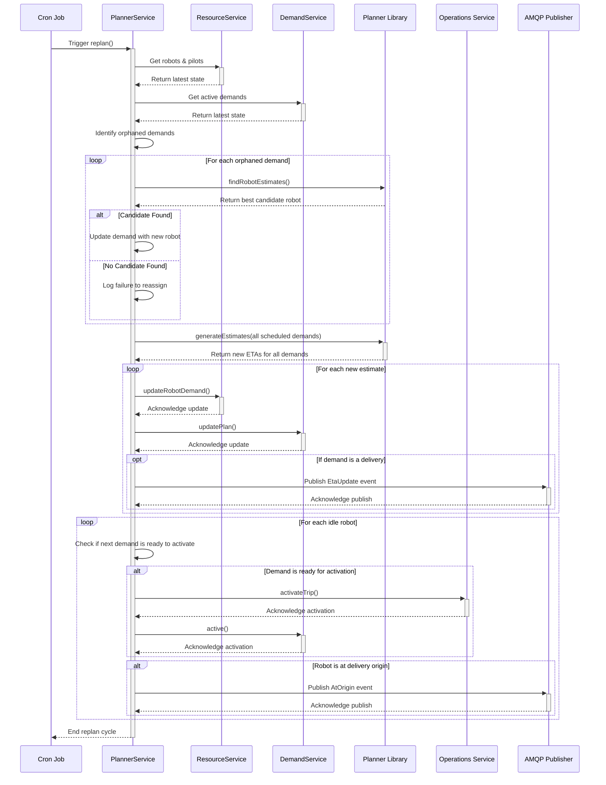

---
tags:
  - dispatch-engine
  - planning
  - workflow
  - sequence-diagram
---
# PlannerService - Replan Workflow

This document provides a detailed sequence diagram of the `replan` method in the [[PlannerService]].

