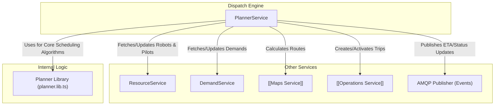

---
tags:
  - dispatch-engine
  - planning
  - architecture
  - service-interactions
---
# PlannerService - Service Interactions

The [[PlannerService]] acts as an orchestrator and interacts with several other services to fulfill its responsibilities.

## Interaction Details

-   **[[ResourceService]]**: Manages the state of [[Supply]] (robots and pilots). The `PlannerService` queries it for available resources and assigns tasks back to it.
-   **[[DemandService]]**: Manages the lifecycle of [[Demand]]s. The `PlannerService` fetches active demands and creates new ones.
-   **[[Maps Service]]**: Provides routing information, like travel time and distance.
-   **[[Operations Service]]**: Manages pilot-executed [[Trip]]s. The `PlannerService` creates and activates trips through this service.
-   **[[AmqpPublisher]]**: Used to publish asynchronous events to the rest of the system, such as ETA updates.
-   **[[Planner Library]]**: A core internal library that contains the complex scheduling and optimization algorithms, separating the pure logic from the service's I/O and orchestration duties.
