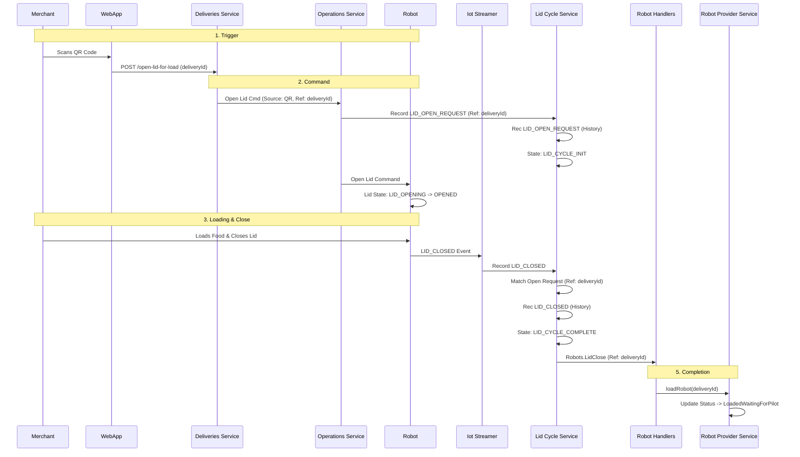
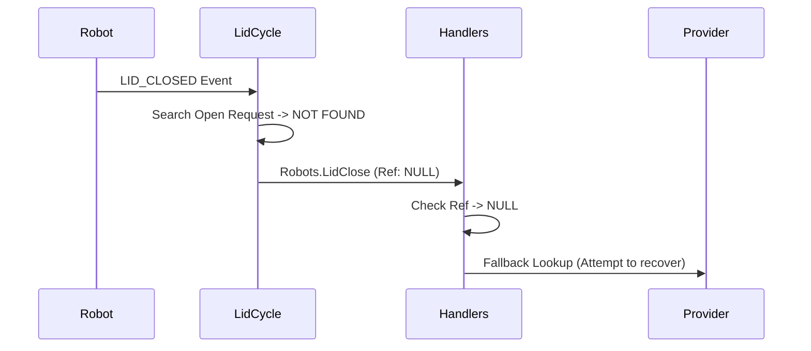
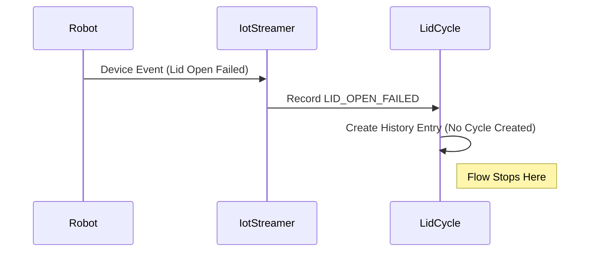
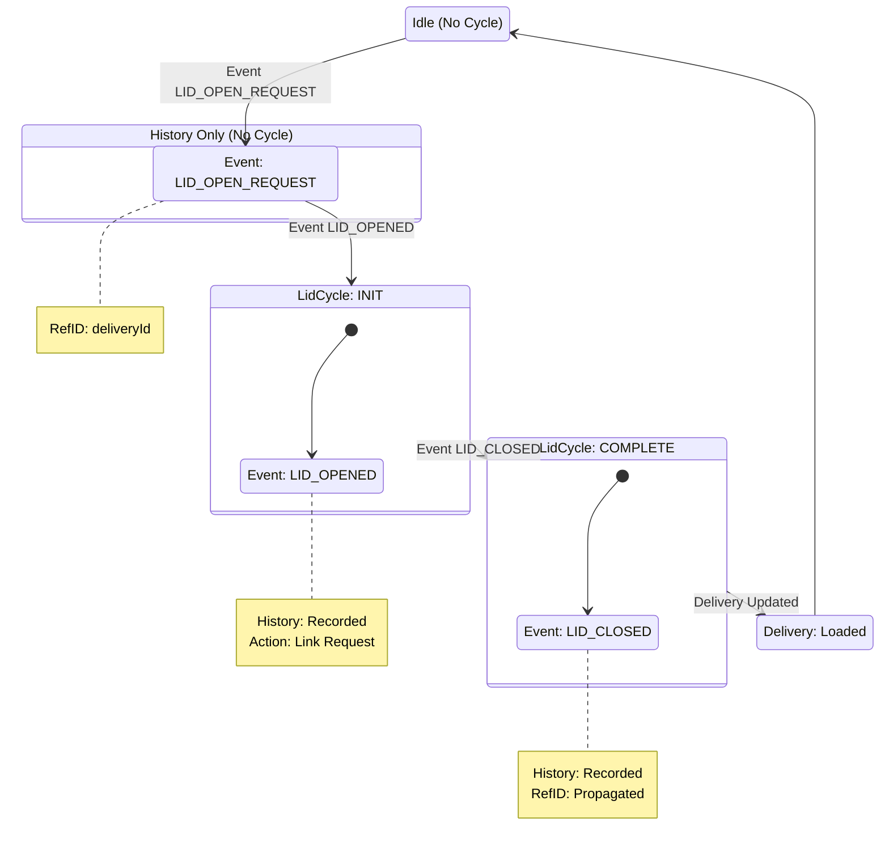

---
tags:
  - delivery
  - operations
  - qr
  - merchant
  - robot
---
# QR Loading Flow

The QR Loading Flow allows a merchant or user to scan a QR code on the robot using a web application (e.g., the Merchant App), which triggers the backend to open the robot's lid remotely.

## Sequence of Events

### Success Flow

**Step-by-Step Explanation:**
1.  **Trigger:** The merchant scans the QR code. The web app calls the `openLidForLoad` endpoint in `DeliveryController`.
    -   `DeliveryController`: [delivery-platform/service/deliveries/src/modules/delivery/controllers/delivery.controller.ts](https://github.com/cocorobotics/delivery-platform/blob/main/service/deliveries/src/modules/delivery/controllers/delivery.controller.ts)
2.  **Command:** `DeliveryService` calls `RobotsService.openRobotLid` (Operations Service) via HTTP/RPC. It passes `Source: QR` and the `deliveryId`.
    -   `RobotsService`: [delivery-platform/service/operations/src/modules/robots/services/robots.service.ts](https://github.com/cocorobotics/delivery-platform/blob/main/service/operations/src/modules/robots/services/robots.service.ts)
3.  **Lid Open:** `RobotsService` calls `StateService.lidCommandSync`. `LidCycleService` records a `LID_OPEN_REQUEST` in the database, storing the `deliveryId` as the `referenceId`. The command is sent to the robot, which opens the lid.
    -   `LidCycleService`: [delivery-platform/service/state/src/lid-cycle/lid-cycle.service.ts](https://github.com/cocorobotics/delivery-platform/blob/main/service/state/src/lid-cycle/lid-cycle.service.ts)
4.  **Context Propagation:** When the merchant closes the lid, the robot sends a `LID_CLOSED` event. `LidCycleService` sees this event and looks up the *active lid cycle*. It finds the previous `LID_OPEN_REQUEST` and copies its `referenceId` (the delivery ID) to the `LID_CLOSED` event context.
5.  **Completion:** `IotStreamerService` publishes `Robots.LidClose` *with* the populated `referenceId`. `RobotHandlers` receives this and calls `loadRobot` directly (no fallback lookup needed since the ID is present).

### Error Flow: Context Loss

**Step-by-Step Explanation:**
1.  **Context Loss:** If the `LID_OPEN_REQUEST` was not recorded (e.g., database error) or timed out, `LidCycleService` cannot find the `referenceId` when the `LID_CLOSED` event arrives.
2.  **Anonymous Event:** The `Robots.LidClose` event is published with `referenceId: null`.
3.  **Recovery:** `RobotHandlers` treats this like a Magic Lid event and attempts the **Fallback Lookup** (checking for an active delivery for that robot serial) to try and save the load.

### Error Flow: Lid Open Failed

**Step-by-Step Explanation:**
1.  **Failure:** The robot attempts to open the lid but fails (e.g., latch jam). It sends a failure event.
2.  **Recording:** `LidCycleService` records `LID_OPEN_FAILED` in the `lid_cycle_event_history` table.
3.  **No Cycle:** Because the lid did not successfully open (`LID_OPENED`), **no `LidCycle` is created**. The state remains null/idle.
4.  **No Notification:** No events are published to RabbitMQ. The `QR Loading Flow` effectively dead-ends. The user must try again.

## Finite State Machine

## Critical Mechanisms

### Context Propagation
The success of this flow depends entirely on **Context Propagation**. The `referenceId` (Delivery ID) is injected at the *Open* stage. It must be persisted in the `LidCycle` database records so that when the *Close* event arrives (which contains no inherent delivery ID from the robot), the system can look up the active cycle and retrieve the ID.

### Manual Close Handling
Unlike PIN flows where the user might press a "Confirm" button (generating a specific trigger), QR loads often end with a manual lid close. `RobotHandlers` is configured to accept `LidCloseTriggerType.OTHER` (or similar non-specific triggers) to accommodate this.

## Potential Issues

-   **Context Loss:** If `LidCycleService` fails to link the Close event to the Open request (e.g., due to database lag or event timing), the `referenceId` will be lost. The `Robots.LidClose` event is published "anonymous," and the load will fail (unless the fallback lookup from the Magic Lid flow catches it).
-   **API Failures:** If the initial API call to open the lid fails (e.g., network issues), the flow never starts.

## Related Concepts
- [[Robot Loading Overview]]
- [[Lid Cycle Service]]
- [[Delivery Service]]
- [[Lid State Resynchronization]]
