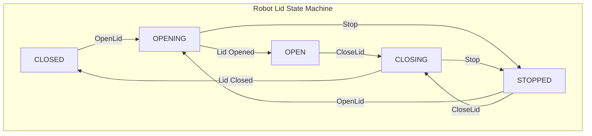

---
tags:
  - state-machine
  - diagram
  - robot
  - hardware
---
# Robot Lid State State Machine

This diagram illustrates the state transitions for the [[Robot]]'s lid, which is critical for loading and unloading [[Delivery|deliveries]].

The states and transitions are primarily managed through the [[state Service]].

*   **State Definition**: The possible states for the lid (`OPEN`, `CLOSED`, `OPENING`, `CLOSING`, `STOPPED`) are defined as an enum in `delivery-platform/lib/types/state/context.ts`.
*   **State Transitions**: Actions like opening the lid are triggered by functions such as `openRobotLid` in `delivery-platform/service/operations/src/modules/robots/services/robots.service.ts`, which sends a command to the [[state Service]] to initiate the state change.

### Description of States
*   **`CLOSED`**: The lid is fully closed and secured.
*   **`OPENING`**: The lid is in the process of opening.
*   **`OPEN`**: The lid is fully open.
*   **`CLOSING`**: The lid is in the process of closing.
*   **`STOPPED`**: The lid's movement has been interrupted, and it is neither fully open nor fully closed.
