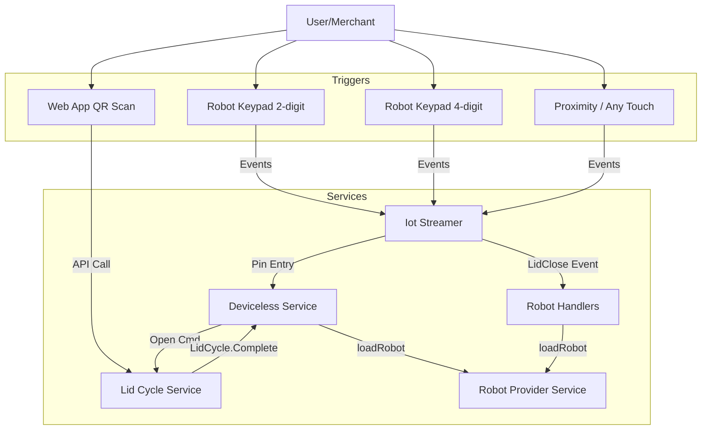

---
tags:
  - delivery
  - operations
  - architecture
  - robot
---
# Robot Loading Overview

The robot loading process is the critical phase where a robot transitions from `AtPickup` to `LoadedWaitingForPilot` (or similar active states). While there are multiple ways to trigger this transition (PIN, QR, etc.), they all converge on a common backend service method to finalize the state change.

## Convergence Point

All loading flows ultimately call `RobotProviderService.loadRobot` (in [[Robot Service]]). This method:
1.  Validates the load (business logic checks).
2.  Notifies the Dispatch Engine (Operations).
3.  Publishes `AttemptTransitioned` events.
4.  Updates the delivery status.

## Loading Mechanisms

There are three primary flows for loading a robot. It is important to distinguish between the **User Experience** (what the user does) and the **Backend Flow** (how the system processes it).

| Flow | User Action | Event Path | Primary Handler | Key Characteristic |
| :--- | :--- | :--- | :--- | :--- |
| [[Deviceless PIN Flow]] | User enters **2-digit** PIN | `LidCycle.Complete` | `DevicelessHandler` | Backend validates PIN -> Sends Open Command |
| [[Magic Lid Loading Flow]] | User enters **4-digit** PIN (Uber) | `Robots.LidClose` | `RobotHandlers` | **Firmware** validates/opens -> Backend reacts to events |
| [[Pinless Loading Flow]] | User touches keypad (no PIN) | `Robots.LidClose` | `RobotHandlers` | **Firmware** validates **Proximity** -> Opens on touch |
| [[QR Loading Flow]] | User scans QR code | `Robots.LidClose` | `RobotHandlers` | Web App triggers Open -> Context propagated to Close event |

### Note on "Magic Lid" vs "PIN"
*   **Deviceless PIN (2-digit):** The backend actively validates the PIN and sends a command to open the lid.
*   **Magic Lid (4-digit / Pinless):** The "Magic Lid" flow is named as such because the lid opens "magically" from the backend's perspective (without a backend open command). This flow is the technical implementation for:
    *   **Uber Eats:** Uses a static 4-digit PIN validated by firmware.
    *   **Pinless/Proximity:** Uses PIN `0` to enable proximity-based open on any touch.

## Common Challenges

-   **Race Conditions:** All flows rely on asynchronous events (Lid Open/Close) and message queues (RabbitMQ/SQS). Race conditions can occur if events arrive out of order or if the "Close" event is processed before the "Open" context is fully persisted.
-   **Context Propagation:** For flows where the backend initiates the open (QR, PIN), the `referenceId` (Delivery ID) must be preserved through the `LidCycle` so that the resulting "Close" event can be linked back to the correct delivery.
-   **Fallback Lookups:** For flows where the backend *doesn't* initiate the open (Magic Lid / Pinless), the system often lacks a `referenceId` in the event payload and must perform a fallback lookup (e.g., finding the active delivery for that robot) to identify the correct delivery.

## Architecture

## Related Documentation
- [[Load Methods and Types]]
- [[Lid Event Data Model]]
- [[State Service]]
- [[Deliveries Service]]
