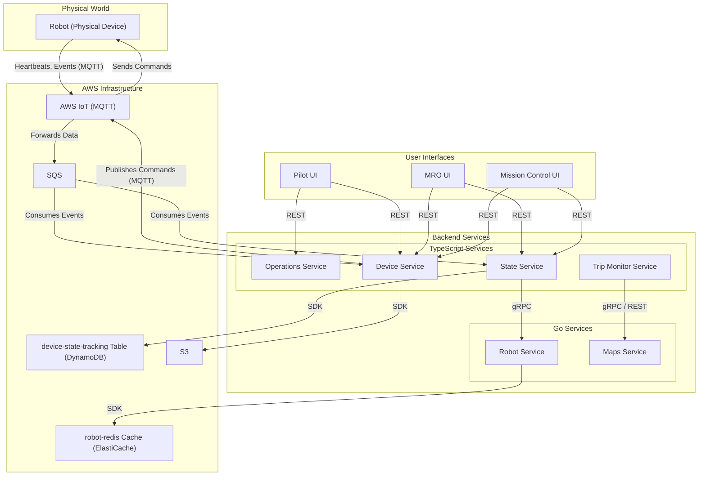

---
tags:
  - workflow
  - diagram
  - architecture
  - robot
  - monitoring
  - operations
---
# Robot Operations & Live Monitoring

This diagram illustrates the real-time command, control, and monitoring of a robot during an active trip. It focuses on the tools used by internal operators (Pilots, MRO, Mission Control).

This flow involves the [[Operations Service]], [[Device Service]], [[State Service]], [[Trip Monitor Service]], [[Robot Service]], and [[Maps Service]].
