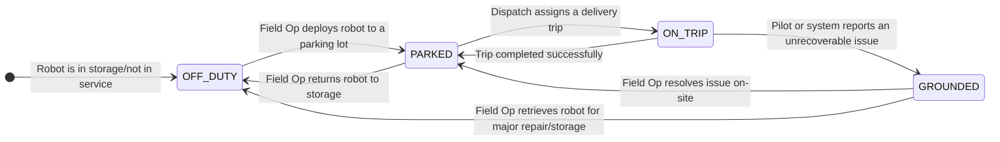

---
tags:
  - state-machine
  - diagram
  - robot
---
# Robot State State Machine

This diagram models the operational status of a physical [[Robot]] in the fleet.

### Description of States

*   **`OFF_DUTY`**: The [[Robot]] is not in service. It is likely in a hub or storage container, not available for any [[Task|tasks]].
*   **`PARKED`**: The [[Robot]] is deployed in the field at a designated parking spot, fully operational, and is idle, waiting to be assigned a [[Trip]].
*   **`ON_TRIP`**: The [[Robot]] has been assigned a [[Trip]] (like a [[Delivery]]) and is actively working on it.
*   **`GROUNDED`**: The [[Robot]] has encountered an issue that requires physical intervention from a [[FO (Field Operator)|Field Operator]] (e.g., it's stuck or has a hardware failure). It cannot proceed with its [[Task]] until it is resolved.
