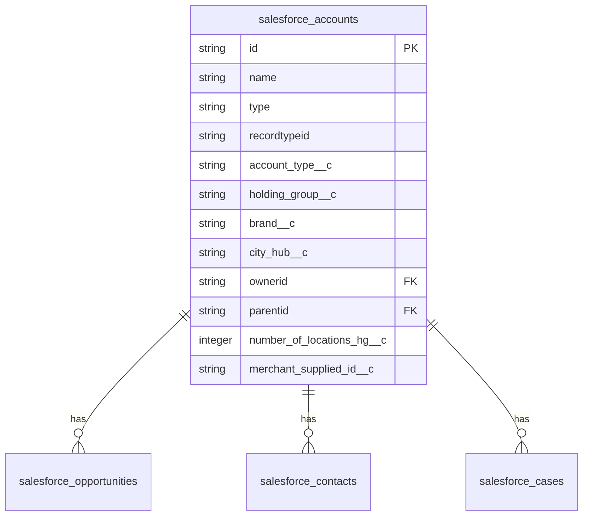

---
tags:
  - integration
  - salesforce
  - crm
  - fivetran
  - database
---
# Salesforce Data Sync

Customer Relationship Management (CRM) data from Salesforce is synchronized to [[Redshift Data Warehouse]] via Fivetran. This enables correlation between sales/account data and operational delivery metrics.

## Synced Salesforce Objects

All tables are in the `deliveries_rds_public` schema with `salesforce_*` prefix.

### Account Management

#### `salesforce_accounts`
Customer accounts (merchants, holding groups, brands).



**Key fields:**
- `id` - Salesforce Account ID
- `name` - Account name
- `account_type__c` - Type (Brand, Holding Group, Location)
- `holding_group__c` - Parent holding group
- `brand__c` - Brand name
- `city_hub__c` - Operational hub
- `merchant_supplied_id__c` - Links to `partner_configs.partner_id`
- `number_of_locations_*` - Location counts by status
- `salesforce_account_id` in [[Config RDS Schema]] and [[Deliveries RDS Schema]]

**Platform metrics:**
- `loc_platforms_doordash__c`, `loc_platforms_ubereats__c`, etc.
- `launched_platforms_*` - Active platforms
- `*_est_daily_volume__c` - Volume estimates by platform

**Business details:**
- `bank_account_number__c`, `bank_routing_number__c` - Payment info
- `ein__c` - Tax ID
- `retailer_legal_company_name__c` - Legal entity
- `cohort__c` - Launch cohort

#### `salesforce_contacts`
Individual contacts at merchant accounts.

**Key fields:**
- `id` - Contact ID
- `accountid` - Associated account
- `name`, `email`, `mobilephone` - Contact info
- `title`, `department` - Role info
- `reportstoid` - Manager relationship

#### `salesforce_account_contact_relation`
Many-to-many contact-to-account relationships.

**Key fields:**
- `contactid` - Contact
- `accountid` - Account
- `roles` - Contact's role at this account
- `isactive` - Current relationship
- `startdate`, `enddate` - Relationship duration

### Sales Pipeline

#### `salesforce_opportunities`
Sales opportunities and deals.

**Key fields:**
- `id` - Opportunity ID
- `accountid` - Associated account
- `name` - Deal name
- `stagename` - Sales stage
- `closedate` - Expected close date
- `probability` - Win probability
- `ownerid` - Account executive
- `locs__c` - Number of locations in deal
- `launching_with_alcohol__c` - Special requirements

#### `salesforce_sbqq_quotes`
CPQ (Configure-Price-Quote) quotes.

**Key fields:**
- `id` - Quote ID
- `sbqq__opportunity2__c` - Associated opportunity
- `sbqq__account__c` - Account
- `sbqq__status__c` - Quote status
- `sbqq__primary__c` - Primary quote for opportunity
- `sbqq__subscriptionterm__c` - Contract term
- `discount_start_date__c`, `discount_end_date__c` - Promotional period

#### `salesforce_sbqq_quotelines`
Individual line items in quotes.

**Key fields:**
- `id` - Quote line ID
- `sbqq__quote__c` - Parent quote
- `sbqq__product__c` - Product being quoted
- `sbqq__quantity__c` - Quantity
- `sbqq__listprice__c`, `sbqq__netprice__c` - Pricing
- `sbqq__discount__c` - Discount percentage

### Order Management

#### `salesforce_orders`
Contracted orders.

**Key fields:**
- `id` - Order ID
- `accountid` - Customer account
- `opportunityid` - Source opportunity
- `sbqq__quote__c` - Source quote
- `status` - Order status
- `effectivedate` - Start date
- `totalamount` - Order value

#### `salesforce_order_lines`
Order line items.

**Key fields:**
- `id` - Order line ID
- `orderid` - Parent order
- `product2id` - Product
- `quantity`, `unitprice`, `totalprice` - Pricing
- `sbqq__subscription__c` - Subscription reference

### Contracts & Assets

#### `salesforce_contracts`
Service contracts.

**Key fields:**
- `id` - Contract ID
- `accountid` - Customer
- `sbqq__quote__c` - Source quote
- `sbqq__opportunity__c` - Source opportunity
- `startdate`, `enddate` - Contract term
- `status` - Contract status
- `sbqq__renewalquoted__c` - Renewal quote exists

#### `salesforce_sbqq_subscriptions`
Recurring subscriptions.

**Key fields:**
- `id` - Subscription ID
- `sbqq__account__c` - Customer
- `sbqq__contract__c` - Parent contract
- `sbqq__product__c` - Product
- `sbqq__quantity__c` - Quantity
- `sbqq__subscriptionstartdate__c`, `sbqq__subscriptionenddate__c` - Term

#### `salesforce_assets`
Customer-owned assets (robots, tablets, etc.).

**Key fields:**
- `id` - Asset ID
- `accountid` - Owning account
- `product2id` - Asset type
- `serialnumber` - Serial number
- `quantity` - Quantity
- `status` - Asset status

### Onboarding

#### `salesforce_cases`
Onboarding cases.

**Key fields:**
- `id` - Case ID
- `accountid` - Merchant being onboarded
- `type` - Case type (usually "Onboarding")
- `status` - Onboarding status
- `estimated_activation_date__c` - Target launch date
- `actual_activation_date__c` - Actual launch date
- `activation_form_complete__c` - Setup checklist
- `number_of_locations__c` - Locations being launched
- Platform flags: `doordash__c`, `ubereats__c`, `grub__c`, `native__c`

#### `salesforce_launch_groups`
Groups of locations launched together.

**Key fields:**
- `id` - Launch group ID
- `opportunity__c` - Associated opportunity
- `start_date__c` - Launch date
- `onboarding_owner__c` - Onboarding manager

#### `salesforce_onboarding_locations`
Individual locations being onboarded.

**Key fields:**
- `id` - Record ID
- `case__c` - Parent onboarding case
- `account__c` - Account
- `opportunity_location__c` - Opportunity location link
- Platform checkboxes: `doordash__c`, `ubereats__c`, etc.
- `needs_tablet__c` - Hardware requirement

### User Management

#### `salesforce_users`
Salesforce users (sales, CS, onboarding).

**Key fields:**
- `id` - User ID
- `name`, `email`, `username` - User identity
- `title`, `department` - Role
- `managerid` - Manager
- `isactive` - Active user

## Sync Configuration

### Fivetran Connector
- **Type:** Salesforce connector
- **Sync Frequency:** Every 6 hours
- **Sync Marker:** `_fivetran_synced` timestamp on all records
- **Deleted Records:** Soft deletes marked with `_fivetran_deleted` boolean

### Object Selection
Only objects relevant to merchant operations and delivery business are synced. Standard Salesforce objects (Task, Event, etc.) are not synced.

## Common Queries

### Link Merchant to Salesforce Account
```sql
SELECT 
  pc.partner_id,
  pc.store_name,
  sa.name AS salesforce_name,
  sa.account_type__c,
  sa.brand__c,
  sa.city_hub__c
FROM deliveries_rds_public.partner_configs pc
LEFT JOIN deliveries_rds_public.salesforce_accounts sa
  ON pc.salesforce_account_id = sa.id
WHERE pc.salesforce_account_id IS NOT NULL
  AND pc._fivetran_deleted = FALSE;
```

### Onboarding Pipeline
```sql
SELECT 
  sa.name AS merchant_name,
  sc.casenumber,
  sc.status,
  sc.estimated_activation_date__c,
  sc.actual_activation_date__c,
  sc.number_of_locations__c,
  sc.doordash__c,
  sc.ubereats__c
FROM deliveries_rds_public.salesforce_cases sc
JOIN deliveries_rds_public.salesforce_accounts sa
  ON sc.accountid = sa.id
WHERE sc.type = 'Onboarding'
  AND sc.status NOT IN ('Closed', 'Cancelled')
  AND sc._fivetran_deleted = FALSE;
```

### Active Subscriptions
```sql
SELECT 
  sa.name AS customer,
  sa.brand__c,
  ss.sbqq__quantity__c AS robot_count,
  ss.sbqq__subscriptionstartdate__c AS start_date,
  ss.sbqq__subscriptionenddate__c AS end_date
FROM deliveries_rds_public.salesforce_sbqq_subscriptions ss
JOIN deliveries_rds_public.salesforce_accounts sa
  ON ss.sbqq__account__c = sa.id
WHERE ss.sbqq__subscriptionenddate__c > CURRENT_DATE
  AND ss._fivetran_deleted = FALSE;
```

## Related Concepts

- [[Redshift Data Warehouse]] - Data destination
- [[Deliveries RDS Schema]] - Contains synced tables
- [[Merchant]] - Merchant concept
- [[Config Service]] - Uses `salesforce_account_id` for linking

