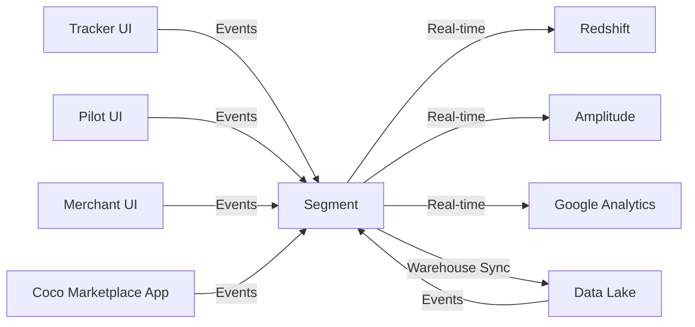

---
tags:
  - integration
  - analytics
  - segment
  - events
---
# Segment Analytics Integration

Segment is the event tracking and customer data platform used across the Coco delivery platform. It collects events from all client applications and routes them to analytics destinations including [[Redshift Data Warehouse]].

## Architecture



## Event Sources

### Customer-Facing Applications
- **[[Tracker UI]]** - Order tracking events → [[Delivery Platform Events Schema]]
- **Coco Marketplace App** - Mobile app events → [[Coco Marketplace Analytics Schema]]

### Operational Applications
- **[[Pilot UI]]** - Pilot operations → [[Delivery Platform Events Schema]]
- **[[Merchant UI]]** - Merchant portal interactions
- **[[MX Manager UI]]** - Merchant management

### Server-Side
- Backend services emit server-side events for critical operations
- See `server_*` events in [[Delivery Platform Events Schema]]

## Event Structure

### Standard Segment Event Format

```typescript
{
  // Identity
  userId: string | null,
  anonymousId: string,
  
  // Event
  event: string,
  properties: Record<string, any>,
  
  // Context (automatic)
  context: {
    ip: string,
    locale: string,
    timezone: string,
    userAgent: string,
    page: {
      url: string,
      path: string,
      title: string,
      referrer: string,
    },
    // Plus device, network, app info
  },
  
  // Timing
  timestamp: Date,
  originalTimestamp: Date,
  sentAt: Date,
}
```

### Track Calls
Used for events/actions:
```javascript
analytics.track('Button Clicked', {
  buttonName: 'Unlock Robot',
  deliveryId: 'del_123',
  merchantName: 'Pizza Place',
});
```

### Page/Screen Calls
Used for navigation:
```javascript
analytics.page('Order Tracker', {
  orderId: 'del_123',
  deliveryStatus: 'in_transit',
});
```

### Identify Calls
Used for user identification:
```javascript
analytics.identify('user_123', {
  email: 'customer@example.com',
  firstName: 'Jane',
});
```

## Destinations

### Redshift Warehouse
- **Schema:** [[Coco Marketplace Analytics Schema]] and [[Delivery Platform Events Schema]]
- **Sync:** Real-time streaming via Segment Connections
- **Usage:** Business intelligence, reporting, data science

### Amplitude
- Product analytics and user behavior analysis
- Funnel analysis, retention, cohorts

### Google Analytics
- Website traffic and conversion tracking
- Marketing attribution

## Implementation

### Client-Side Integration

```javascript
// Initialize Segment
import { Analytics } from '@segment/analytics-next';

const analytics = new Analytics({
  writeKey: 'YOUR_SEGMENT_KEY',
});

// Track user actions
const handleUnlock = async () => {
  analytics.track('Order Unlock Coco', {
    deliveryId: delivery.id,
    attemptId: attempt.id,
    attemptStatus: attempt.status,
  });
  
  // ... perform unlock
};
```

### Server-Side Integration

```typescript
import Analytics from 'analytics-node';

const analytics = new Analytics('YOUR_SEGMENT_KEY');

// Track server events
analytics.track({
  anonymousId: 'system',
  event: 'Server Load Order Success',
  properties: {
    deliveryId: delivery.id,
    attemptId: attempt.id,
  },
});
```

## Event Naming Conventions

Events follow a consistent naming pattern:

- **Object + Action:** `Order Tracker Open`, `Button Clicked`
- **Past tense for completed actions:** `Order Loaded`, `Robot Unlocked`
- **Present tense for in-progress:** `Loading Order`, `Unlocking Robot`
- **Domain prefixes:** `pilot_*`, `server_*`, `order_tracker_*`

## Privacy & Data Governance

### PII Handling
- Customer phone numbers are anonymizable (see `customer.anonymous` in [[Deliveries V3 RDS Schema]])
- Email addresses tracked only for authenticated users
- IP addresses collected for fraud detection

### Data Retention
- Raw events retained in Redshift for 2 years
- Aggregated metrics retained indefinitely
- Right to be forgotten supported via customer anonymization

## Related Concepts

- [[Coco Marketplace Analytics Schema]] - Mobile app events
- [[Delivery Platform Events Schema]] - Platform operational events
- [[Tracker UI]] - Major event source
- [[Pilot UI]] - Major event source
- [[Redshift Data Warehouse]] - Analytics destination

