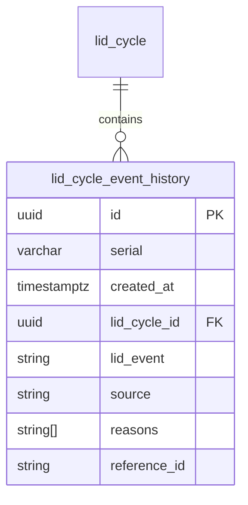
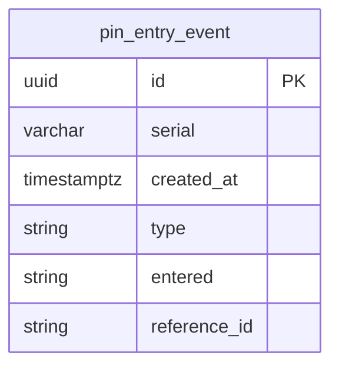

---
tags:
  - database
  - redshift
  - state
  - backend
  - events
---
# State RDS Schema

**Namespace:** `state_rds_public`  
**Schema File**: [`service/state/prisma/schema.prisma`](../../delivery-platform/service/state/prisma/schema.prisma)

This schema is synced from the [[State Service]] RDS database. It tracks real-time robot state events, particularly lid operations and PIN entries for delivery loading and unloading.

## Core Event Tables

### `lid_cycle_event_history`

Tracks all lid operation events for robots during deliveries.



**Key columns:**
- `id` - Unique event identifier
- `serial` - Robot serial number (critical for joining to deliveries via `attempts.driver_name`)
- `created_at` - Timestamp of the event
- `lid_cycle_id` - Reference to parent lid cycle (may be NULL for failed attempts)
- `lid_event` - Type of lid event (see LidEvent enum below)
- `source` - Who/what triggered the event (see LidEventSource below)
- `reasons` - Array of reasons (e.g., `["LOAD"]`, `["UNLOAD"]`)
- `reference_id` - Delivery ID (may be NULL if event occurred outside delivery context)

**LidEvent Types:**
- `LID_OPEN_REQUEST` - Request to open lid
- `LID_OPEN_FAILED` - Failed to open lid
- `LID_OPENED` - Lid successfully opened
- `LID_CLOSE_REQUEST` - Request to close lid
- `LID_CLOSE_FAILED` - Failed to close lid
- `LID_CLOSED` - Lid successfully closed
- `LID_INTERRUPT` - Lid operation interrupted
- `LID_TIMEOUT` - Lid operation timed out

**LidEventSource Values:**
- `MAGIC_LID` - Uber magic lid or 4-digit PIN
- `PIN` - 2-digit deviceless PIN
- `QR` - QR code app
- `FO` - Field Operator app
- `MRO` - Maintenance, Repair, Operations website
- `PILOT` - Pilot via controller
- `TRACKER` - Tracker app
- `UBER_EATS` - UberEats integration
- `DOORDASH` - DoorDash integration
- `MERCHANT_FLEET` - Merchant fleet
- `MISSION_CONTROL` - Mission Control system
- `INTERNAL` - Internal system (timeout/interrupt)
- `MANUAL` - Manual lid closure
- `UNKNOWN` - Unknown source
- `mqtt` - MQTT message (lowercase variant)
- `pin` - PIN entry (lowercase variant)

### `pin_entry_event`

Tracks PIN entry attempts for deviceless deliveries.



**Key columns:**
- `id` - Unique event identifier
- `serial` - Robot serial number
- `created_at` - When PIN was entered
- `type` - Event type (`PIN_ENTRY_LID_OPEN` or `PIN_ENTRY_LID_CLOSE`)
- `entered` - The PIN that was entered
- `reference_id` - Delivery ID (may be NULL if PIN didn't match)

**PinEntryEventType:**
- `PIN_ENTRY_LID_OPEN` - PIN entered to open lid (load)
- `PIN_ENTRY_LID_CLOSE` - PIN entered to close lid (after load)

### `lid_cycle`

Tracks lid cycle state for robots.

**Key columns:**
- `id` - Unique cycle identifier
- `serial` - Robot serial number
- `state` - Current cycle state (`LID_CYCLE_INIT`, `LID_CYCLE_COMPLETE`, `LID_CYCLE_INTERRUPT`, `LID_CYCLE_TIMEOUT`)
- `reference_id` - Associated delivery ID
- `created_at` - Cycle start time
- `updated_at` - Last update time

## Joining to Deliveries

The key to joining state events to deliveries is using **robot serial + timestamp overlap**:

```sql
-- Example: Get first load event for each delivery
WITH delivery_robots AS (
    SELECT 
        d.id AS delivery_id,
        a.driver_name AS robot_serial,
        d.created_at AS delivery_start,
        COALESCE(d.loaded_time, d.created_at + INTERVAL '30 minutes') AS delivery_end
    FROM deliveriesv3prod_rds_public.deliveries d
    LEFT JOIN deliveriesv3prod_rds_public.attempts a ON d.latest_attempt_id = a.id
)
SELECT 
    dr.delivery_id,
    le.source,
    le.lid_event,
    le.created_at
FROM delivery_robots dr
LEFT JOIN state_rds_public.lid_cycle_event_history le
    ON le.serial = dr.robot_serial
    AND le.created_at BETWEEN dr.delivery_start AND dr.delivery_end
WHERE le.lid_event = 'LID_CLOSED'
    AND le.reasons LIKE '%LOAD%';
```

**Why not use `reference_id`?**
- `reference_id` may be NULL for failed load attempts
- Using serial + timestamp captures ALL attempts, including failures

## Use Cases

### Identifying Load Method
See [[Load Methods and Types]] for details on categorizing deliveries by how they were loaded.

### Tracking Failed Loads
See [[Deviceless PIN Flow]] for patterns to identify unsuccessful load attempts.

### Manual Intervention Detection
Check for events with manual sources:

```sql
SELECT 
    d.id,
    COUNT(*) AS manual_events
FROM deliveriesv3prod_rds_public.deliveries d
LEFT JOIN deliveriesv3prod_rds_public.attempts a ON d.latest_attempt_id = a.id
LEFT JOIN state_rds_public.lid_cycle_event_history le
    ON le.serial = a.driver_name
    AND le.created_at BETWEEN d.created_at AND COALESCE(d.loaded_time, d.created_at + INTERVAL '30 minutes')
WHERE le.source IN ('FO', 'MRO', 'PILOT', 'TRACKER', 'MANUAL')
GROUP BY d.id;
```

## Related Concepts

- [[State Service]] - Source service for this data
- [[Deliveries V3 RDS Schema]] - Delivery records that reference these events
- [[Robot Lid State State Machine]] - Lid state machine diagram
- [[Deviceless PIN Flow]] - How PIN-based deliveries work
- [[Load Methods and Types]] - Different ways to load deliveries
- [[Redshift Query Patterns]] - Common query patterns


