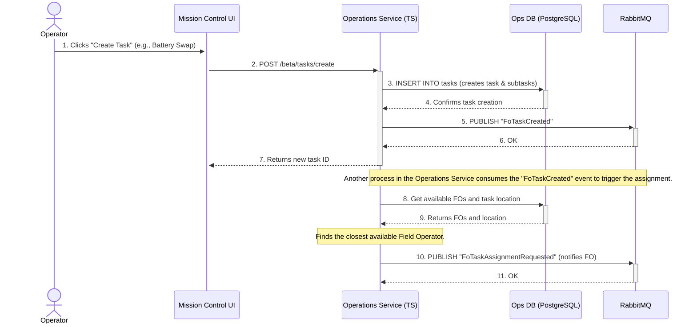

---
tags:
  - workflow
  - diagram
  - sequence
  - trip
  - pilot
  - task
---
# Trip Creation and Pilot Assignment Flow

This sequence describes the process of an operator in Mission Control creating a new task (like a battery swap or robot pickup) and how that task gets assigned to a Field Operator. This flow is managed entirely within the **[[Operations Service]]**.

### Flow Description

1.  **[[Task]] Creation:** A user in the **[[Mission Control UI]]** initiates a [[Task]], sending a `POST /beta/tasks/create` request to the **[[Operations Service]]**.
2.  **Persist [[Task]]:** The **[[Operations Service]]** builds the [[Task]] object, including all necessary subtasks, and saves it to its **PostgreSQL database**.
3.  **Publish `FoTaskCreated` Event:** After successfully saving the [[Task]], the service publishes a `FoTaskCreated` event to **RabbitMQ**. This is a key decoupling step.
4.  **Assignment Trigger:** A separate, event-driven process within the **[[Operations Service]]** listens for `FoTaskCreated` events. When it receives one, it kicks off the assignment logic.
5.  **Find Closest Operator:** The assignment logic queries the **PostgreSQL database** to get a list of available [[FO (Field Operator)|Field Operators]] and their last known locations, as well as the location of the [[Task]]. It then calculates the closest available operator.
6.  **Publish Assignment Event:** Once the best operator is chosen, the service publishes a `FoTaskAssignmentRequested` event to **RabbitMQ**. The assigned [[FO (Field Operator)|Field Operator]]'s mobile application is listening for this event, which triggers a notification on their device to accept or reject the [[Task]].

