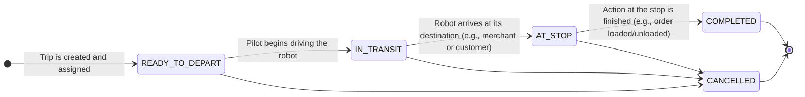

---
tags:
  - state-machine
  - diagram
  - trip
---
# Trip State State Machine

This diagram models the lifecycle of a [[Trip]], which represents a [[Robot]]'s journey from a starting point to a destination for a specific purpose (e.g., [[Delivery]], deployment).

### Description of States

*   **`READY_TO_DEPART`**: The [[Trip]] has been created, and all resources ([[Robot]] and pilot) are assigned. It is waiting for the pilot to initiate movement.
*   **`IN_TRANSIT`**: The pilot is actively driving the [[Robot]] towards the destination.
*   **`AT_STOP`**: The [[Robot]] has arrived at its destination (either the pickup or dropoff location) and is waiting for the next action (e.g., loading, customer pickup).
*   **`COMPLETED`**: The action at the stop has been successfully completed, and the [[Trip]] is finished. This is a final state.
*   **`CANCELLED`**: The [[Trip]] was cancelled before it could be completed. This is a final state.
