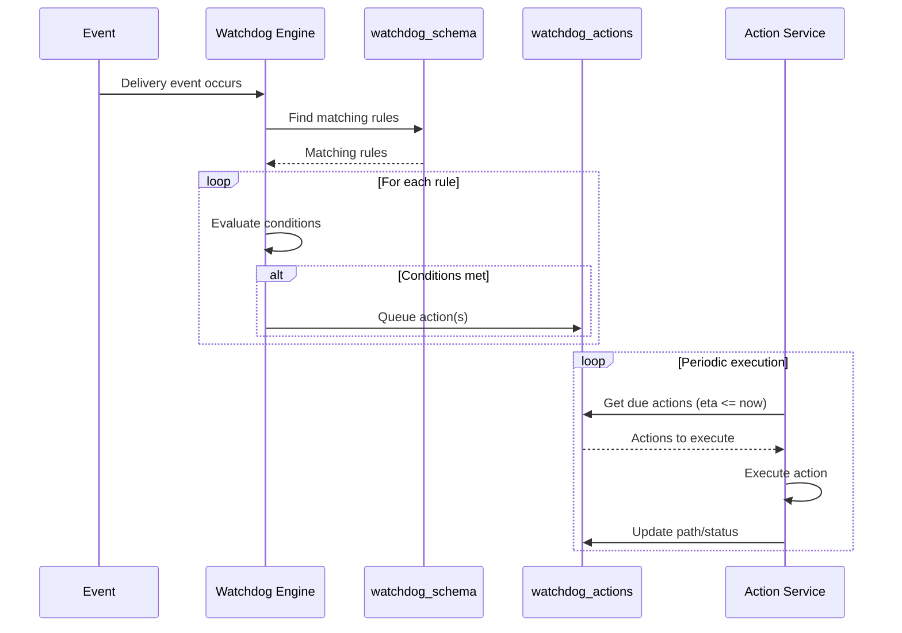

---
tags:
  - service
  - monitoring
  - automation
  - watchdog
---
# Watchdog System

The Watchdog System is an automated monitoring and action framework within the delivery platform. It watches for specific conditions and triggers automated responses to handle edge cases, SLA violations, and operational issues.

## Architecture

The Watchdog System consists of:
1. **Rule Engine** - Defines monitoring conditions
2. **Action Queue** - Scheduled actions to execute
3. **Execution Engine** - Runs actions at appropriate times

## Database Tables

See [[Deliveries V3 RDS Schema]] for table details.

### `watchdog_schema`
Defines monitoring rules and triggers.

**Structure:**
```typescript
{
  label: string;           // Human-readable rule name
  entry_point: string;     // Trigger event type
  schema: {                // Rule definition
    conditions: {...},     // When to trigger
    actions: [...],        // What to do
  };
  active: boolean;         // Enable/disable rule
  updated_by: string;      // Last modifier
}
```

### `watchdog_actions`
Queued and executed actions.

**Structure:**
```typescript
{
  id: string;
  delivery_id: string;     // Target delivery
  type: ActionType;        // Action to perform
  actiondata: {...};       // Action parameters
  eta: Date;              // When to execute
  path: string;           // Execution status/path
}
```

## Action Types

### Monitoring Actions
- **ALERT** - Send notification to ops team
- **LOG** - Record event for analysis

### Remediation Actions
- **CANCEL** - Cancel delivery
- **REASSIGN** - Move delivery to different robot
- **ESCALATE** - Create ops ticket
- **RETRY** - Retry failed operation

### Communication Actions
- **SMS_CUSTOMER** - Send SMS to customer
- **SMS_MERCHANT** - Send SMS to merchant
- **EMAIL_SUPPORT** - Email support team

## Example Rules

### SLA Monitoring

```typescript
// Watchdog rule: Late Pickup
{
  label: "Late Pickup Alert",
  entry_point: "DELIVERY_CREATED",
  schema: {
    conditions: {
      time_since_created: { gt: 30 * 60 * 1000 }, // 30 minutes
      status: { in: ["PENDING", "ASSIGNED"] },
    },
    actions: [
      {
        type: "ALERT",
        target: "ops_channel",
        message: "Delivery {{deliveryId}} not picked up in 30min",
      },
      {
        type: "REASSIGN",
        delay: 5 * 60 * 1000, // 5 more minutes
        provider: "DOORDASH_BACKUP",
      }
    ]
  },
  active: true,
}
```

### Robot Stuck Detection

```typescript
// Watchdog rule: Robot Not Moving
{
  label: "Robot Stuck Detection",
  entry_point: "TRIP_IN_PROGRESS",
  schema: {
    conditions: {
      robot_speed: { lt: 0.1 },      // Barely moving
      duration: { gt: 10 * 60 },     // For 10 minutes
      battery: { gt: 20 },           // Not low battery
    },
    actions: [
      {
        type: "ALERT",
        target: "pilot_on_duty",
        message: "Robot {{robotSerial}} may be stuck",
      },
      {
        type: "ESCALATE",
        if_not_resolved_in: 5 * 60,  // 5 minutes
      }
    ]
  },
  active: true,
}
```

### Customer Communication

```typescript
// Watchdog rule: Delivery Delayed
{
  label: "Notify Customer of Delay",
  entry_point: "ETA_UPDATED",
  schema: {
    conditions: {
      eta_change: { gt: 15 * 60 },   // Delayed 15+ minutes
      customer_notified: false,
    },
    actions: [
      {
        type: "SMS_CUSTOMER",
        template: "DELAY_NOTIFICATION",
        params: {
          new_eta: "{{eta}}",
          reason: "{{delay_reason}}",
        }
      }
    ]
  },
  active: true,
}
```

## Entry Points (Triggers)

Watchdog rules are triggered by system events:

### Delivery Lifecycle
- `DELIVERY_CREATED` - New delivery request
- `DELIVERY_ASSIGNED` - Assigned to robot/courier
- `PICKUP_STARTED` - En route to merchant
- `AT_MERCHANT` - Arrived at merchant
- `LOADED` - Order loaded into robot
- `IN_TRANSIT` - En route to customer
- `AT_DESTINATION` - Arrived at customer
- `DELIVERED` - Successfully delivered
- `CANCELLED` - Delivery cancelled

### Trip Events
- `TRIP_CREATED` - New trip assigned
- `TRIP_IN_PROGRESS` - Trip underway
- `TRIP_PAUSED` - Trip paused by pilot
- `TRIP_COMPLETED` - Trip finished

### Robot Events
- `ROBOT_OFFLINE` - Robot lost connectivity
- `ROBOT_LOW_BATTERY` - Battery below threshold
- `ROBOT_ERROR` - Robot reported error
- `LID_STUCK` - Lid mechanism issue

### Time-Based
- `SCHEDULED_CHECK` - Periodic evaluation (every N minutes)
- `SLA_APPROACHING` - SLA deadline near
- `SLA_VIOLATED` - SLA deadline passed

## Execution Flow



## Managing Rules

### Creating Rules

Rules are typically created through:
1. **Configuration Service** - Admin UI for rule management
2. **Database Migrations** - Version-controlled rule definitions
3. **Feature Flags** - Gradual rollout of new rules

### Testing Rules

```typescript
// Test watchdog rule in staging
const testRule = {
  label: "TEST: Late Pickup",
  entry_point: "DELIVERY_CREATED", 
  schema: {
    conditions: {
      partner_id: "test_partner_123",  // Only test merchant
      time_since_created: { gt: 5 * 60 * 1000 }, // 5min for testing
    },
    actions: [{
      type: "LOG",
      message: "Test rule triggered for {{deliveryId}}",
    }]
  },
  active: true,
};
```

### Disabling Rules

Set `active: false` in `watchdog_schema` to disable without deleting.

## Monitoring

### Watchdog Metrics

Track via [[Datadog Metrics]]:
- `watchdog.rules.evaluated` - Rules evaluated per event
- `watchdog.rules.triggered` - Rules that matched conditions
- `watchdog.actions.queued` - Actions created
- `watchdog.actions.executed` - Actions completed
- `watchdog.actions.failed` - Actions that errored
- `watchdog.latency` - Time from trigger to execution

### Alerting

Alert on:
- High action failure rate
- Actions not executing (queue backup)
- Critical rules disabled
- Rule evaluation errors

## Related Concepts

- [[Deliveries V3 RDS Schema]] - Database tables
- [[Deliveries Service]] - Executes watchdog actions
- [[Operations Service]] - Monitors trip/task events
- [[Delivery Status State Machine]] - Delivery lifecycle
- [[Trip State State Machine]] - Trip lifecycle
- [[Robot State State Machine]] - Robot status

