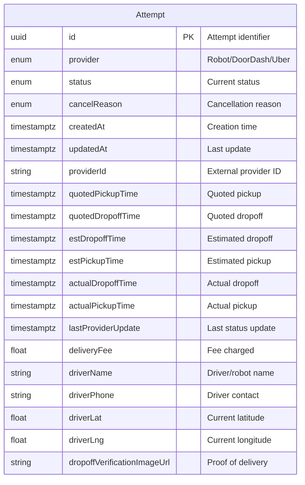
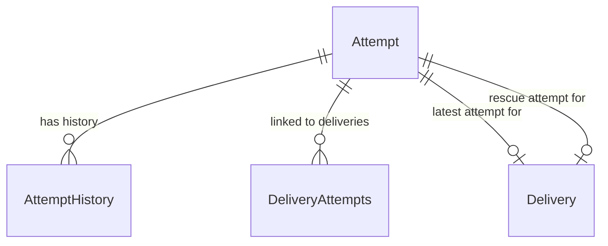
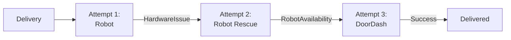

---
tags:
  - database
  - table
  - delivery
  - attempt
---
# Attempt Table

**Database**: [[Deliveries V3 RDS Schema]]  
**Table Name**: `attempts`  
**Schema File**: [`service/deliveries/prisma/schema.prisma`](../../../delivery-platform/service/deliveries/prisma/schema.prisma)

Represents a single fulfillment attempt for a delivery. A [[Delivery V3 Table|Delivery]] can have multiple attempts if initial attempts fail. Attempts can be fulfilled by robots or third-party couriers.

## Schema



## Columns

### Identifiers
- `id` (String, UUID) - Primary key, unique attempt identifier
- `providerId` (String, nullable, unique) - External provider's ID (DoorDash delivery ID, robot serial)

### Provider & Status
- `provider` ([[AttemptProvider Enum]]) - Who is fulfilling
  - Robot - Coco robot
  - DoorDash - DoorDash courier
  - Uber - Uber courier
- `status` ([[AttemptStatus Enum]]) - Current attempt status (30+ possible values)
- `cancelReason` ([[AttemptCancellationReason Enum]], nullable) - Why attempt was cancelled

### Timing Estimates
- `quotedPickupTime` (DateTime with timezone, nullable) - Initial pickup estimate
- `quotedDropoffTime` (DateTime with timezone, nullable) - Initial dropoff estimate
- `estPickupTime` (DateTime with timezone, nullable) - Current pickup estimate
- `estDropoffTime` (DateTime with timezone, nullable) - Current dropoff estimate

### Actual Timing
- `actualPickupTime` (DateTime with timezone, nullable) - When food was actually picked up
- `actualDropoffTime` (DateTime with timezone, nullable) - When food was actually delivered

### Sync & Pricing
- `lastProviderUpdate` (DateTime with timezone, nullable) - Last status update from provider
- `deliveryFee` (Float, nullable) - Fee charged for this attempt

### Driver/Robot Information
- `driverName` (String, nullable) - For robots: serial number, For couriers: driver name
- `driverPhone` (String, nullable) - Driver contact number (not applicable for robots)
- `driverLat` (Float, nullable) - Current GPS latitude
- `driverLng` (Float, nullable) - Current GPS longitude

### Proof of Delivery
- `dropoffVerificationImageUrl` (String, nullable) - Photo of delivery completion

### Timestamps
- `createdAt` (DateTime with timezone) - Attempt creation time
- `updatedAt` (DateTime with timezone) - Last modification time

## Relationships



- **Has History**: One-to-many with [[AttemptHistory Table]]
- **Linked to Deliveries**: Many-to-many with [[Delivery V3 Table]] via [[DeliveryAttempts Table]]
- **Latest Attempt**: One-to-one (optional) with [[Delivery V3 Table]] via `latestAttemptId`
- **Rescue Attempt**: One-to-one (optional) with [[Delivery V3 Table]] via `needsRescueAttemptId`

## Multi-Attempt Pattern

Deliveries can have multiple sequential attempts:



Each attempt:
1. Created when previous attempt fails or rescue is needed
2. Has its own provider and tracking
3. Recorded in [[DeliveryAttempts Table]] junction
4. Full history in [[AttemptHistory Table]]

## Joining to Robot Data

For robot attempts, `driverName` contains the robot serial number:

```sql
-- Join attempt to robot state
SELECT 
    a.id AS attempt_id,
    a.driver_name AS robot_serial,
    a.status,
    le.lid_event
FROM attempts a
LEFT JOIN state_rds_public.lid_cycle_event_history le
    ON le.serial = a.driver_name
    AND le.created_at BETWEEN a.created_at AND COALESCE(a.actual_dropoff_time, NOW())
WHERE a.provider = 'Robot';
```

## SLA Metrics

Key timestamps for SLA tracking:

| Metric | Timestamps Used |
|--------|----------------|
| **Pickup Time** | `actualPickupTime` - `createdAt` |
| **In-Transit Time** | `actualDropoffTime` - `actualPickupTime` |
| **Total Time** | `actualDropoffTime` - `createdAt` |
| **Pickup Accuracy** | `actualPickupTime` vs `quotedPickupTime` |
| **Dropoff Accuracy** | `actualDropoffTime` vs `quotedDropoffTime` |

## Use Cases

1. **Attempt Tracking**: Monitor individual fulfillment attempts
2. **Provider Comparison**: Compare robot vs courier performance
3. **Failure Analysis**: Analyze cancellation reasons
4. **SLA Monitoring**: Track timing against quotes
5. **Real-time Tracking**: Display driver/robot location to customers
6. **Proof of Delivery**: Store delivery verification photos

## Related Concepts

- [[Attempt]] - Attempt concept
- [[Delivery V3 Table]] - Parent delivery
- [[AttemptStatus Enum]] - Attempt statuses
- [[AttemptProvider Enum]] - Provider types
- [[AttemptCancellationReason Enum]] - Cancellation reasons
- [[AttemptHistory Table]] - Status history
- [[Deliveries Service]] - Service managing attempts

