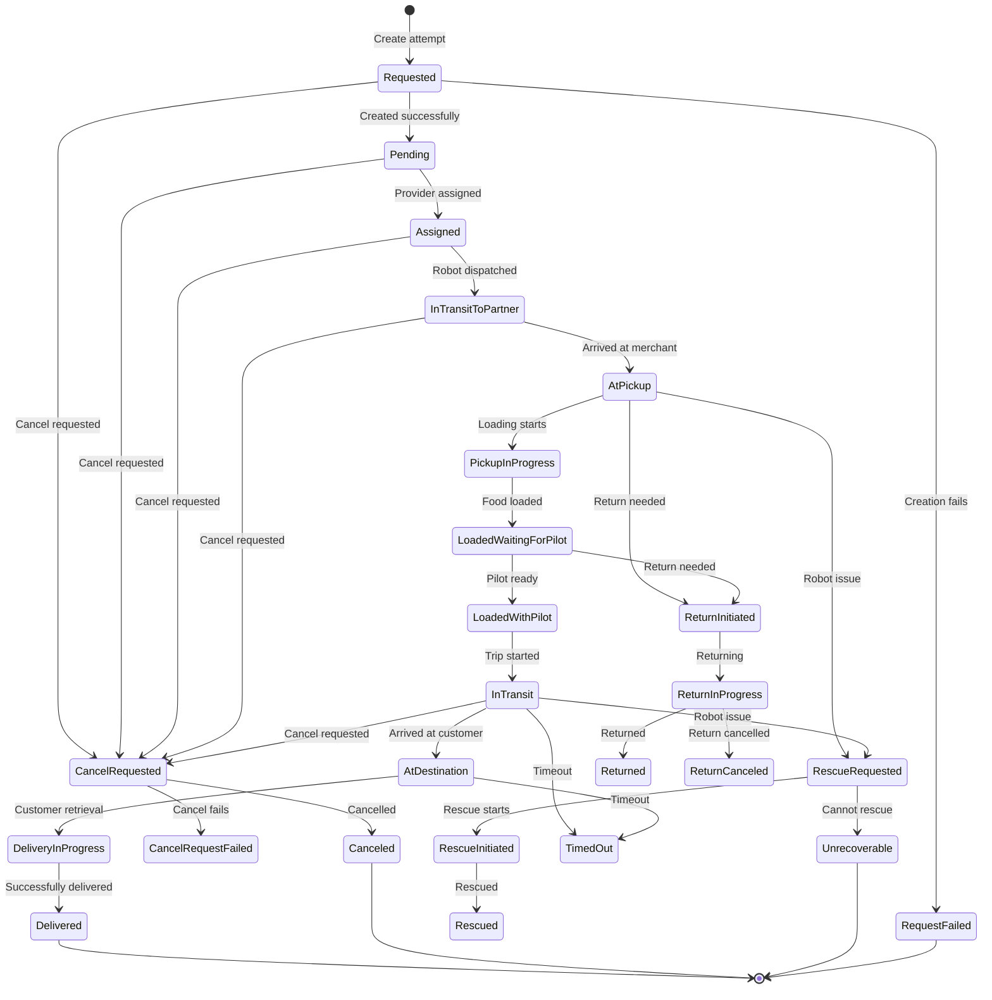

---
tags:
  - enum
  - delivery
  - attempt
---
# AttemptStatus Enum

**Database**: [[Deliveries V3 RDS Schema]]  
**Used in**: [[Attempt Table]], [[AttemptHistory Table]]  
**Schema File**: [`service/deliveries/prisma/schema.prisma`](../../../delivery-platform/service/deliveries/prisma/schema.prisma)

Enum defining the lifecycle states of a delivery [[Attempt]]. An attempt represents a single fulfillment effort by a robot or third-party courier.

## Values

### Initial States
- `Requested` - Attempt creation requested from provider
- `RequestFailed` - Failed to create attempt with provider
- `Pending` - Attempt created, awaiting assignment
- `Scheduled` - Attempt scheduled for future execution
- `Assigned` - Provider assigned to attempt

### Robot Movement States
- `InTransitToPartner` - Robot traveling to merchant
- `InTransitToRescue` - Robot traveling to rescue location
- `AtBot` - (Unclear usage)
- `AtPickup` - Robot arrived at merchant
- `InTransit` - Robot traveling to customer
- `AtDestination` - Robot arrived at customer

### Loading States
- `LoadedWaitingForPilot` - Food loaded, waiting for pilot to start trip
- `LoadedWithPilot` - Food loaded, pilot ready, trip can begin
- `PickupInProgress` - Merchant loading food into robot

### Delivery States
- `DeliveryInProgress` - Customer retrieving food from robot

### Completion States
- `Delivered` - Successfully delivered
- `Completed` - (Alias for delivered)

### Cancellation States
- `CancelRequested` - Cancellation requested
- `CancelRequestFailed` - Failed to cancel with provider
- `Canceled` - Successfully cancelled
- `TimedOut` - Attempt exceeded time limits
- `Unrecoverable` - Attempt failed and cannot be retried

### Rescue States
- `RescueRequested` - Rescue assistance requested
- `RescueInitiated` - Rescue operation started
- `Rescued` - Successfully rescued and recovered

### Return States
- `ReturnInitiated` - Return to merchant started
- `ReturnInProgress` - Currently returning
- `ReturnCanceled` - Return cancelled
- `Returned` - Successfully returned to merchant

## State Machine

## Key Transitions

### Robot Delivery Flow
1. `Requested` → `Pending` → `Assigned`
2. `InTransitToPartner` → `AtPickup`
3. `PickupInProgress` → `LoadedWaitingForPilot` → `LoadedWithPilot`
4. `InTransit` → `AtDestination`
5. `DeliveryInProgress` → `Delivered`

### Courier Delivery Flow
Similar but without robot-specific states like `LoadedWaitingForPilot`

### Failed Attempt Flow
- Any state → `CancelRequested` → `Canceled`
- Any state → `RescueRequested` → `Unrecoverable`
- Any state → `TimedOut`

## Critical States for Metrics

### Success Metrics
- `Delivered` / `Completed` - Successful delivery

### Failure Metrics
- `Canceled` - Cancelled attempt
- `Unrecoverable` - Failed beyond recovery
- `TimedOut` - Exceeded time limits

### In-Progress Metrics
- `InTransit` - Active delivery in progress
- `AtDestination` - Waiting for customer pickup

### SLA Tracking
- `AtPickup` timestamp - Pickup time
- `LoadedWithPilot` timestamp - Load completion time
- `AtDestination` timestamp - Arrival time
- `Delivered` timestamp - Completion time

## Related Concepts

- [[Attempt Table]] - Attempts with this status
- [[Attempt]] - Attempt concept
- [[Delivery Status State Machine]] - Parent delivery status
- [[AttemptHistory Table]] - Historical status tracking
- [[AttemptProvider Enum]] - Robot vs courier providers
- [[AttemptCancellationReason Enum]] - Why attempts are cancelled

