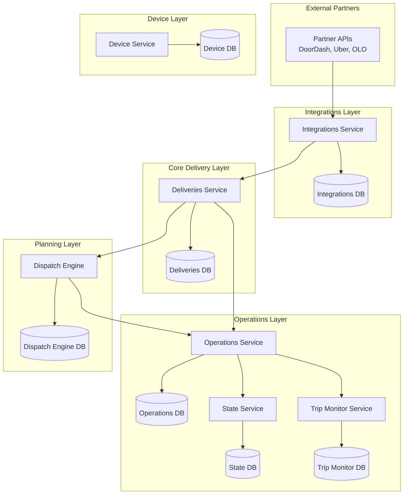
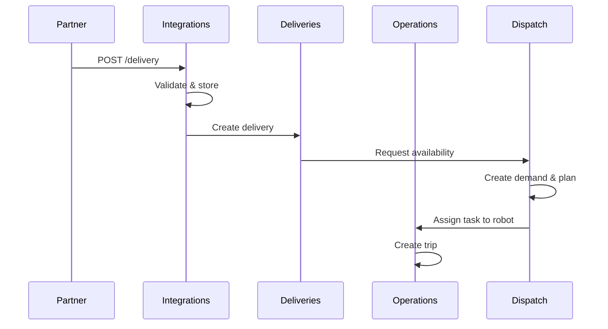
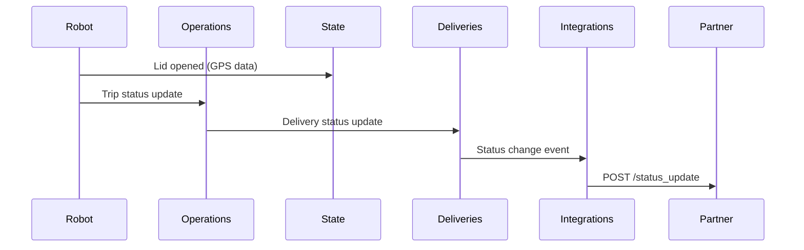

---
tags:
  - architecture
  - database
  - overview
---
# Database Architecture Overview

The delivery platform uses a **microservices architecture** with 7 separate PostgreSQL databases, each owned by a specific service. All databases use **Prisma** as the ORM.

## Service Databases

## Database Summary

| Database | Service | Primary Purpose | Key Tables |
|----------|---------|-----------------|------------|
| [[Integrations RDS Schema]] | [[Integrations Service]] | Process incoming orders from partners | Delivery, ExternalState, PII |
| [[Deliveries V3 RDS Schema]] | [[Deliveries Service]] | Manage delivery lifecycle | Delivery, Attempt, Quote, Customer |
| [[Operations RDS Schema]] | [[Operations Service]] | Coordinate tasks, trips, pilots | Task, Trip, Robot, Pilot, FO tasks |
| [[State RDS Schema]] | [[State Service]] | Track robot hardware state | LidCycleEventHistory, Connectivity, StateHistory |
| [[Dispatch Engine RDS Schema]] | [[Dispatch Engine]] | Plan and schedule resources | Demand, Robot, Plan |
| [[Trip Monitor RDS Schema]] | [[Trip Monitor Service]] | Monitor trip progress | Trip (monitoring view) |
| [[Device RDS Schema]] | [[Device Service]] | Manage device deployments | Deployment |

## Data Flow

### Inbound Order Flow

### Status Update Flow

## Database Design Patterns

### Event Sourcing
Several tables track full history:
- [[TaskHistory Table]] - All task status changes
- [[TripHistory Table]] - All trip status changes
- [[AttemptHistory Table]] - All attempt status changes
- [[PilotShiftStateHistoryModel Table]] - All shift changes
- [[LidCycleEventHistory]] - All lid events

### Optimistic Locking
Version fields prevent concurrent update conflicts:
- [[PilotModel Table]] - `version` field
- [[PilotShiftModel Table]] - `version` field
- [[PilotAssignmentModel Table]] - `pilotVersion` and `taskVersion`

### Denormalization for Performance
Current state stored redundantly for fast queries:
- [[Delivery V3 Table]] - `latestAttemptId` (current attempt)
- [[PilotModel Table]] - `activeShiftId`, `activeAssignmentId` (current state)
- [[Robot Planning Table]] - `activeDemandId`, `scheduledPickupId`, etc. (current schedule)

### Multi-Database Joins
Data often spans databases, requiring:
1. Application-level joins
2. Event-driven synchronization
3. Denormalized foreign keys (e.g., `deliveryId` in Operations, `attemptId` in Trip Monitor)

## Schema Management

All schemas managed via [[Prisma Client Generation in Monorepo]]:
- Schema definitions in `service/*/prisma/schema.prisma`
- Migrations in `service/*/prisma/migrations/`
- Generated clients in `service/*/node_modules/.prisma/client/`

## Related Concepts

- [[Operations Service]] - Core operational orchestration
- [[Deliveries Service]] - Delivery management
- [[Dispatch Engine]] - Resource planning
- [[State Service]] - Hardware state tracking
- [[Integrations Service]] - Partner integration
- [[Entity Relationship Diagram]] - ERD across services

