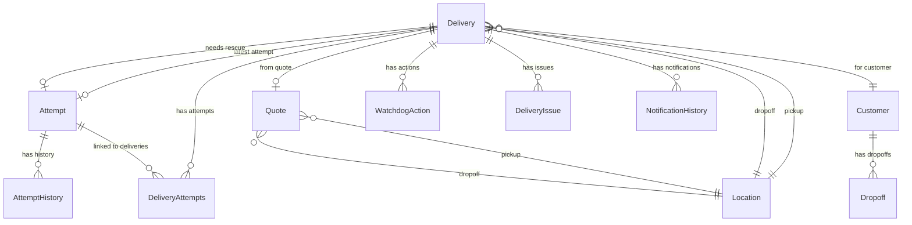
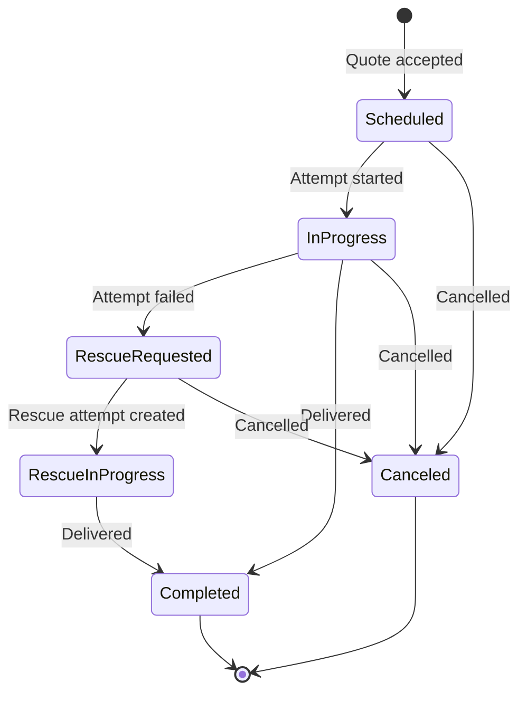
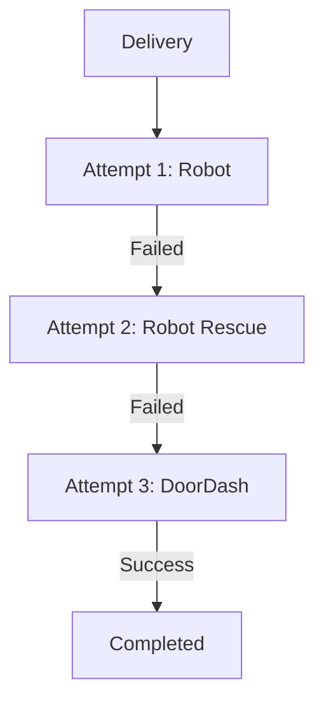

---
tags:
  - database
  - prisma
  - delivery
  - backend
---
# Deliveries V3 RDS Schema

**Database**: PostgreSQL  
**Service**: [[Deliveries Service]]  
**Schema File**: [`service/deliveries/prisma/schema.prisma`](../../../delivery-platform/service/deliveries/prisma/schema.prisma)

The Deliveries database is the primary operational database for managing delivery orders, fulfillment attempts, customers, and partner configurations. This is the V3 schema (current system).

> **Note**: See [[Deliveries RDS Schema]] for the legacy schema synced to Redshift.

## Core Domain Tables

### Delivery Management
- [[Delivery V3 Table]] - Main delivery request records
- [[DeliveryAttempts Table]] - Junction table linking deliveries to attempts
- [[Attempt Table]] - Individual fulfillment attempts
- [[AttemptHistory Table]] - Attempt status change history
- [[Quote Table]] - Delivery quotes/estimates

### Order Details
- [[Location Deliveries Table]] - Pickup and dropoff addresses
- [[Dropoff Table]] - Customer dropoff points
- [[Customer Deliveries Table]] - Customer records

### Monitoring & Issues
- [[WatchdogSchema Table]] - Delivery monitoring rule schemas
- [[WatchdogAction Table]] - Actions triggered by monitoring rules
- [[DeliveryIssue Table]] - Reported delivery issues
- [[NotificationHistory Table]] - SMS and notification delivery records

### Partner Management (Deprecated)
- [[Partner Table]] - Merchant/partner records (deprecated)
- [[PartnerConfig Table]] - Partner configuration (deprecated)
- [[User Deliveries Table]] - User accounts
- [[UserPartner Table]] - User-partner associations (deprecated)

### External Provider Integration
- [[DoordashRequest Table]] - DoorDash API requests (v1)
- [[DoordashResponse Table]] - DoorDash API responses (v1)
- [[DoordashReference Table]] - DoorDash delivery ID mapping (v1)
- [[UberRequest Table]] - Uber API requests (v1)
- [[UberResponse Table]] - Uber API responses (v1)
- [[UberReference Table]] - Uber delivery ID mapping (v1)

## Schema Diagram

## Key Enums

- [[DeliveryStatus V3 Enum]] - Scheduled, InProgress, RescueRequested, RescueInProgress, Completed, Canceled
- [[AttemptStatus Enum]] - 30+ statuses including Requested, InTransit, Delivered, Canceled
- [[AttemptProvider Enum]] - Robot, DoorDash, Uber
- [[AttemptCancellationReason Enum]] - 40+ reasons for cancellation
- [[CancelReason Enum]] - Delivery-level cancellation reasons
- [[ControlledContentsEnum]] - Alcohol, Tobacco, Marijuana
- [[LoadType Enum]] - TWO_DIGIT_DEVICELESS_PIN
- [[WatchdogActionType Enum]] - CHANGE_PROVIDER, CANCEL_DELIVERY, CREATE_REFUND, etc.
- [[NotificationType Enum]] - SMS, Zendesk
- [[DeliveryIssueType Enum]] - 18 different issue types

## Delivery Lifecycle

## Multi-Attempt Pattern

A single delivery can have multiple attempts:

The delivery tracks:
- `latestAttemptId` - Current active attempt
- `needsRescueAttemptId` - Rescue attempt if needed
- `deliveryAttempts` - Full history of all attempts

## Watchdog System

The [[Watchdog System]] monitors deliveries and takes automated actions:

1. **WatchdogSchema**: Defines monitoring rules
2. **Evaluation**: Rules evaluate delivery state
3. **WatchdogAction**: Actions triggered when rules match
4. **Execution**: System executes actions (change provider, cancel, refund, etc.)

## Related Concepts

- [[Deliveries Service]] - Service using this database
- [[Delivery]] - Core delivery concept
- [[Attempt]] - Fulfillment attempt concept
- [[Delivery Status State Machine]] - Status transitions
- [[Watchdog System]] - Monitoring system
- [[Deliveries RDS Schema]] - Legacy schema
