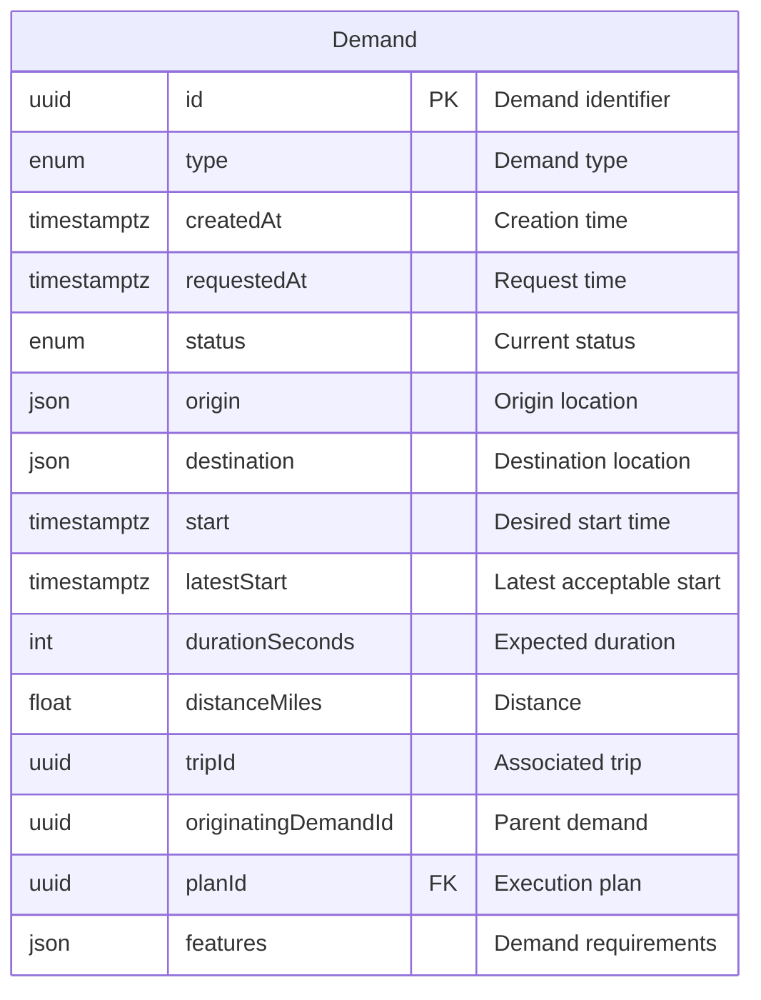
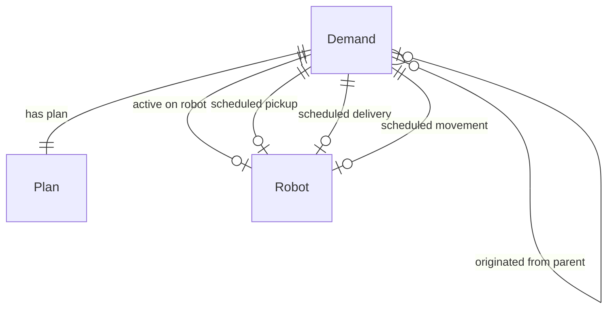
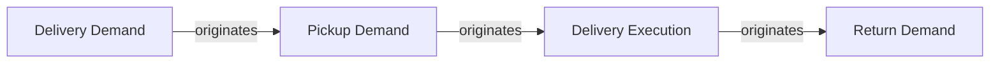

---
tags:
  - database
  - table
  - dispatch-engine
  - demand
---
# Demand Table

**Database**: [[Dispatch Engine RDS Schema]]  
**Table Name**: `demand`  
**Schema File**: [`service/dispatch-engine/prisma/schema.prisma`](../../../delivery-platform/service/dispatch-engine/prisma/schema.prisma)

Represents a demand for robot delivery or movement. A demand is a request for a robot to perform work (delivery, deployment, return, pickup). The [[Dispatch Engine]] creates plans to fulfill demands.

## Schema

## Columns

### Identifiers
- `id` (UUID) - Primary key, unique demand identifier
- `tripId` (UUID, nullable) - Associated [[Trip Table|Trip]] from [[Operations Service]]
- `originatingDemandId` (UUID, nullable) - Parent demand that created this demand

### Type & Status
- `type` ([[DemandType Enum]]) - Type of demand
  - Delivery - Deliver food to customer
  - Deployment - Move robot to location
  - Return - Return robot to hub
  - Pickup - Pickup food from merchant
- `status` ([[DemandStatus Enum]]) - Current demand status
  - Requested - Initial quote request
  - Scheduled - Plan created, not yet assigned
  - Pending - Assigned to robot, waiting to start
  - Active - Currently executing
  - Fulfilled - Successfully completed
  - Canceled - Cancelled before completion
  - Superseded - Replaced by better plan

### Location
- `origin` (Json) - Origin location (lat/lng and other metadata)
- `destination` (Json) - Destination location (lat/lng and other metadata)

### Timing
- `createdAt` (DateTime with timezone) - When demand was created
- `requestedAt` (DateTime with timezone) - When demand was requested (for SLA tracking)
- `start` (DateTime with timezone) - Desired start time
- `latestStart` (DateTime with timezone) - Latest acceptable start time
- `durationSeconds` (Int) - Expected duration in seconds

### Metrics
- `distanceMiles` (Float) - Distance to travel

### Planning
- `planId` (UUID, unique) - Foreign key to [[Plan Table]]
- `features` (Json, nullable) - Special requirements/features for this demand

## Relationships

- **Has Plan**: One-to-one with [[Plan Table]]
- **Originates Demands**: One-to-many with child demands (e.g., pickup demand creates delivery demand)
- **Originated From**: Many-to-one with parent demand
- **Active on Robot**: One-to-one (optional) with [[Robot Planning Table]] via `activeDemandId`
- **Scheduled on Robot**: One-to-one (optional) with [[Robot Planning Table]] via various scheduled fields

## Indexes

- `status` - For filtering by demand status
- `tripId` - For linking to trip records
- `originatingDemandId` - For finding child demands

## Demand Chaining

Demands can originate other demands to create multi-step workflows:

Example: A delivery demand might originate:
1. A pickup demand (get food from merchant)
2. A delivery execution demand (deliver to customer)
3. A return demand (return robot to hub)

## Use Cases

1. **Demand Management**: Track all demands in the system
2. **Resource Scheduling**: Assign demands to robots
3. **Planning**: Create and update plans for demands
4. **Analytics**: Track demand fulfillment rates and timing
5. **Cascading Demands**: Create multi-step workflows

## Related Concepts

- [[Dispatch Engine]] - Service managing demands
- [[Demand]] - Conceptual overview
- [[Plan Table]] - Execution plans for demands
- [[Robot Planning Table]] - Robot scheduling state
- [[Continuous Replanning]] - How demands are replanned
- [[Dispatch Engine Workflow]] - Overall workflow

