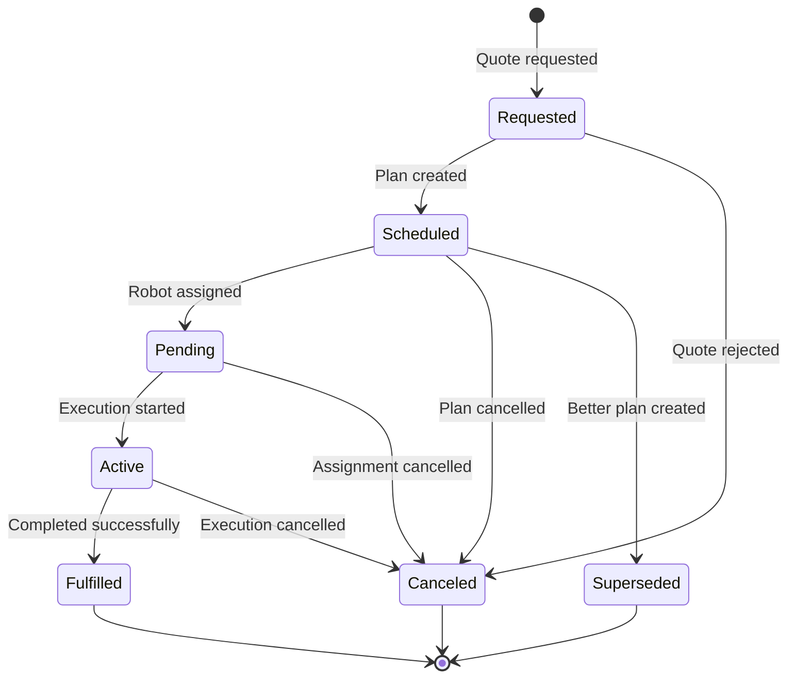

---
tags:
  - enum
  - dispatch-engine
  - demand
---
# DemandStatus Enum

**Database**: [[Dispatch Engine RDS Schema]]  
**Used in**: [[Demand Table]]  
**Schema File**: [`service/dispatch-engine/prisma/schema.prisma`](../../../delivery-platform/service/dispatch-engine/prisma/schema.prisma)

Enum defining the lifecycle states of a [[Demand]] in the dispatch planning system.

## Values

- `Requested` - Initial quote request received
- `Scheduled` - Plan created, awaiting assignment
- `Pending` - Assigned to robot, waiting to start execution
- `Active` - Currently executing
- `Fulfilled` - Successfully completed
- `Canceled` - Cancelled before completion
- `Superseded` - Replaced by a better/updated plan

## State Machine

## Transitions

### To Requested
- **From**: None (initial state)
- **Trigger**: Quote request received from [[Deliveries Service]]
- **Action**: [[PlannerService]] evaluates if demand can be fulfilled

### To Scheduled
- **From**: Requested
- **Trigger**: Planner created feasible [[Plan Table|Plan]]
- **Action**: Plan stored, waiting for robot assignment

### To Pending
- **From**: Scheduled
- **Trigger**: Plan assigned to specific robot's schedule
- **Action**: Robot's `scheduledDeliveryId` or `scheduledPickupId` set

### To Active
- **From**: Pending
- **Trigger**: Robot begins executing the demand
- **Action**: Robot's `activeDemandId` set, trip started

### To Fulfilled
- **From**: Active
- **Trigger**: Robot completes the demand successfully
- **Action**: Robot becomes available, demand marked complete

### To Canceled
- **From**: Requested, Scheduled, Pending, Active
- **Trigger**: Cancellation request (delivery cancelled, timeout, failure)
- **Action**: Resources released, plan discarded

### To Superseded
- **From**: Scheduled
- **Trigger**: [[Continuous Replanning]] creates better plan
- **Action**: Old plan replaced, new demand created

## Superseded vs Canceled

- **Superseded**: Plan replaced by better option (normal replanning)
- **Canceled**: Demand no longer needed (error or cancellation)

Superseded demands are not failures - they're part of normal [[Continuous Replanning]].

## Relationship to Robot State

Demand status maps to robot scheduling fields:

| Demand Status | Robot Field |
|---------------|-------------|
| Scheduled | Not yet on robot |
| Pending | `scheduledDeliveryId`, `scheduledPickupId`, or `scheduledMovementId` |
| Active | `activeDemandId` |
| Fulfilled | Cleared from robot |
| Canceled | Cleared from robot |
| Superseded | Replaced with new demand |

## Related Concepts

- [[Demand Table]] - Demands with this status
- [[Demand]] - Core demand concept
- [[Plan Table]] - Plans for demands
- [[Robot Planning Table]] - Robot scheduling state
- [[Continuous Replanning]] - How demands are updated
- [[Dispatch Engine Workflow]] - Overall workflow

