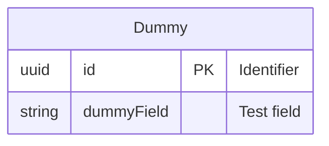
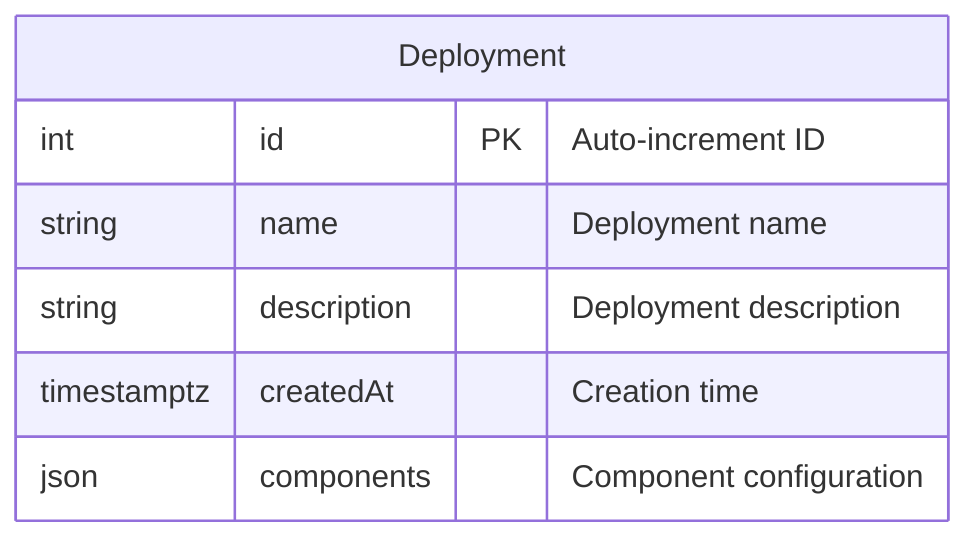

---
tags:
  - database
  - prisma
  - device
  - backend
---
# Device RDS Schema

**Database**: PostgreSQL  
**Service**: [[Device Service]]  
**Schema File**: [`service/device/prisma/schema.prisma`](../../../delivery-platform/service/device/prisma/schema.prisma)

The Device Service database manages hardware deployments and configurations. Currently minimal with only test/placeholder data and deployment configurations.

## Tables

### Dummy Table
**Table Name**: `Dummy`

Placeholder/test table.



- `id` (String, UUID) - Primary key
- `dummyField` (String) - Test data field

### Deployment Table
**Table Name**: `Deployment`

Tracks device/component deployment configurations.



#### Columns
- `id` (Int, autoincrement) - Primary key
- `name` (String, nullable) - Deployment name/identifier
- `description` (String, nullable) - Deployment description
- `createdAt` (DateTime) - When deployment was created
- `components` (Json) - JSON configuration of deployed components

#### Indexes
- `name` - For searching deployments by name

## Components JSON Format

The `components` field stores deployment configuration:

```json
{
  "components": [
    {
      "name": "drive-u",
      "version": "v2.3.1",
      "config": {
        "feature_flags": {
          "autonomy_enabled": true,
          "camera_streaming": true
        }
      }
    },
    {
      "name": "lid-controller",
      "version": "v1.5.0",
      "config": {
        "timeout_seconds": 30
      }
    }
  ]
}
```

## Use Cases

1. **Deployment Tracking**: Record what software/config is deployed to robots
2. **Version Management**: Track component versions across fleet
3. **Configuration Management**: Store device-specific configurations
4. **Rollback Support**: Historical record of deployments

## Limited Schema

This is the **smallest** database schema in the system, indicating that most device-related data is stored elsewhere:

- Robot hardware state → [[State Service]]
- Robot operational assignments → [[Operations Service]]
- Robot scheduling → [[Dispatch Engine]]

The Device Service likely manages device configuration via other mechanisms (environment variables, S3 configs, AWS IoT, etc.) with this database serving as a lightweight deployment log.

## Related Concepts

- [[Device Service]] - Service using this database
- [[State Service]] - Hardware state tracking
- [[Robot Table]] - Robot operational records
- [[IoT Shadow]] - AWS IoT device state

